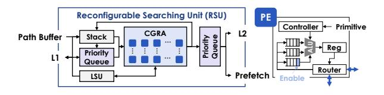

# IV. RECURSIVE DATAFLOW FOR SEARCHING ACCELERATION

#### A. Primitive Design

RoboCortex interprets the searching logic in dataflow expression to fully exploit the program parallelism. Fig. 6 illustrates the basic primitives for program representation. Each primitive runs on one processing element (PE) in a data-driven coarse-grained reconfigurable array (CGRA): each primitive fires upon receiving inputs, performs its operation, and delivers results to the output for subsequent primitives. We will briefly introduce them:

- **Read/Write**: **Read** fetches values from L1 cache with an address (Addr) with Size (Size), while **Write** stores data to certain address with fixed length (cache line size).
- Cont: represents continuing for recursively function call, which pushes the arguments to dedicated data structure (stack or priority queue). For the spatial data structure, the two parameters are the address of current node (Addr) and the coordinates for searching (Pos) respectively. The execution is gated by a binary Enable signal.
- ALU: carries out two-input, one-output arithmetic logic, including addition, subtraction, multiplication, division and bitwise operations (and, or, nand, xor).
- **Swap**: is a two-input, two-output primitive with an Enable that decides whether to swap two flows.
- Cmp: represents comparison and Op encodes "greater than", "less than", or "equal to". Unlike the ALU, the

- output of the **Cmp** is a binary, dedicated to the Enable signals of other units.
- Iter: represents iteration, iteratively generating i: for (i=Bqn; i<End; i+=Delta).</li>
- Fork/Join: Fork and Join are responsible for broadcasting an input to multiple flows and transforming multiple inputs into serial tokens in order of port ids, respectively.
- MUX: is a multiplexer with selection Sel.
- Reg: is a unit distinguished from stateless dataflow for storing state data. If Enable is true, updating new data. Otherwise it continuously takes existing data as the output. To keep dataflow execution correct, Reg's output will always flush downstream input queue.

Fig. 6. Primitives of RoboCortex.

In addition to the above primitives, we explicitly define two components, **Stack** and **Priority Queue**, to implement recursive function calls. The above primitives can be combined in a computational graph to form the search logic for most spatial data structures.

Fig. 7 shows how to use the above primitives to compose a nearest-neighbor searching logic with stack for NNS in Kd-Tree (Listing 1). For distance calculation and position selection which can be done by a combination of **ALU** and **MUX**, we abbreviate the representation for simplification in Fig. 7. For the two challenges mentioned at the beginning of this section, the above primitive's solution are:

(i) Recursion Support: We use the property that Join primitives are output in the order of different ports to represent the search priority of different branches. With the 'Last-In-First-Out' feature of stack, DFS with priority can be implemented.

Fig. 7. Kd-Tree KNN searching based on the defined primitives.

(ii) Non-Pure Function: In NeedExpand, we need to calculate the maximum value of the distance to the found point (MaxD), avoiding to manually access the output queue, we use primitive Reg to manage this maximum value of the distance.

For execution, Read primitive guarantees serial node loading and other primitives allow pipelining of multiple tokens. In particular, for Octo-Trees, the distance calculation of the eight branches is implemented using the Iter primitive to reuse hardware computing units to achieve pipelining calculations. Then, we will show how the above primitive is implemented in hardware.

Fig. 8. RSU design in *RoboCortex*.

