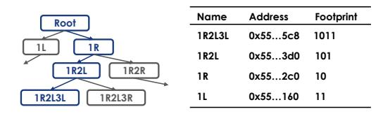

# *C. Footprint Record-and-Replay*

We have analyzed how to optimize the NNS based on the searching history with physical locality. However, the acquisition of this intermediate node in hardware and the corresponding shared space still requires dedicated hardware.

Fig. 11. Footprint tracing when searching.

For the binary tree in Fig. [11](#page-7-1) as an example, when we search from the root to the node 1R2L3L, we pop its all parent nodes to avoid stack overflow in RSU. Although this does not affect the spatial data structure search, it leads to difficulty in finding the shared parent node of searched points. To solve this problem, we use a binary footprint to record the entire search process, with 1 representing going to the left node and 0 representing going to the right node. The footprint corresponding to 1R2L3L is 1011, and its parent node 1R2L corresponds to 101 during the search.

Fig. 12. Tracing dataflow by extending the search dataflow in Fig. [7](#page-4-2) with minor modification.

The significance of this footprint lies in quickly finding the shared parent of the found leaf nodes by calculating the shared footprint prefix. After that, we can quickly find the address of the shared node from the root by reusing the search dataflow RSU with the footprint prefix, and obtain the space information represented by this intermediate node during the search process. Fig. [12](#page-7-3) illustrates the logic. After reversing the footprint prefix, we right-shift the footprint in 1-bit each time and the lowest digit figure out the path from the root node to the target intermediate node (□) until footprint is empty.

Taking all these together, we explain how path buffer and RSU cooperate. We divide the NNS into four stages:

(i) Path Buffer Lookup: For an NNS, we first searching the path buffer based on the coordinates Pos of the searching point p to see if it is within a previously saved search result B. If it hits, we perform the search directly from the intermediate node; otherwise, still search from the root. (Shown in Fig. [9\)](#page-6-0)

- (ii) RSU Recursive Searching: Next, we use RSU to perform a recursive search until finding the nearest neighbor point. In fact, on our hardware, the output priority queue stores the k nearest-neighbor points with their footprint.
- (iii) Footprint Tracing: If we start searching from the root node, we reuse RSU to find the shared prefix from footprints and find the corresponding intermediate node from the root.
- (iv) Path Buffer Updating: Update the path buffer according to the searched points from the last step. The path buffer uses an LRU replacement, directly inserting a new triplet consisting of the space S, the nearest neighbor point x for p, and the address Addr of the leaf node.

Essentially, the above design sacrifices computation for memory design, using node re-search to avoid stack overflow. Our experimental results confirm that the computational cost of re-search is less than 1% of the total search time.

