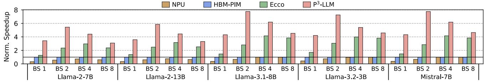
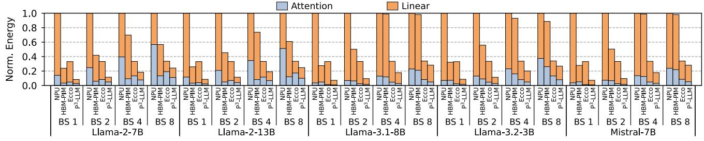
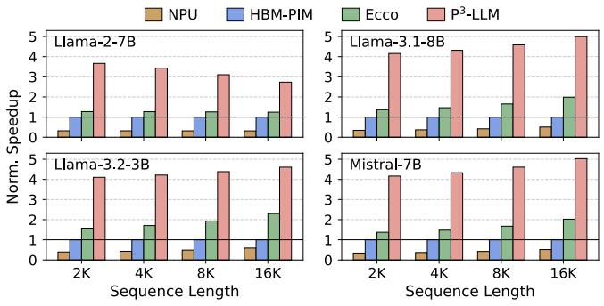
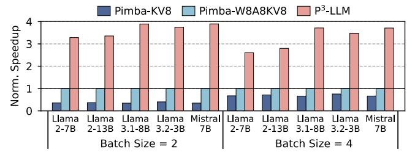
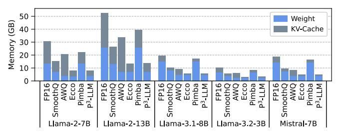
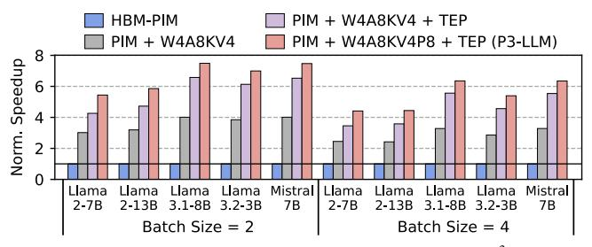

# *C. Hardware Performance*

Speedup. Fig. [9](#page-10-0) depicts the normalized decoding speed of P 3 -LLM against three baseline accelerators with batch sizes varying from 1 to 8. The HBM-PIM system outperforms NPU at low batch sizes of 1 and 2 across all models, primarily due to its higher internal bandwidth. However, as the batch size reaches 4, the performance advantage of HBM-PIM gradually diminishes for Llama-2 and even disappears for Llama-3 and Mistral. This is because the linear layer exhibits more data reuse with increasing batch sizes, which NPU can exploit to boost performance. Additionally, the GQA mechanism of Llama-3 and Mistral offer inherent data reuse opportunities that HBM-PIM fail to exploit. Furthermore, both NPU and HBM-PIM deliver lower performance than Ecco that leverages quantization to reduce the demand of memory bandwidth. On the other hand, P3 -LLM offers substantial performance gains over all baseline accelerators, yielding average speedups of 7.8×, 4.9×, and 2.0× over NPU, HBM-PIM, and Ecco, respectively. These performance gains of P3 -LLM stem from its careful algorithm-hardware co-design of mixed-precision quantization and efficient PCU architecture. Interestingly, P 3 -LLM demonstrates its highest speedup at a batch size of 2, owing to its throughput-enhanced PCU that allows processing two input vectors within the same tCCD L window.

Energy Consumption. Fig. [10](#page-10-1) depicts the breakdown of energy consumption for attention and linear layers across different accelerators and batch sizes. On average, P3 -LLM yields 6.3×, 3.5×, and 2.1× better energy efficiency over NPU, HBM-PIM, and Ecco, respectively. These energy savings are attributed to the reduced memory footprint offered by the W4A8KV4P8 quantization scheme, as well as a PIM architecture co-design that allows most layers to be accelerated by the low-precision PCU. As the batch size increases, NPU can take advantage of data reuse by loading the model weights only once and processing all input requests within a batch simultaneously. In contrast, the PIM accelerator of HBM-PIM only supports GEMV, requiring the model weights to be repetitively fetched from the DRAM bank for processing each input request. Thus, the energy consumption of linear layers in HBM-PIM increases significantly with larger batch sizes. Compared to HBM-PIM, the throughput-enhanced PCU in

Fig. 9: Normalized speedup (†) vs. batch size (BS) for different accelerator systems. The context length is 4K.

Fig. 10: Normalized energy consumption ( $\downarrow$ ) vs. batch size (BS) and the breakdown for attention and linear layers. The context length is 4K.

Fig. 11: Normalized decoding speedup  $(\uparrow)$  across different context lengths under single-batch inference.

P3-LLM enables each memory access to be reused twice, effectively reducing the overhead of duplicated DRAM row activations and the associated energy consumption.

Sensitivity to Context Length. Single-batch inference remains one of the most important scenarios for edge LLM deployment. We analyze the impact of context length on the single-batch decoding performance of different accelerator systems. As shown in Fig. 11, scaling the context length from 2K to 16K yields additional performance gains for  $P^3$ -LLM across all models, except Llama-2-7B. With a longer context length, the attention layer starts to dominate the overall runtime due to the increased KV-cache footprint.  $P^3$ -LLM effectively mitigates this overhead through its 4-bit KV-cache quantization and attention offloading to the mixed-precision PIM accelerator. For Llama-2-7B, since  $P^3$ -LLM applies keycache quantization before RoPE, the  $Q \cdot K^T$  computation is offloaded to NPU, resulting in slightly lower speedup under longer context length.

**Comparison with Existing Low-Precision PIM.** We compare the performance of P3-LLM with Pimba [44], a SoTA low-precision PIM architecture adopting the 8-bit microscaling format [79]. The original Pimba employs KV-cache-only quantization since it targets cloud serving scenarios, where KV-cache

Fig. 12: Normalized decoding speedup ( $\uparrow$ ) of Pimba and P³-LLM. The context length is 4K.

dominates the memory footprint. Hence, we also examine an enhanced version of Pimba with 8-bit weight-activation quantization. Fig. 12 presents the normalized decoding speed of P3-LLM and Pimba under batch sizes of 2 and 4. The original Pimba has the lowest performance because at small batch sizes, weights can dominate the overall memory footprint but remain unquantized. By adopting 8-bit weight-activation quantization, on average, the enhanced Pimba achieves  $2.1 \times$ better performance compared to its original design. The proposed P3-LLM further yields an average of 3.4× performance boost compared to the enhanced Pimba. By quantizing weights and KV-cache to 4 bits with minimal accuracy loss, P3-LLM reduces the memory access compared to Pimba. Moreover, the throughput-enhanced PCU of P3-LLM enables temporal input reuse to double the computational throughput, facilitating efficient execution of low-batch linear layers and GQA.

Comparison with Software Quantization. We compare  $P^3$ -LLM with two SoTA software quantization algorithms, SmoothQuant [88] and AWQ [52] running on our baseline NPU. Fig. 13 illustrates the decoding throughput of different methods across various batch sizes from 1 to 8. On average,  $P^3$ -LLM yields  $3.9\times$  and  $3.0\times$  higher throughput than SmoothQuant and AWQ, respectively. The performance gains of  $P^3$ -LLM arise from its carefully co-designed W4A8KV4P8 quantization algorithm and low-precision PIM architecture. Compared to  $P^3$ -LLM, SmoothQuant and AWQ adopt more conservative 8-bit weight-activation quantization and 4-bit

Fig. 13: Decoding throughput ( $\uparrow$ ) vs. batch size (BS) of different quantization methods. The context length is 4K.

Fig. 14: Memory consumption  $(\downarrow)$  of different quantization methods during decoding. The batch size is 8 and the context length is 4K.

weight-only quantization, respectively. Thus, both methods provide moderate reductions in memory traffic during decoding, which is further exacerbated by the limited off-chip DRAM bandwidth.

**Memory Analysis.** We examine the memory consumption of weights and KV-cache across various quantization methods during the decoding phase. As shown in Fig. 14, Ecco and P3-LLM achieve substantial memory reductions of 3.8× and 3.7× over the FP16 baseline, respectively, owing to their aggressive 4-bit quantization of weights and KV-cache that dominate the memory access during LLM decoding. Compared to P3-LLM, Ecco has a slightly smaller memory footprint due to its compact Hoffman encoding of quantization codebooks and metadata. However, this advantage is largely negated by the constrained bandwidth between NPU and DRAM, leading to much lower decoding speed than P3-LLM.

Area and Power. Following established methodologies [44], [94], we quantify the total area overhead of P³-LLM and compare to that of HBM-PIM. Note that the original HBM-PIM described in [49] supports diverse operations such as element-wise multiplication and addition. Given that LLM decoding is dominated by MAC operations, we only model necessary MAC hardware in HBM-PIM, eliminating complicated instruction decoder and unnecessary operand registers. As shown in Table VII, P³-LLM introduces a total HBM area overhead of 17.5%, well below the 25% maximum logic ratio recommended by prior works [23], [49]. Compared to HBM-PIM using FP16 arithmetic, P³-LLM incurs only 1.1% larger area, yet this increase is justified by delivering an average of 4.9× speedup for edge LLM inference, while maintaining usable accuracy.

We also compare the P3-LLM PE with two mixed-precision PEs of SoTA LLM accelerators, BitMoD [6] and MANT [29].

TABLE VII. Comparison between HBM-PIM and P3-LLM.

|                            | PCU Area | [mm 2 ] | HBM Area                | Avg. Norm.                              |
|----------------------------|----------|--------------------|-------------------------|-----------------------------------------|
|                            | Compute  | Buffer             | Overhead $(\downarrow)$ | $\mathbf{Speedup}\left(\uparrow\right)$ |
| HBM-PIM                    | 7.7      | 6.2                | 16.4%                   | $1.0 \times$                            |
| P 3 -LLM (Ours) | 8.4      | 6.2                | 17.5%                   | $4.9 \times$                            |

TABLE VIII. The area and energy consumption of different PE design under 1GHz. The numbers are normalized to that of an FP16 MAC.

| Type                       | MAC/Cycle           | Area [ $\mu$ m 2 ] | Energy [pJ/MAC] |
|----------------------------|---------------------|-------------------------------|-----------------|
| HBM-PIM                    | 1 MAC               | 1023.1 (1.00×)                | 0.69 (1.00×)    |
| MANT                       | 2 MACs ‡ | 717.3 (0.70×)                 | 0.40 (0.58×)    |
| BitMoD                     | 2 MACs ‡ | 1291.6 (1.26×)                | 0.61 (0.88×)    |
| P 3 -LLM (Ours) | 4 MACs ‡ | 1109.2 (1.08×)                | 0.18 (0.26×)    |

&lt;sup>‡ Normalized to MACs/Cycle under 4-bit weight quantization.

Fig. 15: Ablation study on different architectural techniques of P3-LLM. The context length is 4K.

Table VIII shows the area and power of different PE designs under 1GHz frequency. BitMoD exhibits the lowest hardware efficiency, as it requires an expensive FP32 accumulator to handle unquantized activations. While MANT employs weight-activation quantization, its adaptive numerical type decomposes the weight-activation multiplication into two partial sums with high bit-width. This necessitates an expensive adder to add the two partial sums before accumulation, resulting in large area and energy overhead. P³-LLM delivers superior performance over the FP16 PE of HBM-PIM, with 3.8× higher energy efficiency per MAC. This substantial efficiency gain is attributed to our efficient quantization approach that reduces the bit-width for both operands and intermediate computation.

**Architecture Ablation Study.** We conduct ablation studies to assess the performance gain of different architectural techniques proposed by P3-LLM. Four designs are evaluated: (1) The baseline HBM-PIM accelerator running FP16 models; (2) A PIM accelerator supporting W4A8KV4 quantized models; (3) A PIM accelerator incorporating our throughputenhanced PCU (TEP) to accelerate W4A8KV4 models; (4) The proposed P3-LLM with 8-bit attention-score on top of W4A8KV4 and throughput-enhanced PCU. Fig. 15 illustrates the normalized performance under batch sizes of 2 and 4. On average, W4A8KV4 quantization achieves 3.3× speedup over HBM-PIM, and adopting the throughput-enhanced PCU to exploit data reuse offers an additional  $1.6 \times$  speedup. Finally, with 8-bit attention-score quantization, on average, P3-LLM achieves another  $1.2\times$  performance gain by enabling the lowprecision PCU to fully accelerate the self-attention module.

Applicability to Large-Batch Decoding. Although P3-LLM

Fig. 16: Normalized decoding latency (↓) of Ecco and P3 -LLM across a wide range of batch sizes from 2 to 64. The context length is 4K.

mainly targets low-batch edge inference, it is also applicable to large-batch serving. To demonstrate this applicability, Fig. [16](#page-12-0) presents the decoding latency breakdown of Ecco and P3 -LLM for two Llama-3 models across a wide range of batch sizes from 2 to 64. Notably, Ecco and P3 -LLM have similar latency for linear layers when the batch size reaches 8, as the PIM hardware becomes compute-bound. To address this, P3 -LLM offloads linear layers to NPU for more efficient execution. Interestingly, as the batch size continues to grow, P3 -LLM regains its performance advantage, which is attributed to the increasing dominance of attention layers in the overall runtime. Specifically, the GQA of Llama-3.1-8B and Llama-3.2-3B has a group size of 4 and 3, respectively, which still exhibits low data reuse opportunities. Thus, P3 -LLM can leverage its high internal PIM bandwidth and throughput-enhanced PCU to accelerate the fully quantized attention module, resulting in better performance than Ecco.

