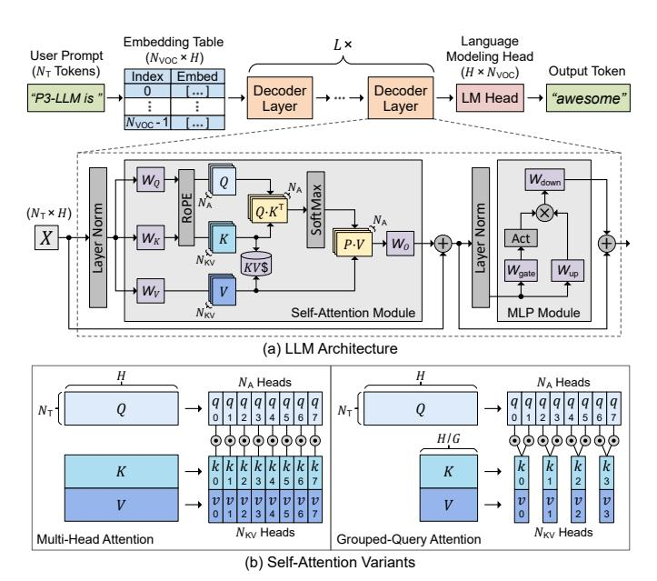

# P3-LLM: An Integrated NPU-PIM Accelerator for Edge LLM Inference Using Hybrid Numerical Formats

Yuzong Chen\*, Chao Fang†, Xilai Dai\*, Yuheng Wu‡, Thierry Tambe‡, Marian Verhelst†, Mohamed S. Abdelfattah\*

\*Department of Electrical and Computer Engineering, Cornell University

†EAST-MICAS, KU Leuven

†Department of Electrical Engineering, Stanford University

\*{yc2367, mohamed}@cornell.edu

†{chao.fang, marian.verhelst}@esat.kuleuven.be

‡{yuhengwu, ttambe}@stanford.edu

Abstract—The substantial memory bandwidth and computational demands of large language models (LLMs) present critical challenges for efficient inference. To tackle this, the literature has explored heterogeneous systems that combine neural processing units (NPUs) with DRAM-based processing-in-memory (PIM) for LLM acceleration. However, the high-precision PIM compute units incur significant area and power overhead in DRAM technology, limiting the effective computation throughput. In this paper, we introduce P3-LLM, a novel NPU-PIM integrated accelerator for edge LLM inference. Our approach is threefold: First, we propose a flexible mixed-precision quantization scheme, which leverages hybrid numerical formats to quantize different LLM operands with high compression efficiency and minimal accuracy loss. Second, we architect an efficient PIM accelerator for P3-LLM, featuring enhanced compute units to support hybrid numerical formats. Our careful choice of numerical formats allows to co-design low-precision PIM compute units that significantly boost the computation throughput under iso-area constraints. Third, we optimize the low-precision dataflow of different LLM modules by applying operator fusion to minimize the overhead of runtime dequantization. Evaluations on diverse LLMs and tasks demonstrate that P3-LLM achieves higher accuracy than state-ofthe-art KV-cache quantization and weight-activation quantization algorithms. Combining the proposed quantization scheme with low-precision PIM architecture co-design, P3-LLM yields an average of  $4.9\times$ ,  $2.0\times$ , and  $3.4\times$  speedups over state-of-theart LLM accelerators HBM-PIM, Ecco, and Pimba, respectively. Code is available at https://github.com/yc2367/P3-LLM.

### I. INTRODUCTION

Large language models (LLMs) have revolutionized various machine learning tasks such as text generation [38], [84], [90], image understanding [3], [65], and logical reasoning [11], [68], [73]. Besides large-scale cloud serving, LLMs are becoming increasingly prevalent in diverse edge scenarios such as chatbot interaction, autonomous driving, and mobile assistant [50], [52], [60], [66], [92]. However, the intelligence of LLMs comes at the cost of substantial computation and memory demands, imposing a significant bottleneck for low-cost deployment, particularly in edge scenarios with limited hardware resources.

To enhance the performance and efficiency of edge LLM deployment, heterogeneous LLM acceleration based on neural processing unit (NPU) and DRAM-based processing-inmemory (PIM) has been actively explored [27], [44], [48], [49], [51], [77], [81]. An integrated NPU-PIM accelerator leverages NPU and PIM to accelerate two distinct LLM inference stages, prefilling and decoding, respectively. During the

prefilling stage, the LLM performs compute-intensive general matrix-matrix multiplication (GEMM) that can be effectively accelerated by NPU with high computational parallelism [39]. While during the decoding stage, the LLM performs memoryintensive general matrix-vector multiplication (GEMV) that is well-suited for PIM with much higher bandwidth than conventional DRAM [40], [41]. Despite PIM's great promise in accelerating LLM inference, the PIM compute units (PCUs) designed for high-precision (e.g. FP16) arithmetic suffer from significant area and power overhead due to the much lower transistor density in DRAM technology [13]. This PCU overhead severely limits the computation throughput of PIM, restricting its practical speedup mainly to single-batch inference on early-generation LLMs, whose multi-head attention and feed-forward layers exhibit an arithmetic intensity of one during decoding [67], [84]. Recently, low-batch edge LLM inference has gained much popularity [50], and state-of-the-art (SoTA) LLMs have adopted grouped-query attention (GQA) with arithmetic intensities larger than one [38], [64], [66], [90]. This trend necessitates new PCU design with higher throughput, while remaining within DRAM area constraints.

One effective solution to alleviate the cost of compute units is quantization. By reducing the operand bit-width, quantization not only decreases the memory footprint, but also enables faster and more area-efficient computation on low-precision hardware. Depending on the target quantized operands, LLM quantization algorithms can be broadly classified into three categories: (1) weight-only quantization [17], [52], [78]; (2) KV-cache-only quantization [28], [42], [61]; (3) weight-activation quantization [2], [8], [16], [29], [46], [47], [53]. Among them, weight-only and KV-cache-only quantization are known to achieve near-lossless accuracy at 4-bit precision. However, since all other operands remain in FP16, these two methods offer limited compression and still require expensive hardware units for computation [6], [31]. [75]. In contrast, weight-activation quantization significantly reduces both memory footprint and hardware computation cost, yet applying it to enable cost-effective PIM for LLM inference still poses several challenges.

On the algorithm side, SoTA weight-activation quantization algorithms like QuaRot [2] and QoQ [53] primarily use the

1Here, we mainly refer activation quantization as quantizing both input activations and KV-cache.

conventional integer format, and rely on calibration datasets to approximate the dynamic behavior of activations in a static offline manner, thereby struggling to maintain good accuracy for other datasets due to overfitting. On the hardware side, adopting low-precision PCUs for LLM inference remains an open research problem in the architecture community, mainly because of the challenges in balancing memory saving, model accuracy, and hardware efficiency. MANT [29] and Ecco [8] propose aggressive quantization methods and codesigned NPU accelerators, but suffer from low computational efficiency due to the complicated numerical formats and encoding to represent quantized operands. Thus, these proposals cannot be directly applied to PIM with stringent area constraints. While a recent PIM work, Pimba [44], adopts the 8-bit microscaling format to improve the area efficiency of PCUs, it overemphasizes preserving model accuracy with 8-bit KV-cache-only quantization, resulting in low memory savings for edge LLM inference. Furthermore, offloading the selfattention module of LLMs to low-precision PCU introduces additional challenges, such as the difficulty of accurately quantizing attention-scores.

To overcome the above limitations, we propose P3-LLM, an NPU-PIM integrated accelerator for low-Precision edge LLM inference. Given the substantial memory and computation demands of LLMs, P3-LLM employs mixed-precision quantization with 4-bit weights and KV-cache to achieve high compression, as well as 8-bit activations and attention scores to reduce computational complexity. Our key algorithmic innovation is an operand-dependent quantization scheme that leverages hybrid numerical formats to aggressively quantize different LLM operands with minimal accuracy loss. For KV-cache, we propose a dynamic, input-aware smoothing strategy that mitigates outliers without calibration datasets, thus enabling accurate and efficient 4-bit integer quantization while preventing overfitting. For attention-scores, we introduce an unsigned 8-bit floating-point format with 4-bit exponent and 4-bit mantissa (FP8-S0E4M4) to offer superior numerical fidelity. For activations, we explore the accuracy-efficiency tradeoffs among different 8-bit quantization options, and identity the direct FP8-E4M3 cast as the optimal choice. Our quantization algorithm is further equipped with a low-precision PIM co-design, which features high-throughput and areaefficient PCUs to flexibly support hybrid numerical formats. Finally, we architect low-precision dataflow of different LLM modules by applying operator fusion to minimize the overhead of runtime dequantization.

The main contributions of this paper are summarized below:

- We introduce P3-LLM, an algorithm-hardware co-design solution with carefully optimized low-precision dataflow to unleash the potential of PIM for edge LLM inference.
- We propose a novel LLM quantization scheme that employs hybrid numerical formats to achieve an excellent trade-off between model accuracy, memory footprint, and computational efficiency.
- 3) We design a high-throughput and area-efficient PCU architecture to accelerate the proposed quantization scheme, while remaining within the PIM area constraints.
- 4) Through comprehensive evaluation, we demonstrate that P³-LLM achieves higher accuracy than SoTA LLM

Fig. 1: Illustration of LLM architecture.

quantization algorithms Oaken [42], QuaRot [2], and QoQ [53], while offering an average of  $4.9 \times$ ,  $2.0 \times$ , and  $3.4 \times$  speedups over the SoTA LLM accelerators HBM-PIM [49], Ecco [8], and Pimba [44], respectively.

