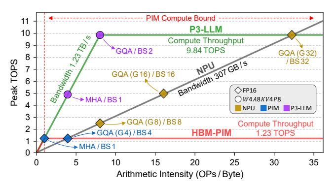

# A. Architecture of Large Language Models (LLMs)

As depicted in Fig. 1(a), mainstream LLMs have a series of decoder layers in addition to an input embedding table and an output language modeling (LM) head. During the prefilling stage of inference, the LLM receives a user prompt containing  $N_{\rm T}$  tokens, and converts it to an input matrix through an embedding table of size  $N_{\rm VOC} \times H$ , where  $N_{\rm VOC}$  is the vocabulary size and H is the hidden dimension size. The input matrix is processed by  $L\times$  decoder layers, followed by the LM head at the end to produce the first output token. During the decoding stage, the LLM takes this output token as input, and performs the same operation as in the prefilling stage to generate new tokens in an auto-regressive manner.

The decoder layer serves as the fundamental component in LLMs, consisting of a self-attention module and a multi-layer perceptron (MLP). The self-attention module begins with three linear layers  $(W_Q, W_K, W_V)$  to generate query, key, and value vectors, respectively. In recent LLM architectures [38], [84], [90],  $W_O$  and  $W_K$  are usually followed by rotary position embedding (RoPE) [83], which encodes positional information into the query and key vectors through matrix rotation. The generated key and value vectors are also cached in offchip memory for computation reuse during future decoding iterations, and are therefore referred to as the KV-cache. Then, each query and key-value vector is split into  $N_A$  and  $N_{KV}$ heads, respectively, where  $N_A$  is the number of attention heads and  $N_{\rm KV}$  is the number of key-value heads. For every attention head, the query vectors are multiplied with the transposed key vectors  $(Q \cdot K^{T})$ , followed by a softmax function to calculate the attention-scores (P). The attention-scores are then multiplied with the value vectors  $(P \cdot V)$ , and the results

Fig. 2: Illustration of PIM architectures for LLM decoding acceleration.

are passed through a linear layer  $(W_O)$  to produce the attention output states. The MLP module contains three linear layers  $(W_{\text{gate}}, W_{\text{up}}, W_{\text{down}})$  to produce the MLP output states.

Considering the KV-cache needs to be stored for every token, its capacity can become significant for long-context scenarios [4]. To mitigate this storage overhead, recent LLMs have adopted the GQA mechanism. As shown in Fig. 1(b), conventional multi-head attention has the number of attention heads equal to the number of key-value heads, i.e.,  $N_{\rm A}=N_{\rm KV}$ . On the other hand, GQA partitions the  $N_{\rm A}$  attention heads into  $G=N_{\rm A}/N_{\rm KV}$  groups (two in this example), and different groups share the same key-value vectors, effectively reducing the KV-cache capacity by  $G\times$ .

### B. Processing In-Memory (PIM) for LLM Acceleration

DRAM-based PIM has become a promising solution to accelerate the decoding stage of LLM inference given its higher internal bandwidth tailored for memory-bound operations [27], [44], [48], [49], [51], [77], [81]. Fig. 2 illustrates the architectures of two commercially available PIM devices: Samsung's HBM-PIM [49] and SK Hynix's Accelerator-in-Memory (AiM) [48]. The left part of Fig. 2 shows a PIM channel consisting of 16 banks organized into 4 bank groups. One PIM compute unit (PCU) is placed near each DRAM bank to perform efficient GEMV operations by leveraging the abundant bank-level parallelism. Depending on area constraints, two banks may share the same PCU to amortize the area overhead [49]. During LLM decoding, the DRAM bank transfers weights / KV-cache data to the PCU in 256-bit granularity (i.e., 16×16-bit operands). Meanwhile, the input vector is sent from the host to either the PCU register file in HBM-PIM or the global buffer in AiM.

As shown in the right part of Fig. 2, HBM-PIM and AiM have different implementations of the PCU microarchitecture. In HBM-PIM, the PCU contains a 16-way single-instruction-multiple-data (SIMD) MAC unit, and allows to exploit input reuse during GEMV by multiplying the same input element with 16 weights. On the other hand, the PCU of AiM uses the brain floating-point (BF16) format for data representation, and adopts an adder-tree-based design to exploit output reuse during GEMV. Despite their simplicity, the high-precision PCUs incur considerable area overhead, ranging from 20% to

27% of the DRAM die area [48], [49], primarily because the DRAM process has roughly  $10\times$  lower transistor density and fewer metal layers for routing compared to CMOS at the same technology node [13]. This overhead significantly constrains the achievable compute throughput of PIM, restricting its performance benefits mainly to single-batch inference and multi-head attention that do not exhibit data reuse.

## C. LLM Quantization

Quantization is a widely used technique for cost-effective LLM acceleration. Consider a group of operands X and a list of quantization values Q, the quantized operand  $\widetilde{X}$  and dequantized operand  $\widetilde{X}$  can be calculated as follows:

$$\Delta = \frac{|X|_{max}}{Q_{max}} \; ; \; \; X_Q = \text{Round}\left(\frac{X}{\Delta} \, , \, Q\right); \; \; \widetilde{X} = X_Q \cdot \Delta \quad \text{(1)}$$

where  $\Delta$  is the scaling factor, and Round (x, Y) is a function that rounds a value x to the closest value in a set Y. This rounding process inevitably introduces error between the original and quantized operands. Numerous techniques have been proposed to reduce quantization error, such as mixed-precision quantization and custom numerical formats.

In mixed-precision domain, SoTA algorithmic solutions on weight-only [17], [52] and KV-cache-only [28], [61] quantization have demonstrated near-lossless accuracy at 4-bit precision. To further alleviate the computation and memory demands of LLMs, several studies have explored weight-activation quantization [2], [15], [53], [82]. Meanwhile, recent literature in the architecture community has explored custom numerical formats that can better adapt to the tensor distribution of LLMs [6], [16], [21], [29], [32], [47], [56], [69], [78], [79], [89]. In addition to research efforts, custom quantization formats have been widely adopted by industry. For instance, NVIDIA and AMD support the 8-bit floating-point format with two variants: 4-bit exponent 3-bit mantissa (FP8-E4M3) and 5-bit exponent 2-bit mantissa (FP8-E5M2) [69].

### III. MOTIVATION

### A. Memory Footprint vs. Quantization Sensitivity

Fig. 3(a) shows the memory breakdown of various LLMs at FP16, including Llama-2-7B [67], Llama-3.1-8B [64], Llama-3.2-3B [66], and Mistral-7B [38]. The batch size varies from 1 to 8 and the input context length is 4K, reflecting typical edge LLM inference scenarios [16], [20], [44], [50]. While model weights dominate the memory footprint at very low batch sizes, the KV-cache capacity significantly grows with increasing batch sizes. Conversely, activations and attention-scores have a smaller impact on memory footprint, since their memory can be released immediately after the associated GEMM/GEMV modules complete. Furthermore, Llama-2-7B requires much larger KV-cache than other LLMs, due to its usage of multi-head attention.

Fig. 3(b) demonstrates the impact of quantizing individual operands to low precision using the standard integer format, while maintaining other operands at FP16. We quantify the model performance of Llama-3.1-8B and Llama-3.2-3B on the C4 dataset [14] using the perplexity metric, where lower perplexity indicates better performance. Unlike the trend observed in memory footprint, activations and attention-scores exhibit

Fig. 3: Analysis of LLM operands: (a) Memory footprint of various LLMs at a 4K context length across different batch sizes. (b) Impact of quantization bit-width on the C4 perplexity ( $\downarrow$ ) of Llama-3.1-8B and Llama-3.2-3B. On the x-axis, operand bits represent the precision of quantizing each operand independently. The perplexity of baseline FP16 LLMs and different quantization methods under W4A8KV4 are also highlighted. Note that all W4A8KV4 methods use FP16 attention-scores, except for  $P^3$ -LLM, which uses 8-bit attention-scores.

Fig. 4: Roofline analysis of different accelerators. The markers highlight the achievable throughput of various operators, including multi-head attention (MHA), grouped-query attention (GQA) with different group sizes (G), and linear layer with different batch sizes (BS).

larger sensitivity to quantization, leading to worse perplexity than weight and KV-cache under the same quantization bitwidth. Furthermore, quantizing weight and KV-cache can maintain acceptable perplexity until 4-bit.

The above observations motivate our mixed-precision quantization scheme, namely W4A8KV4P8. In this scheme, weights (W) and KV-cache (KV) are quantized to 4 bits to maximize memory savings, while activations (A) and attention-scores (P) are retained at 8 bits to mitigate accuracy loss. Although attention-scores account for a small memory footprint, we argue that quantizing attention-scores further enhances hardware efficiency by allowing the  $P \cdot V$  operation of the self-attention module to run on low-precision compute units. Unfortunately, the naïve W4A8KV4P8 quantization with the standard integer format results in large perplexity degradation, as highlighted in Fig. 3(b). To address this, P3-LLM proposes an operanddependent W4A8KV4P8 quantization strategy using hybrid numerical formats (detailed in Section IV). This approach employs dedicated numerical format for each LLM operand to minimize their quantization error. As a result, P3-LLM achieves better model performance than SoTA W4A8KV4 integer quantization algorithms, QuaRot [2] and QoQ [53].

## B. Limitations of Existing NPU-PIM Systems

Existing PIM solutions for LLM inference mainly adopt high-precision PCUs with limited computation throughput, thus facing challenges in low-batch decoding and GQA. To elucidate such limitations, we conduct roofline analysis on

TABLE I. P³-LLM vs. existing co-design solutions for quantized LLM acceleration. The precision "W $\alpha$ A $\beta$ KV $\gamma$ P $\delta$ " stands for  $\alpha$ -bit weights,  $\beta$ -bit activations,  $\gamma$ -bit KV-cache, and  $\delta$ -bit attention-scores. By default, attention-scores are 16-bit.

| Framework                  | Operand Precision | Memory Saving | Model Accuracy | Hardware Efficiency |
|----------------------------|----------------------|------------------|-------------------|------------------------|
| BitMoD [6]                 | W4A16KV16            | Medium           | High              | Medium                 |
| Oaken [42]                 | W16A16KV4            | Medium           | High              | Low                    |
| MANT [29]                  | W4A8KV4              | High             | Medium            | Medium                 |
| Ecco [8]                   | W4A8KV4              | High             | High              | Low                    |
| Pimba [44]                 | W16A16KV8            | Low              | High              | Medium                 |
| P 3 -LLM (Ours) | W4A8KV4P8            | High             | High              | High                   |

HBM-PIM supporting FP16 arithmetic [49], which has  $4\times$ higher bandwidth than normal HBM during PIM operations. Fig. 4 reveals that the performance benefits of HBM-PIM gradually disappear as the batch size (BS) and GQA group size (G) approach 4, due to the limited computation throughput. On the other hand, NPU remains memory-bound even for moderate BS  $\geq$  16, making it highly desirable to increase the compute throughput of PIM while exploiting its abundant bandwidth. To address this, P3-LLM leverages W4A8KV4P8 quantization to enable cost-effective LLM inference on compact, lowprecision hardware. Compared to HBM-PIM, P3-LLM can integrate 4× PCUs under iso-compute-area constraints. Furthermore, as we will discuss in Section V-D, the low-precision PCU enables  $2 \times$  higher operating frequency than the FP16 PCU, which effectively doubles the peak throughput. Thus,  $P^3$ -LLM offers a superior roofline with  $8 \times$  higher throughput over HBM-PIM.

