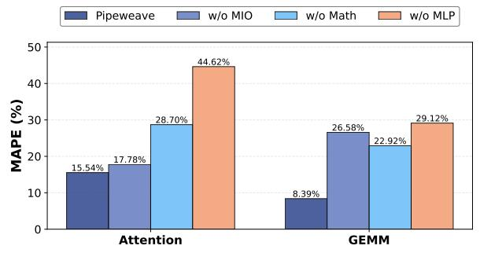
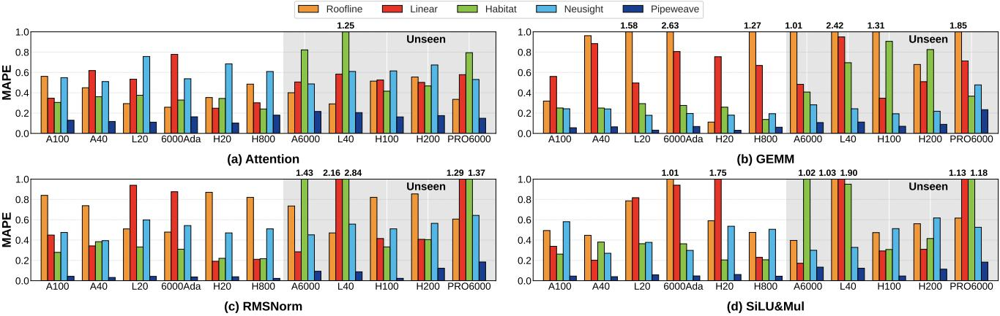
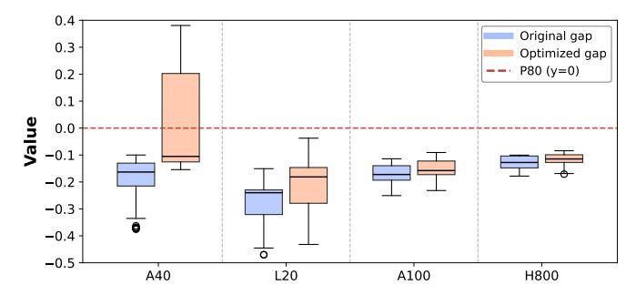

# *A. Baselines*

To comprehensively evaluate PIPEWEAVE, we conduct our primary evaluation by comparing its prediction accuracy against four main baselines: (1) the classic analytical Roofline model [74]; (2) a Linear regression-based model [29]; (3) Habitat [76]; and (4) Neusight [26], a state-of-the-art datadriven method. To ensure a fair comparison among these primary baselines, we adjusted them to incorporate our analytical components. The Linear model, following the approach in the original paper [29], was trained using two main features from our Feature Analyzer (Section IV-C): theoretical cycles for aggregating compute and memory demand. Similarly, we supplied Habitat and Neusight with the exact task definitions from our Kernel Decomposer (Section IV-A).

Furthermore, to highlight the advantages of our analytical–ML hybrid design in both prediction accuracy and simulation efficiency, we introduce a secondary set of baselines representing highly detailed modeling paradigms: AMALI [6], an instruction-trace-based analytical model, and LLMCompass [78], a hybrid framework that integrates analytical models

| Metric         | gemm8 | gemm9 | FA2  | FA3  |
|----------------|-------|-------|------|------|
| Max SM Ops (%) | 0.07  | 0.04  | 6.34 | 0.45 |
| Total Ops (%)  | 0.01  | 0.14  | 0.50 | 0.00 |

and cycle-accurate systolic array modeling. Since these detailed simulators provide limited support for diverse modern kernels and incur substantial runtime overhead for end-to-end LLM workloads, we restrict this comparison to standalone GEMMs.

## B. Validation of Analytical Components

We first validate PIPEWEAVE's core analytical components: *Kernel Decomposer*, *Scheduling Simulator*, and *Feature Analyzer*. This step is essential since these parts work in sequence. Any error may propagate and reduce the final feature quality.

We start by verifying the correctness of the *Kernel Decomposer*. Specifically, we compare the number of CTAs from our decomposition process with the ground-truth configurations in the dataset across multiple kernels. The results are fully consistent, confirming decomposition accuracy.

Next, we assess the accuracy of the Scheduling Simulator and Feature Analyzer. Our method compares analytically derived math pipeline operation counts, both total (kernel-wide) and per-SM maximum operations, against ground-truth measurements from the NVIDIA Nsight Compute (NCU) tool [53]. Due to high profiling overhead and restricted hardware access, we perform this validation on two flagship devices: A100 and H100. The evaluation covers four key kernel implementations: cuBLAS GEMM (gemm8 on A100 and gemm9 on H100), FA2, and FA3. Each includes about 500 test samples randomly sampled from the workload configuration ranges defined in Section V-B. As shown in Table VII, our model achieves a maximum error of 0.5% for total operations and 6.3% for the maximum per-SM operations. The higher error for FA2 (6.34%) relative to FA3 (0.45%) is mainly due to their different scheduling mechanisms: FA3 uses a persistent-kernel design with deterministic task scheduling that can be explicitly simulated, whereas FA2 relies on dynamic hardware scheduling, which introduces additional uncertainty in predicting peak per-SM workload.

Finally, we conduct an ablation study on the GEMM and Attention kernels using their full datasets (Section V-B) to highlight the contribution of our core components. We compare the full PIPEWEAVE model against three ablated variants: (1) w/o MIO (without MIO features), (2) w/o Math, and (3) w/o MLP (replacing MLP with a Roofline-based predictor). As shown in Figure 4, each component is crucial for accurate performance. For the Attention kernel, the full model achieves 1.1×, 1.8× and 2.9× higher accuracy than w/o MIO, w/o Math, and w/o MLP respectively. The effect is stronger for GEMM, where our full model improves accuracy by 3.2× (w/o MIO), 2.7× (w/o Math), and 3.5× (w/o MLP), respectively. While both kernels benefit significantly from our modeling framework, the final prediction error for Attention kernels

TABLE VIII
PREDICTION ERROR ON SEEN AND UNSEEN GPUS.

| Hardware | Roofline | Linear | Habitat | Neusight | PIPEWEAVE |
|----------|----------|--------|---------|----------|-----------|
| Seen     | 72.22%   | 59.50% | 28.92%  | 43.49%   | 6.77%     |
| Unseen   | 79.61%   | 70.28% | 85.96%  | 46.70%   | 13.14%    |

(15.54%) remains higher than that of GEMM kernels (8.39%). As previously shown in Table VII, this gap is not caused by inaccuracies in the analytical operation counts, which remain comparably low for both kernels. Instead, it arises from the inherently uneven workload distribution and dynamic execution characteristics of Attention mechanisms. Unlike GEMM, where tasks are defined by uniform dimensional parameters across tiles, Attention workloads exhibit substantial variance. This variance primarily results from causal masking—where tasks processing earlier query tokens attend to fewer key/value tokens than those handling later tokens—as well as randomly varying sequence lengths within a batch. In addition, Attention introduces more complex memory behavior and heterogeneous execution phases with different compute-memory characteristics, which further increase runtime variability. These factors make execution latency more sensitive to hardware scheduling dynamics and lead to larger inter-block completion variance. Consequently, Attention latency is inherently more difficult for the MLP to model than the stable and uniform execution patterns observed in GEMM workloads.

## C. Kernel-Level Prediction Accuracy

We evaluate PIPEWEAVE on a dataset of around **1M** samples from 11 different GPUs (Section V-B). This dataset includes fundamental kernels from modern inference frameworks such as vLLM [72] and SGLang [59]), covering FP32, BF16/FP16, and FP8 precisions. PIPEWEAVE achieves state-of-the-art prediction accuracy and significantly surpasses prior work. On seen hardware, it attains an average MAPE of 6.0%, outperforming the next-best Neusight at 42.6%. On unseen hardware, our framework demonstrates superior generalization with an average MAPE of 11.5%-a **3.9**× improvement compared to Neusight (45.1%).

Figure 5 shows the prediction accuracy (MAPE) for four typical kernels in BF16 LLM inference scenarios. Correspondingly, Table VIII summarizes the average MAPE across

Fig. 4. Ablation study on the impact of MIO and Math Pipeline features for GEMM and Attention kernels.

Fig. 5. Kernel-level prediction accuracy (MAPE) of PIPEWEAVE and baseline models. Unseen hardware platforms are identified by a grey background.

Fig. 6. End-to-end inference prediction accuracy (MAPE) of PIPEWEAVE and baseline models for single-GPU Qwen2.5-14B inference using SGLang. Unseen hardware platforms are identified by a grey background.

these four kernels on both seen and unseen hardware. Errors for Linear and Roofline models are significantly higher than PIPEWEAVE on both seen and unseen hardware, with peak MAPEs reaching 215.6% and 263.5%, respectively. Although the SOTA baseline, Neusight, outperforms other baselines, its highest error of 75.7% remains substantially above PIPEWEAVE's 23.4%. Furthermore, the prediction errors of analytical approaches, namely the Linear and Roofline models, are highly hardware-dependent. For instance, Figure 5(b) highlights a stark contrast in the Roofline model's MAPE for GEMM kernels between the H20 (11%) and H800 (127%). This difference arises from the distinct compute-to-memory ratios of the two GPUs. Specifically, while the H20 retains approximately 120% of the H800's memory bandwidth, its peak compute capability is restricted to roughly 15% of the H800's. Under this extremely low compute-to-memory ratio, the compute units on the H20 are easily saturated. The abundant memory bandwidth ensures that execution pipelines are constantly fed, allowing GEMMs to sustain throughput very close to the theoretical peak; thus, the Roofline estimate remains accurate. Conversely, the H800 features a massive compute capacity that is exceedingly difficult to fully saturate in most practical scenarios, as reaching the theoretical peak requires nearperfect instruction-level concurrency and uninterrupted data delivery. In practice, inevitable microarchitectural frictions prevent kernels from approaching this idealized Roofline peak, leading to significant overestimation. Unlike such models, PIPEWEAVE's MLP naturally learns these hardware-specific inefficiencies, thereby achieving significantly lower prediction errors.

Besides the four kernels common in BF16 LLM inference

scenarios, we also trained and tested the scaled mm kernel (block-wise quantization) for FP8 inference on the Hopper architecture, achieving high prediction accuracy. On seen hardware (H20, H800), PIPEWEAVE's MAPE was 1.9% and 4.1%, while on unseen hardware (H100, H200), MAPE was 4.2% and 5.2%. This highlights the framework's adaptability to FP8 precision kernels, achieving average accuracy gains of  $10.8\times$ ,  $9.5\times$ ,  $5.5\times$ , and  $7.8\times$  over Roofline, Linear, Habitat, and Neusight.

Finally, to evaluate PIPEWEAVE's prediction accuracy and simulation efficiency, we conduct a targeted comparison with AMALI and LLMCompass on an A100 GPU. As outlined in our baseline methodology (Section VI-A), this comparison is restricted to GEMMs due to the high computational overhead of these detailed simulators. Using 540 distinct GEMM samples with varying dimensions randomly drawn from our dataset (Section V-B), we measure prediction error and per-GEMM simulation overhead. Figure 7 shows the comparison results, where prediction error is reported as signed relative error to capture both over- and under-estimation. Overall, PIPEWEAVE achieves substantially lower simulation overhead while maintaining higher prediction accuracy. On average, it obtains a MAPE of 6.4%, compared with 28.3% for AMALI and 29.7% for LLMCompass, while reducing prediction time by 3 to 7 orders of magnitude. These results indicate that the grey-box design—combining pipeline-demand analytical modeling with ML—can effectively capture dominant performance factors without requiring expensive low-level simulation.

Fig. 7. Comparison of simulation overhead versus relative prediction error for GEMM workloads on the A100 GPU.

## D. E2E Inference Accuracy

Beyond kernel-level validation, we assess PIPEWEAVE's end-to-end predictive accuracy by comparing its simulations with actual serving latencies from SGLang [59] and vLLM [72]. Following prior work [1], we use two representative datasets Arxiv Summarization [8] and Splitwise [55]—and test three typical LLMs (Qwen2.5-14B, Qwen3-32B, and Llama3.1-70B) in both single-GPU (TP=1) and distributed (TP, PP) inference settings.

Workloads for these datasets are generated by randomly sampling requests to create batches of varying sizes, such as arxiv\_8 and splitwise\_64. The arxiv\_\* (where \* denotes the batch size) workloads have an average input length of 2,630 tokens, while the splitwise\_\* workloads average 982 tokens. Output lengths vary from 5 to 4,056 tokens.

For single-GPU (TP=1) evaluations, we tested Qwen2.5-14B across all 11 GPUs (Figure 6). PIPEWEAVE achieves an average MAPE of 11.3%, notably outperforming the best baseline, Neusight at 34.5%. Furthermore, PIPEWEAVE maintains high accuracy on unseen GPUs, with a 12.5% MAPE—a significant **2.8**× improvement over Neusight's 34.4%.

This robustness extends to distributed inference. As shown in Table IX, PIPEWEAVE delivers consistent accuracy across diverse end-to-end inference scenarios. It spans two inference frameworks (SGLang and vLLM), multiple models (Qwen3-32B and Llama3.1-70B), and various parallelism strategies (TP=2, TP=4, TP=8, and TP=4&PP=2). PIPEWEAVE consistently achieves low MAPE averages: 8.4% (SGLang, Qwen3-32B, TP=2), 4.3% (SGLang, Llama3.1-70B, TP=4), 7.7% (SGLang, Llama3.1-70B, TP=8), and an excellent 4.0% (vLLM, Llama3.1-70B, TP=4&PP=2). This performance significantly surpasses the best baseline Neusight. Across all 20 tested configurations, PIPEWEAVE achieves an overall average MAPE of 6.6% versus Neusight's 34.7%, showing a  $5.3\times$ average accuracy improvement. Interestingly, our analysis shows that in some E2E inference scenarios, baselines such as Neusight can exhibit very low E2E errors (e.g., 0.5%) despite having poor kernel-level prediction accuracy. We identify two primary causes for this phenomenon. First, E2E latency aggregates the execution time of many kernels, which leads to systematic error cancellation: overestimations for some kernels offset underestimations for others, thereby reducing the overall E2E error. Second, E2E inference typically involves a much narrower and more constrained set of workload dimensions than those covered in comprehensive kernel-level evaluations (Section V-B); consequently, these workloads often lie near the baseline's prediction "sweet spots."

In summary, PIPEWEAVE delivers high fidelity, fast prediction, and broad generalizability for GPU performance modeling.

## VII. BEYOND SIMULATION

In prior sections, we verified the robustness of PIPEWEAVE. Trained with a MAPE loss, our framework demonstrates strong accuracy in forecasting the performance of various well-optimized kernels on diverse hardware platforms. In this section, we transition from general prediction to a more challenging task: **optimization guidance**. Our goal is to improve the performance of the Fused MoE Triton kernel—the default MoE backend in SGLang [59]—across hardware platforms.

The primary challenge lies in the opacity of performance potential. For any given input shape and hardware platform, the attainable performance ceiling is unknown. Consequently, we cannot determine *a priori* whether a current execution is near-optimal or sub-optimal. For instance, achieving 50% of the roofline [74] on an A40 might be poor if the true ceiling is 70%, while 20% on an A100 could be near-optimal if the ceiling is only 21%. Lacking this ground truth, it is impossible to systematically quantify the performance gap or identify where system-level optimization efforts should be directed.

Therefore, we look beyond simulation. Rather than predicting average performance, our aim is to provide practical optimization guidance. We aim to address the following questions:

- (1) Can modeling help establish the kernel's true "Potential Performance Ceiling", distinct from the noise of suboptimal configurations?
- (2) Can this estimated "ceiling" serve as a reference to identify systematic underutilization and guide optimization efforts?

## A. Defining the Potential Ceiling via Quantile Loss

To address this issue, we adopt the principles of Quantile Regression [23]. We train an MLP model using the same feature set and target (execution efficiency) described in Section V-C, but employ Quantile Loss as the training objective. We specifically configure the model to predict the 80th percentile (P80). This approach provides a statistically robust estimate of the performance ceiling, which is less sensitive to extreme outliers or measurement noise compared to higher quantiles such as P90.

By targeting P80, the model is effectively trained to fit the top 20% of performance data points, capturing the characteristics of high-performing configurations while systematically filtering out the lower 80% of sub-optimal results. Consequently, the resulting prediction,  $\hat{y}_{p80}$ , does not represent a typical average. Instead, it serves as a statistically-defined **Potential** 

TABLE IX
END-TO-END PERFORMANCE PREDICTION MAPE (%) OF PIPEWEAVE AND BASELINES FOR MULTI-GPU INFERENCE USING SGLANG AND VLLM.

| Framework       | Model                    | Dataset      | Hardware | Roofline | Linear | Habitat | Neusight | PIPEWEAVE |
|-----------------|--------------------------|--------------|----------|----------|--------|---------|----------|-----------|
|                 |                          |              | A100     | 48.6     | 42.7   | 47.3    | 45.0     | 2.4       |
|                 |                          |              | 6000Ada  | 59.2     | 43.3   | 44.9    | 30.4     | 9.1       |
|                 |                          | arxiv_12     | H100     | 73.5     | 77.1   | 34.9    | 31.1     | 7.5       |
| SGLang          | Qwen3-32B (TP=2)         |              | PRO6000  | 46.5     | 15.2   | 39.6    | 56.6     | 9.3       |
| Sozung          | Q., end 525 (11 2)       |              | A100     | 49.0     | 44.6   | 35.5    | 45.9     | 3.9       |
|                 |                          | 3.1.         | 6000Ada  | 53.2     | 51.5   | 35.1    | 38.8     | 7.9       |
|                 |                          | splitwise_48 | H100     | 62.4     | 49.6   | 33.3    | 60.2     | 16.5      |
|                 |                          |              | PRO6000  | 47.1     | 29.8   | 36.9    | 18.5     | 10.9      |
|                 |                          | . 10         | A100     | 45.2     | 30.3   | 50.1    | 76.5     | 2.6       |
| SGLang          | Llama3.1-70B (TP=4)      | arxiv_16     | H100     | 78.6     | 69.4   | 45.6    | 34.5     | 5.4       |
| Sozung          | Emmeri 70B (II I)        | 111 1 64     | A100     | 46.0     | 26.2   | 57.5    | 55.6     | 2.1       |
|                 | splitw                   | splitwise_64 | H100     | 82.2     | 64.8   | 56.1    | 47.2     | 7.0       |
|                 |                          |              | H20      | 90.1     | 70.5   | 54.4    | 27.1     | 4.0       |
| SGLang          | Llama3.1-70B (TP=8)      | arxiv_16     | H800     | 66.7     | 46.7   | 25.9    | 17.2     | 12.3      |
| Social Liamas.1 | Ziminasii 702 (II 0)     |              | H20      | 91.8     | 74.3   | 62.7    | 20.4     | 3.7       |
|                 |                          | splitwise_64 | H800     | 69.8     | 51.5   | 29.1    | 26.1     | 10.7      |
|                 |                          | 1 10         | H20      | 69.1     | 45.2   | 54.6    | 0.5      | 3.0       |
| vLLM            | Llama3.1-70B (TP=4,PP=2) | arxiv_16     | H800     | 25.7     | 60.8   | 9.0     | 16.9     | 0.7       |
|                 | 2                        | 211 1 64     | H20      | 76.7     | 64.7   | 72.6    | 19.1     | 2.3       |
|                 |                          | splitwise_64 | H800     | 49.5     | 67.1   | 38.6    | 23.7     | 9.9       |

**Performance Ceiling**, representing a high yet realistically achievable target for the kernel's implementation.

## B. Diagnosing the Performance Gap

We first validate the P80 model as a diagnostic tool. The trained model, which predicts the P80 ceiling  $\hat{y}_{p80}$ , is applied across the entire Fused MoE dataset (Section V-B). We then measure the *Performance Gap* by computing the difference between the predicted ceiling and the actual performance:

$$perf_gap = \hat{y}_{p80} - y_{actual}$$

Here,  $y_{\text{actual}}$  represents execution efficiency (Section V-C).

Figure 8 presents a consolidated analysis of these gaps. Each vertical bar represents a hardware platform, with the bar height indicating the total number of identified underperforming points on that platform. The line plot shows the cumulative distribution function (CDF) of the performance gaps aggregated across all evaluated hardware platforms. The figure reveals two key findings. First, the CDF line confirms a "long tail" pattern. We observe that while the vast majority of configurations perform near their potential, approximately 80% of all points have a Performance Gap below 0.1. Based on this observation, we identify an "Underperforming Point" as any configuration where the Performance Gap > 0.1. Second, the bar chart pinpoints where these Underperforming Points occur, revealing that significant inefficiencies are hardwarespecific. For instance, the A40 GPU exhibits the largest discrepancies, accounting for the vast majority of inefficiencies with 921 distinct Underperforming Points (representing 30.4% of all A40 samples). This clearly indicates that the kernel's current configuration logic is ill-suited for this specific hardware architecture. In stark contrast, the H20 achieves near-optimal results, exhibiting zero such points.

Fig. 8. Performance Gap analysis. The CDF of the gap distribution (line) and the count of "Underperforming Points" (Gap > 0.1) by hardware (bars).

## C. Closing Performance Gap by Tuning Parameters

In Section VII-B, we apply our P80 model to successfully identify "Underperforming Points". We now verify that these gaps are actionable and indicative of systemic optimization potential. Approximately 70 unique "Underperforming Point" configurations are selected for each GPU: A40, L20, A100, and H800. For these targeted cases, optimization is conducted via brute-force autotuning over three parameters: BLOCK\_SIZE, num\_stages, and num\_warps.

To explicitly validate our statistical diagnostic methodology against actual optimization outcomes, Table X shows the relationship between the systemic density of underperforming points and the achieved tuning benefits. A clear positive correlation is observed (Pearson correlation coefficient of **0.86**): hardware platforms with a higher count of underperforming points obtain larger geometric mean speedups after tuning. This result confirms that our statistical diagnosis effectively reflects real optimization potential and can guide tuning efforts toward configurations with the largest expected gains.

Furthermore, Figure 9 demonstrates the practical impact of these diagnosed underperforming points. After applying bruteforce autotuning, the average performance gap is noticeably

TABLE X SPEEDUP VS. UNDERPERFORMING POINTS ACROSS GPUS.

| GPU  | Underperforming Points | Geo-mean Speedup |
|------|------------------------|------------------|
| A40  | 921                    | 1.61×            |
| L20  | 728                    | 1.12×            |
| A100 | 488                    | 1.06×            |
| H800 | 340                    | 1.03×            |

Fig. 9. Performance gap distribution before and after model-guided optimization across four GPU platforms.

reduced, particularly on hardware that initially exhibits larger inefficiencies. For example, the average gap on A40 decreases from **0.187** to **0.083**, and on L20 from **0.274** to **0.215**. In contrast, the improvements on A100 and H800 are more limited, as their baseline configurations are already closer to the estimated performance ceiling. Despite these improvements, a residual gap often remains. This suggests that certain inefficiencies cannot be fully eliminated through parameter tuning alone, but may instead stem from deeper factors such as the kernel's structural design or inherent limitations of the Triton programming model [12], [58].

#### VIII. RELATED WORK

## A. GPU Performance Modeling

Research on GPU performance modeling is broadly divided into three categories: cycle-accurate simulators [4], [22], [66], analytical models [6], [19], [25], [78], and data-driven approaches [26], [76]. Despite their usefulness, these approaches present inherent trade-offs. High-fidelity cycle-accurate simulators are computationally expensive and difficult to generalize across new hardware. Faster alternatives—analytical and data-driven models—often face limited accuracy, hardware-specific constraints, and coarse-grained assumptions that miss complex behaviors such as fused-kernel coupling, restricting their generalization. PIPEWEAVE is designed to address these limitations by combining principled analytical modeling with the speed and flexibility of data-driven techniques, enabling high fidelity and broad generalization.

Table XI summarizes representative GPU performance models. Unlike prior methods relying on empirical black-box learning or coarse-grained analytical abstractions (e.g., tile-level throughput and static wave scheduling), PIPEWEAVE advances the grey-box paradigm via a microarchitecture-aware, pipeline-level formulation. By explicitly capturing heterogeneous pipeline demands and dynamic scheduling, it achieves high accuracy and cross-architecture portability.

TABLE XI
COMPARISON OF MICROARCHITECTURAL MODELING CAPABILITIES.

| Dimension             | Habitat           | Neusight               | PIPEWEAVE (Ours)          |
|-----------------------|-------------------|------------------------|---------------------------|
| Modeling Strategy     | Black-box         | Macro Grey-box         | Micro-arch Grey-box       |
| Granularity           | Kernel-level      | Tile-level             | Pipeline-level            |
| Hardware Fidelity     | GPU               | SM                     | Pipeline                  |
| Scheduling Semantics  | N/A               | Static wave assumption | Dynamic SM scheduling     |
| Kernel Type           | Elemental kernels | Elemental kernels      | Fused & Elemental kernels |
| Cross-Arch Generality | Low               | Medium                 | High                      |
| Prediction Accuracy   | Low               | Medium                 | High                      |

#### B. Network Simulation

As computation scales across multi-node clusters, precise modeling of data center interconnects grows increasingly vital. General-purpose network simulators [17], [69] provide granular packet-level control to evaluate congestion, routing behavior, and protocol interactions. Newer AI-focused network simulation frameworks [57], [73] target communication patterns such as All-Reduce and All-Gather, as well as the performance characteristics of large-scale, communication-heavy distributed workloads.

## C. System-Level Simulation

Beyond individual components, extensive research focuses on end-to-end DNN system performance simulation. These tools model the complex interactions among computation, communication, and scheduling strategies for large models. In distributed training, simulators [5], [57], [73] evaluate various parallelism strategies, such as data, pipeline, tensor. For inference, particularly in LLM serving, tools [1], [7], [14] simulate dynamic batching and scheduling policies. Our PIPEWEAVE framework not only incorporates a system-level simulator for inference, but also offers a high-fidelity, pluggable GPU computation model required by prior system-level tools.

#### IX. CONCLUSION

We present PIPEWEAVE, a unified framework that synergizes knowledge-guided analytical modeling with data-driven learning to achieve high-fidelity GPU performance prediction. By decomposing kernels into fundamental pipeline demands and capturing complex runtime interactions via an MLP, PIPEWEAVE demonstrates state-of-the-art accuracy and generalization across diverse kernels, workloads, and hardware generations. Beyond prediction, we validated its practical utility in diagnosing hardware-specific inefficiencies and guiding targeted optimizations.

Future work will focus on two main areas. First, we will extend PIPEWEAVE to complex distributed settings, incorporating support for multi-node clusters and advanced parallelism strategies such as Expert Parallelism (EP). Second, we plan to broaden our model-guided optimization method by developing automated tools that detect performance bottlenecks and enhance configuration logic for more production kernels.

