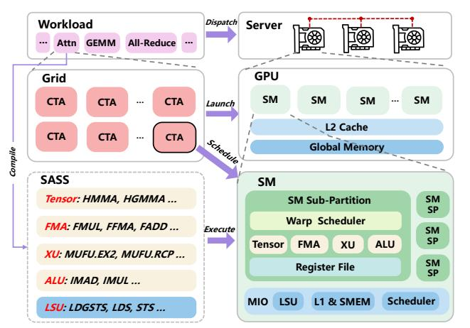

# *A. Large Language Models (LLMs)*

Modern LLMs are predominantly based on the Transformer architecture [70]. A typical Transformer block includes two key components: a multi-head attention mechanism and a position-wise feed-forward network (FFN). LLM inference is commonly divided into two phases: *prefill* and *decode* [2], [59], [72]. During prefill, the input prompt is processed in parallel, with key/value pairs computed and stored in the KV cache for every token. The decode phase then generates output tokens in an autoregressive way.

Table I shows the kernel (a GPU-executable function) runtime distribution for Qwen2.5-32B inference on a 4×A100 cluster with Tensor Parallelism (TP=4) (batch size 8, sequence

TABLE I RUNTIME BREAKDOWN OF QWEN2.5-32B INFERENCE ON A 4×A100 CLUSTER WITH TENSOR PARALLELISM (TP=4).

| Phase   | GEMM   | Attention | RMSNorm | SiLU&Mul | All-Reduce | Other |
|---------|--------|-----------|---------|----------|------------|-------|
| Prefill | 72.70% | 8.22%     | 3.85%   | 2.26%    | 12.10%     | 0.87% |
| Decode  | 65.05% | 17.78%    | 3.19%   | 1.50%    | 5.76%      | 6.72% |

length 8192). These categories correspond to core computational building components and communication primitives of the Transformer architecture used in today's mainstream distributed LLMs: GEMM kernels [2] dominate the workload, stemming from linear projections in both attention and feedforward layers; Attention kernels compute the relationships between tokens; RMSNorm kernels [77] stabilize activations prior to attention and feed-forward computations; operations like SiLU&Mul implement activation functions and elementwise calculations, which are central to the SwiGLU FFN used in many LLMs [61]; and All-Reduce kernels handle the essential collective communications across GPUs. Together, these major kernels account for the vast majority of the total runtime. As their dominance persists across models, software stacks, and hardware generations [2], [11], [64], our analysis focuses on accurately modeling these kernels.

Furthermore, recent advances in LLM optimization have led to the adoption of specialized kernels. The use of lowerprecision data types, notably FP8 quantization for W8A8 (8 bit weights and activations) inference [24], [63], has popularized Scaled Matrix Multiplication (Scaled MM) kernels [40], [41], [45]. Concurrently, Mixture-of-Experts (MoE) architectures [9], [13], [62] leverage Fused MoE kernels. These kernels efficiently execute batched GEMM operations across expert sub-networks once token routing is finished.

## *B. From Kernels to GPU Architectures*

Without loss of generality, our discussion is contextualized within the NVIDIA GPU architecture, primarily focusing on LLM inference scenarios. To analyze performance in this context, we distinguish two tightly related perspectives: the *software* view, which involves how kernels are defined and launched, and the *hardware* view, which describes how kernels are mapped to and executed on the underlying microarchitecture, as illustrated in Figure 1.

Kernel execution involves two conceptual stages. The compilation stage produces GPU-executable code in the form of SASS instructions, which are the only representation that NVIDIA SMs can natively execute. In practice, the compilation toolchain may emit a fat binary that contains both architecture-specific SASS [33] and a virtual instruction set architecture (ISA) (PTX [54]); the CUDA driver may further JIT-compile PTX into SASS when necessary. Regardless of whether a kernel originates from Triton, CUDA C++, or precompiled libraries such as cuBLAS, its final execution always resolves to SASS instructions compatible with the target GPU microarchitecture [48], [68].

The runtime stage is responsible for launching the compiled kernel. A kernel launch specifies the CUDA execution configuration (Grid and its Cooperative Thread Arrays) [49].

Fig. 1. An illustration of the mapping between the software hierarchy and the physical GPU hardware hierarchy.

The GPU hardware work-distribution logic schedules CTAs onto SMs, dynamically dispatching work in units of CTAs rather than mapping the entire Grid at once [34], [47]. At the SM level, the SASS instructions from compilation are fetched via the instruction cache hierarchy and issued by warp schedulers to the SM's diverse execution pipelines.

An SM in Ampere [36] and later architectures is typically partitioned into four SM Sub-partitions (SMSPs) and one Memory I/O (MIO) unit. Each SMSP mainly includes a Warp Scheduler for cycle-by-cycle instruction dispatch, a Register File, and a collection of specialized math pipelines. Notable examples are fixed-latency math pipelines such as FMA (processing most FP32 arithmetic operations like FMUL, FADD) and Tensor (executing MMA instructions like HMMA), as well as variable-latency math pipelines like the XU (for special functions such as base-2 exponential MUFU.EX2). The MIO unit is dedicated to managing data movement. It incorporates on-chip memory caches—the L1 cache and Shared Memory (SMEM)—as well as the Load Store Unit (LSU), which executes memory instructions (e.g., LDGSTS, STS) for accessing global, local, or shared memory [52], [53].

This consistent high-level SM organization across Ampere and later architectures provides a stable micro-architectural abstraction. PIPEWEAVE builds on this foundation to achieve generalizability across kernels and hardware platforms.

#### III. MOTIVATION

The rapid co-evolution of LLMs and GPUs necessitates performance modeling tools that are fast, accurate, and generalizable across diverse LLMs, serving frameworks, and hardware architectures. Current approaches, such as cycle-accurate simulation [4], [22], analytical modeling [6], [19], [25], and data-driven methods [1], [73], each offer partial solutions, yet none fully meet these requirements. Although cycle-accurate simulators deliver high fidelity, they are slow. Analytical models are labor-intensive and lack generalizability.

In this landscape, data-driven strategies—particularly "grey-box" approaches that integrate analytical modeling with ML techniques [26], [76]—represent a distinct paradigm. These

methods aim to deliver rapid predictions with improved generalizability by utilizing strategies like tile-level decomposition and incorporating hardware specifications. However, despite marking notable progress, even these advanced techniques can encounter modeling constraints that limit their accuracy, with prediction errors exceeding 40% (Section VI-C).

The core issue arises from insufficient microarchitectural fidelity. Specifically, while state-of-the-art simulators like Neusight [26] incorporate workload-level feature engineering (e.g., tile decomposition), they still fall short of true microarchitectural modeling in three key aspects.

Mismatched Granularity: Although such methods decompose workloads into thread block tiles, their hardware representation remains coarse-grained. They primarily rely on tile-level descriptors as inputs to an ML model, without explicitly modeling how a tile's execution translates into specific demands and contention on the SM's heterogeneous instruction pipelines. For instance, the execution of a single tile inherently involves concurrent activity across multiple hardware units—such as Tensor, FMA, and memory pipelines. A tile-centric abstraction therefore collapses heterogeneous pipeline activity into a single aggregate workload representation, effectively treating the SM as a monolithic black box rather than reflecting its actual execution behavior.

**Inability to Model Fused Kernels:** Such methods model performance primarily at the level of individual deep learning operators in the computation graph (e.g., GEMM, Softmax). This abstraction assumes that kernel execution can be approximated as a composition of standard operators. However, modern high-performance implementations increasingly rely on fused kernels (e.g., FlashAttention [11]), where multiple operators are tightly integrated into a single GPU kernel. In such kernels, performance is governed by tightly coupled execution patterns introduced by operator fusion, where multiple computations are executed within a shared execution structure and intermediate data is reused across steps. As a result, the effective computation and data movement behavior no longer aligns with the boundaries of individual operators. These execution characteristics cannot be accurately captured through operator-level decomposition, leading to significant modeling limitations.

Static Wave Modeling: While current baselines attempt to account for wave quantization (the tail effect of thread block scheduling), they typically rely on a static assumption that tiles within a wave exhibit uniform execution latency. In practice, dynamic workloads—such as causal attention processing variable-length tokens or kernels with early-exit conditions—introduce substantial tile-to-tile latency variation. Without a granular scheduling model, these approaches struggle to capture cross-SM load imbalance and tail effects that frequently degrade real-world performance.

These limitations highlight the need for a new modeling approach that more faithfully reflects GPU execution. An accurate and generalizable model must bridge high-level workload structure with the microarchitectural realities of how kernels execute on modern GPUs. In particular, it should explicitly

characterize how workload decomposition and scheduling translate into concrete demands on heterogeneous instruction pipelines, rather than treating execution as an abstract workload description. At the same time, purely analytical modeling is insufficient to capture the complex interactions and resource coupling that arise in real kernels, and such models are often tailored to specific operators and hardware assumptions, making them difficult to generalize as new kernels or GPU architectures emerge without significant re-derivation. Therefore, a hybrid design is needed: one that grounds the model in execution-aware analytical structure while leveraging learningbased components to capture higher-order performance effects. This design philosophy underpins PIPEWEAVE.

