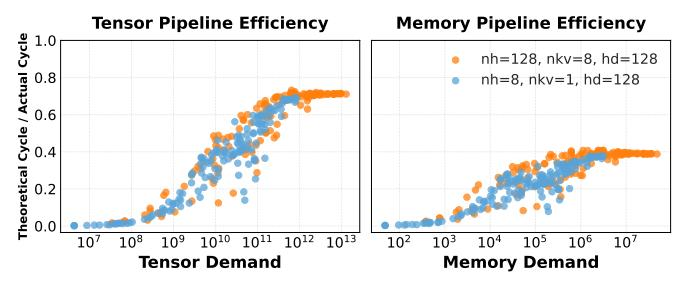

# IV. THE PIPEWEAVE DESIGN

Achieving accurate and generalizable GPU performance prediction requires a comprehensive understanding of the intricate interplay between software kernels and underlying hardware architectures. A robust modeling approach must account for both deterministic first-order effects and complex dynamic interactions. Accordingly, we propose PIPEWEAVE, a framework built on a methodology guided by the *dual principles of knowledge and data*.

The *knowledge-driven* component is a hierarchical analytical model that leverages deep domain-specific knowledge of the GPU's parallel execution model to systematically decompose a kernel's complex execution flow. This top-down decomposition progresses from the entire kernel to a set of fundamental tasks, and further into the elemental demands on specific instruction pipelines. This decomposition yields an interpretable feature set for the complementary *data-driven* component: a lightweight MLP designed to capture the complex non-linear interactions and resource contention, which are challenging to characterize analytically. It is this integration of knowledge-driven decomposition and data-driven modeling for higher-order effects that enables PIPEWEAVE to achieve high-fidelity performance predictions.

PIPEWEAVE comprises four core modules, as shown in Figure 2: (1) Kernel Decomposer, which breaks down a kernel's overall execution into a set of fundamental tasks (§IV-A); (2) Scheduling Simulator, modeling how tasks are assigned to the GPU's SMs and producing the final task distribution (§IV-B); (3) Feature Analyzer, converting the task distribution into a multi-level feature set that captures instruction pipeline demands and associated theoretical cycles (§IV-C); and (4) Performance Estimator, which synthesizes these features into a final prediction using a lightweight MLP to model complex higher-order interactions (§IV-D).

This multistage design underpins PIPEWEAVE's generalizability. The initial two modules ensure *kernel generalizability* by converting any kernel into a uniform task distribution, agnostic to its source. The third module then enables *hardware generalizability* by mapping this distribution to a feature set via a compact vector representing the target GPU's architectural parameters. Once the MLP for a given kernel is trained across various hardware configurations, predicting performance for

Fig. 2. Overview of the PIPEWEAVE modeling framework, detailing the flow from kernel decomposition to the final performance prediction.

any new input or GPU—even unseen architectures—becomes highly efficient. The process only involves running fast analytical steps to produce the corresponding feature vector, then performing one forward pass of the MLP, enabling real-time predictions.

While our evaluation is validated on NVIDIA GPU architectures (Table VI), the principle of decomposing a kernel into its demands on heterogeneous instruction pipelines is fundamentally general. This can be readily extended to other modern accelerators, such as AMD GPUs.

## *A. Kernel Decomposer*

To accurately capture the parallel execution of modern GPUs as described in Section II-B, PIPEWEAVE decomposes a kernel's workload into a set of smaller *tasks*. This decomposition is central to our approach, as it models the kernel in a manner consistent with GPU parallelism [47]. Although prior studies [26], [76] have explored partitioning kernels into tiles, they often rely on inferring simplified tiling logic from profiling data. In contrast, PIPEWEAVE emphasizes deterministic analysis of available source code. This enables a more accurate and verifiable decomposition process, capturing complex and diverse task structures in modern kernels.

The precise definition of a task can vary across GPU architectures and kernel implementations. In the *conventional GPU execution model* [47] (e.g., FlashAttention-2 [10]), a task usually corresponds to a Cooperative Thread Array (CTA), also known as a thread block. A kernel launch generates a grid of CTAs, and the hardware scheduler assigns each CTA to one available SM for the duration of its execution. However, in modern high-performance GPU paradigms such as *persistent kernels* used in patterns like Ping-Pong GEMM [27], [50], this one-to-one mapping no longer holds. Under this execution model, a long-lived CTA stays resident on an SM and serves as a persistent worker. Therefore, the fundamental schedulable unit—our *task*—is not the CTA itself, but a smaller computational packet that the resident CTA fetches from a global work queue.

While the fundamental decomposition methodology is consistent, the specific implementation varies by kernel. To characterize a task's execution properties, our framework identifies *dimensional parameters* (di) that define its scope and scale. While these dimensional parameters, and hence the computa-

TABLE II HARDWARE SPECIFICATIONS REQUIRED BY PIPEWEAVE.

| Parameter                      | Value Range  | Unit         |
|--------------------------------|--------------|--------------|
| Compute Capability             | 8.0 – 12.0   | -            |
| Number of SMs                  | 78 – 188     | -            |
| SM Clock Frequency             | 1410 – 2520  | MHz          |
| Tensor Pipe Throughput         | 512 – 4096   | ops/cycle/SM |
| FMA Pipe Throughput            | 64 – 128     | ops/cycle/SM |
| XU Pipe Throughput             | 16           | ops/cycle/SM |
| Global Memory Bandwidth        | 696 – 4916   | GB/s         |
| L2 Cache Bandwidth             | 2430 – 10400 | GB/s         |
| Shared Memory Bandwidth per SM | 128          | Byte/cycle   |
| Shared Memory Size per SM      | 100 – 228    | KB           |
| Register File Size per SM      | 256          | KB           |

tional workload, are often uniform across all tasks in a kernel (e.g., each GEMM task is typically defined by the same tile dimensions (tile M, tile N, tile K)), this is not always the case. A key exception accurs in FlashAttention [10], [11], [60], [75] when causal masking is applied. Due to the causal constraint, tasks processing earlier query tokens attend to fewer key/value tokens than those handling later tokens. Thus, even if the nominal task dimensions seem uniform, the actual workload per task can differ significantly.

We formalize the process of deriving these tasks and their parameters through a mapping function F. For a given kernel, F maps the input parameters X and the hardware's architectural specifications S (Table II) to the full set of tasks T = {τ1, τ2, . . . , τt}:

$$\{\tau_1, \tau_2, \dots, \tau_t\} = \mathcal{F}(\mathbf{X}, \mathbf{S}) \tag{1}$$

Each task τi encapsulates a specific part of the kernel's workload, characterized by its dimensional parameter vector di . These parameters form the basis for analytically deriving the task's execution properties, such as computational and memory demands, as detailed in the subsequent section (§IV-C).

The method for deriving the decomposition function F depends on kernel accessibility. For open-source libraries (e.g., FlashInfer [75]), F is derived by directly extracting the parallelization strategy and thread block mapping logic from the source code. However, this approach does not apply to closed-source libraries such as NVIDIA's cuBLAS [51]. To handle such case, we infer the mapping function empirically. For example, to identify the decomposition logic for a cuBLAS GEMM kernel running in BF16 precision, we profile its execution over diverse input matrix dimensions (M, N, K) using tools like the PyTorch Profiler [56]. By analyzing the profiled data, particularly the correlation between kernel names, the number of CTAs, and input sizes, we reverse-engineer the kernel's implicit task partitioning strategy. This empirical approach enables us to build a surrogate mapping function F that closely approximates the proprietary decomposition logic.

## *B. Scheduling Simulator*

A kernel's performance is determined not only by its total workload but also by how that work is allocated across the GPU's parallel resources. After decomposing the kernel into an abstract set of tasks, the next key component of our framework is to simulate the scheduling of these tasks onto SMs. This scheduling analysis converts the task set into a concrete *task distribution*, providing a precise mapping of tasks to specific SMs. This mapping is crucial, as it enables accurate per-SM characterization of the kernel's behavior and helps identify performance bottlenecks resulting from workload imbalance—a critical aspect overlooked in prior studies [26], [29], [74], [76]. They often rely exclusively on aggregated kernel-level metrics and assume an over-simplified scheduling model where all tasks are handled uniformly. PIPEWEAVE is designed for versatility, supporting the two main scheduling paradigms used in modern GPU applications.

Hardware-Implemented Scheduler. For conventional kernels, task scheduling is handled by the GPU's hardware scheduler, called the *GigaThread Engine* [28], [47]. Since the exact behavior of this hardware component is not publicly documented, its default scheduling policy is generally inferred from empirical studies to be round-robin (RR) [18], [20], [21], [28], [30], [31], [35], [65], [79]. The policy first assigns each SM at least one task (i.e., a CTA). If an SM still has enough resources (e.g., registers, shared memory, warp-slots, etc.) to support additional tasks, a second assignment round is performed. This rounding-assignment process continues until all SMs are saturated, either due to resource constraints or hardware limits. Afterwards, a new task is assigned to an SM when an existing task finishes and retires from it.

Software-Implemented Scheduler. For persistent kernels, the role of hardware scheduler in dispatching CTAs becomes secondary, as each CTA launches only once and remains resident on an SM during execution. Key scheduling logic is handled in software. In this setup, a long-lived CTA repeatedly processes fine-grained work units taken from a global list. In GEMM-like kernels, these units are commonly implemented as *tiles*, which represent the concrete form of our *tasks*. Tile assignment is managed by a tile scheduler [50], [71], a software component with logic specific to the kernel.

By simulating these scheduling mechanisms, PIPEWEAVE accurately derives a realistic *task distribution*. We formalize the distribution as a partition of the total task set, T = {τ1, τ2, . . . , τt}, across available SMs. This partition comprises sets, {T1, T2, . . . , TNSM }, where NSM denotes the SM count and each set Tj contains all tasks assigned to the jth SM. Our scheduling simulator, represented by mapping function M, generates this partition as follows:

$$\{\mathcal{T}_1, \mathcal{T}_2, \dots, \mathcal{T}_{N_{SM}}\} = \mathcal{M}(\mathcal{T}, \mathbf{S})$$
 (2)

The sets {Tj} form a partition of T , such that SNSM j=1 Tj = T and Ti ∩ Tj = ∅ for i ̸= j.

## *C. Feature Analyzer*

Feature engineering is conceptually guided by principles from the Roofline performance model [74]. This classic model offers a powerful first-order analysis by determining whether a kernel is bound by the hardware's peak compute throughput or memory bandwidth. However, its predictive accuracy for

Fig. 3. Illustration of the PIPEWEAVE multi-dimensional analysis for FlashAttention-2 on A100. As demand increases, measured performance for two different configurations approaches the theoretical "roof" and plateaus.

modern GPUs remains limited. This occurs because its highlevel, two-dimensional view of compute and memory fails to capture the intricate resource contention and dynamic interactions that arise when complex modern kernels execute on heterogeneous hardware.

To overcome this limitation, PIPEWEAVE expands the Roofline model into a *multi-dimensional analysis*. Instead of a single compute roof and a single memory roof, our model calculates a separate theoretical performance limit for every key instruction pipeline. This necessitates characterizing kernel execution along two fundamental dimensions: (1) **Demand**, measuring the total workload (e.g., operations or bytes) applied to each pipeline; (2) **Theoretical Cycles**, obtained from the demand, indicating the ideal execution time if that pipeline alone were the bottleneck. This resembles a particular pipeline's "roof". Figure 3 shows a concrete example. It plots execution efficiency—the ratio of theoretical cycles to measured latency—against absolute pipeline demand. Unlike the standard roofline, pipelines are decoupled into separate plots, each showing a predictable and independent saturation trend

Moreover, we do not construct rigid analytical models for complex instruction-level concurrency (e.g., the parallel execution of Tensor and FMA pipelines) or architecturespecific mechanisms (e.g., Hopper's Tensor Memory Accelerator (TMA)). Accurately modeling such microarchitectural details would require generation-specific reverse engineering, which undermines cross-generation generalizability and significantly increases modeling complexity. Instead, PIPEWEAVE adopts a deliberate abstraction strategy. We unify diverse memory access mechanisms—ranging from conventional LSU instructions to advanced asynchronous copies—into generalized memory pipeline demands. By exposing these fundamental pipeline demands as separate raw features, we allow the model to learn their complex and non-linear interactions automatically in the subsequent MLP stage. Empirically, we find that this abstraction is sufficient to capture the dominant performance behaviors across architectures while maintaining strong generalizability.

The generation of these features follows a bottom-up process across three levels. First, at the *task* level, we characterize the isolated demands of both Math pipelines and MIO pipelines, deriving their corresponding per-task theoretical cycles. Next, these per-task features are aggregated to the *SM* 

TABLE III
PRIMARY OPERATIONS EXECUTED BY KEY MATH PIPELINES.

| Math Pipeline | Primary Operations                                                                                                                                |  |  |  |
|---------------|---------------------------------------------------------------------------------------------------------------------------------------------------|--|--|--|
| Tensor        | MMA instructions across various precisions (e.g., FP8, FP16, BF16).                                                                               |  |  |  |
| FMA           | FP32 floating-point add, multiply, and fused multiply-add.                                                                                        |  |  |  |
| XU            | FP32 approximate floating-point special functions (e.g., reciprocal, reciprocal square root, base-2 logarithm, base 2 exponential, sine, cosine). |  |  |  |

level, creating a detailed profile for each SM and enabling identification of traits for the most heavily utilized SM. Finally, a second aggregation yields a whole-GPU profile containing demand and theoretical cycle metrics for all major pipelines.

1) Math Pipelines: For each task  $\tau_i \in \mathcal{T}$ , we define its computational demand per math pipeline by the number of executed operations it executes. These pipelines mainly process two operation types: matrix-multiply-accumulate (MMA) operations executed on the Tensor pipeline, and element-wise (EW) operations handled by units like FMA or XU pipelines. Key operations for each math pipeline [46], [47], [52], [53] are outlined in Table III.

For MMA operations in  $\tau_i$ , the operation count  $(N_{\text{ops,Tensor}})$  is derived directly from the task dimension vector  $\mathbf{d}_i$ , which includes the tile geometry  $\{tile\_M, tile\_N, tile\_K\}$ . The total operation count is:

$$N_{\text{ops.Tensor}} = \alpha \cdot tile\_M \cdot tile\_N \cdot tile\_K$$
 (3)

Here, coefficient  $\alpha$  represents the total number of basic multiply-add operations per output element during MMA computations. In a standard GEMM kernel [42], [43], one matrix multiplication gives  $\alpha=2$ , while a FlashAttention kernel does two sequential matrix multiplications per task [11], resulting in  $\alpha=4$ .

For the EW operations in task  $\tau_i$ , our analysis directly computes the total operations (e.g.,  $N_{\rm ops,FMA}$ ,  $N_{\rm ops,XU}$ ) for each math pipeline. This entails deriving the aggregate operation counts for specific hardware pipelines (Table III) by analyzing the kernel's arithmetic expressions and loop iteration spaces.

Finally, for each pipeline p, the theoretical cycles  $C_p$  needed to execute these operations are determined by dividing the total operation count  $N_{\text{ops},p}$  by its corresponding throughput  $Th_p$ , a parameter from hardware specification  $\mathbf{S}$ :

$$C_p = \frac{N_{\text{ops},p}}{Th_p} \tag{4}$$

After obtaining per-task demand features, we use a bottomup approach to aggregate task distributions  $\{\mathcal{T}_1, \mathcal{T}_2,$ 

 $\ldots, \mathcal{T}_{N_{SM}}$  into SM-level and GPU-level features. Starting at the SM level, for each pipeline p, we combine the demands of all tasks assigned to SM $_j$  to compute total per-SM operations  $N_{\mathrm{ops},p}^{\mathrm{SM}_j}$  and theoretical cycles  $C_p^{\mathrm{SM}_j}$ . These per-SM values are summed to obtain overall GPU operations  $N_{\mathrm{ops},p}^{\mathrm{GPU}}$ . Correspond-

TABLE IV THE ANALYTICAL FEATURE VECTOR PROVIDED AS INPUT TO THE MLP.

| Pipeline | Granularity | Features                                                        |
|----------|-------------|-----------------------------------------------------------------|
| Math     | GPU         | Total Operations Total Theoretical Cycles                    |
|          | SM          | Max SM Operations Max SM Theoretical Cycles                  |
|          | GPU         | Total Memory Demand Theoretical Cycles (Global, L2)          |
| MIO      | SM          | Max SM Memory Demand Theoretical Cycles (Global, L2, Shared) |

ing GPU-level theoretical cycles are derived from this total workload and the combined throughput of pipeline p:

$$C_p^{\rm GPU} = \frac{N_{\rm ops,p}^{\rm GPU}}{N_{SM} \cdot Th_p} \tag{5}$$

*2) MIO pipelines:* For MIO pipelines, we measure total demand in bytes at three levels. First, for each task τi , we calculate the total *per-task* memory demand Bi by summing all data it loads from the memory hierarchy. This approach is taken because loads are often on the critical execute path in most kernels. A data stall directly affects consumer latency (math pipelines) [53]. Using the task distribution, these pertask values are summed for tasks in set Tj to get the *per-SM* memory demand BSMj . Finally, summing all per-SM values BSMj gives the *global* memory demand BGPU.

From these aggregated byte counts, we derive several theoretical cycle features. The theoretical cycles Cmem is calculated by dividing total bytes at a given level by a specific memory subsystem's theoretical bandwidth, expressed as Cmem = B/BWmem. At GPU-level, we apply this formula with BGPU, using L2 Cache and Global Memory bandwidths. At SM-level, BSMj is used along with per-SM bandwidths for Shared Memory, L2 Cache, and Global Memory.

## *D. Performance Estimator*

The final component of PIPEWEAVE is a lightweight machine learning model that predicts the overall kernel execution duration. The MLP uses a single feature vector as input, which is the concatenation of all analytical features from earlier stages (Section IV-C). This vector includes features (Table IV) from the MIO pipeline, plus features from one or more Math pipelines based on the kernel's specific operations.

We adopt a per-kernel modeling approach, training a separate MLP for each kernel category. Each MLP's training dataset is built by profiling the corresponding kernel's execution across various GPU architectures and input parameters. For every sample, we record the actual execution latency on physical hardware as ground-truth.

## V. IMPLEMENTATION DETAILS

## *A. Analytical Models*

To ensure our performance model accurately reflects realworld LLM inference workloads, we chose a representative set

TABLE V KEY CHARACTERISTICS OF THE KERNELS SELECTED.

| Category  | Source     | Language     | Precision | Scheduler | Math Pipe  |
|-----------|------------|--------------|-----------|-----------|------------|
| GEMM      | cuBLAS     | Pre-compiled | BF16/FP16 | HW/SW     | Tensor     |
| Scaled MM | vLLM       | CUDA C++     | FP8       | HW/SW     | Tensor     |
| Attention | FlashInfer | CUDA C++     | BF16/FP16 | HW/SW     | Tensor, XU |
| RMSNorm   | FlashInfer | CUDA C++     | FP32      | HW        | FMA, XU    |
| SiLU&Mul  | FlashInfer | CUDA C++     | FP32      | HW        | FMA, XU    |
| Fused MoE | SGLang     | Triton       | BF16/FP16 | HW        | Tensor     |

of critical kernels directly from the backends of popular highperformance serving frameworks, such as SGLang [59] and vLLM [72]. The key characteristics of these kernels are summarized in Table V. Note that for categories like GEMM and Attention, multiple implementations often exist. For cuBLAS GEMM kernels, we observe that specific implementations vary across hardware architectures. For FlashInfer Attention kernels, our analysis includes both FlashAttention-2 (FA2) and FlashAttention-3 (FA3) variants, covering implementations for paged and ragged KV cache layouts [15].

For each kernel category, the implementation of the Kernel Decomposer is concise, requiring just 10-50 lines of code. Except for cuBLAS GEMM whose decomposition is taken directly from profiling data, the mapping function F in Equation (1) for other kernels is drawn from their source code. Because cuBLAS GEMM is closed-source and its implementation differs across hardware architectures, its decomposition behavior is unknown on new GPUs. Therefore, for unseen GPUs lacking profiling data on closed-source kernels, we use decomposition logic from the most architecturally similar GPUs available in our profiling dataset.

Following kernel decomposition, the Scheduling Simulator allocates tasks across SMs. For the majority of kernels analyzed (Table V), which utilize the hardware-based scheduler, we simulate the widely inferred RR policy as described in Section IV-B. For cuBLAS GEMM and FlashInfer FA3 kernels [75] on the Hopper architecture, both using persistent kernel designs, we model their respective softwarebased schedulers. Taking FlashInfer FA3 as an example, we accurately replicated its MinHeap-based scheduler logic in our simulator with around 40 code lines.

The Feature Analyzer converts the task distribution into a comprehensive feature set. For math pipelines, our implementation focuses on three types of instruction pipelines most critical to LLM workloads: the Tensor, FMA, and XU pipelines. We found that these three together cover most computational demands in the target kernels. Other pipelines, such as ALU handling logic operations [53], were left out due to their generally low utilization in the kernels and the difficulty in analytically counting their operations.

## *B. Dataset Construction*

To train and evaluate PIPEWEAVE, we built a comprehensive dataset by profiling selected kernels (Table V) across various NVIDIA GPU architectures. The dataset covers 11 different GPU models [36]–[38], [44], representing multiple architectures and market segments. As shown in Table VI,

TABLE VI KEY SPECIFICATIONS OF THE EVALUATED NVIDIA GPUS.

| GPU            | Architecture | SMs | Mem BW (GB/s) | Tensor BF16 (ops/clk/SM) | Freq (MHz) |
|----------------|--------------|-----|------------------|-----------------------------|---------------|
| A40            | Ampere       | 84  | 696              | 1024                        | 1740          |
| A100           | Ampere       | 108 | 2039             | 2048                        | 1410          |
| RTX 6000 Ada   | Ada          | 142 | 960              | 1024                        | 2505          |
| L20            | Ada          | 92  | 864              | 516                         | 2520          |
| H20            | Hopper       | 78  | 4023             | 1024                        | 1830          |
| H800           | Hopper       | 132 | 3352             | 4096                        | 1830          |
| RTX A6000      | Ampere       | 84  | 768              | 1024                        | 1800          |
| L40            | Ada          | 142 | 864              | 512                         | 2490          |
| H100           | Hopper       | 132 | 3352             | 4096                        | 1830          |
| H200           | Hopper       | 132 | 4917             | 4096                        | 1830          |
| RTX PRO 6000 S | Blackwell    | 188 | 1792             | 1024                        | 2340          |

these were split into two groups: the first group was used for training, while the second group was reserved solely for testing to assess PIPEWEAVE's generalizability to unseen hardware.

Profiling was performed in a consistent software environment using PyTorch 2.8.0, CUDA Toolkit 12.8, FlashInfer 0.4.1, SGLang 0.5.4, vllm 0.11.0, and Triton 3.4.0. For each combination of kernel, input parameters, serving framework, and GPU hardware, we measured execution latency with the PyTorch Profiler. We conducted 5 warm-up runs followed by 10 measurement runs, using their average as the ground-truth. The profiling dataset includes 6 key kernels serving as core computational backend for vLLM [72] and SGLang [59]:

- Attention: 104,958 samples (71,969 training and 32,989 test). bs ∈ [1, 16], nh ∈ [2, 128], nkv ∈ [1, 8], hd ∈ {64, 128}, qlen ∈ [1, 20097], kvlen ∈ [4, 20481]. The Query and KV lengths vary randomly within each batch to simulate realistic variable-length sequence patterns.
- GEMM: 613,263 samples (494,463 training and 118,800 test). M ∈ [2, 131072], N ∈ [384, 152064], K ∈ [256, 53248].
- RMSNorm: 65,036 samples (44,592 training and 20,444 test). seq ∈ [2, 131072], dim ∈ [128, 16384].
- SiLU&Mul: 104,834 samples (71,868 training and 32,966 test). seq ∈ [2, 131072], dim ∈ [768, 106496].
- Scaled MM: 25,228 samples (16,818 training and 8410 test). M ∈ [2, 131072], N ∈ [384, 8192], K ∈ [256, 8192].
- Fused MoE: 33,264 samples. M ∈ [2, 8192], E ∈ [8, 128], topk ∈ [2, 8], H ∈ [1024, 4096], N ∈ [512, 3072]. This kernel is used as a detailed case study for our optimization approach in Section VII.

## *C. MLP Model Training*

As outlined in Section IV-D, a separate MLP is trained for each kernel type using derived analytical features. The MLP has a shallow architecture with 3 hidden layers (256, 128, and 64 units), employing ReLU activations followed by Batch Normalization and Dropout (rate 0.1) for regularization. The output layer utilizes a Sigmoid activation to limit predictions to the range [0, 1], representing the kernel's *execution efficiency* (defined as the ratio of theoretical execution time to actual latency). The final latency prediction is obtained by dividing the theoretical execution time by this estimated efficiency.

Training uses the dataset described in Section V-B. The AdamW optimizer [32] is applied with a 0.001 initial learning rate and weight decay. Mean Absolute Percentage Error (MAPE) serves as the loss function, minimizing relative prediction error. Early stopping is employed to prevent overfitting by monitoring validation loss.

## *D. End-to-end Performance Prediction*

Beyond predicting single kernel performance, we validate our framework's accuracy in modeling end-to-end LLM inference latency. We built a Workload Generator based on the model definitions and kernel invocation logic from both SGLang [59] and vLLM [72]. Given a model configuration and input parameters, this generator creates a sequence of kernel invocations that represents a real inference scenario. Following prior work [26], [76], [80], we assume sequential kernel execution without overlap. For each kernel in the sequence, we use PIPEWEAVE to predict its runtime based on type and input dimensions. The total end-to-end latency for single-GPU inference is calculated by summing all predicted kernel durations.

Predicting end-to-end performance in distributed settings requires modeling both computational kernels and communication kernels required for multi-GPU parallelism [1], [26], [73], [78]. Depending on the employed parallelism, this includes kernels such as *All-Reduce* for Tensor Parallelism (TP) or *Send/Recv* primitives for Pipeline Parallelism (PP). To model these communication kernels, we use a simplified method. We profile their performance across different network topologies and communication volumes to build a baseline performance database. Using this data, we apply a data-driven regression technique (e.g., Random Forest) to estimate communication kernel latency. This prediction is then combined with computational kernel estimates to forecast the total end-to-end latency for distributed inference.

