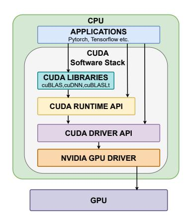

# PRowhammer: Propagating Bit-flips from CPU to GPU

Mrityunjay Shukla *Indian Institute of Technology Bombay* Mumbai, India mrityunjay@cse.iitb.ac.in

Sayandeep Saha *Indian Institute of Technology Bombay* Mumbai, India sayandeepsaha@cse.iitb.ac.in

Shubham Roy *Indian Institute of Technology Bombay* Mumbai, India royshubham@cse.iitb.ac.in

Biswabandan Panda *Indian Institute of Technology Bombay* Mumbai, India biswa@cse.iitb.ac.in

*Abstract*—The Rowhammer attack is an exploit that induces bit-flips in DRAMs. In the last decade, Rowhammer has been demonstrated on DDRs and LPDDRs used by CPUs, and recently it has been demonstrated on GDDRs used by GPUs. In a heterogeneous system with CPUs and GPUs, GPUs are dependent on the hDRAM (host's DRAM, i.e., CPU's DRAM) as all the data and the code executed on the GPU are first loaded into the hDRAM. We exploit the dependency of GPUs on hDRAM to develop a novel attack called Propagated Rowhammer (PRowhammer), which utilizes CPU-based Rowhammer bit-flips in hDRAM to corrupt GPU code before execution, thereby propagating the bit-flips to the GPU. We exploit two key observations that are, OS page deduplication of GPU shared libraries in hDRAM and inducing bit-flips transform GPU instructions into semantically altered yet valid instructions. Despite challenges such as the massive size of GPU shared libraries (hundreds of megabytes), the closed-source nature of the code, and the use of a proprietary compression algorithm for the SASS (GPU assembly) code, we develop automated techniques to identify exploitable bit-flip locations in hDRAM.

We demonstrate PRowhammer on hDRAMs, such as DDRs (DDR3 and DDR4), with NVIDIA's discrete GPUs that utilize the CUDA software stack. We demonstrate the effectiveness of PRowhammer against state-of-the-art machine learning (ML) models in realistic black-box settings, where the adversary operates on a CPU and lacks access to the ML model's weights and architecture. With PRowhammer, a single bit-flip in the wellknown shared library cuBLASLt degrades image classification accuracy across 16 test cases (ResNet-18, ResNet-34, ResNet-50 and VGG-16 on MNIST, FMNIST, CIFAR-10, and ImageNet) to random guessing, and in the worst-case scenario, it drops to 0%. We also demonstrate the effectiveness of PRowhammer on Large Language Models (LLMs) such as Llama-2, Mistral, and Falcon, where a single bit-flip in the GGML library reduces the generation quality, resulting in a BERTScore of 25%, which produces gibberish output. Overall, PRowhammer exposes an entirely new class of GPU vulnerabilities stemming from CPU-GPU architectural coupling, demanding holistic security approaches for heterogeneous computing systems.

### I. INTRODUCTION

GPUs are the most prominent and important computing devices, which power graphics processing, high-performance computing, and the Artificial Intelligence (AI) revolution, [\[47\]](#page-13-0). GPUs are high-throughput processors with a distinct instruction set, microarchitecture, and programming model compared to CPUs. Consequently, the attack surfaces for GPUs are also different from those of CPUs. One defining characteristic of GPUs is that the CPU manages them through a software stack comprising a runtime library, GPU drivers, and associated APIs. This is an artifact of GPU programming models such as Compute Unified Device Architecture (CUDA). The resource allocation, code execution, context management, and data transfers from CPU to GPU are governed by the software stack. Since the software stack exclusively handles code and data transfers to the GPU, all content executed on the GPU is first loaded into the CPU's DRAM (referred to as hDRAM, host DRAM). Although discrete GPUs have their own dedicated DRAM (referred to as dDRAM, device DRAM), modern GPUs still depend on the CPU and hDRAM.

The pertinent questions. (i) Does the *dependency* of GPU computation on the hDRAM have any security implications for GPUs? More precisely, can any vulnerability in hDRAM affect the computation running on the GPU? The inherent dependency highlighted in the previous paragraph suggests that such vulnerabilities should be thoroughly investigated. The existence of such a vulnerability would reveal an entirely new class of attack surfaces for GPUs. (ii) What are the potential attacks on hDRAM that affects GPUs? Is it possible to impact the GPU computation through bit-flips in hDRAMs? If yes, then *how* and *when* can bit-flips be induced within GPU computation by exploiting a dependency on the hDRAM?

Propagated Rowhammer (PRowhammer). We answer the question mentioned in the previous paragraph, using the Rowhammer attack (how) [\[35\]](#page-13-1) – a well-known attack that enables attackers to induce bit-flips in the hDRAM memory regions of a victim process by rapidly accessing some neighboring hDRAM rows close to the victim's rows. In our threat model, the attacker and victim are two different users sharing the same physical machine (hence hDRAM) in a cloud environment [\[41\]](#page-13-2). The attacker in our attack is a CPU process belonging to a malicious user that performs bit-flips in the hDRAM to modify the GPU kernel code of a GPU-bound victim process belonging to another user; a kernel is a function that is executed on the GPU. We refer to the modified code as corrupted code. However, the bit-flip occurs before the code and the data are transferred (when) to the GPU. We exploit the presence of GPU data and kernel code in hDRAM. When transferred and executed on the GPU, the bit-flip in data or kernel code propagates and corrupts the GPU computation. We refer to this attack as Propagated Rowhammer, or PRowhammer. Please note that PRowhammer differs from GPUHammer [\[43\]](#page-13-3), which targets dDRAM, whereas our attack targets hDRAM.

Rowhammer remains an unresolved hardware vulnerability because, despite extensive mitigation efforts [\[15\]](#page-12-0), [\[26\]](#page-12-1), [\[45\]](#page-13-4), [\[46\]](#page-13-5), [\[65\]](#page-13-6), practical exploits continue to bypass existing defenses [\[23\]](#page-12-2), [\[30\]](#page-12-3), [\[33\]](#page-12-4), [\[43\]](#page-13-3), [\[48\]](#page-13-7), and consequently, any DDR module susceptible to Rowhammer is inherently susceptible to PRowhammer. We demonstrate PRowhammer on the CUDA software stack targeting NVIDIA's discrete GPUs.

*Why PRowhammer works?* Since the attacker and victim in our attack are two separate users sharing the same machine, the attacker cannot directly access the victim's private memory regions. Therefore, if the attacker wishes to corrupt the GPU kernel code of a victim process via Rowhammer, it must target a shared library that (i) contains GPU kernel code used by the victim process, and (ii) is accessible to both the attacker and victim. Importantly, the OS does not differentiate between CPU and GPU shared libraries, treating them identically in terms of memory management and access control. Due to OS page deduplication, only a single copy of each shared library resides in hDRAM, even when the library is being used concurrently by multiple processes belonging to different users. While shared libraries are readable by all users, only privileged users (i.e., users with root-level access) can modify them through conventional file system operations. Since our attacker is an unprivileged user, without permission to modify shared library files directly, it uses Rowhammer to induce bitflips in the shared library's code while it resides in hDRAM. Machine Learning (ML) models as target applications. As an exploit of PRowhammer, we target state-of-the-art ML applications running on GPUs, undermining the prediction or generation accuracy of such models during inference (called accuracy degradation attacks [\[29\]](#page-12-5), [\[52\]](#page-13-8), [\[53\]](#page-13-9), [\[68\]](#page-13-10)).

Adversarial model for ML exploits. Prior works [\[29\]](#page-12-5), [\[52\]](#page-13-8), [\[53\]](#page-13-9), [\[68\]](#page-13-10) targeting the prediction accuracy of ML models assume complete adversarial knowledge and access to model architecture and weights (white-box access), and perform bitflips on selected model weights. However, we assume a weaker adversary having no knowledge of the model architecture and weights and only having API-level access to the model, meaning the attacker can submit inputs and receive outputs (such as predicted labels or generated text) through a query interface, without any direct visibility into the model's architecture, parameters, or internal workings (black-box access) [\[41\]](#page-13-2).

### Observations (O) and challenges (C).

*O1: OS page deduplication for GPU shared libraries (Sec. [III\)](#page-3-0).* In black-box settings, adversaries lack access to model weights, making existing weight attacks [\[29\]](#page-12-5), [\[52\]](#page-13-8), [\[53\]](#page-13-9), [\[68\]](#page-13-10) impractical[1](#page-1-0) . Instead, attackers must target GPU-accelerated shared libraries that contain the GPU kernels used by ML frameworks. While Li et al. [\[41\]](#page-13-2) demonstrated CPU-bound library attacks by exploiting OS page deduplication, we observe that GPU shared libraries are likewise deduplicated in hDRAM. This observation enables attackers to perform Rowhammer on deduplicated GPU shared libraries, leading to GPU kernel code corruption.

*O2: Valid GPU instructions after bit-flips (Sec. [III\)](#page-3-0).* Accuracy degradation attacks require that the corrupted model remain executable, albeit with changed semantics. Therefore, the SASS instructions (GPU assembly code) that we corrupt in the shared libraries need to be converted to different yet valid instructions, as invalid instructions lead to crashes. Interestingly, we observe several instructions in the instruction set of the targeted NVIDIA GPUs changing to valid instructions, even after one or multiple bit-flips in them. This observation indicates that semantically changing the kernels in the shared libraries is feasible.

*C1: Compressed GPU code (Sec. [IV\)](#page-4-0).* NVIDIA's shared libraries store the GPU kernel code in a compressed form, and the compression algorithm is proprietary [\[10\]](#page-12-6). These two facts compel us to induce bit-flips in the compressed code in the hDRAM. We observe that flipping a bit in the compressed code results in one or multiple valid but different SASS instructions, and this happens with a reasonable probability. Based on this observation, we devise a bit-flip simulation and testing strategy for identifying *exploitable bit-flips* that can change the semantics of kernels in a library.

*C2: Size of the shared library (Sec. [IV\)](#page-4-0).* GPU shared libraries, even in compressed form, occupy hundreds of megabytes in memory (e.g, cuBLASLt library has a size of 335MB). Finding exploitable bit-flips is challenging because of the need to individually test each of these bits. We observe that simulating and testing each bit-flip takes roughly 500 milliseconds in our setup, and doing this for millions of bits would take years. Moreover, such libraries contain code for different GPU architectures, and while executing on a specific GPU architecture, only the code relevant to that GPU architecture is used. While in a compressed library, there is no way to identify the codes for different GPU architectures, we develop an automated pruning strategy to overcome this challenge.

### PRowhammer on ML in a nutshell.

Fig. [1](#page-2-0) presents the overview of the PRowhammer attack on black-box ML models deployed in cloud environments. In step 1 , the attacker loads and corrupts the CUDA shared library (e.g., cuBLAS, cuDNN) by inducing bit-flips via Rowhammer attacks in the hDRAM. The bit-flip alters the semantics of the GPU kernel code contained within. This corruption occurs before the victim begins execution. When the victim's ML framework invokes CUDA-accelerated shared libraries ( 2 ), the OS performs page de-duplication of the shared library

<span id="page-1-0"></span><sup>1</sup>Weight attacks require identifying vulnerable weights for targeted corruption with minimal bit-flips, which is infeasible without weight knowledge. Achieving an arbitrary number of bit-flips is infeasible due to Rowhammer constraints [\[68\]](#page-13-10).

<span id="page-2-0"></span>

Fig. 1: Overview of PRowhammer on ML Models

( 3 ), ensuring that only a single physical copy resides in hDRAM. Consequently, the victim process is compelled to map to and use the same corrupted GPU kernel code from the shared library that was previously corrupted by the attacker. In step 4 , the corrupted GPU kernels are transferred from hDRAM to the GPU. During execution ( 5 ), the propagation of bit-flips corrupts the GPU computation. Finally, in step 6 , the victim's ML framework receives the corrupted results from the GPU, leading to misclassified images or incoherent text generation ( 7 ).

Note that PRowhammer demonstrates a novel variant of Rowhammer, where compromising hDRAM corrupts GPU computation. Therefore, PRowhammer motivates for a holistic view of security especially for heterogeneous systems with interdependent components like CPU and GPU. Holistic here means, in a heterogeneous system with multiple components, even if one component is compromised (in our case, the hDRAM), it affects the other components as well (in our case, the GPU). So, even to secure GPU computation, we need to ensure secure hDRAMs and dDRAMs.

Key results. We demonstrate the PRowhammer attack on image classification models and Large Language Models (LLMs). The key results from our evaluation, performed on three different GPUs (RTX A6000, RTX 4090, and RTX 5060), are as follows:

• Our image classification test suite comprises 16 different test cases, utilizing four state-of-the-art architectures (ResNet-18, ResNet-34, ResNet-50 [\[28\]](#page-12-7), and VGG-16 [\[57\]](#page-13-11)) trained on four datasets (MNIST [\[40\]](#page-13-12), FM-NIST [\[66\]](#page-13-13), CIFAR-10 [\[37\]](#page-13-14), and ImageNet [\[24\]](#page-12-8)). For all of these test cases, a single bit-flip induced in the cuBLASLt [\[1\]](#page-12-9) shared library degrades the performance of the models close to random guessing. The classification accuracy is 0% in the worst case for the ImageNet dataset.

<span id="page-2-2"></span>

Fig. 2: Steps in a Rowhammer attack

• Our LLM use case consists of three publicly available pre-trained models (Llama-2-7B [\[62\]](#page-13-15), Mistral-7B [\[32\]](#page-12-10), Falcon-7B [\[12\]](#page-12-11)), which we utilized for a questionanswering task based on Google's Natural Questions (NQ) dataset. We evaluate the question-answering performance using BERTScore [\[70\]](#page-14-0). A single bit-flip in the underlying GGML [\[7\]](#page-12-12) library degrades the BERTScore to 25%, at which the models only generate a string of #s as an output.

We make the following contributions:

- We observe that inducing a bit-flip in GPU shared libraries can affect the programs that use those libraries (Sec . [III\)](#page-3-0).
- We present challenges in identifying exploitable bit-flip locations in the GPU shared library and discuss how to overcome those challenges (Sec. [IV\)](#page-4-0).
- We showcase our attack[2](#page-2-1) on state-of-the-art image classification models, degrading their classification accuracy. We also demonstrate that, for large language models, our attack results in incoherent text generation (Sec. [V\)](#page-6-0).

### II. BACKGROUND

In this section, we briefly go over the Rowhammer attack, followed by the necessary background on the software stack of NVIDIA GPUs, which is pivotal in creating the CPU dependency in GPUs. Finally, we discuss how state-of-the-art ML frameworks utilize GPUs through this software stack.

### <span id="page-2-3"></span>*A. Rowhammer attack*

Since its discovery, Rowhammer [\[35\]](#page-13-1) has evolved into a versatile attack vector that spans reliability, security, and privacy domains [\[30\]](#page-12-3), [\[35\]](#page-13-1), [\[39\]](#page-13-16), [\[54\]](#page-13-17). The attack exploits a fundamental cell-to-cell interference problem in modern DRAMs—repeatedly activating (*hammering*) one row can accelerate charge leakage in adjacent rows through capacitive coupling and electromagnetic interference. When a row is activated thousands of times within a single refresh interval (typically 64 ms in DDR3 and DDR4 DRAMs), the affected neighboring cells may lose sufficient charge that, upon subsequent access, their stored value is misread by the sense amplifier, resulting in a bit-flip. This reliability issue has been exploited by attackers, who deliberately access certain DRAM rows (called aggressor rows) in their own address space with

<span id="page-2-1"></span><sup>2</sup>For the benefit of the community, we will release the code of PRowhammer.

<span id="page-3-1"></span>

Fig. 3: CUDA software stack for NVIDIA GPUs

a high frequency, resulting in flips in the DRAM rows used by a victim process (called victim rows). DRAM vendors have implemented countermeasures, like Targeted Row Refresh (TRR) [\[26\]](#page-12-1) and Per Row Activation Counter (PRAC) in DDR5 [\[6\]](#page-12-13), which refresh a victim row upon detecting suspicious row activations. However, TRR has been bypassed on several occasions [\[26\]](#page-12-1) [\[30\]](#page-12-3), and Rowhammer remains a threat even for the most recent DDR5 DRAMs [\[31\]](#page-12-14) [\[48\]](#page-13-7).

A successful Rowhammer attack typically consists of three key steps as given by Razavi et al. in [\[54\]](#page-13-17) and shown in Fig. [2.](#page-2-2) The attack begins with memory profiling ( 1 ), where the attacker profiles the DRAM to discover DRAM locations susceptible to bit-flips by allocating chunks of memory from its own address space. It identifies the *page-frames* (a fixedsized block in DRAM holding an OS page) that have bit flips at offsets suitable for their purpose. Upon finding suitable bit-flip locations (i.e., at desired offsets of a DRAM pageframe), the attacker manipulates the memory allocation of the victim process so that the sensitive victim data or code is mapped to these suitable locations. Typically, the pageframe allocation policy of an OS, which allocates page frames without respecting process boundaries, is exploited for this step. This process is known as memory massaging ( 2 ) [\[13\]](#page-12-15), [\[34\]](#page-13-18), [\[39\]](#page-13-16). Finally, during the hammering phase ( 3 ), the attacker repeatedly accesses the identified aggressor rows in its own address space to induce bit flips in the victim's rows. The end-to-end Rowhammer attack does not require any elevated privileges or root-level access to the target system.

### *B. CUDA software stack*

The CUDA software stack (Fig. [3\)](#page-3-1) enables GPU programming through a layered architecture. At the top layer, GPUbound shared libraries contain optimized compiled kernels that are dynamically linked at runtime. This reduces application binary size and enables code sharing across applications. Applications and libraries interact with CUDA APIs, which invoke NVIDIA GPU drivers that control the hardware.

CUDA APIs. CUDA provides two sets of APIs. The *driver API* offers low-level control for GPU resource allocation, contexts, and kernel execution, including explicit binary loading

Listing 1: CPU to GPU data transfer

```
int main () {
    // Host allocation
    h_data = (int *) malloc ( size );
    // Device allocation
    cudaMalloc (& d_data , size );
    // Data Transfer
    cudaMemcpy ( d_data , h_data , size ,
         cudaMemcpyHostToDevice );
    // Kernel launch
    myKernel < < <1 ,1 > > >( d_data );
    return 0;
}
```

and symbol resolution. The *runtime API* wraps the driver API, abstracting low-level operations like context creation and dynamic linking. Programmers explicitly manage only memory allocation through cudaMalloc and data transfer through cudaMemcpy, while code transfer and execution occur automatically.

Involvement of hDRAM. Listing [1](#page-3-2) presents a template for launching CUDA applications using runtime APIs. The data is first loaded in the hDRAM using malloc(), which shows the involvement of hDRAM. The mapping of GPU kernel code in the CPU side address space of the template can be confirmed by checking the /proc/PID/maps of the template. Therefore, the GPU kernels are also loaded inside the hDRAM. Shared libraries also follow the same trend – they are mapped in the hDRAM by the software stack (using mmap()), and kernel code is dynamically linked and sent to the GPU on demand.

### *C. GPU accelerated ML frameworks*

ML training and inference are one of the most prominent use cases requiring GPU acceleration. ML frameworks, such as PyTorch [\[14\]](#page-12-16), TensorFlow [\[11\]](#page-12-17), and Llama.cpp [\[8\]](#page-12-18), largely simplify the task of constructing and training ML models by providing ML-specific functions (e.g., for constructing convolution or linear layers) to build, train, and deploy the models. Such frameworks are mostly open-source, implemented in high-level languages such as Python or C++, and achieve GPU acceleration by invoking the runtime API and shared libraries from the CUDA software stack. The GPU acceleration in such frameworks closely follows the template provided in Listing [1,](#page-3-2) with each ML-specific function invoking the kernels from the shared libraries. In particular, PyTorch and TensorFlow extensively utilize the NVIDIA-provided, proprietary shared libraries, such as cuDNN [\[3\]](#page-12-19) and cuBLAS [\[1\]](#page-12-9), which benefit from their highly optimized kernels for tensor operations. The GPU-bound data and code, including those from the shared libraries, are stored in the hDRAM for every model constructed using these ML frameworks.

### III. MOTIVATING OBSERVATIONS

<span id="page-3-0"></span>Rowhammer attacks on shared libraries [\[41\]](#page-13-2) exploit the fact that these libraries reside in OS pages mapped by both the victim and the attacker, allowing the attacker to flip bits in hDRAM pages the victim also uses. Moreover, these libraries contain compiled CPU instructions, where a single bit-flip can transform one instruction into another valid one, enabling semantic changes without necessarily crashing the victim process.

We target GPU shared libraries that contain SASS instructions and reside in hDRAM. To enable a CPU-based attacker, the OS must perform page sharing for GPU shared libraries, allowing the attacker and the victim to share the same physical page. The attacker also requires that bit-flips convert SASS instructions into different yet valid SASS instructions.

SASS instructions in shared libraries. NVIDIA GPU executables and shared libraries primarily contain SASS instructions; NVIDIA also provides PTX, but the compiler translates PTX to SASS before GPU execution [\[10\]](#page-12-6). The host (CPU) code and SASS are strictly separated: SASS resides in a dedicated nv\_fatbin section [\[9\]](#page-12-20). The nv\_fatbin section may include SASS for multiple GPU architectures, and libraries commonly bundle code for several architectures [\[10\]](#page-12-6).

OS page deduplication for GPU shared libraries. Linux systems employ copy-on-write for DRAM pages, maintaining a single shared copy until modification occurs (page deduplication). Read-only code pages (e.g., the .text section) remain deduplicated across processes, including CPU shared libraries in hDRAM. This motivates us to ask the question: *"Are GPU code pages (*.nv\_fatbin *section) in shared libraries also deduplicated?"* Yes. In Linux-based systems, the OS loader maps GPU shared libraries into hDRAM during GPU kernel launch (Listing [2\)](#page-4-1). The kernels are dynamically linked to the GPU executable, with kernel code supplied to the GPU from CPU-resident OS pages. The .nv\_fatbin section is mapped with mmap(MAP\_PRIVATE) and PROT\_READ|PROT\_EXEC flags, enabling copy-on-write semantics for read-only pages. Any process can map these libraries into its address space with identical flags. This enables the Rowhammer attack: i) An attacker process maps .nv\_fatbin pages into its address space where it remains deduplicated, ii) induces bit flips via Rowhammer, and iii) the corrupted page supplies kernel code to the GPU during dynamic linking, corrupting GPU execution.

