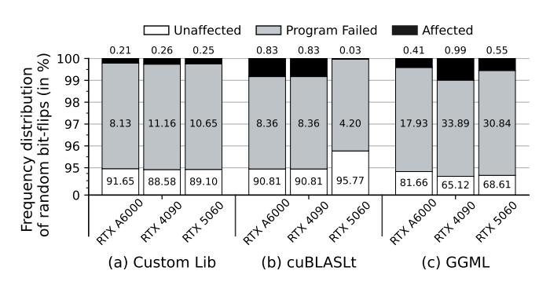
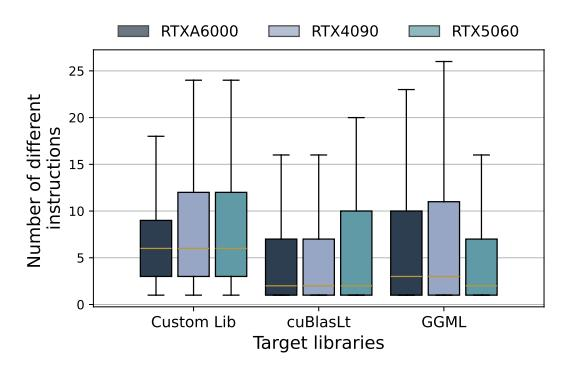
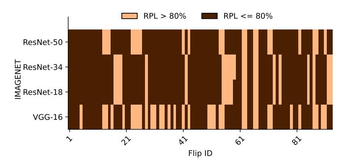

# Takeaway I:

OS Pages corresponding to the nv\_fatbin section, which contains GPU code for a GPU shared library, are deduplicated.

Valid instructions after bit-flips. The next question is whether or not bit-flips in SASS instructions result in valid instructions. We find this to be affirmative for SASS instructions across different GPU architectures. Table [I](#page-5-0) shows a few representative cases, corresponding to NVIDIA RTX 4090, where a single bit-flip in a SASS instruction results in a valid yet different SASS instruction. Broadly, we observe four different categories of changes in the instructions. i) *register change:* the operands of an instruction are affected by changes to the register names. ii) *opcode change:* only <span id="page-4-1"></span>Listing 2: System call trace during a GPU kernel launch that shows the loading a GPU shared library in hDRAM via mmap.

```
...
openat ( AT_FDCWD , "/usr/local/lib/ libcublasLt.
    so .12", O_RDONLY | O_CLOEXEC ) = 3
...
mmap (< VA of lib >, <size >, PROT_READ | PROT_EXEC ,
     MAP_PRIVATE | MAP_FIXED | MAP_DENYWRITE , 3,
    0)
```

the opcode of the instruction is affected, while the operands remain unchanged. iii) *offset change:* the offset from a base address of a memory reference is changed. iv) *instruction change:* some bit-flips result in the instruction being changed. A similar observation holds for SASS instructions of the other GPUs with different architectures. Overall, both basic conditions for a shared library-based Rowhammer attack are satisfied. However, there are still challenges in identifying exploitable bit-flip locations, which we address and overcome in the following section.

### Takeaway II:

SASS instructions change to different yet valid instructions upon bit flips.

### IV. CHALLENGES

<span id="page-4-0"></span>NVIDIA provides the NVCC compiler targeting CUDA-enabled GPUs. The NVCC compiler applies --compress-mode flag, while compiling CUDA kernels [\[10\]](#page-12-6), which compresses the content of the .nv\_fatbin section using a proprietary compression algorithm [\[10\]](#page-12-6). Most of the NVIDIA-provided CUDA shared libraries relevant for ML (e.g., cuBLAS, cuDNN) are distributed in their *compressed* form, and only the APIs are exposed to a user.

Compressed SASS code in GPU shared libraries. The compressed nv\_fatbin is mapped by the attacker in its address space while it loads the library. However, by looking at the compressed code, the attacker cannot identify the SASS code for any kernels, nor differentiate code corresponding to different GPU architectures. The attacker can observe the decompressed library code using the cuobjdump command. Due to the undisclosed compression algorithm [\[10\]](#page-12-6) and the lack of identifiable patterns in the compressed code, it is challenging to establish any meaningful correspondence between the compressed and decompressed code; the adversary cannot trivially identify bits in the compressed code to flip, resulting in semantic changes in the kernels. Furthermore, a single bitflip in the compressed code often results in multiple bit-flips upon decompression, leading to frequent program crashes.

Large size of GPU shared libraries. The compiled SASS code within libraries like cuBLAS and cuBLASLt is hundreds of megabytes even in their compressed form [\[1\]](#page-12-9). Finding exploitable bits by checking every bit of the compressed code

<span id="page-5-0"></span>TABLE I: Valid SASS instructions resulting from single bit-flips on an RTX 4090, shown with their 64-bit machine-code encodings (hex). Changes are highlighted: green (original), red (corrupted).

| Type               | Correct SASS              | Corrupted SASS                    | Correct Hex                 | Corrupted Hex                     |
|--------------------|---------------------------|-----------------------------------|-----------------------------|-----------------------------------|
| Register Change    | MOV R1, c[0x0][0x20]      | MOV $R_0$ , $c[0x0][0x20]$        | 0x4c98078000870001          | 0x4c9807800087000                 |
| Opcode Change      | FFMA R11, R22, R11, R8    | FSET.F.FTZ.AND R11, R22, R11, !P0 | 0x5980040000b7160b          | 0x5 <mark>8</mark> 80040000b7160b |
| Offset Change      | LDS.U.32 R23, [R17+0x140] | LDS.U.32 R23, [R17+0x148]         | 0xef4c100014 <b>0</b> 71117 | 0xef4c100014871117                |
| Instruction Change | SHL R15, R3, 0x6          | LOP3.LUT R15, R3, 0x6, R0, 0x48   | 0x384800000067030f          | 0x3c4800000067030f                |

is time-consuming in the case of cuBLASLt, as it can take around 11805 days (500ms for each bit) to check every bit. Based on challenges mentioned above, we ask the question: "Is it indeed possible to find an exploitable bit-flip in a large compressed GPU shared library?"

### <span id="page-5-4"></span>A. Addressing challenges

In this subsection, we elaborate on how to systematically overcome the aforementioned challenges and find bit-flips that can make semantic changes to the shared library kernels (exploitable bit-flips). Interestingly, we do not need to reverse-engineer the code compression algorithm for this.

Feasibility of exploitable flips. To check the feasibility of exploitable bit-flips in compressed code, we first compile our own shared library (with default compression enabled), called CustomLib, which contains a vanilla matrix multiplication kernel. The nv\_fatbin section of CustomLib has a size of 21KB, and we simulate bit-flips in this section. Our goal is to determine whether some bit-flips avoid crashes as well as produce an altered output. We randomly choose and flip one bit at a time in CustomLib, and we execute the kernel (using the corrupted CustomLib) on the GPU. Each *trial* (bit-flip followed by GPU execution) takes 100 milliseconds, and we perform 10,000 trials in total. Fig 4(a) presents the results.

We observe that in most cases, the program remains unaffected by the flips. For <code>CustomLib</code> across three different GPU architectures, the program crashes in 8.13–11.16% of the cases, and in a small fraction of cases (0.21–0.25%), the output differs from the expected result. We refer to such output-altering bit-flips as exploitable bit-flips. When we evaluate this small set of exploitable flips using <code>cuobjdump</code>, we observe that the flips alter one or more SASS instructions into different but valid SASS instructions. Although the percentage of exploitable bit-flip locations appears negligible, their actual count, even for this small library, is 21–26 across different GPU architectures, and this count steadily increases as we increase the number of trials.

### Takeaway III:

A single-bit flip in the compressed nv\_fatbin of a shared library is enough to alter the outcome of the GPU computation, meaning such bit-flips are indeed feasible in compressed code.

**Exploitable bit-flips in large shared libraries.** Next, we extrapolate our observations to real-world libraries: i) cuBLASLt, NVIDIA's proprietary library containing optimized tensor core

<span id="page-5-1"></span>

Fig. 4: Percentage of exploitable bit-flips for Custom Lib, cuBLASLt, and GGML across GPU different architectures.

kernels for linear algebra<sup>3</sup>, and ii) GGML, an open-source GPU-accelerated ML library for language models [7]. The compressed nv\_fatbin section is 255MB for cuBLASLt and 14MB for GGML. With 10000 trials, exploitable bit-flips remain rare—we find none after 50000 trials (500-700ms each). We therefore develop a pruning strategy.

Since shared libraries contain SASS code for multiple architectures, with only the target architecture dynamically linked at execution<sup>4</sup>, bit-flips only cause corruption if they affect the relevant architecture's code. We follow the approach which is as follows:-

- (i) We divide the nv\_fatbin section into *n* equal segments.
- (ii) For each segment, we flip all bits and execute a kernel from the target library. If the output is correct, we discard the segment. If there's a crash or altered output, we mark it as a useful segment.
- (iii) We recursively segment each useful segment into n equal segments until reaching the threshold T KB.

For our experiments, we choose n=2 and T=1KB. This yields useful segments of 1KB each. We randomly select 10000 bits from these segments to find exploitable bit-flips. Figs. 4(b) and (c) show results: cuBLASLt yields 3-83 exploitable bit-flips, while GGML yields 41-99 exploitable bit-flips across 10000 trials. Runtime never exceeds 90 minutes even for the largest library. These offline steps require no source code access and are performed once per library and GPU. While not guaranteed to find all exploitable locations, this approach returns a sufficient subset of all possible exploitable bit-flips.

<span id="page-5-2"></span> $<sup>^3</sup>$ The cuBLASLt library is internally invoked by cuBLAS, which is widely used in frameworks such as PyTorch and TensorFlow.

<span id="page-5-3"></span><sup>&</sup>lt;sup>4</sup>CustomLib was compiled for one architecture at a time.

<span id="page-6-1"></span>

Fig. 5: Spread of the number of instruction changes from a single bit-flip in compressed libraries, over 10000 trials.

### Takeaway IV:

Exploitable bit-flips can be efficiently identified even for large compressed libraries.

Now that we have addressed the above two challenges, we ask a question: "Is it possible to cause multi-instruction corruption using a single bit-flip?"

Multi-instruction corruption. As already mentioned in previous paragraphs, a single-bit flip in the compressed nv fatbin may corrupt multiple bits in the corresponding uncompressed version. In many cases, such multi-bit corruptions lead to invalid instructions. However, we also observe several cases where multiple instructions change to valid instructions. Fig. 5 shows the distribution of such cases across different libraries and GPU architectures, for the same set of trials we performed for Fig. 4. It is clear from Fig. 5 that each bit-flip in the compressed code, i) there are two to five changed yet valid instructions on average across different libraries and architectures. There are even cases resulting in 25 valid instructions. ii) While many such corrupted kernels result in crashes due to the presence of some invalid instructions along with valid instructions, a substantial number of these cases have only valid instructions. In many such cases, 3-83 for cuBLASLt and 41-99 for GGML execute without crashing, producing a different output than expected. Fig. 6 depicts a case where a single bit-flip leads to multiple instructions being corrupted.

## Takeaway V:

Bit-flip in the compressed code can result in several corrupted yet valid instructions, and many such corrupted kernels execute with an altered outcome.

### V. PROWHAMMER

<span id="page-6-0"></span>The PRowhammer attack exploits the Rowhammer vulnerability in hDRAM to induce targeted bit-flips in the compressed GPU shared library, thereby altering the semantics of GPU kernels prior to victim execution. Through page-deduplication, the victim's GPU-bound ML application is forced to reference these compromised kernels during computation. As the

corrupted kernels are invoked on the GPU, the induced bitflips propagate through the computational pipeline, ultimately manifesting as degraded inference accuracy in the target ML model.

In this section, we synthesize the observations from Sec. III and Sec. IV to demonstrate end-to-end accuracy degradation attacks against deployed ML models. To demonstrate our attack, we have taken two case studies: (i) accuracy degradation in image classification models, where we exploit the cublable shared library used by popular ML frameworks like Pytorch and TensorFlow. (ii) incoherent text generation by large language models (LLMs), where we exploit the GGML shared library, which is used by the llama.cpp framework.

#### A. Threat Model

**System setting.** We consider a multi-tenant computing platform where independent users share the hDRAM. Although the GPU maintains separate device memory, both CPU and GPU operations ultimately depend on the shared hDRAM. This architectural coupling enables interference across CPU–GPU boundaries despite process and address-space isolation.

**Victim.** The victim is a GPU process running an ML model as part of a shared inference platform (e.g., MLaaS) [22]. It executes inference on the GPU while relying on the hDRAM for model data and code. The adversary interacts with the model only through API-level queries, with no access to its architecture, parameters, or internal state—representing a black-box inference setting. We assume the victim model is implemented using open-source ML frameworks such as PyTorch, TensorFlow, or Llama.cpp [41] [67].

Attacker. The attacker is an unprivileged user-level process running on the CPU [34]. Its active capability is limited to performing Rowhammer on hDRAM by repeatedly activating selected DRAM rows. Following prior work, we assume the attacker can infer DRAM address mappings through software-based reverse engineering [49], but cannot modify firmware, device drivers, or hardware components.

**Goal of the attacker.** The attacker seeks to induce bit-flips in hDRAM to degrade the performance of ML models.

#### B. Evaluation platforms

Table II presents the evaluation platforms for our PRowhammer attack. We perform our experiments on two platforms: one with an Intel Core-i7 Haswell architecture having 8 GB DDR3 DRAM [58], and Intel Core i7-8700 (Coffee Lake) having 8 GB DDR4 DRAM module [30]. The same attack would be applicable for more recent DRAMs like DDR5 [31] [48]. We validate all the attacks using an end-to-end Rowhammer attack.

#### C. PRowhammer on image classification models

In this use case, we target models built upon Pytorch (Tensor-Flow would have identical effects).

**Test suite.** We validate the attack over a test suite consisting of four classification datasets (MNIST, FMNIST, CIFAR-10,

```
Function : * Z17matrixTraceKernelPfS *
...
IMAD .SHL.U32 R14,R0, 0x4 ,RZ;0 x0000000 4 000 e782 4
FMUL R19,R14,R45.reuse ;0 x0000002d0e13 7220
STS [R37.X16+0x400],R22 ;0 x000 4001625007388
...
```

```
Function : * Z17matrixTraceKernelPfS *
...
IMAD .U32 R14,R0, 0x1404 ,RZ;0 x0000 1404 000 e782 4
@P0 LEA R19,P0,R14,R45.reuse,0x0 ;0 x0000002d0e13 0211
LEA R28,P0,R28,R45,0x0 ;0 x000 0002d1c1c7211
...
```

(a) Original SASS Code

(b) Corrupted SASS Code

Fig. 6: Changes to the SASS code for the NVIDIA Ampere architecture are highlighted, following a single bit-flip in the code.

TABLE II: Platforms for evaluation

<span id="page-7-1"></span>

| Component    | Platform A                        | Platform B           |  |
|--------------|-----------------------------------|----------------------|--|
| CPU          | Intel Core i7-4790                | Intel Core i7-8700   |  |
|              | (Haswell)                         | (Coffee Lake)        |  |
| DRAM         | 8 GB Kingston DDR3                | 8 GB Corsair DDR4    |  |
|              | (1600 MT/s)                       | (2400 MT/s)          |  |
| Kernel       | 5.15.0-131-generic                | 6.2.0-060200-generic |  |
| GPU          | NVIDIA RTX 4090, NVIDIA RTX A6000 |                      |  |
|              | NVIDIA RTX 5060                   |                      |  |
| OS           | Ubuntu 20.04.6                    |                      |  |
| CUDA Toolkit | Version 12.8                      |                      |  |

and ImageNet), and four state-of-the-art image classification models (VGG-16, ResNet-18, ResNet-34, and ResNet-50). Each classifier is trained for each dataset, resulting in 16 configurations. The MNIST, FMNIST, and CIFAR-10 have 10 output classes, whereas the ImageNet dataset has 1000 output classes. Finally, we execute these models over two GPUs (RTX 4090 and RTX A6000)[5](#page-7-2) , both of which use the same code from the cuBLASLt shared library.

Metrics. We compute the prediction accuracy – percentage of test images correctly classified by a model – both before and after corruption, to validate the efficacy of our attacks. The baseline for measuring accuracy degradation is the prediction accuracy of a model that randomly predicts classes, which is given as *ACCrandom* = *Class*(*D*) with *Class*(*D*) being the number of classes in the dataset *D*. A prediction accuracy (after corruption) close to *ACCrandom* indicates that a model is performing random guesses. To compare the prediction accuracy before and after corruption we compute the relative prediction loss (RPL [\[41\]](#page-13-2)) as: *RPL* = (*ACCPristine*−*ACCCorrupted* ) *ACCPristine* where *ACCPristine* denotes the prediction accuracy before corruption, and *ACCCorrupted* denotes the accuracy after corruption.

### *D. Profiling exploitable bit-flips*

We demonstrate how to find exploitable bit-flips that degrade the classification accuracy of state-of-the-art image classification models in a black-box setting.

Challenge. In black-box settings, the target model's architecture remains unknown, making it difficult to determine which library kernels to corrupt. The cuBLASLt library contains 3508 kernels for sm\_86 architecture, but each model invokes only one to two. Randomly corrupting a kernel yields a success probability of merely <sup>1</sup> <sup>3508</sup> .

Key insight. We exploit two structural properties of modern image classification models: i) the final layer is typically a linear layer [\[28\]](#page-12-7) [\[57\]](#page-13-11), and ii) linear layers invoke cuBLASLt kernels in frameworks like PyTorch [\[2\]](#page-12-22). Corrupting these kernels affects the target model's final classification step.

Profiling. We construct a simple *profiling model* consisting of a single linear layer with random weights. This model requires no training and serves solely to identify which cuBLASLt kernels the target invokes. Since the adversary has API access, the target's output dimension (number of classes) is known. We set the profiling model's output dimension to match the target, which fixes the matrix multiplication dimensions and narrows down the invoked kernels, as cuBLASLt optimizes different kernels for different matrix shapes.

Handling unknown input dimensions. The target model's input dimension remains unknown and affects kernel selection. We test multiple input dimensions (ranging from 2 to 10000) while fixing the output dimension. Empirically, only one to two distinct kernels are invoked across this entire range: one kernel for CIFAR-10, MNIST, and FMNIST (output dimension 10), and two kernels for ImageNet (output dimension 1000). This limited variation makes the attack practical despite incomplete architecture knowledge.

Putting it all together. We perform exploitable bit-flip profiling on the identified kernels using the profiling model. We then select and flip the most damaging bit using PRowhammer. Critically, bit-flips causing maximum accuracy degradation in the profiling model also cause maximum degradation in the target model, enabling reliable selection of attack locations without target-specific profiling.

### *E. Hammering shared libraries*

After profiling, the attacker accesses the target system to perform Rowhammer as described in Sec. [II-A.](#page-2-3) The first step is *memory profiling* for finding flippable locations in the hDRAM, having the same offset in a page-frame as one of our exploitable bit-flips. In the next step, the attacker loads the target shared library (cuBLASLt) from its own address space, and makes the exploitable bit sit at the flippable location in DRAM through *memory massaging*. After memory massaging, the attacker hammers the library to perform a bit-flip at the chosen location. While the victim starts executing, it is compelled to utilize the corrupted library.

For the attack to succeed, it is crucial that the attacker corrupts the library before the victim executes. This can,

<span id="page-7-2"></span><sup>5</sup>We were unable to use the RTX 5060 GPU due to a lack of stable support for PyTorch at the time of our experiments.

<span id="page-8-0"></span>TABLE III: Classification accuracy of image classification models before and after PRowhammer attack.

| Dataset  | Network   | Classification<br>Accuracy (%) |        |        | RPL (%) |
|----------|-----------|--------------------------------|--------|--------|---------|
|          |           | Before                         | After  | Random |         |
|          |           | Attack                         | Attack | Guess  |         |
|          | VGG-16    | 98.40                          | 13.70  |        | 86.08   |
| MNIST    | ResNet-18 | 94.40                          | 8.10   | 10.00  | 91.42   |
|          | ResNet-34 | 97.10                          | 9.90   |        | 89.80   |
|          | ResNet-50 | 96.90                          | 7.00   |        | 92.78   |
|          | VGG-16    | 87.10                          | 2.30   |        | 97.36   |
| FMNIST   | ResNet-18 | 79.20                          | 10.70  | 10.00  | 86.49   |
|          | ResNet-34 | 82.40                          | 5.90   |        | 92.84   |
|          | ResNet-50 | 84.70                          | 7.00   |        | 91.74   |
|          | VGG-16    | 91.00                          | 13.70  |        | 84.95   |
| CIFAR-10 | ResNet-18 | 81.00                          | 10.40  | 10.00  | 87.16   |
|          | ResNet-34 | 87.00                          | 10.40  |        | 88.05   |
|          | ResNet-50 | 84.00                          | 8.50   |        | 89.88   |
|          | VGG-16    | 72.80                          | 0.00   |        | 100.00  |
| IMAGENET | ResNet-18 | 70.00                          | 0.00   | 0.10   | 100.00  |
|          | ResNet-34 | 74.00                          | 0.30   |        | 99.59   |
|          | ResNet-50 | 77.00                          | 0.00   |        | 100.00  |

however, be achieved in practice. The code pages of a process (nv\_fatbin is treated as a code page) are maintained by another OS data structure called *page cache*. If the target library has been loaded before the attack begins, the code pages are already allocated with page frames and reside in the page cache. The attacker can, however, flush the page cache in several means, for example, by using the vmtouch tool [\[19\]](#page-12-23). After flushing the page cache, the attacker can relocate the library using *memory massaging* as mentioned above.

PRowhammer does not fundamentally depend on page deduplication. If deduplication is disabled, the attacker can instead rely on other memory massaging techniques, such as Frame Feng Shui [\[39\]](#page-13-16). Frame Feng Shui exploits the Page Frame cache and the Linux buddy allocator for physical page frames. By carefully allocating and freeing memory, the attacker shapes the Page Frame cache [\[39\]](#page-13-16) [\[34\]](#page-13-18), which stores recently freed physical pages. Since the Linux buddy allocator reuses these cached pages to satisfy future allocations, the attacker can influence which physical frame is assigned to a victim allocation. By controlling allocation patterns, the attacker can steer a victim page into a predictable physical frame adjacent to attacker-controlled pages. The attacker can then hammer the neighboring rows to induce a bit-flip in the victim page, which is later consumed by the GPU.

### *F. Accuracy degradation in state-of-the-art ML models*

Table [III](#page-8-0) presents the accuracy degradation results for the best bit-flip locations obtained during profiling for each dataset. We note that for a specific dataset, the bit-flip location remains the same across all the models. As can be observed from Table [III,](#page-8-0) the accuracy values are consistently close to the *ACCrandom* – the prediction accuracy if the model chooses the classes randomly. The RPL is also significant (> 80%) in all the cases, indicating that a single bit-flip in the library can be fatal.

Number of exploitable bit-flips. While Table [III](#page-8-0) presents the accuracy for one bit-flip location per dataset, the number of similar exploitable flips is more in practice. Upon testing

<span id="page-8-1"></span>TABLE IV: Number of exploitable bit-flips that are transferable across models and datasets for different RPL values.

| Datasets | Networks  | RPL > 80% | RPL 40-80% | RPL < 40% |
|----------|-----------|-----------|------------|-----------|
|          | VGG-16    | 131       | 11         | 18        |
|          | ResNet-18 | 157       | 28         | 24        |
| CIFAR-10 | ResNet-34 | 159       | 29         | 22        |
|          | ResNet-50 | 155       | 36         | 17        |
|          | VGG-16    | 132       | 6          | 20        |
| MNIST    | ResNet-18 | 162       | 28         | 20        |
|          | ResNet-34 | 169       | 18         | 23        |
|          | ResNet-50 | 156       | 38         | 14        |
|          | VGG-16    | 127       | 13         | 18        |
| FMNIST   | ResNet-18 | 151       | 37         | 22        |
|          | ResNet-34 | 143       | 45         | 21        |
|          | ResNet-50 | 156       | 36         | 17        |
|          | VGG-16    | 35        | 1          | 56        |
|          | ResNet-18 | 19        | 6          | 66        |
| IMAGENET | ResNet-34 | 20        | 7          | 66        |
|          | ResNet-50 | 21        | 3          | 64        |

<span id="page-8-2"></span>TABLE V: Number of exploitable flips that are transferable across models with different RPL values.

| RPL(%) | MNIST,CIFAR-10,FMNIST<br>(218 exploitable flips) | IMAGENET<br>(93 exploitable flips) |
|--------|--------------------------------------------------|------------------------------------|
| 10     | 141                                              | 7                                  |
| 20     | 131                                              | 7                                  |
| 30     | 127                                              | 6                                  |
| 40     | 126                                              | 6                                  |
| 50     | 124                                              | 6                                  |
| 60     | 121                                              | 6                                  |
| 70     | 107                                              | 6                                  |
| 80     | 92                                               | 6                                  |
| 90     | 0                                                | 4                                  |

50,000 random bit-flip locations with our exploitable bitfinding strategy (refer Sec. [IV-A\)](#page-5-4), we obtain 218 exploitable bit-flips for MNIST, FMNIST, and CIFAR-10 datasets and 93 for the ImageNet dataset. We note that the number and the positions of the exploitable bit-flips are different for ImageNet from the other datasets, as the (cuBLASLt) kernel being invoked for ImageNet is different from the kernel being invoked for the three other datasets. As the output dimension is the same for MNIST, FMNIST, and CIFAR-10, all three of them invoke the same kernel from cuBLASLt. Table [IV](#page-8-1) presents the number of exploitable bit-flips for MNIST, FMNIST, CIFAR-10, and ImageNet at three different ranges of RPL%: 0−40%, 40−80%, and > 80%. As can be observed, there are several candidate bit-flip locations in each RPL band. Considering the fact that Rowhammer bit-flip locations strongly depend on the DRAM module under consideration, more bit-flips indicate a high chance of success for the attack over a large variety of DRAMs, even while the susceptibility of DRAMs to bit-flips varies.

Transferability of bit-flips. Interestingly, we observe that the same bit-flips can cause equally bad accuracy degradation across different model architectures and datasets. Also, there are numerous such exploitable bits. Fig. [7](#page-9-0) and Fig. [8](#page-9-1) exhibit the transferability of exploitable bit-flips, where each strip in a row represents an exploitable bit-flip, and the color of the strip represents the RPL (darker means higher RPL). Table [V](#page-8-2) shows the number of exploitable bits that are transferable across different models with different RPL values. In Fig. [7,](#page-9-0) we showcase the transferability of 218 bits for an RPL of

<span id="page-9-0"></span>

Fig. 7: Transferability of 218 flip locations on different datasets and networks. Lighter color signifies higher loss (relative prediction loss >80%) in prediction accuracy.

<span id="page-9-1"></span>

Fig. 8: Transferability of 93 flip locations on the ImageNet dataset for different networks. Lighter color signifies higher loss (relative prediction loss >80%) in prediction accuracy.

80%. There are several common equally fatal bit-flip locations across MNIST, FMNIST, and CIFAR-10 datasets, and for different model architectures (Fig. 7). While it is expected to some extent, as all of these test cases call the same cuBLASLt kernel, it is still interesting to observe that the same bit-flip within the kernel works equally badly for different cases. The observation is similar for ImageNet, where the transferability is observed across different model architectures (Fig. 8).

#### 🔨 Takeaway VI:

A single bit-flip in the cuBLASLt library suffices to mount the attack, and that bit-flip location can be fatal across different ML models and datasets.

#### G. PRowhammer on large language models (LLMs)

LLMs have rapidly evolved as one of the prime ML deployments in recent years. In contrast to the classification tasks, the tasks performed by LLMs are generative in nature. We investigate whether a single bit-flip can significantly damage the state-of-the-art LLMs, that too without any knowledge of the weights or the architecture.

<span id="page-9-2"></span>TABLE VI: Comparison of average  $F1_{BERT}$  scores before and after a bit-flip on three LLMs using 100 questions from Google's Natural Questions dataset.

| Model      | GPU       | Average F1 <sub>BERT</sub> (Pristine) | Average F1 <sub>BERT</sub> (Corrupt) |
|------------|-----------|---------------------------------------|--------------------------------------|
|            | RTX A6000 | 0.62                                  | 0.30                                 |
| Llama-2-7B | RTX 4090  | 0.62                                  | 0.26                                 |
|            | RTX 5060  | 0.62                                  | 0.26                                 |
|            | RTX A6000 | 0.58                                  | 0.30                                 |
| Mistral-7B | RTX 4090  | 0.58                                  | 0.26                                 |
|            | RTX 5060  | 0.58                                  | 0.26                                 |
| Falcon-7B  | RTX A6000 | 0.58                                  | 0.26                                 |
|            | RTX 4090  | 0.58                                  | 0.30                                 |
|            | RTX 5060  | 0.58                                  | 0.25                                 |

LLM test suite and metrics. We demonstrate our attacks on the llama.cpp framework using the GGML library. As our target models, we use (pre-trained) LLama-2-7B [62], Mistral-7B [32], and Falcon-7B [12]. One challenge with LLMs is their size, as they might not fit inside our GPUs. Therefore, we choose the quantized version of each model (4bit quantized), which are relatively small but still perform well in the language-related tasks, such as question answering, text summarization, etc. Without loss of generality, we focus on only one task – Question Answering (QA), for evaluating our attacks. We use Google's Natural Questions [38] dataset for this purpose. Note that the models are generic and, therefore, testing on different QA datasets will not give us any extra insight. For our experiments, we chose 100 questions (i.e, to be prompted to the LLM model) from Google's Natural Questions [38] dataset. We also handcrafted the answers with manual effort.

We compare the performance of the corrupted LLM to that of the correct one. However, the outputs of the LLMs cannot be compared for exact match, as the two different answers can still be semantically similar. BERTScore [70] is one of the popular LLM evaluation metrics that leverages contextual embeddings from pre-trained BERT models to compute similarity scores between an LLM-generated text and a human-generated reference text. The range of the score is zero to one, with one indicating the highest similarity and zero indicating the lowest similarity. The outcome of this metric is an F1 statistical test score for the LLM-generated answer to a specific question. For our evaluation, we report the average of these F1 scores over 100 questions – before and after the corruption. Listing 3 shows one such example of text generated by a corrupted model.

Accuracy degradation attacks. The high-level functions in the llama.cpp framework extensively utilizes the ggml\_mul\_mat kernel. We construct a wrapper based on this kernel for bit-flip profiling. The profiling stage returns 33, 55, and 64 exploitable bit-flips for the same function on RTX A6000, RTX 5060, and RTX 4090, respectively. At the attack phase, we apply the bit-flips to the real models. Given the fact that the kernel used for profiling is extensively reused among the models, the transferability of bit-flips is found to be significant for most of the profiled exploitable bit-flips.

Table [VI](#page-9-2) presents one such bit-flip location that results in maximum degradation of BERTScore. For this bit-flip location and many such locations, the model generates a string of #s for most of the questions. In another case, the model generates incoherent texts from different languages. Surprisingly, the BERTScore for the corrupted model is consistently in the range of 0.25 − 0.30. Upon further investigation with the reference implementation of this metric, we found that even for other constant and irrelevant strings, the BERTScore remains in the range of 0.25−0.30.

While certain bit-flips induce catastrophic failures leading to the LLM model producing gibberish, we also identify bitflip locations that yield syntactically coherent yet semantically incorrect text. An example of such a case is presented in Listing [4.](#page-10-1) These bit-flip locations are particularly challenging to detect, as they preserve the model's surface-level fluency while compromising factual integrity.

```
$ llama - cli -p "What is Google"
Correct Output :- "Google is a multinational
    technology company"
Incorrect Output :- " Unterscheidung sehialog Dhorn
    Jurivers H"
```

Listing 3: Incoherent text generation by LLM models after PRowhammer attack

```
$ llama - cli -p "What 's the dog 's name on tom and
    jerry"
Correct Output :- "The dog 's name on Tom and Jerry is
     Spike."
Incorrect Output :- "In the Tom and Jerry cartoon
    series , the dog 's name is Momo."
```

Listing 4: Incorrect text generation by LLM models after PRowhammer attack

