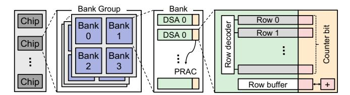
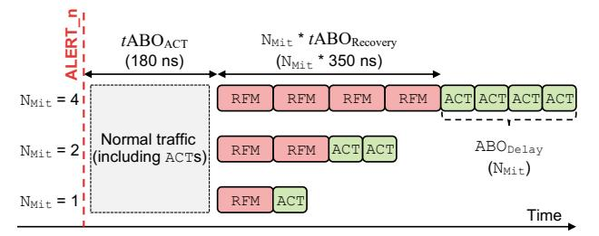
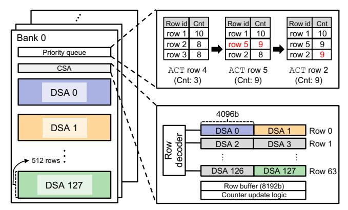
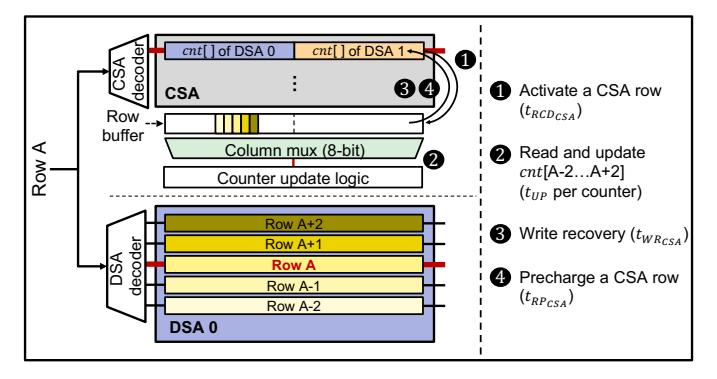
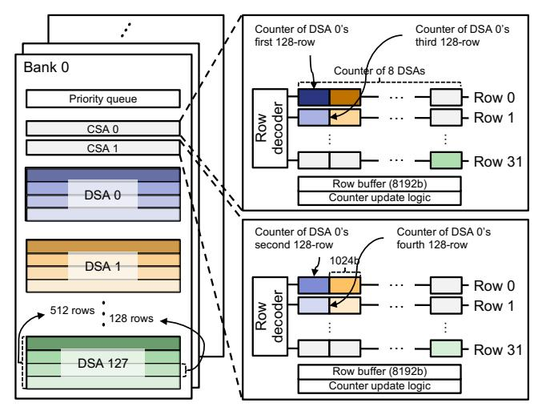

# Algorithm 1 An aggressor-based counting mechanism

```
1: State: per-row counter array cnt[], back-off threshold NBO, and
  RFM target queue Q
2: procedure ACT(r):
3: cnt[r] ← cnt[r] + 1
4: if cnt[r] ≥ NBO then
5: ENQUEUE(Q, r)
6: RFM() // ALERT
7: procedure RFM():
8: r ← DEQUEUE(Q)
9: for each row v in Victims(r) do
10: ACT(v) // RFM-induced ACT
11: cnt[r] ← 0
```

## Algorithm 2 A victim-based counting mechanism

```
1: State: per-row counter array cnt[], back-off threshold NBO, and
  RFM target queue Q
2: procedure ACT(r):
```

```
3: cnt[r] ← 0
4: for each row v in Victims(r) do
5: cnt[v] ← cnt[v] + 1
6: if cnt[v] ≥ NBO then
7: ENQUEUE(Q, v)
8: RFM() // ALERT
9: procedure RFM():
10: r ← DEQUEUE(Q)
11: ACT(r) // RFM-induced ACT
```

precisely count every activation [30]. When a row is activated, PRAC increments its corresponding counter; these activations include activate (ACT), refresh (REF), and refresh management (RFM) operations. If the counter value exceeds a predefined threshold (NBO), PRAC triggers an alert back-off (ABO) protocol that instructs the memory controller (MC) to issue an RFM command. The RFM command performs preventive refreshes on its neighboring victim rows, which activate them, and also resets the counter value for the aggressor row. We provide the pseudo code of PRAC in Algorithm 1.

However, PRAC's aggressor-based counting creates a structural asymmetry: counters increment on every activation (including periodic REFs) but reset only during explicit RFM commands [30]. Because refreshes occur continuously, counter values monotonically increase even in an idle bank. Conse-

<sup>∗</sup>These authors contributed equally to this work.


Figure 1. Counter value per row and available bandwidth across the tREFW window, solely driven by normal refresh under PRAC when NBO, NMit, and blast radius are 64, 4, and 2, respectively.

quently, as counters approach the threshold (NBO), a single activation can trigger a chain reaction of RFM commands across the bank. This domino effect severely degrades performance and can intermittently halt memory operations, causing denialof-service (DoS) behavior even without malicious accesses. Figure 1 illustrates the average counter value and the resulting available memory bandwidth of a DDR5 single-rank DIMM in the absence of memory accesses, configured with NBO = 64, NMit = 4, and a blast radius of 2, consistent with NBO values evaluated in recent PRAC-based studies [7], [65], [89], [91]. Even when a bank is idle, the effective bandwidth is 92.44% due to periodic refresh operations. As REF commands are issued continuously, the model shows that counters increase linearly. At the beginning of the 63rd tREFW, the counter values of the earliest refreshed rows reach the NBO threshold (*i.e.*, 64), triggering a sequence of RFM commands. As a result, the effective bandwidth collapses to 20.56% within the 63rd tREFW, leading to intermittent but severe DoS behavior. This issue becomes even worse when normal accesses are present, as their activations accelerate counter accumulation.

PRAC's counter organization further exacerbates the problem. Prior in-DRAM mitigation schemes maintain counters in SRAM/CAM tables, enabling all counters to be reset in parallel once per tREFW [47], [63], [78]. However, as PRAC stores counter bits directly inside DRAM rows [30], such parallel reset operations incur significant overhead. This design forces counter accesses to incur an ACT-PRE sequence, resulting in long latency. Overall, PRAC-based mechanisms are fundamentally constrained not only by the one-directional counter increments but also by the high cost of counter resets, highlighting the need for a new counting organization.

To address this problem, we propose *PVAC, Per-Victimrow hAmmered Counting*, which fundamentally shifts counting from aggressor rows to victim rows. Similar to PRAC, each DRAM row has its dedicated counter. However, instead of incrementing the counter of the row being activated (an aggressor row), we increment the counters of its victim rows. For simplicity, we initially assume a blast radius of one (*i.e.*, an aggressor row influences one row on each side). If counter values are stored in an array cnt[ ] and the index of the activated row is r, we reset cnt[r] to 0 and increment the counters of the potential victim rows (cnt[r ± 1]). In PVAC, therefore, cnt[r] indicates the vulnerability of the row itself against RH, whereas in PRAC it indicates the vulnerability of the neighboring rows (Algorithm 2).

Because every activation naturally resets the counter of the accessed row, PVAC prevents unnecessary accumulation. While an REF operation implicitly activates each row once per tREFW, PVAC resets the counter of the refreshed row during this activation. Although REF-induced activations may briefly increase a victim's counter, a subsequent REF operation soon resets its counter back to zero, preventing long-term accumulation. Even when normal accesses are interleaved, PVAC maintains this bounded behavior because each ACT and REF also resets the activated row's counter.

As PVAC updates the counter values of multiple rows on each activation, we employ a counter subarray (CSA) [2], [7]. The CSA does not share the data path with the data subarray (DSA), allowing counter updates for both aggressor and victim rows to proceed in parallel with normal memory accesses. However, resetting counters during refresh could require activating multiple CSA rows. Accordingly, we introduce an energy-efficient CSA organization that enables these updates with a single CSA activation. This structure removes the overhead of multiple activations while preserving both performance and energy efficiency.

PVAC's victim-based counting enables larger NBO configurations than PRAC while maintaining security under a lower victim-row RH threshold (NRHv). Here, NRHv denotes the maximum hammered count that a victim row can tolerate without inducing bitflips. PVAC directly bounds the hammered count observed at each row, while PRAC must conservatively restrict each aggressor's hammering count to account for disturbance aggregation within the blast radius. To quantify this difference, we model a worst-case feinting attack [57], [98] and analytically derive the NBO values for PVAC and PRAC to tolerate an identical maximum hammered count.

PVAC improves both performance and energy efficiency under benign workloads and malicious access patterns. We evaluate its performance and energy consumption against PRAC and state-of-the-art PRAC-based mitigation schemes, including Chronus [7], MOAT [65], and QPRAC [91]. Under benign workloads, PVAC consistently delivers higher performance than PRAC-based schemes while reducing energy consumption by avoiding unnecessary proactive mitigations and operating without long-latency PRAC timing parameters. Even under the adversarial access patterns we evaluated, PVAC outperforms Chronus.

The key contributions of this paper are as follows:

- We identify fundamental drawbacks in aggressor-based counting and the PRAC organization, and we propose a victim-based counting method, Per-Victim-row hAmmered Counting (PVAC), to address these limitations.
- PVAC enables larger NBO than PRAC under an identical worst-case bound and remains safe at lower thresholds.
- We show that PVAC incurs the lowest performance and energy overhead among PRAC-based schemes we evaluated.



Figure 2. A DRAM organization equipped with PRAC.

#### Table I Major timing parameters for DDR5-4800 without/with PRAC

| Timing                        | Description                                  | Default | PRAC  |
|-------------------------------|----------------------------------------------|---------|-------|
| $\overline{t_{\mathrm{RAS}}}$ | Min. time from ACT to PRE                    | 32 ns   | 16 ns |
| $t_{\rm RP}$                  | Min. time from PRE to ACT                    | 16 ns   | 36 ns |
| $t_{\rm RC}$                  | Min. time between consecutive ACTs           | 48 ns   | 52 ns |
| $t_{\mathrm{RTP}}$            | Min. time from RD to PRE                     | 7.5 ns  | 5 ns  |
| $t_{\rm WR}$                  | Min. time from the end of write burst to PRE | 30 ns   | 10 ns |
| $t_{\rm RCD}$                 | Min. time from ACT to RD / WR                | 16 ns   | 16 ns |

#### II. BACKGROUND

#### A. DRAM operations and timing parameters

To access data in DRAM, a memory controller (MC) issues a sequence of DRAM commands with predefined timing constraints. DRAM chips are organized hierarchically into bank groups, banks, and data subarrays (DSAs), which contain multiple rows and columns (Figure 2). To access data, the MC must first activate (ACT) the row containing the data, which enables a row decoder and loads the data into the row buffer. After that, read (RD) or write (WR) operations can be performed. When accessing data from a different row, the currently activated row must be precharged (PRE) before issuing a subsequent ACT command. Table I summarizes the timing parameters that define the ordering and timing constraints among the commands.

The timing parameters are largely determined by circuit-level properties. In particular,  $t_{\rm RAS}$ ,  $t_{\rm RP}$ ,  $t_{\rm WR}$ , and  $t_{\rm RCD}$  depend on the number of rows within a subarray. Populating more rows increases the capacitance of the sensing circuitry, which in turn lengthens the sensing time [46], [80].

To ensure data retention, an MC periodically issues refresh (REF) commands, guaranteeing that each row is activated and precharged at least once within the refresh window ( $t_{\rm REFW}$ ) to restore charge lost due to leakage. Table II lists the timing parameters associated with REF. There are two types of refresh operations: REF ab refreshes all banks simultaneously, and REF sb refreshes one bank per bank group. The MC issues an REF command every refresh interval ( $t_{\rm REFI}$ ), providing DRAM with a refresh period of  $t_{\rm RFC}$ , whose duration depends on the REF type and DRAM chip capacity.

#### B. RowHammer (RH)

RH is a phenomenon in which repeatedly activating a DRAM row (an aggressor row) induces bitflips in its neighboring rows (victim rows). We refer to the activation of an aggressor row as *hammering*, and the victim rows that receive disturbance as *hammered*. To distinguish the two perspectives, we use N<sub>RH</sub> to denote the maximum hammering count allowed

 $Table \,\, II \\ Refresh \,\, timing \,\, parameters \,\, for \,\, 16 \,\, Gb \,\, DDR5 \,\, devices$ 

| Command           | Refresh mode     | $t_{\rm REFW}$ | $t_{\rm REFI}$        | $t_{\rm RFC}$ |
|-------------------|------------------|----------------|-----------------------|---------------|
| REFab             | Normal           | 32 ms          | $3.9 \mu s$           | 295 ns        |
| REF <sub>ab</sub> | Fine granularity | 32 ms          | $1.95 \mu s$          | 160 ns        |
| REF <sub>sb</sub> | Fine granularity | 32 ms          | $1.95/4  \mu {\rm s}$ | 130 ns        |

for each aggressor row, and N<sub>RHv</sub> to denote the maximum hammered count that a victim row can tolerate without inducing bitflips. Because this threshold can vary depending on attack patterns and DRAM cell values [59], we define N<sub>RHv</sub> and N<sub>RH</sub> using their minimum values. Additionally, the disturbance can extend beyond the immediately adjacent rows to affect rows at greater distances—a behavior commonly referred to as the *blast radius* (BR)—and JEDEC has taken the BR into account in its specifications [30].

Although  $N_{RH}$  and  $N_{RHv}$  are related, they capture fundamentally different quantities. When multiple aggressor rows within the BR contribute to the same victim row, their effects accumulate at the victim. Thus, aggressor-based mitigation schemes must conservatively set  $N_{RH}$  below  $N_{RHv}$  so that the total hammered count at any victim row never exceeds  $N_{RHv}$ . As BR grows, the gap between  $N_{RH}$  and  $N_{RHv}$  becomes larger.

To mitigate RH, DRAM vendors have implemented in-DRAM Target Row Refresh (TRR) mechanisms starting since DDR4. In-DRAM TRR implementations have adopted counter-based, sampling-based, or hybrid schemes that combine both approaches [23], [25], [40]. These mechanisms identify potential victim rows and use a portion of  $t_{\rm RFC}$  to refresh those victim rows. While in-DRAM TRR reduces the impact of RH, it remains vulnerable to carefully crafted adversarial access patterns [17], [23], [29].

Moreover, the DDR5 JEDEC standard introduces Refresh Management (RFM) as a formal mitigation primitive [30]. By issuing an RFM command, the MC grants DRAM a timing window during which the device may perform internal mitigative actions. Upon receiving the RFM command, DRAM can refresh potential victim rows using the allotted time.

#### C. Per-Row Activation Counting (PRAC)

PRAC is a RH mitigation mechanism that extends each DRAM row to include extra counter bits and performs exact activation counting by updating the counter value on every PRE command [30]. The activations include ACT, REF, and RFM operations [30]. PRAC updates counter bits internally through a read-modify-write operation performed at every PRE command. This additional operation alters several timing parameters. Table I summarizes the timing parameters under both default and PRAC configurations. Among the timing parameters modified by PRAC, the longer  $t_{\rm RP}$  introduces performance overhead [7], [36], [60], [89].

When the activation count of a row exceeds the Back-Off threshold ( $N_{BO}$ ), PRAC invokes the Alert Back-Off (ABO) protocol to mitigate potential RH effects. Figure 3 shows the overall sequence once DRAM asserts the ALERT\_n signal (Alert) to the MC. Upon receiving the signal, the MC



Figure 3. Alert Back-Off (ABO) protocol overview.

provides a  $t{\rm ABO_{ACT}}$  timing margin before initiating mitigation. During this period, up to  ${\rm ABO_{ACT}}$  activations can be issued. After  $t{\rm ABO_{ACT}}$ , the MC issues  ${\rm N_{Mit}}$  RFM commands, allowing DRAM to refresh potential victim rows internally. Each RFM occupies 350 ns, during which ACT commands are blocked, resulting in a total stall time of  $t{\rm ABO_{Recovery}} = {\rm N_{Mit}} \times 350$  ns. Within this duration, DRAM performs victim row refreshes and resets the counter value of the aggressor row. After all RFMs are complete, the next Alert can be triggered only after ABO\_{Delay} activations have been issued. Table III summarizes the PRAC terminologies.

To determine which rows should be refreshed, PRAC can maintain a queue structure that stores row addresses with their counter values [30]. When any counter in this queue reaches a specific threshold, DRAM triggers an Alert.

Further, similar to the In-DRAM TRR in DDR4, PRAC can incorporate proactive mitigations that refresh potential victim rows in advance during  $t_{\rm RFC}$  [7], [65], [91]. We classify  $t_{\rm RFC}$  operations into normal refresh, which periodically refreshes all rows to ensure data retention, and proactive mitigation, which resets an aggressor row counter and refreshes its victim rows, similar to an RFM operation.

#### III. THREAT MODEL

We define a typical RH threat model consistent with prior studies [7], [65], [89], [91]. We assume a BR of two, as in Chronus [7], which is also used in commodity DRAM devices [32]. We assume that a powerful attacker can generate memory requests targeting specific DRAM components (e.g., banks, rows, and columns) and possesses full knowledge of the deployed defense algorithm. Under this assumption, the attacker can craft adversarial memory access patterns for RH attacks. Other disturbance attacks, such as RowPress [54] and ColumnDisturb [100], are out of scope.

#### IV. MOTIVATION

We investigate the necessity of *victim-based counting* for mitigating RH attacks. *Aggressor-based counting*, which increments a counter on every activation, overlooks the charge restoration naturally provided by activations, causing unnecessary counter accumulation. Thus, PRAC suffers from performance degradation due to excessive RFM operations [7], [65], [89], [91]. Also, DRAM cell-based counters inherently differ from SRAM-based counters, imposing more constraints on their operations.

Table III
TERMINOLOGIES RELATED TO PRAC

| Symbol                                 | Description                                                                  | Value            |
|----------------------------------------|------------------------------------------------------------------------------|------------------|
| N <sub>RH</sub> / N <sub>RHv</sub>     | Minimum aggressor hammering / victim hammered count for the first RH bitflip |                  |
| N <sub>BO</sub>                        | Back-Off threshold                                                           |                  |
| N <sub>Mit</sub>                       | The number of RFMs on Alert                                                  | 1, 2, or 4       |
| $\overline{t{\rm ABO}_{\rm ACT}}$      | Maximum time window from Alert to RFM                                        | 180 ns           |
| $\overline{t{\rm ABO}_{\rm Recovery}}$ | Time window for performing RFMs                                              | 350 ns           |
| ABO <sub>ACT</sub>                     | The possible number of ACTs during $t{\rm ABO}_{\rm ACT}$                    | 3                |
| ABO <sub>Delay</sub>                   | The minimum number of ACTs allowed from end of RFM to the next Alert         | N <sub>Mit</sub> |
| BR                                     | Blast radius                                                                 | 2                |

#### A. Limitations of aggressor-based counting

Aggressor-based counting ignores the physical charge restoration that occurs when a row is activated. While an activation physically restores the accessed row, PRAC blindly increments that row's hammering count (§I). This causes persistent, monotonic counter accumulation even for unaccessed rows, eventually triggering unnecessary Alerts. Further, these Alerts exacerbate the problem: because RFM operations activate adjacent victim rows, mitigating one row increments its neighbors' counters, potentially triggering further Alerts in a cascading effect.

To prevent this accumulation, frequent counter resets are required, but they are prohibitively expensive in aggressor-based schemes. Safely resetting an aggressor's counter requires first refreshing all neighboring victim rows. Because PRAC stores counters within DRAM rows, this process requires at least five serialized activations (for a BR of two), incurring a severe latency penalty. Consequently, PRAC is forced to delay resets until Alert-induced RFM operations, which provide a sufficiently long timing window (350 ns).

## B. Structural Limits of DRAM Cell-based Counters

Unlike prior SRAM/CAM-based mitigations that permit parallel counter resets every  $t_{\rm REFW}$  [25], [38], [47], [57], [63], PRAC embeds counters directly within DRAM rows. This strict adherence to DRAM timing dictates that every counter update requires an explicit ACT and PRE, making large-scale periodic resets infeasible. Consequently, PRAC and its derivatives are forced to rely on expensive Alertinduced RFM or heavily extended normal refresh windows (e.g., MOAT [65] inflates  $t_{\rm RFC}$  from 295 ns to 410 ns) simply to accommodate the latency of counter resets.

## C. Need for victim-based counting

Victim-based counting resolves the reset bottlenecks of PRAC. By resetting a row's counter upon its activation—which accurately reflects its physical charge restoration—and incrementing the adjacent victim rows, PVAC intrinsically prevents persistent accumulation and eliminates the multi-row structural overheads of aggressor-based tracking.

Table IV COMPARISON WITH PRIOR PRAC STUDIES

|                      | PRAC<br>[30] | Chronus<br>[7] | QPRAC<br>[91] | MOAT<br>[65] | PVAC   |
|----------------------|--------------|----------------|---------------|--------------|--------|
| Target of counting   | Aggr.        | Aggr.          | Aggr.         | Aggr.        | Victim |
| Counter reset on ACT | No           | No             | No            | No           | Yes    |
| PRAC timing usage    | Yes          | No             | Yes           | Yes          | No     |

## *D. Prior works*

Table IV categorizes prior PRAC-based studies [7], [65], [91] along three key aspects: counting target, counter reset behavior on an ACT operation, and PRAC timing usage. Among these, all previous studies track activations of aggressor rows, which inherently prevents counter reset on ACT. Chronus [7] is the only work that introduces a counter subarray that allows concurrent counter updates, enabling it to operate under the original DDR5 timing rather than PRAC timing.

In summary, none of the prior PRAC studies adopt a victimbased counting method that enables seamless counter resets during ACT operations. Our goal is to implement victim-based counting PRAC without incurring additional overhead.

## V. PER-VICTIM-ROW HAMMERED COUNTING

PVAC shifts the counting paradigm from aggressor rows to victim rows. Every ACT inherently resets the accessed row's counter in PVAC, eliminating the need to activate multiple consecutive rows for a single reset and making refresh-coupled resets feasible. However, because each ACT must modify multiple counters (*e.g.*, the accessed row and four adjacent victims when BR = 2), PVAC employs a dedicated counter subarray (CSA) to perform these updates concurrently without extending the critical timing path. All evaluations use DDR5- 4800 B-die 16Gb chips with 32 banks per sub-channel, 64K rows per bank, and 1 KB row size (Table I and Table II).

## *A. PVAC structure*

Figure 4 illustrates the overall structure of PVAC, which consists of two main components: 1) a CSA and 2) a priority queue. A DSA stores user data for normal memory access, whereas a CSA maintains the hammered counts of every row in each DSA. We assume that each DSA contains 512 rows, and each row has an 8-bit counter, a commonly used configuration in prior works [7], [51]. The priority queue, as introduced in [91], is updated on every ACT and tracks the top-K victim rows with the highest hammered counts (where K denotes the queue depth).

Counter subarray: As established in §IV-B, PRAC's embedding of counters within DSA rows strictly ties updates to the slow DRAM timing parameters. Because PVAC must update the counters of the accessed row and its adjacent victims on every ACT, a traditional PRAC layout would demand up to five serialized DSA activations (for BR = 2). This adds approximately 4×tRC (*e.g.*, 208 ns) of latency per normal access, severely degrading performance.



Figure 4. An overview of PVAC architecture, including a counter subarray (CSA) and a priority queue.

To bypass these structural limits, PVAC extracts counter storage into a dedicated counter subarray (CSA), leveraging subarray-level parallelism [42] as in prior studies [2], [7]. Because the CSA does not share the data path with the DSA, it can activate concurrently with DRAM accesses (Figure 5). On a DSA ACT, the CSA simultaneously updates the adjacent victim counters and resets the accessed row's counter without extending the critical timing path.

Because RH disturbance is confined within a single subarray [9], [52], [53], [59], [61], PVAC maps the counters of each DSA to a single CSA row, enabling all counter updates with a single ACT. Thus, PVAC need not examine or update counters in other DSAs.

The storage overhead of the CSA is negligible. For 64K rows, each with an 8-bit counter, a CSA requires only 64 KB (64 rows), *i.e.*, less than 0.1% capacity overhead [35]. Given that a DSA typically contains 512 rows, each CSA row can store counter values for two DSAs.

Moreover, PVAC adopts guard rows [5], [16], [44], [88] between CSA rows to prevent potential bitflips. Assuming two guard rows per CSA row to account for a BR of two, the resulting capacity overhead is only 0.29% [35]. As PVAC performs counter resets during refresh operations, every CSA row is refreshed once per tREFW, thereby eliminating the need for additional refresh logic for the CSA.

Counter update logic: PVAC updates the counter values by simultaneously activating both a DSA row and a CSA row. Figure 5 illustrates the sequence of operations involved in counter updates. Both the CSA and DSA decoders receive the input row address and activate the corresponding row. Following prior work [7], we incorporate dedicated counter update logic within the CSA to update the counter efficiently.

Unlike PRAC, PVAC resets the counter of the activated row and updates the counters of its adjacent victim rows. tRCDCSA , tWRCSA , and tRPCSA denote the CSA timing parameters corresponding to tRCD, tWR, and tRP of the DSA, respectively. 1 When a DSA row is activated, the corresponding CSA row is activated concurrently. 2 After tRCDCSA , the counter update logic sequentially increments or decrements the counters of the four victim rows and then resets the counter of the activated row. Each 8-bit counter value requires tUP to be read, updated,



Figure 5. Counter update sequence when a DSA row A is activated, with concurrent CSA row activation.

and written back; thus, a total latency of  $5 \times t_{\rm UP}$  is required.

3 Once the update is finished, the CSA waits for  $t_{\rm WR_{CSA}}$ .

4 Finally, the row is precharged, which takes  $t_{\rm RP_{CSA}}$ .

Each activation of a DSA row requires updating five counters—one for the activated row and four for its adjacent victim rows—but updating is completed within  $t_{\rm RC}$  because of the shorter CSA timing parameters. As each CSA contains only 64 rows, its timing parameters ( $t_{\rm RCD_{CSA}}$ ,  $t_{\rm RAS_{CSA}}$ ,  $t_{\rm RP_{CSA}}$ , and  $t_{\rm WR_{CSA}}$ ) are significantly smaller than the corresponding DSA timing parameters (§II-A) [46], [73], [80]. Based on the SPICE simulations from previous studies [22], [55], we apply reduction ratios (47.4%, 52.0%, 25.3%, and 63.8%) to the original DDR5 timing parameters, resulting in 7.6 ns, 16.7 ns, 4.1 ns, and 19.2 ns, respectively. These values closely align with those reported in prior studies [73], [80].

If the five counter values are updated serially, the total latency becomes  $t_{\rm RCD_{CSA}}+5\times t_{\rm UP}+t_{\rm WR_{CSA}}+t_{\rm RP_{CSA}}=(30.9+5\times t_{\rm UP})\,\rm ns,$  which fits within  $t_{\rm RC}$  of 48 ns. We synthesized the counter update logic using Synopsys Design Compiler [81] with a TSMC 40nm process and measured  $t_{\rm UP}$  of 0.83 ns. Overall, the total counter update latency is 35.1 ns and can be fully hidden within normal DSA operations. The area overhead remains below 0.01% per bank [35], and the energy overhead is also negligible because CSA ACT and PRE operations dominate the total update energy.

Priority queue: To determine which rows should be refreshed during proactive mitigation and RFM, consistent with previous work [7], [89], [91] and the JEDEC specification [30] (§II), PVAC maintains a priority queue that stores row addresses together with their hammered counts, sorted by the count value. Without such a queue, triggering an Alert would require scanning all activation counters to identify victim rows, leading to prohibitive performance overhead. To avoid this overhead, PVAC maintains a per-bank priority queue so that mitigation candidates are readily available without requiring full-bank counter scans at each Alert.

Whenever a row is activated, PVAC simultaneously updates its counter value and determines whether the corresponding entry in the queue should be inserted or updated. If the row already exists in the queue, only its hammered count is updated. If a row's hammered count exceeds that of an existing entry, the entry with the smallest count is evicted and replaced

with the new row. By doing so, the queue always contains the top-K rows with the highest hammered counts.

## B. Mitigative actions

PVAC employs two commonly adopted mitigative actions to guarantee timely protection of victim rows: proactive mitigation and RFM. Proactive mitigation is performed within  $t_{\rm RFC}$  to refresh potential victim rows, along with the normal refresh. RFM is triggered when the hammered count of a specific victim row exceeds NBO, generating an Alert.

**Proactive mitigation:** PVAC's proactive mitigation reduces the frequency of Alert invocations by refreshing the most hammered victim rows before they reach  $N_{BO}$ . Similar to prior studies [23], [25], PVAC leverages a portion of  $t_{RFC}$  to selectively refresh the rows with the highest counter values in the priority queue. To further enhance energy efficiency, PVAC does not invoke this mitigative action every  $t_{RFC}$ ; instead, it is triggered only when at least one row's counter value exceeds a predefined threshold (e.g.,  $N_{BO}/2$ ) [91]. This selective triggering reduces the number of Alerts proactively. Consistent with prior aggressor-based schemes that refresh four victim rows and reset one aggressor row per mitigation, PVAC performs mitigation by refreshing four victim rows.

**RFM:** Because PVAC increments up to four victim counters per ACT, multiple rows may exceed N<sub>BO</sub> simultaneously. To ensure all Alerts from a single activation are safely resolved, PVAC leverages the standard RFM timing window—which inherently accommodates five row accesses (four victims and one aggressor)—to refresh the four highest-priority victim rows directly from the priority queue.

**Priority queue size:** PVAC provisions its priority queue size to accommodate all the rows that may be refreshed during both RFM and proactive mitigation, ensuring correctness under the worst-case activation patterns. The number of rows refreshed during RFM is the product of the maximum number of RFMs per Alert (N<sub>Mit</sub>), which can be up to four (Table III), and the number of rows refreshed per RFM (*i.e.*, four). Proactive mitigation adds up to four additional rows, totaling a queue size of 20. This is four times larger than QPRAC's queue size, but still incurs only 0.2% area overhead per chip [91].

#### C. Overhead of PVAC on normal refresh

While PVAC can perform counter resets during normal refresh operations, each refresh triggers additional counter updates and thus increases CSA energy consumption. When rows in multiple DSAs are refreshed concurrently, their corresponding CSA rows must also be activated to update the associated counters. For example, because each  $REF_{ab}$  command refreshes eight rows per  $t_{REFI}$ , refreshing a single row in eight even-indexed DSAs (*e.g.*, DSA 0, 2, 4, ..., 14) requires activating up to eight CSA rows (Figure 4).

Further, because these CSA rows reside in the same subarray, they must be activated serially, resulting in non-trivial latency overhead in addition to the increased energy cost. For example, activating eight CSA rows incurs a latency of  $280.8 \, \mathrm{ns} = (8 \times 35.1 \, \mathrm{ns})$ , which occupies a critical portion of



Figure 6. Energy efficient CSA structure in PVAC, interleaving counters across dual CSAs to reduce overhead during normal refresh.

tRFC (295 ns). As proactive mitigation must also be completed within the tRFC, such long latency poses an additional critical challenge. To make PVAC practical, it is essential to reduce the number of CSA activations for normal refreshes.

## *D. CSA optimization for normal refresh*

To minimize energy consumption from CSA during normal refresh, we optimize a CSA structure to activate fewer CSA rows while preserving all functional behaviors of PVAC. Baseline PVAC stores all counters of a DSA within a single CSA row, which requires activating many CSA rows when multiple DSAs are refreshed in parallel. Instead, we map multiple DSAs' counter values into a single CSA row, while distributing each DSA's counters across several CSA rows. This remapping allows a single CSA row activation to update the counters of many DSA rows refreshed in parallel, substantially reducing CSA activation energy and latency.

However, distributing each DSA's counters across multiple CSA rows introduces a corner case. When the required counters for a DSA row are spread over two CSA rows, the update requires two CSA activations, causing the operation to exceed tRC (*e.g.*, when row 128 is activated, the counter values of rows 126 through 130 must be updated). Updating these five counters requires activating two CSA rows, and the resulting serialized activations incur 70.2 ns = (2 × 35.1 ns) > tRC.

To resolve this, we partition the original 64-row CSA into two parallel 32-row subarrays and interleave the counter storage. The counters of each DSA are divided into four chunks, each containing the counters of 128 rows, and these chunks are interleaved across two CSAs (Figure 6). That is, the counters for rows 126 and 127 are mapped to a different CSA than those for rows 128, 129, and 130. Hence, the activations are distributed across the two CSAs and can proceed in parallel, ensuring that all counter updates complete within tRC.

As dual-CSA activation occurs only in a small fraction of cases (<sup>3</sup>/128), this design reduces the additional energy cost of counter resets in refresh operations (§VII-C). However, splitting the CSA introduces additional peripheral circuitry. Since a sense amplifier is typically about two orders of magnitude larger than a DRAM cell [70], this additional peripheral logic inevitably incurs area overhead. Nevertheless, the chip-level impact remains negligible, making the structure a practical and efficient enhancement to PVAC.

## VI. SECURITY ANALYSIS

For a fair comparison between aggressor- and victim-based schemes, we evaluate NBO values of all schemes under a common victim-side maximum hammered count (HC) constraint. For aggressor-counting schemes, the NBO values reported in this paper are not taken from their native NRH-based analysis [7], [91]. Instead, we reformulate the analysis from the victim-row perspective and re-derive their NBO values under the same maximum HC constraint. Our analysis builds on the methodology of [91], but focuses on victim rows' *hammered count* rather than aggressor rows' *hammering count*. The NBO value must be chosen such that the maximum HC of any victim row remains below NRHv.

We assume that the system employs the ABO protocol, which uses the RFM command as the only reactive mitigation mechanism. Although proactive mitigation (and normal refresh in the case of PVAC) is also applied as a mitigative action, these mechanisms involve refresh postponement effects.<sup>1</sup> For analytical clarity, we exclude such mechanisms from our model—representing a conservative assumption that places the defender in the worst-case condition. Further, we assume that the attacker performs the RH attack within a single tREFW, during which every DRAM row is refreshed exactly once.

## *A. Feinting attack [57]*

To derive the worst-case HC achievable against PVAC and PRAC-based schemes, we adopt the feinting attack model [57] (or wave attack [98]), which maximizes HC within a single tREFW. This attack proceeds in multiple rounds. In each round, the attacker evenly distributes activations across a prepared set of rows.

When a counter exceeds NBO, an Alert triggers RFM. Assuming the attacker knows which rows are mitigated (§III), they exclude these from subsequent rounds and continue evenly activating the remaining rows until only one survives, experiencing the maximum HC.

## *B. Attack modeling for PVAC*

Figure 7 illustrates the feinting attack on a victim-based counting scheme [57]. We analyze the feinting attack against PVAC by decomposing it into two phases: (1) *setup phase* and (2) *online phase*. The total HC is obtained as the sum of HC from both phases:

$$HC = HC_{setup} + HC_{online}$$
 (1)

Setup phase: During the setup phase, the attacker prepares an initial victim row pool (R1) and issues NBO − 1 activations to each victim's corresponding aggressor rows. To efficiently

<sup>1</sup>With PRAC enabled, refresh scheduling flexibility is reduced, limiting the maximum postponement from 5×tREFI to 3×tREFI [30].


Figure 7. A sequence of feinting attack under a victim-based tracking mechanism with BR of 2 [57].

increase the row pool size, the attacker activates rows with a stride of 5, considering a BR of 2 [57]. Therefore, the HC achieved in the setup phase is expressed as:

$$HC_{setup} = N_{BO} - 1 \tag{2}$$

Online phase: The online phase proceeds over NR rounds, where NR denotes the number of attack rounds. In each round, the attacker activates each remaining row once. Rows within the BR of the refreshed rows experience additional RFM-induced activations (Figure 7). In the final round (NR), the attacker can perform ABO<sub>ACT</sub> + ABO<sub>Delay</sub> activations before the last RFM commands are issued. Therefore, the online phase HC can be expressed as:

$$HC_{online} = NR + ABO_{Delay} + ABO_{ACT} + BR$$
 (3)

Because all values except NR are constant, the HC reaches its maximum when NR reaches its highest possible value.

**Determining NR:** In round n, all remaining rows  $(R_n)$  are evenly hammered. Based on the ABO protocol constraints (Table III), each Alert permits exactly  $ABO_{ACT} + ABO_{Delay}$  activations before the defense enforces the RFM penalty, implying that exactly  $ABO_{ACT} + ABO_{Delay}$  rows in the pool can be activated once per Alert.

During a round, Alerts are triggered, and the resulting RFMs refresh a subset of rows. The number of Alerts generated in round n-1 is  $\lfloor \frac{R_{n-1}}{4 \times (ABO_{ACT} + ABO_{Delay})} \rfloor$ . Multiplying this by the number of victim rows refreshed per RFM (i.e., 4) and by N<sub>Mit</sub> yields the total number of mitigated rows. Thus, the remaining row pool size for the next round  $(R_n)$  can be expressed as:

$$\mathbf{R}_{n} = \mathbf{R}_{n-1} - \mathbf{N}_{Mit} \times \left\lfloor \frac{\mathbf{R}_{n-1}}{\mathbf{A}\mathbf{B}\mathbf{O}_{ACT} + \mathbf{A}\mathbf{B}\mathbf{O}_{Delay}} \right\rfloor \tag{4}$$

NR is the value of n where  $R_n = 1$ .

