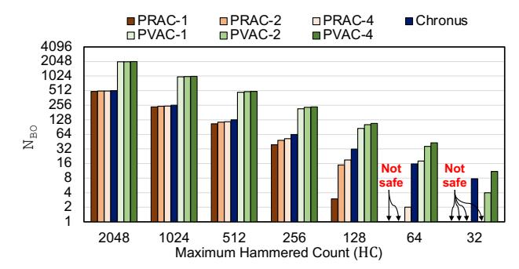
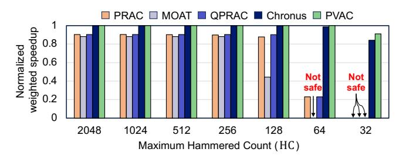
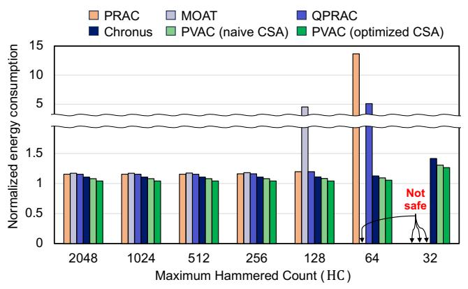
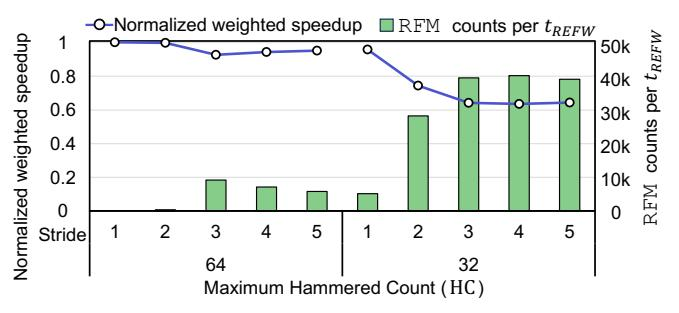
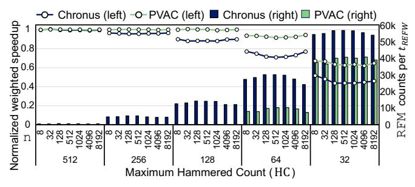
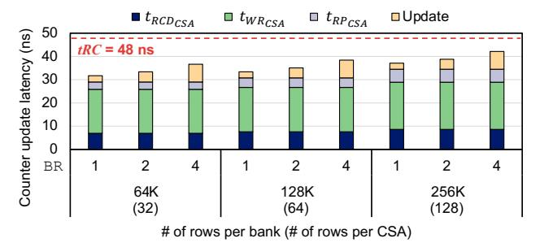

# C. Attack modeling for PRAC [91]

As PRAC employs aggressor-based counting, its  $N_{BO}$  must be conservatively determined by considering BR. Consider five

contiguous rows (row 0–4). If rows 0, 1, 3, and 4 are each activated  $^{N}/_{4}$  times, their individual *hammering counts* remain  $^{N}/_{4}$ , but the cumulative hammered count at row 2 reaches  $^{N}$ . PVAC can tolerate this behavior by ensuring that the hammered count does not exceed  $^{N}$ . In contrast, PRAC enforces a stricter bound that limits each aggressor's hammering count to at most  $^{N}/_{4}$ . Even if only one of these rows is activated  $^{N}/_{4}$  times, an Alert must be issued. This gap in the threshold values between PRAC and PVAC increases as BR grows. To reconcile this asymmetry, we derive the  $^{N}$ BO value for PRAC that guarantee the same maximum HC as PVAC.

We model the feinting attack on PRAC following [91] with one key difference in the layout of aggressor and victim rows. To maximize the HC of a victim row, the aggressor rows must be placed within the victim row's BR so that their disturbance accumulates onto the victim. With BR of 2, this requires the final surviving aggressor rows to surround one victim row, with two aggressors on each side. As the victim is refreshed when any of those aggressors is mitigated, the attack ends when the remaining aggressor row pool  $R_n$  becomes four. Hence, NR corresponds to the round index n at which  $R_n = 4$ .

**Setup phase:** During the setup phase, each of the final  $2 \times BR$  aggressor rows is prepared up to  $N_{BO}$  -1. Because all of them lie within the same victim row's BR, their disturbance accumulates at the victim, yielding:

$$\mathbf{HC}_{setup} = 2 \times \mathbf{BR} \times (\mathbf{N}_{BO} - 1) \tag{5}$$

Online phase: In every round, the progression is the same as that of PVAC, except that the per-round HC contribution becomes  $2\times BR$ . After the last round (NR), the attacker can further issue  $ABO_{Delay} + ABO_{ACT}$  activations before RFM begins. Then, as rows are refreshed in the order of distance 1, 2, ..., BR from the mitigated aggressor, the farthest victim row is refreshed last and can receive up to BR-1 additional disturbances before being refreshed. Therefore, the online-phase HC is expressed as:

$$HC_{online} = (2 \times BR \times NR) + ABO_{Delay} + ABO_{ACT} + BR - 1$$
 (6)

**Determining NR:** As in prior work [91], aggressor rows in PRAC are placed contiguously, since PRAC tracks only aggressor hammering counts and thus does not require the stride used in PVAC. Because each RFM refreshes victim rows within BR of the mitigated aggressor, the last RFM in round n-1 effectively pre-activates the first BR rows of the aggressor row pool in round n [91]. Therefore, only  $R_{n-1}$  – BR rows need to be considered when counting the number of Alert events in round n-1, yielding:

$$\mathbf{R}_{n} = \mathbf{R}_{n-1} - \mathbf{N}_{Mit} \times \left[ \frac{(\mathbf{R}_{n-1} - \mathbf{B}\mathbf{R})}{\mathbf{A}\mathbf{B}\mathbf{O}_{ACT} + \mathbf{A}\mathbf{B}\mathbf{O}_{Delay}} \right]$$
(7)

For BR = 2, NR is the round index at which only the final four aggressor rows around the victim remain (i.e.,  $R_n = 4$ ).

#### D. Attack modeling for Chronus

Chronus proposes an optimized ABO protocol that enables a single Alert to mitigate all rows whose counter values exceed  $N_{BO}$ , regardless of  $N_{Mit}$  [7]. Accordingly, after the

Figure 8. NBO across various maximum hammered count (HC) for PRAC, PVAC, and Chronus.

setup phase, one additional activation is needed to trigger the Alert, after which the attacker can issue ABOACT more activations before RFM begins. The farthest victim row can then receive up to BR-1 additional disturbances during RFM before being refreshed. Therefore, the online-phase HC is  $1+\mbox{ABO}_{ACT}+(\mbox{BR}-1)=\mbox{ABO}_{ACT}+\mbox{BR}$ . Since the setup phase is identical to that in Equation 5 and the online phase does not proceed over multiple rounds, we obtain:

$$HC_{online} = ABO_{ACT} + BR$$
 (8)

and the total HC is:

$$HC = 2 \times BR \times (NBO - 1) + ABO_{ACT} + BR.$$
 (9

#### E. Result

Figure 8 illustrates  $N_{BO}$  as a function of maximum HC, when a bank consists of 64K rows, corresponding to a DDR5 16 Gb configuration, and  $N_{Mit}$  is set to 1, 2, or 4. While the minimum and maximum initial victim row pool size under PVAC are 4 and 52,428, respectively, due to its stride-5 layout, the minimum and maximum initial aggressor row pool size of PRAC are 1 and 65,535, as one row must be reserved as the final victim row. To compute NR, we solve Equation 4 and Equation 7 for each initial row pool size ( $R_1$ ) from minimum to maximum value. We then substitute the resulting NR into Equation 3 and Equation 6 to obtain the corresponding HC values, and finally determine the  $N_{BO}$  values for PVAC and PRAC-based schemes under the same maximum HC. For Chronus, only Equation 5 and Equation 8 need to be solved.

PVAC can be configured with larger  $\rm N_{BO}$  values than PRAC-based schemes. When the maximum HC is 128 and  $\rm N_{Mit}$  is set to 1, 2, and 4, the resulting  $\rm N_{BO}$  values for PVAC are 85, 102, and 108, respectively, whereas those for PRAC are only 3, 15, and 19, and Chronus exhibits 31. At the maximum HC of 2048, PVAC exhibits  $\rm N_{BO}$  values of 2015, 2028, and 2032 for  $\rm N_{Mit}$  = 1, 2, and 4, respectively, whereas PRAC achieves 495, 501, and 503. For Chronus, the derived  $\rm N_{BO}$  value is 511.

PVAC can guarantee safety at lower maximum HC values than PRAC. At a maximum HC of 64, PRAC-1 and PRAC-2 fail to accommodate this value, and only PRAC-4 can be configured with NBO of 2. Because PRAC must conservatively configure NBO, it requires a much smaller value. Consequently, as the maximum HC decreases, NBO approaches zero earlier than PVAC, leading to unsafe points. In contrast, PVAC

Table V CONFIGURATIONS OF MITIGATIONS

| Schemes             | PRAC  | Chronus [7]             | <b>QPRAC</b> [91]       | MOAT [65]                 | PVAC                    |
|---------------------|-------|----------------------------|-------------------------|------------------------------|-------------------------|
| Proactive threshold | -     | -                          | $N_{BO} / 2$            | $N_{BO} / 2$                 | $N_{BO} / 2$            |
| Proactive period    | -     | $2 \times t_{\text{REFI}}$ | $1{\times}t_{\rm REFI}$ | $4 \times t_{\mathrm{REFI}}$ | $1{\times}t_{\rm REFI}$ |
| $t_{\rm RFC}$ (ns)  | 295   | 295                        | 295                     | 410                          | 295                     |
| N Mit    | 1/2/4 | Adaptive                   | 1/2/4                   | 1                            | 1/2/4                   |

remains safe with  $N_{BO}$  set to 43 at a maximum HC of 64 and continues to do so even when the maximum HC is reduced to 32, where  $N_{BO}$  is 11. Chronus can also tolerate these points with  $N_{BO}$  of 15 and 7, respectively, due to its optimized ABO protocol (§VI-D).

#### VII. EVALUATION

In this section, we evaluate the performance and energy overhead of PVAC in comparison with PRAC and other PRAC-based mitigation schemes. We sweep the maximum HC values and, for each HC setting, compare all mitigation schemes under the same maximum HC constraint.

#### A. System configuration

Table V summarizes the configurations of PVAC and the compared PRAC-based schemes. For aggressor-counting schemes, the  $\rm N_{BO}$  values used here are not directly taken from their native  $\rm N_{RH}$ -based configurations, but are re-derived under the victim-side HC formulation described in Section VI. The proactive threshold and period denote the counter value threshold and period that trigger proactive mitigations, respectively. Chronus does not employ a proactive threshold. Instead, it always performs proactive mitigation once every two  $t_{\rm REFI}$  intervals. QPRAC, MOAT, and PVAC all adopt a threshold of  $^{\rm N_{BO}}/_{\rm 2}$ . Among them, QPRAC and PVAC execute proactive mitigation every  $t_{\rm REFI}$ , whereas MOAT performs it once every four  $t_{\rm REFI}$  by default.

All schemes refresh four victim rows per proactive mitigation. PVAC resets the counter values of those victim rows, while the others reset the counters of a corresponding aggressor row. Consistent with prior studies, conventional PRAC is assumed not to perform proactive mitigation [7], [91]. MOAT assumes a  $t_{\rm RFC}$  of 410 ns, while the others use 295 ns.

Chronus adaptively issues RFM commands for all aggressor rows whose counter values exceed  $N_{BO}$  within a single Alert. As MOAT is designed for the case of  $N_{Mit}=1$ , we compare it under that configuration [65]. The other schemes support  $N_{Mit}$  values of 1, 2, or 4. For each HC value, we evaluate all feasible  $N_{Mit}$  configurations for each respective scheme and report the configuration that satisfies the HC constraint with the lowest overhead.

#### B. Methodology

**Simulation.** We evaluate performance and energy consumption using Ramulator 2.0 [56], a cycle-accurate memory system simulator. Table VI summarizes the system configuration used in our experiments. We assume a four-core out-of-order

#### Table VI SYSTEM CONFIGURATION

| Processor         | 4.2 GHz, 4-core, 128-entry instruction window                                                    |
|-------------------|--------------------------------------------------------------------------------------------------|
| Last-level cache  | 64 B cache line, 8-way set associative, 8 MB                                                     |
| Memory controller | 64-entry read/write queue, FR-FCFS [72], MOP4CLXOR address mapping [34]                       |
| Main memory       | DDR5-4800, 2 sub-channels, 1 rank, 8 bank groups, 4 banks/bank group, 64K rows/bank, 1KB/chip |

system with an 8 MB last-level cache (LLC). The main memory consists of two sub-channels, each with 32 banks, totaling 64 banks of DDR5-4800. Accordingly, the LLC capacity and the number of banks per core are 2 MB and 16, respectively. The MC employs FR-FCFS scheduling policy [72].

Workloads. We evaluated PVAC and prior work using five benchmark suites: SPEC CPU2006 [11], SPEC CPU2017 [12], TPC [13], MediaBench [18], and YCSB [10]. We classify these workloads into three groups—High, Mid, and Low based on their Row-Buffer Misses Per Kilo Instructions (RBMPKI) [4], [7], [36], [97]. Using these classifications, we construct 30 mixed workloads, with 10 from each group.

## *C. Benign workloads*

Performance. Figure 9 shows the performance impact under different HC constraints. For each group, we compute weighted speedup, normalize it to the baseline with no mitigation, and report the geometric mean across all mixed workloads. We sweep HC from 32 to 2048 and evaluate both the na¨ıve and optimized versions of CSA. Because the CSA optimization does not impact performance, we report a single representative result.

When HC is below 32, the required NBO values become extremely small to remain secure. For example, Chronus must set NBO to 3 at HC = 16, and to 1 at HC = 8, to satisfy the security constraint. Such configurations are no longer practically operable under benign workloads. For this reason, we present evaluation results for HC values of 32 and above.

PVAC and Chronus achieve the highest performance among all the evaluated schemes. Both schemes utilize dedicated CSAs, thereby operating with the default timing parameters (Table I). In contrast, the other schemes adopt PRAC's timing parameters, which incur additional memory access latency and degrade performance [7], [36], [89].

The performance gap between PVAC/Chronus and the other mitigation schemes further widens as HC decreases. PVAC employs a larger NBO and resets counters on every access. Chronus benefits from its adaptive RFM behavior that limits mitigation frequency. These properties enable PVAC and Chronus to sustain higher performance while remaining secure even at lower HC values. At lower HC values, PVAC outperforms Chronus by generating fewer Alerts under all benign workloads. For the same HC value, PVAC, which counts victims, can configure a higher NBO than Chronus, which counts aggressors, resulting in a larger performance gap at lower HC settings. Specifically, when HC is 64, PVAC

Figure 9. Normalized weighted speedup across different workloads and HC values.

achieves a 1.3% performance improvement over Chronus, and when HC is 32, the performance gap widens to 6.9%.

Among the mitigations adopting PRAC timing parameters, performance decreases in the order of QPRAC, PRAC, and MOAT. PRAC issues more RFM commands than any other schemes, and it triggers Alerts even in the high group when HC is 2048, exhibiting the most significant RFM-induced performance reduction. It is because PRAC neither resets counters during normal refresh nor employs proactive mitigation.

QPRAC outperforms PRAC due to its proactive mitigation. At an HC of 256, QPRAC does not trigger an Alert, while PRAC incurs Alert-induced performance degradation. QPRAC triggers Alert only when HC falls below 128.

MOAT generally performs worst. Similar to QPRAC, MOAT employs proactive mitigation; thus, it rarely triggers Alerts until HC reaches 256. However, its tRFC (410 ns) is longer than that of other schemes (295 ns), resulting in higher refresh overhead. Further, as MOAT only supports NMit = 1, it must configure a lower NBO than QPRAC and PRAC, which support NMit up to 4, under the same HC constraint (Figure 8). Energy. We evaluate the mean energy consumption of each mitigation scheme across all workloads (Figure 10). Following the methodology of prior work [7], [22], [55], [73], [80], we estimate CSA energy consumption during both normal accesses and REF operations using SPICE simulations.

The optimized CSA design of PVAC reduces the number of activations during normal REF operations, thereby achieving lower energy overhead than the na¨ıve CSA design. Because the na¨ıve CSA may activate up to eight rows per REF (§V-C), the energy overhead during an REF operation can reach 161% of normal access energy. In contrast, the optimized CSA design requires only a single CSA activation, resulting in an additional energy overhead of only 19.3%.

During normal memory accesses, the na¨ıve CSA increases the normal access energy by 20.1%, while the optimized CSA increases it by 19.8%. This lower energy consumption of the optimized CSA is obtained even though the dual-CSA activation is required with a probability of 3 ⁄128. It is because the optimized CSA halves the number of rows per CSA, thereby reducing the energy consumption per CSA access compared to the naive CSA design.

Overall, the optimized CSA exhibits lower energy consumption than the na¨ıve design. This optimization reduces total energy consumption by 3.9% compared to the na¨ıve design across all HC values, primarily by lowering energy overhead

Figure 10. Normalized average energy consumption across different workloads with different HC values.

during normal REF operations.

PVAC and Chronus is more energy efficient than the other schemes, despite the additional energy overhead in the CSA. As DRAM energy consumption is proportional to operation latency, timing parameters are the dominant factor. Although ACT and PRE in PVAC and Chronus incur nearly a 20% peraccess energy increase due to CSA, this cost is less than the increase caused by PRAC timing parameters, consistent with the findings of Chronus [7]. When HC is 2048, even though Alerts are rarely triggered, PRAC, MOAT, and QPRAC incur energy overheads of 15.4%, 17.2% and 15.4%, respectively, whereas PVAC and Chronus incur only 4.08% and 10.8%, respectively, despite performing proactive mitigations.

PVAC consumes less energy than Chronus as it performs fewer proactive mitigations. Chronus triggers proactive mitigation once every two  $t_{\rm REFI}$  intervals, whereas PVAC initiates proactive mitigation only when a counter exceeds its threshold (i.e., NBO/2). Thus, PVAC avoids unnecessary proactive mitigations, lowering overall energy consumption. Even if Chronus adopts the same proactive mitigation threshold, PVAC still performs fewer mitigations due to its larger security-equivalent NBO, thereby reducing the mitigation energy overhead.

When the HC values drop below 256, Chronus issues more RFM commands than PVAC, which further increases its energy consumption. When HC is greater than 128, the energy overheads of Chronus and PVAC remain at 10.8% and 4.08%, respectively. However, as HC decreases to 64, the energy overheads of Chronus and PVAC become 12.6% and 5.35%, respectively. When HC is even reduced to 32, the overheads increase to 41.7% and 26.4%, respectively, with Chronus exhibiting the larger increase.

PRAC, QPRAC, and MOAT generally consume more energy than PVAC and Chronus. MOAT incurs the highest energy overhead as its performance slowdown caused by the longer  $t_{\rm RFC}$  further increases refresh-related energy, and its restriction to  $N_{\rm Mit}=1$ . PRAC shows the next highest energy consumption due to the frequent RFM commands issued, while QPRAC reduces this overhead by proactive mitigations.

Figure 11. Normalized weighted speedup across workloads under adversarial access patterns for varying maximum hammered count (HC) and row stride, with the number of RFM commands issued per  $t_{\rm REFW}$ .

#### D. Malicious attacks

We evaluate the robustness of PVAC and Chronus under adversarial patterns with concurrent benign workloads. We note that Appendix XI provides the theoretical upper bound of bandwidth degradation based on the methodology of Chronus [7], whereas this section focuses on the behavior observed under such workload conditions.

Adversarial pattern. To evaluate robustness against malicious attack patterns, we assume that one core issues adversarial memory accesses while the remaining three cores run benign workloads. We focus on Chronus and PVAC as these schemes maintain competitive performance overheads relative to other schemes under benign workloads (Figure 9). The attacker activates n rows in a round-robin manner to intentionally generate frequent Alerts and degrade overall system performance. We vary the number of rows n ( $n \in \{8, 32, 128, 512, 1K, 4K, 8K\}$ ) and sweep the maximum HC values from 32 to 512, because neither scheme triggers Alerts when the HC value exceeds 512.

We sweep the aggressor row stride from 1 to 5 to examine how the stride affects PVAC. Because PVAC increments the counters of multiple victim rows, the aggressor row stride affects counter accumulation, which in turn changes the number of issued RFM commands. Figure 11 shows the performance of PVAC, averaged across workload groups and n values for each row stride, along with the number of RFM commands issued per  $t_{REFW}$ . No Alert is triggered when the HC values are 512, 256, and 128. When the HC values decrease to 64 and 32, the largest RFM commands are issued at strides of 3 and 4, respectively. As the performance degradation is proportional to the number of RFM commands issued, these cases are the most harmful among the adversarial patterns we evaluated. When the stride is small (e.g., stride = 1 or 2), the counter increment can be immediately reset by the activation of the neighboring row, resulting in fewer Alerts. For strides of 3 or larger, this immediate counter reset disappears, allowing disturbance to accumulate more effectively. We derive an adversarial access pattern based on this spatial behavior to maximize issuing RFM commands. We observe a significant increase in the number of issued RFM commands within  $t_{REFW}$  when the stride is 3 or larger. Thus, a stride of 3 represents the physical worst-case access pattern that avoids self-resetting penalties.

Figure 12. Normalized weighted speedup across workloads under adversarial access patterns for varying maximum hammered counts (HC) and row pool (n), with the number of RFM commands issued per  $t_{\rm REFW}$ .

Figure 13. Counter update latency under different row numbers and BR.

**Performance.** Figure 12 evaluates performance under the previously identified stride while varying n. Due to 1) the larger  $N_{\rm BO}$  and 2) the counter reset during normal refresh operations, PVAC achieves higher performance than Chronus across the evaluated settings. In particular, when HC is 64 and n=128, PVAC outperforms Chronus up to 29.4%, which is the largest gap observed in our evaluation.

At small n and HC values where Alerts can be triggered within  $t_{\rm REFW}$ , this difference is primarily associated with the larger NBO of PVAC compared to Chronus. As n increases such that an Alert cannot be triggered within a single  $t_{\rm REFW}$ , PVAC still avoids triggering Alert due to its periodic counter reset on REF, while Chronus continues to trigger Alerts. For example, when HC = 512 and n = 8K, the access pattern can persist across multiple  $t_{\rm REFW}$  intervals. Without refresh-driven counter reset, Chronus continues issuing RFM commands, reaching roughly 1K RFM commands.

#### E. Sensitivity study

Because PVAC updates the counters of both aggressor and victim rows, PVAC's feasibility highly depends on the counter update latency. As explained in  $\S V$ , the counter update latency is determined by 1) the CSA timing parameters (*i.e.*,  $t_{\text{RCD}_{\text{CSA}}}$ ,  $t_{\text{WR}_{\text{CSA}}}$ , and  $t_{\text{RP}_{\text{CSA}}}$ ) and 2) the number of counter values updated. The CSA timing parameters depend on the number of CSA rows, which scales with the number of DSA rows [46], [73], [80], while the number of counters to update is determined by BR. Thus, we analyze the counter update latency as a function of the number of rows per bank and BR.

Figure 13 breaks down the latency into  $t_{\rm RCD_{CSA}}$ ,  $t_{\rm WR_{CSA}}$ ,  $t_{\rm RP_{CSA}}$ , and Update, and shows that all configurations satisfy the  $t_{\rm RC}$  bound. The Update component represents the latency

to update the counters of both the victim and aggressor rows, computed as  $(2 \times BR + 1) \times t_{\rm UP}$ . We evaluate three row counts specified by JEDEC [30]—64K, 128K, and 256K—and sweep BR up to 4, the maximum value defined by the standard, to calculate the latency. All the evaluated configurations result in latencies below the 48 ns  $t_{\rm RC}$  constraint.

Increasing BR has a larger impact on the latency than increasing the row count. When the number of rows increases from 64K to 128K and 256K at BR = 1, the CSA timing parameters account for 91.6%, 92.0%, and 92.8% of the total latency, respectively. In contrast, with 64K rows, the fraction of latency contributed by Update increases more significantly—from 8.39% to 12.9% and 20.8%—as BR grows. These results indicate that increases in BR amplify the counter update latency more substantially than scaling the row count.

#### VIII. DISCUSSION

**Distributed counter.** PVAC introduces higher overhead on the counter structure compared to other schemes, which can be mitigated by distributing the counters across multiple chips. In the current design, all DRAM chips maintain identical counter subarrays and perform update/reset operations in tandem. By distributing the counters, each chip maintains counters for a subset of rows. Then, the chips no longer maintain the same counters or perform identical operations. Each only updates its dedicated rows, reducing counter maintenance overhead.

However, this approach requires an additional mechanism to broadcast the row index to be refreshed to all chips. When an Alert is triggered in a specific chip, only that chip knows which row must be refreshed. Therefore, the corresponding chip or MC must broadcast the row information to all chips within the  $tABO_{ACT}$  window (i.e., before RFM is issued).

RowPress [54], ColumnDisturb [100]. RowPress is orthogonal to PRAC and can be effectively mitigated by the MC's page policy. RowPress refers to a phenomenon where keeping a row activated for a long time induces bitflips in adjacent rows. Modern CPUs primarily employ adaptive or close page policies [34], [36], [48]. An adaptive page policy performs PRE after serving a certain number of RD/WR operations per ACT, while a close page policy performs PRE immediately after a RD/WR when the MC does not have a pending request to the activated page. With the limited row activation time, these policies naturally suppress RowPress-induced bitflips.

ColumnDisturb exhibits a behavior similar to RH, where repeated activations in a subarray cause bitflips in neighboring subarrays, potentially affecting up to 3,072 rows. Such a wide disturbance range makes conventional per-row counting mechanisms impractical due to its extremely large BR, thereby requiring a more coarse-grained counting approach.

Recent work proposes a subarray-level counting mechanism, SALT [68]. Instead of tracking activations at row granularity, SALT tracks the aggregate activation count of each subarray and refreshes rows at the subarray-level. To protect against ColumnDisturb, SALT increments the counter values of three subarrays—the given and its neighboring subarrays—thereby

capturing disturbance propagation without incurring the prohibitive overhead of per-row tracking. Because this work is built upon the PRAC protocol and does not depend on whether counting is performed on aggressors or victims, this mechanism can be adopted to PVAC with minimal modification.

Refresh postponing. Under PRAC, a maximum of two and four REFab can be postponed in normal and fine granularity refresh mode, respectively [30]. As PVAC resets counter values during periodic refresh operations, postponing a refresh also delays the corresponding reset. With DDR5 tRC = 48 ns, up to approximately 243 additional ACT commands can be issued to a single bank. Consequently, additional ACT commands may accumulate before the reset occurs, potentially increasing the likelihood of triggering RFM and thereby incurring additional performance and energy overhead. However, this is not unique to PVAC; other PRAC-based schemes are equally exposed to the same extra number of ACT commands.

## IX. RELATED WORK

Victim-based counting method. While several prior works explore victim-based counting schemes in RH mitigation [15], [57], [79], [99], none of them directly address the fundamental limitations of aggressor-based counting methods. ProHIT [79] tracks potential victim rows using probabilistically managed hot and cold tables, effectively extending PARA [41]-like probabilistic refresh. MRLoc [99] also targets victim rows, but maintains them in a queue that derives a locality–aware weight so that frequently hammered victims receive higher refresh probability.

DIVIDE [15] leverages in-DRAM caching to isolate frequently activated rows from neighboring rows, thereby reducing effective hammering. It employs a lightweight victimoriented mechanism in the cache tag table to track row vulnerability within the cache array. ProTRR [57] builds upon TR-Rideal, an idealized victim-based counting model that assumes the ability to track the activation count of every potential victim row. Because maintaining exact per-row counts using SRAM incurs prohibitive area and energy overhead, ProTRR replaces exact counting with a frequent-item approximation that identifies the most frequently activated rows using a Misra-Gries based algorithm [58], [63].

Side/covert-channel in PRAC. The ABO protocol of PRAC has recently been shown to be susceptible to timing-based side and covert channels [3], [93]. This vulnerability arises because, once a row's activation count reaches NBO, the subsequent issuance of RFM commands introduces observable timing differences in system-wide memory access latency.

To mitigate this, prior works have proposed two main countermeasures. First, they adopt timing-based RFM schemes that issue the RFM command at a fixed and periodic interval. For example, TPRAC [93] and FR-RFM [3] propose issuing RFM per fixed timing interval. Second, RIAC [3] suggests initializing the counters with a random value to make the exact moment of RFM issuance unpredictable. During system initialization, each activation counter is assigned a randomly chosen non-zero value.

Both of them can be seamlessly adopted in PVAC to defend against the timing channels. Further, PVAC enhances security by resetting its counter upon commands that include activations (*e.g.*, ACT, REF, and RFM), which fundamentally limits the overall frequency of RFM. Therefore, PVAC is capable of providing a defense against timing channels by increasing the unpredictability of the mitigation process.

