# ParetoES: Hardware-Accelerated Sparse Embedding Similarity via Pareto-Optimal Pruning

Jiaqi Zhai† Xuanhua Shi∗† Wenju Zhao† Kaiyi Huang† Chencheng Ye† Shunsen Lv† Zhongtian Long† Bingsheng He‡ Hai Jin†

*National Engineering Research Center for Big Data Technology and System, Services Computing Technology and System Lab, Cluster and Grid Computing Lab, School of Computer Science and Technology, Huazhong University of Science and Technology, Wuhan, 430074, China*† *School of Computing, National University of Singapore, 119077, Singapore*‡

> {jqzhai, xhshi, wjzh, kyhuang, yecc, sslv, longzt, hjin}@hust.edu.cn dcsheb@nus.edu.sg

*Abstract*—Efficient retrieval of sparse embeddings, a critical task in modern information systems, is fundamentally challenged by the memory-bound nature of *Top-K sparse matrix–vector multiplication* (SpMV). Existing solutions often pursue full computation for absolute accuracy, which is not Pareto-optimal and results in excessive memory transfers and redundant work. We propose ParetoES, an FPGA-accelerated retrieval system that adopts a selective computation strategy to optimize the trade-off between recall and throughput. ParetoES integrates algorithmic and architectural co-design, featuring: (1) a *Spherical K-means++ Refine* algorithm that combines clustering, low-bit quantization, and unstructured pruning to reduce the candidate search space and memory access overhead; (2) a *Hierarchical Hotspot-Balancing* (H<sup>2</sup>Balance) strategy to mitigate workload skew in multicore environments; and (3) a lightweight *Adaptive Cluster Probing Engine* (ACPE) architecture with distributed microsorters to enable flexible, high-throughput retrieval. Experiments on five datasets show that when maintaining Recall@100 > 0.8, ParetoES achieves up to 540× and 79× higher *Queries Per Second* (QPS) than CPU and GPU baselines, respectively. It also demonstrates an average throughput improvement of 2.27× over the state-of-the-art FPGA accelerator.

*Index Terms*—Top-K Sparse Matrix-Vector Multiplication, Pareto-Optimal, Memory Optimization, Accelerator

#### I. INTRODUCTION

The exponential growth of unstructured data has made deep embedding models fundamental to modern information systems, with sparse embeddings proving especially effective for cross-modal semantic representation [4], [19]–[21], [59]. These models encode diverse data types—entities, videos, text, products—into high-dimensional sparse vectors, enabling applications such as *Retrieval-Augmented Generation* (RAG), personalized recommendation and knowledge graph construction [9], [14], [39]. As illustrated in Figure 1, efficient retrieval in these systems fundamentally boils down to identifying the most similar items to a query—a computation that reduces to a *Top-K sparse matrix–vector multiplication* (SpMV), which ranks database vectors by their inner-product similarity.

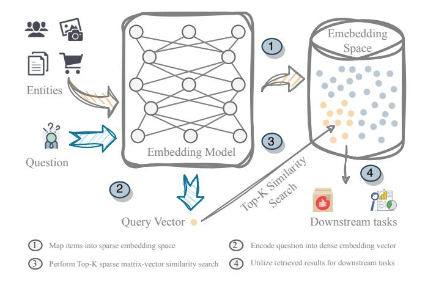

Fig. 1. Top-K SpMV for Embedding Similarity in Retrieval System

The computational efficiency of Top-K SpMV is critical for downstream tasks. Despite numerous acceleration efforts targeting CPUs, GPUs, and FPGAs, this operation continues to be a significant burden, consistently accounting for a substantial fraction of the total computational cost and thus severely limiting overall efficiency [61].

The root cause of this inefficiency is twofold: a fundamental architectural mismatch and inherent algorithmic overcomputation. On the architectural front, conventional processors struggle with the operator's irregular workload. CPUs suffer from severe memory wall issues due to sparse data's irregular access patterns, where cache misses and poor prefetcher efficacy cause memory latency to dominate 60%–70% of execution time [56]. Meanwhile, GPUs are hampered by load imbalance and low arithmetic intensity under high sparsity, which underutilizes their parallel resources and diminishes performance gains [61]. These limitations render conventional architectures fundamentally ill-suited for this task. On the algorithmic front,

<sup>∗</sup>Corresponding author: Xuanhua Shi.

algorithmic overcomputation persists in modern FPGA accelerators [47], [60]. Although techniques like HBM streaming and low-bit quantization alleviate memory bottlenecks, these designs remain bound to the full-computation paradigm. By prioritizing high recall (e.g., > 99%) through exhaustive comparisons of all database vectors, they inherently sustain substantial memory and computational overhead.

Empirical evidence indicates that production applications like RAG and recommender systems operate effectively at 80-90% recall. In RAG systems, reducing recall to  $\sim 80\%$ incurs only minor accuracy loss (0.3-3.6%) [64], with further recall improvements yielding diminishing returns [29], [33], [36], [57]. Similarly, recommendation systems achieve sufficient utility at 80-90% recall, avoiding disproportionate cost increases for marginal gains [27], [50]. More broadly, retrieval recall exhibits a monotonic relationship with downstream task metrics, such as accuracy and perplexity in RAG, as well as MRR and NDCG in recommendation systems, and tends to saturate beyond moderate recall levels [11], [23], [31], [34]. Our analysis further reveals a stark Pareto trend: processing a mere 20% of candidate vectors can often achieve over 80% recall. This consistent tolerance to sub-perfect candidate preservation strongly motivates a shift from full-computation to selective search space pruning.

Prior systems' inability to effectively trade recall for efficiency stems from their failure to recognize the underlying Pareto trend—that a small fraction of vectors contributes disproportionately to recall. Unaware of this property, they remained algorithmically confined to the full-computation paradigm while simultaneously lacking the architectural support needed to efficiently execute a pruned search.

To overcome this co-design gap, we present ParetoES, a vertically integrated retrieval framework that co-designs algorithms, architecture, and system optimizations to operate along the Pareto-optimal frontier. Algorithmically, we extend Spherical K-means [25] into a refined Spherical K-means++ Refine to enhance direction-sensitive clustering and adopt lowbit quantization with an enhanced ReSparse algorithm to minimize redundant memory accesses and arithmetic operations. Architecturally, our underlying hardware comprises multiple Adaptive Cluster Probing Engine (ACPE) cores that execute cluster selection and intra-cluster similarity evaluation in a multi-core parallel paradigm. Each ACPE integrates Bitonic-16 networks [8] for efficient cluster screening and localized ranking, while co-locating centroids and vectors in memory to improve locality. System-wide, the Hierarchical Hotspot-Balancing (H<sup>2</sup>Balance) mechanism dynamically profiles access patterns and redistributes cluster tasks to mitigate load skew across cores. With fine-grained pipelining and optimized memory scheduling, ParetoES sustains retrieval accuracy while delivering high throughput, completing the fullstack co-design from algorithms to architecture to system.

Experiments on five diverse datasets validate the effectiveness of our approach. Under constrained Recall@100 levels within [0.8, 1.0], ParetoES achieves up to  $540\times$  and  $79\times$  higher QPS than highly-optimized CPU and GPU baselines,

respectively, while delivering an average throughput improvement of  $2.27\times$  over the state-of-the-art AccelES FPGA accelerator [60]. At  $Recall@100\approx 1.0$ , ParetoES achieves average speedups of  $1.21\times$  over AccelES and  $3.89\times$  over FPGA32 across five datasets. These results demonstrate that by leveraging a selective computation paradigm, ParetoES establishes a highly efficient trade-off among retrieval accuracy, throughput, and energy consumption.

In summary, we make the following contributions:

- A novel sparse embedding retrieval framework, ParetoES, establishes a new Pareto-optimal trade-off between accuracy and efficiency through the vertical co-design of algorithms, system strategies, and reconfigurable architecture.
- A co-designed algorithm-system suite comprising Spherical K-means++ Refine for search space reduction; integrated pruning and quantization for bandwidth efficiency; and H<sup>2</sup>Balance for multi-core load balancing, collectively boosting QPS while maintaining high recall.
- A flexible FPGA architecture supports selective cluster probing via distributed micro-sorters and centroid-vector co-location, enabling runtime-configurable retrieval without re-synthesis and achieving up to 540×/79×/2.27× higher QPS over CPU/GPU/FPGA baselines.

#### II. BACKGROUND AND MOTIVATION

#### A. Top-K Sparse Matrix-Vector Multiplication

1) Formal Definition of Top-K SpMV: The Top-K SpMV problem is defined as follows: given a sparse matrix  $A \in \mathbb{R}^{m \times n}$  and a dense vector  $\mathbf{v} \in \mathbb{R}^n$ , compute the product

$$\mathbf{y} = A \mathbf{v} = [y_1, y_2, \dots, y_m]^{\top}, \quad y_i = \langle A_i, \mathbf{v} \rangle$$
 (1)

where  $A_i$  denotes the ith row of A and  $\langle\cdot,\cdot\rangle$  represents the inner-product operation. The output is the index set

$$TopK(\mathbf{y}, K) = \{i_1, i_2, \dots, i_K\}$$
s.t.  $y_{i_j} \ge y_r$ ,  $\forall i_j \in TopK$ ,  $\forall r \notin TopK$  (2)

i.e., the set of K indices corresponding to the largest entries in y where the order of elements within the set is not required.

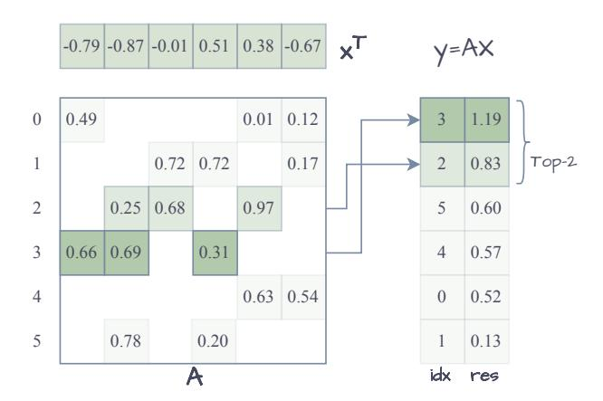

Fig. 2. Workload characteristics of Top-K SpMV

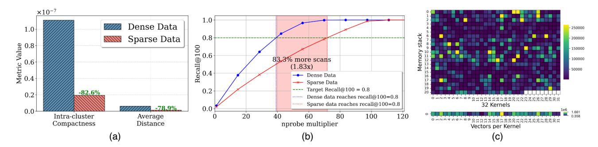

Fig. 3. Key challenges description. (a) Intra-cluster distance comparison between dense and sparse spaces. (b) Degraded cluster compactness in sparse spaces. (c) Load imbalance caused by power-law distributed cluster accesses.

In sparse vector retrieval tasks, each row of A represents a database candidate, and v acts as the query. Their inner product quantifies similarity. As a result, solving this problem requires both efficient sparse matrix–vector multiplication and high-performance Top-K selection to meet stringent latency and throughput constraints.

To quantify retrieval quality under approximate execution, we adopt Recall@K, defined as the fraction of ground-truth Top-K results recovered by the approximate computation. Let  $\mathrm{TopK}_{\mathrm{exact}}$  denote the result obtained via exhaustive full-precision Top-K SpMV, and  $\mathrm{TopK}_{\mathrm{approx}}$  denote the result produced by an approximate or optimized implementation. The metric is computed as

$$Recall@K = \frac{\left| \text{TopK}_{\text{approx}} \cap \text{TopK}_{\text{exact}} \right|}{K}$$
 (3)

2) Workload Analysis: As illustrated in Figure 2, Top-K SpMV workloads present three major challenges: irregular memory access, compute imbalance, and sparse outputs. First, memory access to the sparse matrix is highly irregular and poorly localized, resulting in low cache hit rates and ineffective hardware prefetching. These characteristics severely degrade memory bandwidth utilization and limit the efficiency of cache-based systems such as CPUs and GPUs. Second, uneven nonzero distribution across rows introduces load imbalance, reducing parallel execution efficiency. Third, the Top-K inherently yields sparse outputs ( $K \ll m$ ), requiring heap-based or pre-filtering structures to maintain results efficiently online.

#### B. Prior Work: Algorithm and Hardware Design Perspectives

Top-K SpMV can be viewed as a sparse-specialized formulation within *Approximate Nearest Neighbor Search* (ANNS). Most existing ANNS systems are designed for dense vector retrieval and rely on index traversal or graph-based search structures. In contrast, Top-K SpMV targets sparse embedding retrieval. Existing research accelerates sparse embedding retrieval from both algorithmic and hardware design perspectives.

1) Algorithm Perspective: From an algorithmic standpoint, optimizations focus on: (1) Encoding formats via hardware-adaptive CSR variants: CSR5 [37] partitions rows for SIMD

vectorization, CSR2 [5] employs dual row-column indexing for GPU warp efficiency, Block-Streaming CSR (BS-CSR) [47] organizes fixed-size blocks for streaming-friendly access, Ultra-CSR [60] minimizes pointer overhead via bit-mask compression, and Random-CSR [60] enables dynamic per-vector access; (2) *Computational acceleration* through distributed parallelism (e.g., sparse\_dot\_topn [1]), GPU-optimized libraries (cusparse [45] for SpMV kernels and Thrust [46] for sort-select pipelines), and approximate techniques including inverted indexing [26], LSH [12], product quantization [30], and HNSW graphs [40], which are integrated in Faiss [16] to achieve substantial gains in dense embeddings retrieval.

TABLE I Hardware-oriented Evaluation of Sparse Embedding Retrieval Architectures

| Method                                               | Sparse<br>Retrieval | Sparse<br>Agnostic | Selective<br>Computation |  |
|------------------------------------------------------|---------------------|--------------------|--------------------------|--|
| CPU-based Methods                                    |                     |                    |                          |  |
| MKL [55] + Sort<br>sparse_dot_topn [1]<br>Faiss [16] | √<br>√<br>√         | ×<br>×<br>×        | ×<br>×<br>√              |  |
| <b>GPU-based Methods</b>                             |                     |                    |                          |  |
| cuSPARSE [45] + Thrust [46]<br>Faiss [16]            | √<br>√              | ×                  | × _/                     |  |
| FPGA-based Methods                                   |                     |                    |                          |  |
| FPGA32 [47]<br>AccelES [60]<br>ParetoES (ours)       | √<br>√<br>√         | √<br>√<br>√        | ×<br>×<br>√              |  |

<sup>\*</sup> Sparse Agnostic: Delivers consistent throughput across arbitrary sparsity levels.

2) Hardware Design Perspective: As shown in Table I, current hardware architectures fail to co-support both sparse-agnostic design and the selective computation paradigm. Specifically, CPU-based methods (MKL [55]+Sort, sparse\_dot\_topn [1]) lack selective computation, while Faiss supports selective computation but is not sparse-agnostic. The

GPU-based cuSPARSE+Thrust [45], [46] is partially sparse-agnostic but does not support selective computation. The lack of native support for sparse-agnostic computation in CPUs/GPUs makes them clearly unsuitable as ideal platforms for solving this problem. Prior FPGA-based works such as FPGA32 [47] and AccelES [60] exploit custom pipelines and sparse-agnostic designs to achieve significant performance improvements over CPU and GPU baselines. However, these approaches lack selective computation capabilities. ParetoES introduces a novel architecture that natively integrates sparse-agnostic design with selective computation. By strategically evaluating only promising candidate vectors, it achieves substantial improvements in retrieval time while preserving accuracy, thereby outperforming all current alternatives.

#### C. Towards Pareto-Optimal Co-Design Exploration

Conventional sparse retrieval systems [47], [60] follow a "full-computation" paradigm, exhaustively evaluating all similarity scores  $\langle A_i, \mathbf{v} \rangle$  to achieve ultra-high recall  $\langle Recall \rangle$  99%). Yet, many applications—such as open-domain QA and large-scale recommendation—require only a sufficiently good candidate set, making 80–100% recall acceptable [28], [53], [58], as residual errors can be corrected by subsequent models or human intervention [13], [32], [51], [52], [54]. This exhaustive approach is Pareto-inefficient [6], [17]: processing the top 20% of candidates post-clustering suffices for  $\sim$ 80% recall, enabling selective computation that discards low-yield operations. Building on this insight, we propose ParetoES, a reconfigurable multicore accelerator that supports two-stage retrieval over a clustering-based inverted index, featuring dual-pipelined cluster filtering and in-cluster Top-K selection.

Despite the promise of clustering-based inverted-index accelerators for sparse embedding retrieval, three challenges persist: (1) Standard K-means, effective for dense vectors, poorly captures sparse high-dimensional similarity under  $L_2$  metrics. As Figure 3(a-b) shows, in equal-sized vector spaces  $(m=640,000,\ d=900,\ \text{sparse nonzero density}\le 14.0\%)$ , sparse clustering exhibits 75.8% lower intra-cluster distances yet 82.6% worse compactness versus dense cases, necessitating scanning up to  $1.83\times$  more clusters to maintain Re-call@100=80%. (2) Cluster access follows a power-law, creating long-tail scan workloads. Static multi-core partitioning without runtime load awareness yields up to  $4.6\times$  per-core load imbalance and severe stragglers (Figure 3(c)). (3) The number of clusters to scan varies with application, dataset, and accuracy, challenging fixed hardware designs.

#### III. SYSTEM OVERVIEW

To advance large-scale sparse retrieval, we introduce ParetoES—a heterogeneous system that integrates CPU, GPU, and FPGA accelerators (see Figure 4). The operational workflow consists of two primary stages: offline preprocessing and online retrieval.

During offline preprocessing, CPUs and GPUs jointly cluster sparse vectors to build the retrieval index, reorganize the sparse matrix, partition it into submatrices by cluster ID,

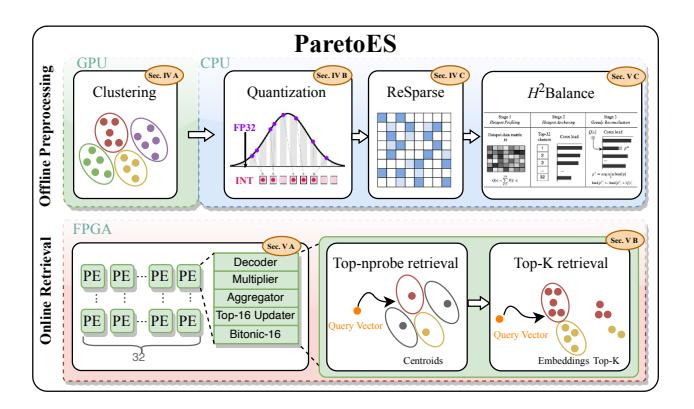

Fig. 4. System Overview

quantize nonzeros to 6-bit integers, and apply the ReSparse pruning algorithm. The H<sup>2</sup>Balance strategy maps hotspot clusters to processing cores for effective load balancing. The processed matrices are then encoded in the Ultra-CSR format and transferred to the FPGA's HBM for online retrieval.

In the online retrieval phase, the CPU quantizes each query and sends it to the *Adaptive Cluster Probing Engines* (ACPEs; see Section V-B), a parallel array optimized for selective Top-K SpMV. The ACPEs identify the Top-nprobe most relevant clusters and restrict computation to the corresponding submatrices, where processing elements efficiently generate Top-k candidates through localized filtering.

## IV. CLUSTERING-BASED ALGORITHM OPTIMIZATION INCORPORATING QUANTIZATION AND PRUNING

This section details three orthogonal optimizations for Top-K SpMV applied during offline preprocessing, as introduced in Section III: clustering, low-bit quantization, and ReSparse pruning. To the best of our knowledge, we are the first to demonstrate that their combined application can substantially reduce both computational and communication overhead while preserving high recall.

#### A. Spherical K-means Cluster with Pre and Post Refine

1) Spherical K-means vs. K-means: Dense-vector retrieval frameworks such as Faiss often use K-means [41], effective for dense data but limited in high-dimensional sparse spaces: (1) Distance-metric mismatch: The  $L_2$  norm is dominated by zeros, obscuring discriminative information and causing misclustering of semantically related vectors. (2) Centroid drift: Using the arithmetic mean of sparse vectors introduces noise, reducing cluster representativeness and retrieval efficiency.

To address these limitations, we adopt a direction-sensitive Spherical K-means that normalizes vectors and centroids, uses cosine similarity to capture directional alignment of nonzeros, and represents each cluster by the sparse vector closest to the mean, mitigating centroid drift and improving clustering in sparse high-dimensional spaces.

Figure 5 compares the two methods by clustering sixdimensional sparse vectors projected onto a 2D polar plot,

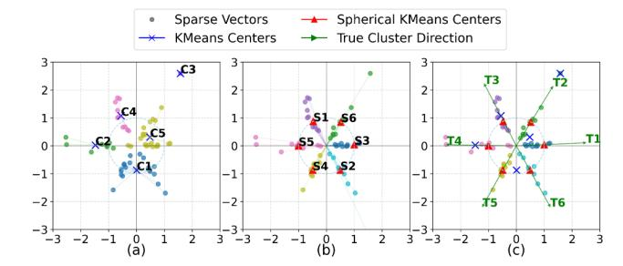

Fig. 5. Comparison between conventional and spherical K-means. (a) The Euclidean-distance-based K-means algorithm is sensitive to vector magnitudes. (b) The Cosine-similarity-based Spherical K-means algorithm focuses on vector direction rather than magnitudes. (c) Centroid direction comparison.

with each  $60^{\circ}$  sector representing a feature. Conventional Euclidean K-means (Fig. 5(a)) clusters primarily by magnitude, ignoring sparsity patterns, and merges vectors with similar magnitudes but differing directions [15], [49], producing fewer and distorted clusters even with a maximum of six clusters. In contrast, Spherical K-means (Fig. 5(b)) normalizes vectors to unit norm and uses cosine similarity to capture directional alignment, producing equidistant centroids. Fig. 5(c) shows these centroids closely align with ground-truth directional indicators (green arrows), confirming improved semantic coherence and clustering.

2) Spherical K-means++ with Post Refine: Our approach advances classical Spherical K-means via enhanced centroid initialization and post-clustering refinement, as detailed in Algorithm 1. We employ K-means++ [2] variant for centroid initialization. The sampling probability is defined as:

$$p(x_i) = \frac{1 - \max_{c_j \in \mathbf{C}_{\text{current}}} x_i^{\top} c_j}{\sum_{c_j \in \mathbf{C}_{\text{current}}}^n \left(1 - \max_{c_j \in \mathbf{C}_{\text{current}}} x_k^{\top} c_j\right)}$$
(4)

Let  $x_i \in \mathbb{R}^d$  denote a sparse vector and  $\mathbf{C}_{\text{current}}$  the current centroid set. This strategy maximizes the minimum cosine distance  $1-x_i^\top c_j$  to ensure centroid diversity. Each centroid is sampled from a random subset of  $m = \min(0.01n, 10000)$  candidates, reducing per-iteration cost from  $\mathcal{O}(nd)$  to  $\mathcal{O}(md)$  and total complexity to  $\mathcal{O}(mKd)$ .

We employ a dynamic refinement strategy that merges clusters when their centroids exhibit near-duplicate cosine similarity and splits those with insufficient cohesion. Merging is conducted by replacing qualified centroid pairs with the vector closest to their average, whereas splitting is performed via 2-means initialization followed by iterative reassignment until both subclusters satisfy the cohesion criterion or reach the iteration limit. The specific threshold pair  $(\theta_{\text{merge}}, \theta_{\text{split}}) = (0.9, 0.6)$  follows the refinement principle commonly adopted in split-and-merge clustering methods [3], [38], [44], which advocate merging only near-redundant clusters and splitting only clearly incoherent ones, yielding stable refinement without over-fragmentation or redundant merging.

### Algorithm 1: Spherical K-means++ with Refinement

```
Input: Sparse vectors \{\mathbf{x}_i\}_{i=1}^N, initial clusters K,
                      \theta_{merge}, \theta_{split}, max\_refine\_iter
     Output: Clusters \{c_i\}, centroids \{\mu_i\}
 1 Function
       Spherical-KMeans++-With-Refine():
            Initialize centroids \{\mu_i\}_{i=1}^K via K-means++;
 2
 3
                  foreach x_i do
 4
 5
                         \mathbf{x}_i \leftarrow \mathbf{x}_i / \|\mathbf{x}_i\|_2;
                         Assign to cluster c_i where
 6
                         j = \arg\max_k (\mathbf{x}_i \cdot \boldsymbol{\mu}_k);
                  foreach cluster c_i do
 7
                    \boldsymbol{\mu}_i \leftarrow \arg\max_{\mathbf{x} \in c_i} (\mathbf{x} \cdot \text{normalize}(\sum \mathbf{x}));
 8
            until convergence;
 9
            while \max_{i\neq j}\cos(\boldsymbol{\mu}_i,\boldsymbol{\mu}_j) > \theta_{merge} do
10
                  (i^*, j^*) \leftarrow \arg\max_{i \neq j} \cos(\boldsymbol{\mu}_i, \boldsymbol{\mu}_j);
11
                  \mu_{\text{new}} \leftarrow \arg \max_{\mathbf{x} \in c_{i^*} \cup c_{j^*}} (\mathbf{x} \cdot \text{normalize}(\sum \mathbf{x});
12
              Merge c_{i^*}, c_{j^*} into c_{\text{new}} with centroid \mu_{\text{new}};
13
            foreach cluster c_k do
14
                  \begin{array}{l} \text{if} \ \frac{1}{|c_k|} \sum_{\mathbf{x} \in c_k} \mathbf{x}^\top \boldsymbol{\mu}_k < \theta_{split} \ \text{then} \\ | \ \text{Split} \ c_k \ \text{via} \ 2\text{-means} \to c_{k1}, c_{k2}; \end{array}
15
16
                         Compute \mu_{k1}, \mu_{k2};
17
18
                         for t = 1 to max\_refine\_iter do
                                Reassign \mathbf{x} \in c_k to \boldsymbol{\mu}_{k1} or \boldsymbol{\mu}_{k2};
 19
                                Update \mu_{k1}, \mu_{k2};
 20
                                if cohesion(c_{k1}) \geq \theta_{split} \&
21
                                  cohesion(c_{k2}) \geq \theta_{split} then
22
                         Replace c_k with c_{k1}, c_{k2};
23
            return \{c_j\}, \{\boldsymbol{\mu}_j\};
24
```

#### B. Low-bit Uniform Integer Quantization

Low-bit quantization improves bandwidth and parallelism on FPGA, reducing memory and DSP usage with negligible accuracy loss. We adopt symmetric INT6 quantization with dynamic scaling  $\alpha = \max(|x|)$ , linearly mapping  $x \in \mathbb{R}$  into [-31,31]:

$$Q_x = \text{round}\left(\frac{S}{\alpha} \cdot x\right), \quad S = 31$$
 (5)

INT6 provides a favorable trade-off between recall and bandwidth: it preserves Recall@100, whereas 5- and 4-bit quantization reduce recall by up to 10% and 32.5%. Combined with Ultra-CSR [60], INT6 increases effective memory bandwidth  $6\times$  over FP32, crucial for memory-bound sparse retrieval. Unlike prior work [60], we avoid clipping to preserve angular scaling. While clipping can maintain recall, it suppresses high-norm components and distorts directional similarity [7], [63], motivating our no-clipping design as a more geometry-preserving alternative.

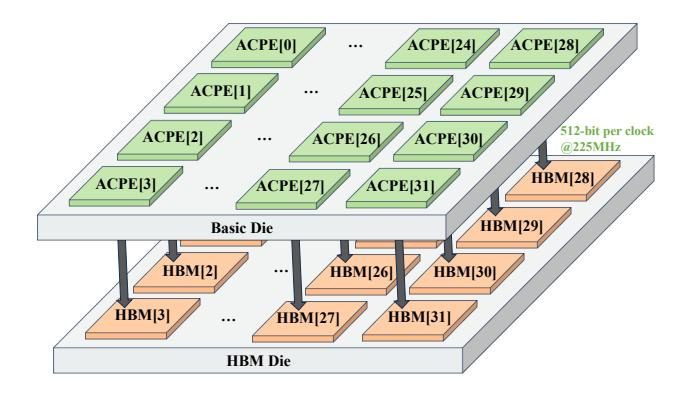

Fig. 6. ParetoES architecture

To ensure clustering quality, we adopt a hybrid precision strategy: clustering is performed in full-precision floating point, while sparse vectors, centroids, and queries are quantized once to 6-bit integers post-clustering. This enables efficient integer-based Top-K retrieval.

#### C. ReSparse Algorithm for Clustering

In sparse vectors, small-magnitude non-zero elements have limited impact on similarity ranking. Pruning such elements reduces redundant computation and communication. Prior work [60] applied unstructured pruning to the full-computation Top-K SpMV paradigm, achieving significant speedup. In this work, we are the first to demonstrate that unstructured pruning can be effectively applied to the selective computation Top-K SpMV paradigm. Our approach maintains high retrieval accuracy while offering a superior speed-accuracy trade-off.

We adapt the ReSparse algorithm to the cluster-based Top-K SpMV paradigm through targeted structural and statistical refinements. In particular, we restructure the pruning ratio calculation to fit its iterative search over selected clusters by integrating it with the spherical K-means++ refine algorithm. We further determine the minimum nprobe per dataset under a Recall@100 constraint of  $\geq 80\%$ , ensuring pruning preserves accuracy. However, the original ReSparse is less effective for high-sparsity matrices, as its pruning threshold is based on the global mean, which is skewed downward by zeros. This causes most non-zero elements to be retained, diminishing pruning benefits. To address this, we compute the mean over non-zero elements only, enhancing pruning discriminability in extreme sparsity scenarios.

#### V. PARETOES

#### A. Introduction to Multi-core Parallel Computing Architecture

Figure 6 illustrates ParetoES, a scalable multicore architecture deployed on an HBM+FPGA platform. The system incorporates two HBM2 stacks exposing 32 pseudo-channels (PCs), each connected via a 512-bit bus running at 225 MHz, providing a theoretical peak bandwidth of 460 GB/s.

The FPGA fabric hosts 32 ACPEs (Sec. V-B), each bound to a dedicated HBM PC through a 512-bit interface, forming

a fully isolated compute-memory pair. This architecture of fully isolated compute-memory pairs, devoid of inter-engine communication or synchronization, enables Pareto to sustain peak bandwidth utilization across all 32 HBM channels during streaming of sparse matrix elements. Each ACPE core is responsible for performing cluster selection and intra-cluster similarity evaluation on its assigned subset of clusters. Every engine continuously fetches nonzeros from its local HBM channel, computes inner products, and updates local Top-16 candidates in parallel, without inter-engine synchronization. The system finally aggregates the Top-512 candidates returned by all 32 ACPEs on the host side to produce the global result.

ParetoES introduces a new architecture tailored for Topnprobe cluster selection, enabling dynamic identification of probe clusters while supporting efficient Top-K similarity computation within each cluster.

#### B. Adaptive Cluster Probing Engine (ACPE)

Clustering-based selective computation consists of cluster probing followed by intra-cluster Top-K similarity evaluation, requiring high-throughput computation and efficient sorting support. A centralized Bitonic-N sorter guarantees global ordering but scales poorly, with  $C(N) = \frac{N \log N(\log N + 1)}{4}$  comparators and  $D(N) = \frac{\log N(\log N + 1)}{2}$  deep pipelines, e.g., 11,520 comparators and 45 stages for N=512, exhausting FPGA resources and limiting scalability.

To address this bottleneck, we design a *Distributed Micro-Sorting Unit* (DMSU) that replaces a monolithic Bitonic-512 with 32 core-local Bitonic-16 sorters. This reduces comparators from 11,520 to 2,560, simplifies control, and enables fully parallel operation with deterministic 10-cycle latency, improving resource efficiency and scalability.

Complementing the compute-layer optimizations, the ACPE enhances memory-layer efficiency through a cluster-centroid co-placement strategy, as illustrated in Figure 7. Irregular memory access is a key performance challenge in sparse Top-K SpMV, primarily caused by index-driven indirection and parallel random reads to both sparse matrix entries and the query vector x. ParetoES mitigates this challenge through a co-designed execution and memory organization strategy. Selective cluster probing is jointly supported by the Bitonic-16 sorter, the Mem Map scheduler within ACPE, and the cluster-aware data layout in HBM, forming a co-designed architecture-memory mechanism. By bounding the active working set per query, it reduces full-dataset traversal and global indirection. The post-clustering matrix is reorganized into cluster-local sub-matrices with ordered indices, confining random access within active clusters and enabling burstoriented streaming from dedicated HBM channels. In addition, ACPE replicates x across multiple URAM banks to provide sufficient on-chip read bandwidth for concurrent lanes and alleviate random-read contention. Together, these mechanisms reshape sparse access behavior from globally irregular patterns toward bounded, streaming-dominated execution.

Figure 7 illustrates the end-to-end dataflow of the ACPE, which operates as a deeply pipelined and stream-oriented

architecture tightly coupled with the HBM memory system. • At initialization, each ACPE core retrieves the centroids colocated at the head of its dedicated HBM channel. These centroids are pre-encoded into Ultra-CSR [60] packets, where each 512-bit transfer contains 30 nonzero elements. This layout enables one-packet-per-cycle streaming directly into the in-core x-decoder, ensuring alignment with the HBM channel width and maximizing throughput. 2 The x-decoder performs bitwise popcount operations to derive row indices within a single cycle, generating (x, y, val) tuples that are streamed directly to the multiplier stage. Multiplier retrieves the corresponding dense vector elements from 15 replicated URAM banks. As each Ultra-CSR packet contains 30 nonzeros while a single URAM provides only two read ports, this replication eliminates the parallel random-access bottleneck by confining all 30 reads per cycle entirely on-chip without serialization. Under selective probing, only the clusters chosen at runtime are activated, so execution is restricted to clusterpartitioned submatrices rather than traversing the full matrix. **4** The Aggregator accumulates row-wise partial sums and emits completed (row, score) pairs to the Top-16 Updater. **6** The Updater maintains local top candidates using a LUTbased comparator heap before forwarding them to the downstream Bitonic-16 sorter. As the Top-16 updater lies on the pipeline's critical path, we implement it as four parallel Top-4 units coordinated via a lightweight polling mechanism. This design shortens the critical path and increases the operating frequency of the compute core. 6 The Bitonic-16 sorter performs a two-stage merge-and-sort procedure that completes in 10 pipeline stages, producing a globally ordered Top-16 set. During sorting, both the cluster index x and similarity score sim are jointly ordered according to sim, preserving index-score consistency throughout the pipeline. • Guided by the sorted results and the software-configured  $sub\_nprobe$  parameter, each ACPE core consults a preloaded lookup table to locate the memory address of the next target cluster. The core then issues random-access requests to fetch the corresponding cluster block, which is processed through the same decoding—multiplication—aggregation-updating pipeline. After all  $sub\_nprobe$  clusters have been probed, the aggregated results yield the approximate Top-16 set, completing one adaptive cluster probing cycle. Each ACPE then forwards its local Top-16 results to the host CPU, which consolidates the outputs from all cores to produce a global Top-512 set.

The resulting Top-512 set is not guaranteed to be globally optimal, but this relaxation is intentional: the retrieval objective remains Top-100 or Top-10, and Top-512 serves as a parallelism-friendly candidate superset. Such superset construction is standard in multi-stage retrieval pipelines including RAG and recommendation systems, where moderate over-approximation is tolerated by downstream refinement [11], [34].

To prevent frequent FPGA resynthesis during parameter tuning, ACPE decouples the nprobe parameter from the bitstream and exposes a sub\_nprobe interface to the host software. At initialization, the host computes  $sub_nprobe = \lceil nprobe/32 \rceil$  and assigns it to each ACPE core, defining the number of clusters to probe dynamically at runtime. This software–hardware co-design enables runtime reconfiguration without re-synthesis, accelerating deployment and improving development efficiency.

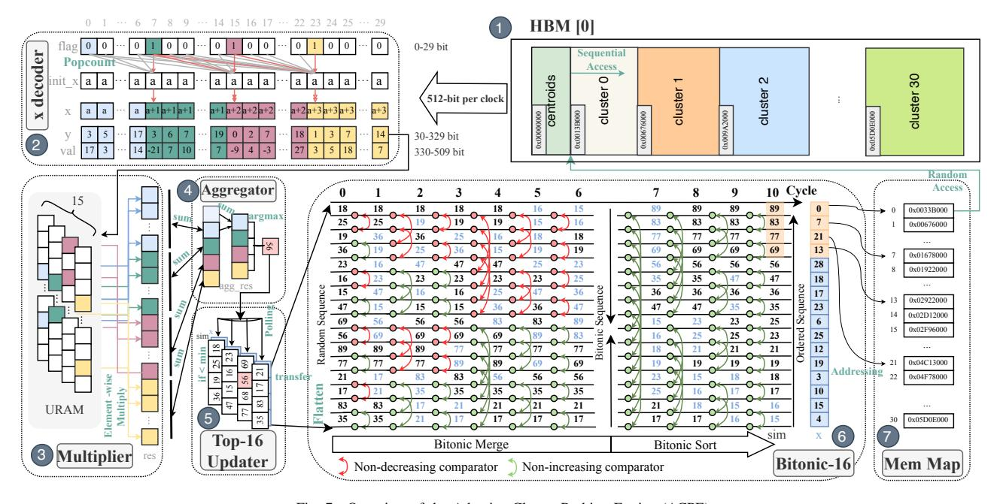

Fig. 7. Overview of the Adaptive Cluster Probing Engine (ACPE).

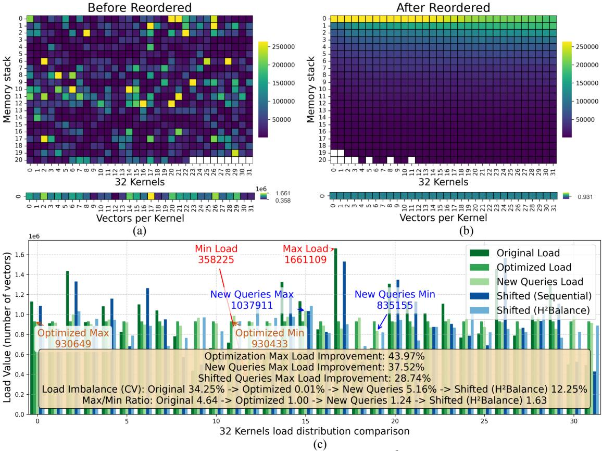

Fig. 8. Optimization analysis of computational load balancing on the Baidu dataset [35] using the H<sup>2</sup>Balance algorithm: (a) hotspot access pattern under static linear assignment by cluster index; (b) hotspot distribution after applying H<sup>2</sup>Balance; (c) comparison of per-core workload distributions across five scenarios, including static assignment, H<sup>2</sup>Balance, previously unseen queries, distribution-shifted queries under static assignment, and distribution-shifted queries under H<sup>2</sup>Balance, accompanied by relevant evaluation metrics.

#### C. Hierarchical Hotspot-Balancing (H<sup>2</sup>Balance)

Cluster accesses follow a power-law distribution, resulting in long-tail workloads across cores. Directly assigning clusters to ACPE cores based on their inherent IDs fails to account for query-dependent skew, leading to severe load imbalance.

We profile workload distribution on the Sp.Baidu dataset [35] ( $m=640,000,\,d=900,\,14\%$  nonzeros) over 100 queries. Cluster-based retrieval exhibits heavy-tailed access patterns, where a small subset of hot clusters dominates the overall query load. Consequently, static linear assignment produces substantial per-core imbalance (Fig. 8(a)). We quantify this imbalance using the coefficient of variation (CV):

$$CV_W = \frac{\sigma_W}{\mu_W} \times 100\% = \frac{\sqrt{\frac{1}{32} \sum_{i=1}^{32} (W_i - \mu_W)^2}}{\frac{1}{32} \sum_{i=1}^{32} W_i} \times 100\%$$
 (6)

with  $W_i$  the workload of core i. Static partitioning yields  ${\rm CV}_W{=}34.25\%$  and  $\kappa{=}W_{max}/W_{min}{=}4.64$ , confirming substantial bottlenecks.

To address this challenge, we propose the *Hierarchical Hotspot-Balancing* (H<sup>2</sup>Balance) algorithm, which orchestrates

three hierarchical stages:

Stage 1: Hotspot Profiling. We construct a cluster-level frequency model from 100 queries, forming a hotspot matrix  $H \in \mathbb{R}^{100 \times C}$ , where H[t,c] counts vector accesses of cluster c in query t. The cumulative access frequency per cluster is:

$$Q[c] = \sum_{t=1}^{100} H[t, c], \quad \forall c \in \{1, \dots, C\}$$
 (7)

producing a global priority permutation perm.

Stage 2: Hotspot Anchoring. The top-32 clusters are statically assigned to dedicated cores to evenly distribute dominant workloads.

Stage 3: Greedy Reconciliation. Remaining clusters are assigned greedily to the least-loaded core.

Combining static anchoring with dynamic reconciliation, H²Balance hierarchically balances workload, reducing intercore imbalance and boosting sparse retrieval throughput. Fig. 8(b) illustrates H²Balance confining workloads from [358,225,1,661,109] to [930,433,930,649], reducing CV from 34.25% to 0.01%, with  $\kappa \approx 1.0001$ . Fig. 8(c) illustrates how H²Balance generalizes to 100 new queries. The load

#### **Algorithm 2:** H<sup>2</sup>Balance

```
Input: Hotspot data matrix H \in \mathbb{R}^{100 \times C}, number of
            cores P
   Output: Cluster-to-core map M
1 Function PROFILE_BALANCE (H, P):
        C \leftarrow number of columns in H;
        Q \leftarrow \sum_{t=1}^{100} H[t,:];
3
4
        perm \leftarrow \operatorname{argsort\_desc}(Q);
5
        load[0..P-1] \leftarrow 0;
        M \leftarrow \{\};
6
        for i \leftarrow 0 to \min(31, C - 1) do
7
            // Hotspot Anchoring
            c \leftarrow perm[i]; M[c] \leftarrow i;
            load[i] \leftarrow load[i] + Q[c];
10
11
        for i \leftarrow 32 to C-1 do
             // Greedy Reconciliation
12
            c \leftarrow perm[i];
13
            p^* \leftarrow \arg\min_{p} \operatorname{load}[p];
14
            M[c] \leftarrow p^*;
15
            load[p^*] \leftarrow load[p^*] + Q[c];
16
        return M
17
```

distribution across 32 kernels becomes significantly more balanced: the CV drops from 34.25% to 5.16%,  $\kappa$  decreases from 4.64 to 1.24. This effective balancing under new query loads results in a 37.52% throughput gain at Recall@100 = 0.8, demonstrating H²Balance's strong adaptability across varying query sparsity patterns. To further stress robustness under distribution shifts, we introduce a controlled positive bias of 0.2 to the original query distribution prior to normalization, thereby simulating systematic drift. Even under these shifted workloads, H²Balance reduces CV from 36.27% to 12.25% and lowers the max/min ratio from 4.48 to 1.63, achieving a 28.74% reduction in peak load compared to sequential scheduling. These results indicate that while extreme workload drift may reduce optimality, H²Balance retains substantial balancing capability under dynamic query patterns.

#### VI. EVALUATION

#### A. Experiment Setting

We evaluate ParetoES against CPU, GPU, and FPGA baselines, assessing both approximation accuracy and computational performance. For CPU and GPU baselines, we utilize Faiss [16] (v1.7.2), a widely adopted ANNS library that supports configurable recall-throughput trade-offs via inverted indexing and adjustable *nprobe*. Faiss provides optimized and production-grade implementations on both CPU and GPU, enabling standardized and reproducible cross-platform comparison, whereas many research prototypes target specific ANNS configurations or lack comparable sparse embedding support [24], [43]. We additionally evaluate sparse\_dot\_topn [1], a CPU-based exhaustive sparse matrix multiplication library that

performs full-computation Top-K selection without approximation and thus serves as a golden-standard exact baseline. Our FPGA baseline extends state-of-the-art sparse vector retrieval architectures: FPGA32 [47] and AccelES [60].

The CPU baseline was evaluated on an Inspur NF5468M5 server with an Intel Xeon Gold 5117 processor (56 vCPUs at 2.00 GHz) and 256 GB of DDR4 memory. The GPU baseline runs on NVIDIA A100 and V100-SXM2 accelerators under CUDA 12.1. The A100 features 6,912 CUDA cores and 40 GB of HBM2 memory. The V100-SXM2 variant provides 5,120 CUDA cores and 32 GB of HBM2 memory. ParetoES and the FPGA baseline are implemented with Vitis HLS 2023.2 toolchain and deployed on an Xilinx Alveo U280 platform.

TABLE II

OVERVIEW OF THE DATASETS AND PREPROCESSING COST.

| Dataset                | Rows                                   | Cols       | Non-zeros                                    | Density        | Index<br>Time (s) | Other<br>Preproc. (s) | Total<br>Time (s) |
|------------------------|----------------------------------------|------------|----------------------------------------------|----------------|-------------------|-----------------------|-------------------|
| Sp.Baidu               | $6.4 \times 10^{5}$                    | 900        | $8.03 \times 10^{7}$                         | 14.02%         | 71                | 89                    | 160               |
| Sp.CC_zh               | $2 \times 10^{6}$                      | 900        | $3.82 \times 10^{7}$                         | 2.12%          | 92                | 73                    | 165               |
| Sp.GloVe               | $4 \times 10^{5}$                      | 500        | $2.77 \times 10^{7}$                         | 13.83%         | 37                | 49                    | 86                |
| Sp.Wiki News<br>Sp.10M | $1 \times 10^{6}$<br>$1 \times 10^{7}$ | 900<br>524 | $2.74 \times 10^{7}$<br>$3.99 \times 10^{7}$ | 3.04%<br>0.72% | 76<br>363         | 68<br>317             | 144<br>680        |

To comprehensively assess the performance and robustness of ParetoES across diverse scenarios, we evaluate on four public datasets with varying scales and sparsity levels, as shown in Table II. Following the sparse embedding procedure in [18], we sparsify Baidu [35], CC\_zh [22], GloVe [48], and Wiki News [42]. The resulting matrices span 0.4–2M rows, 500–900 dimensions, and 2.12%–14.02% density.

The preprocessing pipeline comprises index construction, quantization, ReSparse, and H<sup>2</sup>Balance, with index construction dominating runtime. Built on an NVIDIA A100 GPU, million-scale datasets require 37 to 92 s for index construction and at most 165 s total preprocessing, as shown in Table II. For scalability evaluation under extreme sparsity and scale, we synthesize Sp.10M, a 10M-row matrix with 0.72% density, which requires 363 s for index construction and 680 s total preprocessing.

#### B. Approximation Precision

We validate Spherical K-means++ with Refinement through extensive retrieval-efficiency evaluations. Given the architectural compatibility with any inverted-index-based retrieval paradigm, we further benchmark several alternative clustering strategies: the K-means-based Faiss baseline, Spectral Clustering, and Hierarchical Clustering. This generality facilitates dataset-specific algorithm selection during deployment, thereby demonstrating the inherent adaptability and scalability of our proposed architecture.

All clustering algorithms are executed on an NVIDIA A100 GPU. We employ a consistent initial cluster count, defined as  $nlist = \sqrt{m/2}$ , where m denotes the total number of sparse vectors. For Spherical, Hierarchical, and Spectral Clustering, we impose an iteration limit of 1000 and a convergence threshold of  $10^{-4}$ , measured by the maximum L2-norm of centroid displacement,  $\max \|\text{new centroids} - \text{centroids}\|_2$ .

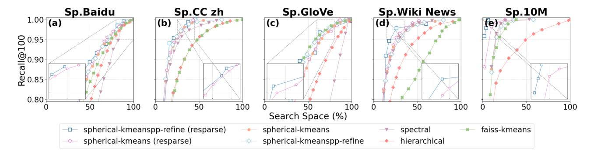

Fig. 9. Ablation analysis of clustering strategies: Recall@100 versus search space across datasets

Our benchmarking setup utilizes the Faiss library [16] (v1.7.2), specifically the IndexIVFFlat with innerproduct similarity (faiss.METRIC\_INNER\_PRODUCT) and faiss.IndexFlatIP as the quantizer.

Figure 9 plots Recall@100 versus the scanned vector fraction across datasets. Under constrained budgets, Spherical Kmeans matches or outperforms alternative clustering methods. With ReSparse, the refined variant achieves higher recall while scanning fewer vectors. The gain aligns with ReSparse's suppression of minor features that amplify salient semantic components. Comparing Spherical K-means + ReSparse with Spherical K-means Refine + ReSparse, the refinement step improves cluster compactness and centroid quality, which reduces inter-cluster ambiguity and redundant activations during selective probing. As a result, it achieves higher recall at the same probing depth.

Further ablation results, depicted in Fig. 10, demonstrate that the enhanced ReSparse achieves a 61.25% peak and 37.41% average pruning rate. This contrasts with the original ReSparse [60], which averages 23.93% but drops to 2.34% on the sparsest dataset (Sp.10M, density 0.72%). The enhanced version maintains 11.48% on Sp.10M, demonstrating superior robustness under extreme sparsity. Being a sparse-agnostic architecture, ParetoES directly benefits from increased sparsity. This reduction in non-zero elements lowers memory access and computational overhead, thereby improving overall

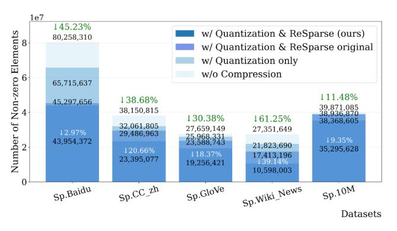

Fig. 10. Ablation study on non-zero elements w/o Quantization & ReSparse

retrieval performance. Compared to AccelES, the enhanced ReSparse further reduces nonzeros by up to 39.14%, with an average reduction of 18.09%.

TABLE III IMPACT OF 32×TOP-16 DECOMPOSITION ACROSS DATASETS

| Dataset / K  | 10    | 30    | 50    | 100   | 200   | 300   | 400   | 512   |
|--------------|-------|-------|-------|-------|-------|-------|-------|-------|
| Sp.Baidu     | 1.000 | 1.000 | 1.000 | 1.000 | 1.000 | 0.997 | 0.974 | 0.899 |
| Sp.CC Zh     | 1.000 | 1.000 | 1.000 | 1.000 | 1.000 | 0.996 | 0.972 | 0.900 |
| Sp.GloVe     | 1.000 | 1.000 | 1.000 | 1.000 | 1.000 | 0.998 | 0.975 | 0.900 |
| Sp.Wiki News | 1.000 | 1.000 | 1.000 | 1.000 | 1.000 | 0.997 | 0.975 | 0.902 |
| Sp.10M       | 1.000 | 1.000 | 1.000 | 1.000 | 1.000 | 0.997 | 0.974 | 0.903 |

Table III reports the average Recall@K achieved by the 32×Top-16 decomposition compared with exact global Top-K sorting for K ranging from 10 to 512 over identical candidate sets. For practical retrieval targets where K ≤ 200, Recall consistently remains at 100% across all five datasets. Minor deviations appear only when K exceeds 200, indicating that the decomposition primarily affects lower-ranked tail elements and introduces no impact on Recall@100 or Recall@10 retrieval. This experiment further confirms that under exhaustive probing, ParetoES reaches the theoretical upper bound of Recall@100 = 1.0.

#### *C. Overall Retrieval Performance*

To demonstrate the effectiveness of our hardware-software co-design, we conduct a series of retrieval performance experiments. Our evaluation rigorously benchmarks systems across two architectural paradigms: (1) selective-computation systems (ParetoES and Faiss [16]), which trade recall for throughput by dynamically adjusting the nprobe parameter, and (2) full-computation systems (AccelES [60] and FPGA32 [47]), whose fixed latency is decoupled from the target recall due to a lack of runtime adaptivity.

Using the Sp.Baidu dataset as a case study, Table IV demonstrates the performance superiority of ParetoES over alternative solutions across recall targets (Recall@100 ≈ 0.8, 0.9, 1.0). ParetoES consistently achieves the highest throughput, delivering speedups of up to 4.1×, 5.9×, and 104.4× over Faiss on A100, V100, and CPU platforms, re-

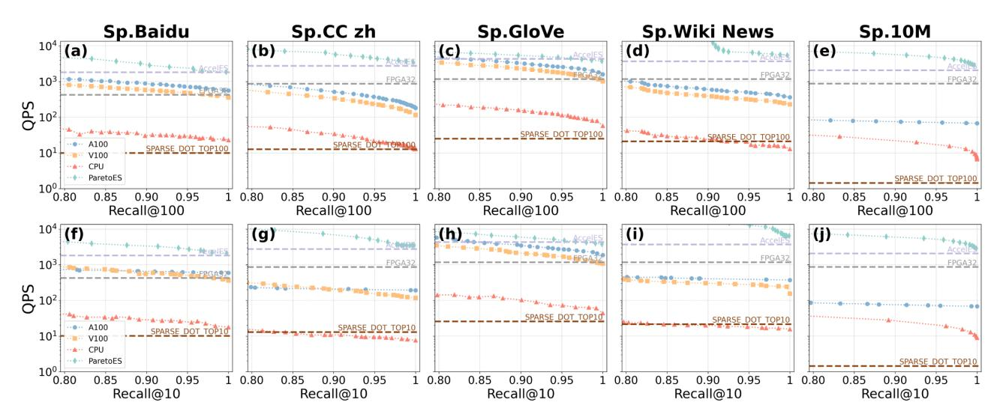

Fig. 11. QPS versus end-to-end recall performance across five datasets: (a)–(e) illustrate the trade-off curves between QPS and Recall@100, while (f)–(j) present the corresponding results for Recall@10.

spectively. These gains are driven by a hardware-software codesign. Algorithmically, the optimized Spherical Kmeans++ Refine clustering enables ParetoES to attain target recall levels by probing fewer clusters compared to the Kmeans-based approach used in Faiss, thereby reducing computational demands. Architecturally, ParetoES employs a sparse-agnostic dataflow architecture that avoids the irregular memory access and warp divergence of SIMD-based CPU/GPU implementations. Its non-zero-level pipeline, enhanced by on-chip URAM buffering and an in-place fused Top-K sort, maximizes throughput by leveraging fine-grained FPGA control.

TABLE IV
RETRIEVAL PERFORMANCE (QPS) ACROSS HARDWARE PLATFORMS AT
MATCHED RECALL LEVELS (SP.BAIDU)

| Hardware        | $\begin{array}{c} Recall@100 \\ \approx 0.8 \end{array}$ | $\begin{array}{c} Recall@100 \\ \approx 0.9 \end{array}$ | $\begin{array}{c} Recall@100\\ \approx 1.0 \end{array}$ |
|-----------------|----------------------------------------------------------|----------------------------------------------------------|---------------------------------------------------------|
| ParetoES        | 4761.9 (128/398)                                         | 2857.1 (224/398)                                         | 1851.9 (384/398)                                        |
| Faiss-A100 [16] | 1172.5 (180/400)                                         | 834.9 (240/400)                                          | 558.9 (400/400)                                         |
| Faiss-V100 [16] | 806.5 (180/400)                                          | 567.9 (240/400)                                          | 357.7 (400/400)                                         |
| Faiss-CPU [16]  | 45.6 (180/400)                                           | 30.3 (240/400)                                           | 22.9 (400/400)                                          |
| AccelES [60]    | 1818.2 (-/-)                                             | 1818.2 (-/-)                                             | 1818.2 (-/-)                                            |
| FPGA32 [47]     | 425.5 (-/-)                                              | 425.5 (-/-)                                              | 425.5 (-/-)                                             |

<sup>\*</sup> Each value shows QPS with the corresponding (nprobe/nlist) setting.

Compared to FPGA-based full-computation baselines (AccelES [60] and FPGA32 [47]), ParetoES treats selective computation as a first-class hardware primitive. By leveraging the ACPE kernel—which performs cluster-level selective computation using a Bitonic-16 micro-sorting unit—ParetoES dynamically skips redundant memory accesses and arithmetic operations. As shown in Table IV, when targeting Recall @100 levels of 0.8, 0.9, and 1.0, ParetoES eliminates 68%, 44%, and 4% of memory accesses and computation, respectively. This reduction in search space translates to  $2.6\times$ ,  $1.6\times$ , and  $1.02\times$  higher QPS compared to AccelES [60]. The speedup

over AccelES diminishes to  $1.02\times$  when  $Recall \approx 1.0$ , since the advantage of selective computation is largely offset by the additional  $\frac{384}{32} = 12$  random memory accesses required per query. Relative to FPGA32 [47], ParetoES achieves 11.2×,  $6.7\times$ , and  $4.4\times$  higher throughput when targeting Recall@100levels of 0.8, 0.9, and 1.0. Beyond cluster-level selective computation, these gains are further amplified by INT6 quantization, ReSparse pruning, and a compact CSR encoding, which collectively enhance memory bandwidth utilization and enable higher compute parallelism. Prior empirical studies indicate diminishing marginal revenue with respect to recall variations in production recommender systems [62]. Specifically, reducing recall from 92.5% to 85.5% leads to only a 1.2% decrease in Gross Merchandise Value (GMV), highlighting saturation effects in the high-recall regime. In contrast, user-perceived latency has been consistently shown to exert a substantial impact on business outcomes: large-scale industrial case studies report that a 1 s increase in response time may reduce revenue by 7–10% [10]. In our experiments, reducing recall within a comparable interval yields a 32.7% reduction in retrieval latency. This contrast suggests that moderate relaxation of recall constraints can achieve disproportionate system-level efficiency gains while incurring relatively limited downstream business impact.

As summarized in Figure 11, ParetoES's end-to-end throughput is evaluated against CPU, GPU, and FPGA platforms. ParetoES achieves  $1.54\times$  to  $79.34\times$  higher throughput than the NVIDIA A100 across five datasets, yielding a geometric mean speedup of  $14.77\times$ . Against the V100, ParetoES achieves  $2.09\times-34.55\times$  speedups across four datasets (Sp.10M excluded due to the V100's excessive memory requirements), yielding a geometric mean of  $12.92\times$ . The CPU baseline achieves even more substantial throughput speedups, ranging from  $28.95\times$  to  $540.73\times$  (geometric mean:  $225.51\times$ ).

These advantages are most evident on large and highly sparse datasets, where the fine-grained, nonzero-level pipeline alleviates compute bottlenecks. In addition to the Faiss-based CPU and GPU baselines, we evaluate sparse\_dot\_topn as an exact full-computation reference. As shown in Fig. 11, sparse\_dot\_topn does not outperform Faiss-CPU at 100% recall on most datasets and remains substantially slower than Faiss-GPU. This is expected, as it does not support selective computation or approximate search. Furthermore, ParetoES outperforms FPGA-based full-computation accelerators (AccelES [60] and FPGA32 [47]), evaluated by comparing the average QPS over Recall@100 = [0.8, 1.0], where it achieves 2.27× and 7.61× higher throughput, respectively. At Recall@100 ≈ 1.0, ParetoES achieves average speedups of 1.21× over AccelES and 3.89× over FPGA32 across five datasets.

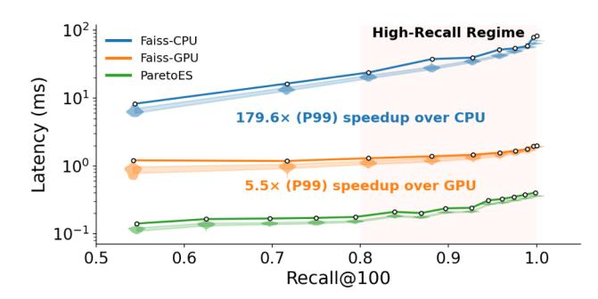

Fig. 12. Query latencies across recall levels of Sp.GloVe

We further evaluate throughput under Recall@10 constraints—commonly adopted in industrial retrieval settings. Unlike Faiss [16], whose Top-10 optimization incurs significant latency overhead relative to its Top-100 configuration. Under identical recall constraints, the QPS of ParetoES is higher at Recall@10 compared to Recall@100.

In practice, only 2 KB of Top-512 IDs are transferred per query. Even with PCIe transaction overhead, this incurs only microsecond-level latency, negligible compared to millisecond-level retrieval time.

Figure 12 reports latency distributions across recall levels on Sp.GloVe. The violin plots show per-query latency under different device configurations and Recall@100 targets. White markers denote P99 latency, and shaded regions represent the interquartile range from P25 to P75. ParetoES achieves lower latency across the IQR and at P99 at all recall levels. In the high-recall regime where Recall@100 ranges from 0.8 to 1.0, ParetoES achieves an average P99 speedup of 179.6× over Faiss-CPU and 5.5× over Faiss-GPU.

#### *D. Multi-optimization Ablation*

Due to space constraints, Figure 13 presents the ablation study on the Sp.CC zh dataset, which is representative of the overall trends observed across all datasets. All reported QPS results for ParetoES and Faiss [16] are averaged over the Recall@100 ∈ [0.8, 1.0] range. ParetoES-Kmeans

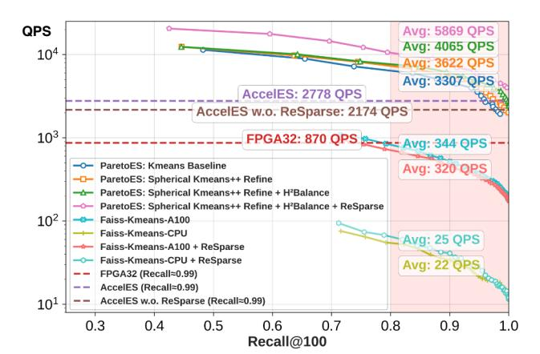

Fig. 13. Optimization stack analysis: measuring cumulative performance benefits on Sp.CC zh

achieves 3307 QPS, outperforming AccelES [60] (2778 QPS) by 19.1% through hardware-accelerated selective computation. Progressive optimizations yield cumulative gains: Spherical Kmeans++ Refine improves clustering quality, boosting QPS by 11.3% to 3622; H<sup>2</sup>Balance adds 15.9% to 4065 QPS via workload balancing; and ReSparse increases throughput by 64.9% to 5869 QPS by reducing non-zero elements. The fully-optimized ParetoES achieves 2.11× and 6.75× speedups over AccelES and FPGA32 [47], respectively. Even without ReSparse, ParetoES sustains 4065 QPS—1.87× faster than non-ReSparse AccelES—demonstrating significant throughput gains from both algorithmic and system-level optimizations.

To isolate ParetoES's architectural advantages, we conduct a fair comparison using identical K-means baselines across platforms. Under matched accuracy (Recall@100 ∈ [0.8, 1.0]), ParetoES delivers 7.9× and 194.5× higher QPS than A100 GPU and CPU, respectively. Applying ReSparse to Faiss yields a 14% CPU speedup but a 7% GPU slowdown, as conventional architectures lack sparse-agnostic support to translate pruning benefits (∼40% for Sp.CC zh) into proportional gains. Overall, ParetoES's substantial speedup stems from its nonzero-level parallelism and massively multi-core execution, effectively mitigating random-access bottlenecks in traditional architectures.

#### *E. ParetoES Resource Utilization & Power Consumption*

Table V compares ParetoES with prior FPGA implementations in terms of resource utilization and power consumption. ParetoES employs an INT6-based computation and transmission scheme consistent with AccelES-INT6 [60], enhancing data parallelism by 2.7× over FPGA32 [47] (from 11 to 30 elements). This increased parallelism requires additional URAMs to support single-cycle access to query vectors. Moreover, by exploiting modern DSPs' capability to perform three 6-bit multiplications per cycle, ParetoES consumes far fewer DSPs than FPGA32-style designs. We further optimize the Top-16 updater through a microarchitectural partition that divides it into four parallel Top-4 updaters coordinated by a roundrobin scheduler. This partitioning reduces critical path delay, achieving an operating frequency of 225 MHz for ParetoES.

TABLE V Comparison of Resource Utilization and Power Consumption on the Sp.Baidu Dataset under  $Recall@100 \approx 1.0$ 

| Metric                                | FP32 [47] | AccelES [60] | ParetoES<br>(ours) | Faiss [16]<br>CPU | Faiss [16]<br>A100 |
|---------------------------------------|-----------|--------------|--------------------|-------------------|--------------------|
| LUTs                                  | 46%       | 44%          | 54%                | -                 | -                  |
| FFs                                   | 39%       | 38%          | 37%                | -                 | -                  |
| DSPs                                  | 18%       | 13%          | 13%                | -                 | -                  |
| BRAMs                                 | 28%       | 17%          | 34%                | -                 | -                  |
| URAMs                                 | 46%       | 63%          | 63%                | -                 | -                  |
| Frequency (MHz)                       | 203       | 210          | 225                | 2000              | 1410               |
| Throughput (GOPS)                     | 34.1      | 83.3         | 81.5               | 4.6               | 44.8               |
| Power (w)                             | 54        | 55           | 59                 | 250               | 250                |
| Power Efficiency (GOPS/W)             | 0.63      | 1.51         | 1.38               | 0.02              | 0.18               |
| Bandwidth (GB/s)                      | 460       | 460          | 460                | 230.4             | 1555               |
| Bandwidth Efficiency<br>(GOPS/(GB/s)) | 0.07      | 0.18         | 0.18               | 0.02              | 0.03               |
| Cost (\$)                             |           | \$8,575      |                    | \$8,428           | \$12,000           |
| Cost Efficiency (MOPS/\$)             | 3.98      | 9.71         | 9.51               | 0.55              | 3.73               |

Although the Bitonic-16 sorting network increases LUT/BRAM usage and slightly raises power to 59W, ParetoES still delivers 1.38 GOPS/W, achieving  $7.7\times$  the energy efficiency of A100 and  $69\times$  that of Faiss-CPU. Its 0.18 GOPS/(GB/s) bandwidth efficiency also surpasses FPGA32 by  $2.6\times$  and CPU/GPU by  $6-9\times$ , confirming that ParetoES is fundamentally more compute-per-byte efficient under identical memory bandwidth constraints.

We further examine the cost efficiency. ParetoES achieves 9.51 MOPS/\$, comparable to AccelES and substantially higher than Faiss-CPU and A100. Despite slightly lower peak cost efficiency than AccelES, ParetoES reduces total computation through selective search, resulting in lower effective energy consumption while maintaining competitive cost characteristics.

#### F. TCO Analysis: Effective Cost per Query

To evaluate long-term deployment cost, we analyze *Total Cost of Ownership* (TCO) by incorporating both *Capital Expenditure* (CapEx) and *Operational Energy Cost* (OpEx). For a system s operating at recall level r, we define

$$TCO^{(s)}(r) = C_{\text{hw}}^{(s)} + \left(\frac{P^{(s)}}{1000}\right) \cdot H(L, u) \cdot \text{PUE} \cdot c_e \qquad (8)$$

where  $C_{\rm hw}$  is hardware cost, P is average power (W),  $H(L,u)=24\cdot 365\cdot L\cdot u$  is total operating hours over lifetime L with utilization u, PUE is the datacenter power usage effectiveness, and  $c_e$  is electricity price (USD/kWh).

We normalize TCO to a per-query metric:

$$\kappa^{(s)}(r) = \frac{\text{TCO}^{(s)}(r)}{Q^{(s)}(r) \cdot 3600H(L, u)}$$
(9)

where  $Q^{(s)}(r)=1/t^{(s)}(r)$  is throughput derived from measured latency  $t^{(s)}(r)$ .

Unless otherwise stated, we assume: L=3 years, u=1, PUE = 1.2,  $c_e=0.12$  USD/kWh, and FPGA hardware cost \$8,575.

TABLE VI EFFECTIVE TCO PER QUERY (USD  $\times 10^{-6})$  on CC\_zh.

| System   | Recall@100↑   | Latency (ms)↓ | Energy (mJ)↓ | $\kappa(r){\downarrow}$ |
|----------|---------------|---------------|--------------|-------------------------|
| AccelES  | $\approx 1.0$ | 0.36          | 19.8         | 0.42                    |
|          | 0.8401        | 0.142         | 8.38         | 0.17                    |
|          | 0.8899        | 0.154         | 9.09         | 0.19                    |
|          | 0.8899        | 0.134         | 10.27        | 0.19                    |
| ParetoES | 0.9357        | 0.202         | 11.92        | 0.24                    |
|          | 0.9532        | 0.228         | 13.45        | 0.27                    |
|          | 0.9790        | 0.255         | 15.05        | 0.30                    |
|          | 0.9970        | 0.284         | 16.76        | 0.33                    |

Table VI reports effective cost per query under different recall levels on CC\_zh. While AccelES operates at fixed full computation latency (0.36 ms), ParetoES exhibits a monotonic decrease in effective cost per query as recall is relaxed, owing to its selective computation mechanism. At moderate recall levels (e.g., Recall@100  $\approx$  0.84–0.90), ParetoES reduces effective TCO per query by 50%–60% compared to AccelES. Even at high recall (0.9532), the reduction remains 36%, and near full recall (0.9970) ParetoES still achieves a 21% lower effective TCO. These results demonstrate that selective search translates directly into lifetime cost reduction across a wide operating region rather than only at extreme recall settings.

#### VII. CONCLUSION

This work presents ParetoES, a hardware-accelerated retrieval system that redefines the efficiency frontier of sparse embedding similarity search. Instead of adhering to the conventional full-computation paradigm, ParetoES adopts a selective computation strategy grounded in Pareto optimality, demonstrating that high recall and semantic coverage can be achieved without exhaustive memory access or computation.

At the algorithm level, ParetoES integrates Spherical K-means++ Refine, which aligns clustering with sparse vector geometry by combining cosine-based initialization, 6-bit quantization, and enhanced unstructured pruning (ReSparse) to aggressively reduce the search space. At the architecture level, the Adaptive Cluster Probing Engine enables high-throughput, sparsity-optimized retrieval via distributed micro-sorting, centroid–cluster co-placement, and runtime-configurable probing, improving locality and resource utilization. At the system level, H<sup>2</sup>Balance profiles real-world query distributions to dynamically balance workload across cores and alleviate straggler-induced bottlenecks.

Extensive evaluations across five datasets confirm the practical advantages of ParetoES: at Recall@100  $\geq$  0.8, it achieves up to 540× higher QPS than CPUs and 79× over GPUs.

#### VIII. ACKNOWLEDGEMENTS

We thank all anonymous reviewers for their insightful comments and valuable feedback. This work was supported by the National Key Research and Development Program of China under Grant No. 2024YFB4505202, the NSFC-RGC under Grant No. 62461160333, and the NSFC under Grant No. 62572207.

#### REFERENCES

- [1] ing-bank/sparse dot topn: Python package to accelerate the sparse matrix multiplication and top-n similarity selection. [Online]. Available: https://github.com/ing-bank/sparse dot topn
- [2] D. Arthur and S. Vassilvitskii, "k-means++: The advantages of careful seeding," Stanford, Tech. Rep., 2006.
- [3] B. F. Azevedo, A. M. A. Rocha, and A. I. Pereira, "A split and merge strategy for multi-objective clustering algorithms," *SN Computer Science*, vol. 6, no. 6, p. 711, 2025.
- [4] Y. Bai, X. Li, G. Wang, C. Zhang, L. Shang, J. Xu, Z. Wang, F. Wang, and Q. Liu, "Sparterm: Learning term-based sparse representation for fast text retrieval," *arXiv preprint arXiv:2010.00768*, 2020.
- [5] H. Bian, J. Huang, R. Dong, L. Liu, and X. Wang, "Csr2: a new format for simd-accelerated spmv," in *Proceedings of the 20th IEEE/ACM International Symposium on Cluster, Cloud and Internet Computing (CCGRID)*. IEEE, 2020, pp. 350–359.
- [6] J. M. Buchanan, "The relevance of pareto optimality," *Journal of Conflict Resolution (JCR)*, vol. 6, no. 4, pp. 341–354, 1962.
- [7] J. Chen, T. Hoefler, and D. Alistarh, "The geometry of llm quantization: Gptq as babai's nearest plane algorithm," *arXiv preprint arXiv:2507.18553*, 2025.
- [8] R. Chen, S. Siriyal, and V. Prasanna, "Energy and memory efficient mapping of bitonic sorting on fpga," in *Proceedings of the 2015 ACM/SIGDA International Symposium on Field-Programmable Gate Arrays*, 2015, pp. 240–249.
- [9] Y.-S. Chuang, "Information retrieval with dense and sparse representations," Master's thesis, Massachusetts Institute of Technology, 2024.
- [10] E. Commerce, "Latency and revenue impact research: Evidencebased analysis of performance on business outcomes," https:// edmondscommerce.co.uk/research/performance/latency-revenue/, 2025, industry synthesis of latency–revenue relationships from Amazon, Google, Akamai, Walmart.
- [11] P. Covington, J. Adams, and E. Sargin, "Deep neural networks for youtube recommendations," in *Proceedings of the 10th ACM conference on Recommender Systems*, 2016, pp. 191–198.
- [12] M. Datar, N. Immorlica, P. Indyk, and V. S. Mirrokni, "Locality-sensitive hashing scheme based on p-stable distributions," in *Proceedings of the Twentieth Annual Symposium on Computational Geometry (SCG)*, 2004, pp. 253–262.
- [13] Z. Deng, J. Park, P. T. P. Tang, H. Liu, J. Yang, H. Yuen, J. Huang, D. Khudia, X. Wei, E. Wen, D. Choudhary, R. Krishnamoorthi, C.-J. Wu, S. Nadathur, C. Kim, M. Naumov, S. Naghshineh, and M. Smelyanskiy, "Low-precision hardware architectures meet recommendation model inference at scale," *IEEE Micro*, vol. 41, no. 5, pp. 93–100, 2021.
- [14] J. Devlin, M.-W. Chang, K. Lee, and K. Toutanova, "Bert: Pre-training of deep bidirectional transformers for language understanding," in *Proceedings of the 2019 Conference of the North American Chapter of the Association for Computational Linguistics: Human Language Technologies, Volume 1 (Long and Short Papers)*, 2019, pp. 4171–4186.
- [15] I. S. Dhillon, Y. Guan, and J. Kogan, "Iterative clustering of high dimensional text data augmented by local search," in *Proceedings of the 2nd IEEE International Conference on Data Mining*. IEEE, 2002, pp. 131–138.
- [16] M. Douze, A. Guzhva, C. Deng, J. Johnson, G. Szilvasy, P.-E. Mazare,´ M. Lomeli, L. Hosseini, and H. Jegou, "The faiss library," ´ *arXiv preprint arXiv:2401.08281*, 2024.
- [17] R. Dunford, Q. Su, E. Tamang, and A. Wintour, "The pareto principle," *The Plymouth Student Scientist*, vol. 7, no. 1, pp. 140–148, 2014.
- [18] M. Faruqui, Y. Tsvetkov, D. Yogatama, C. Dyer, and N. A. Smith, "Sparse overcomplete word vector representations," in *Proceedings of the 53rd Annual Meeting of the Association for Computational Linguistics and the 7th International Joint Conference on Natural Language Processing (Volume 1: Long Papers)*, 2015, pp. 1491–1500.
- [19] T. Formal, C. Lassance, B. Piwowarski, and S. Clinchant, "Splade v2: Sparse lexical and expansion model for information retrieval," *arXiv preprint arXiv:2109.10086*, 2021.
- [20] T. Formal, C. Lassance, B. Piwowarski, and S. Clinchant, "Towards effective and efficient sparse neural information retrieval," *ACM Transactions on Information Systems (TOIS)*, vol. 42, no. 5, pp. 1–46, 2024.
- [21] T. Formal, B. Piwowarski, and S. Clinchant, "Splade: Sparse lexical and expansion model for first stage ranking," in *Proceedings of the 44th International ACM SIGIR Conference on Research and Development in Information Retrieval (SIGIR)*, 2021, pp. 2288–2292.

- [22] E. Grave, P. Bojanowski, P. Gupta, A. Joulin, and T. Mikolov, "Learning word vectors for 157 languages," in *Proceedings of the International Conference on Language Resources and Evaluation (LREC 2018)*, 2018.
- [23] R. Guo, P. Sun, E. Lindgren, Q. Geng, D. Simcha, F. Chern, and S. Kumar, "Accelerating large-scale inference with anisotropic vector quantization," in *Proceedings of International Conference on Machine Learning*. PMLR, 2020, pp. 3887–3896.
- [24] S. Hassantabar, Z. Wang, and N. K. Jha, "Scann: Synthesis of compact and accurate neural networks," *IEEE Transactions on Computer-Aided Design of Integrated Circuits and Systems*, vol. 41, no. 9, pp. 3012–3025, 2021.
- [25] K. Hornik, I. Feinerer, M. Kober, and C. Buchta, "Spherical k-means clustering," *Journal of statistical software*, vol. 50, pp. 1–22, 2012.
- [26] J.-T. Huang, A. Sharma, S. Sun, L. Xia, D. Zhang, P. Pronin, J. Padmanabhan, G. Ottaviano, and L. Yang, "Embedding-based retrieval in facebook search," in *Proceedings of the 26th ACM SIGKDD International Conference on Knowledge Discovery & Data Mining (KDD)*, 2020, pp. 2553–2561.
- [27] J. Huang, J. Chen, J. Lin, J. Qin, Z. Feng, W. Zhang, and Y. Yu, "A comprehensive survey on retrieval methods in recommender systems," *arXiv preprint arXiv:2407.21022*, 2024.
- [28] Y. Huang, X. Han, and M. Sun, "Fastfid: Improve inference efficiency of open domain question answering via sentence selection," *arXiv preprint arXiv:2408.06333*, 2024.
- [29] G. Izacard and E. Grave, "Leveraging passage retrieval with generative models for open domain question answering," in *Proceedings of the 16th conference of the European Chapter of the Association for Computational Linguistics: main volume*, 2021, pp. 874–880.
- [30] H. Jegou, M. Douze, and C. Schmid, "Product quantization for nearest neighbor search," *IEEE Transactions on Pattern Analysis and Machine Intelligence (TPAMI)*, vol. 33, no. 1, pp. 117–128, 2010.
- [31] J. Johnson, M. Douze, and H. Jegou, "Billion-scale similarity search ´ with GPUs," *IEEE Transactions on Big Data (TBD)*, vol. 7, no. 3, pp. 535–547, 2019.
- [32] J. Kaplan, S. McCandlish, T. Henighan, T. B. Brown, B. Chess, R. Child, S. Gray, A. Radford, J. Wu, and D. Amodei, "Scaling laws for neural language models," *arXiv preprint arXiv:2001.08361*, 2020.
- [33] V. Karpukhin, B. Oguz, S. Min, P. Lewis, L. Wu, S. Edunov, D. Chen, and W.-t. Yih, "Dense passage retrieval for open-domain question answering," in *Proceedings of the 2020 conference on Empirical Methods in Natural Language Processing (EMNLP)*, 2020, pp. 6769–6781.
- [34] P. Lewis, E. Perez, A. Piktus, F. Petroni, V. Karpukhin, N. Goyal, H. Kuttler, M. Lewis, W.-t. Yih, T. Rockt ¨ aschel ¨ *et al.*, "Retrievalaugmented generation for knowledge-intensive nlp tasks," *Advances in Neural Information Processing Systems (NeurIPS)*, vol. 33, pp. 9459– 9474, 2020.
- [35] S. Li, Z. Zhao, R. Hu, W. Li, T. Liu, and X. Du, "Analogical reasoning on chinese morphological and semantic relations," in *Proceedings of the 56th Annual Meeting of the Association for Computational Linguistics (Volume 2: Short Papers)*. Association for Computational Linguistics, 2018, pp. 138–143. [Online]. Available: http://aclweb.org/anthology/P18-2023
- [36] W. Lin, J. Chen, J. Mei, A. Coca, and B. Byrne, "Fine-grained lateinteraction multi-modal retrieval for retrieval augmented visual question answering," *Advances in Neural Information Processing Systems*, vol. 36, pp. 22 820–22 840, 2023.
- [37] W. Liu and B. Vinter, "Csr5: An efficient storage format for crossplatform sparse matrix-vector multiplication," in *Proceedings of the 29th ACM on International Conference on Supercomputing (ICS)*, 2015, pp. 339–350.
- [38] E. Lughofer, "A dynamic split-and-merge approach for evolving cluster models," *Evolving Systems*, vol. 3, no. 3, pp. 135–151, 2012.
- [39] X. Ma, S.-C. Lin, M. Li, W. Chen, and J. Lin, "Unifying multimodal retrieval via document screenshot embedding," in *Proceedings of the 2024 Conference on Empirical Methods in Natural Language Processing (EMNLP)*, 2024, pp. 6492–6505.
- [40] Y. A. Malkov and D. A. Yashunin, "Efficient and robust approximate nearest neighbor search using hierarchical navigable small world graphs," *IEEE Transactions on Pattern Analysis and Machine Intelligence (TPAMI)*, vol. 42, no. 4, pp. 824–836, 2018.
- [41] J. B. McQueen, "Some methods of classification and analysis of multivariate observations," in *Proc. of 5th Berkeley Symposium on Math. Stat. and Prob.*, 1967, pp. 281–297.

- [42] T. Mikolov, E. Grave, P. Bojanowski, C. Puhrsch, and A. Joulin, "Advances in pre-training distributed word representations," in *Proceedings of the International Conference on Language Resources and Evaluation (LREC 2018)*, 2018.
- [43] J. Mohoney, D. Sarda, M. Tang, S. R. Chowdhury, A. Pacaci, I. F. Ilyas, T. Rekatsinas, and S. Venkataraman, "Quake: Adaptive indexing for vector search," in *Proceedings of the 19th USENIX Symposium on Operating Systems Design and Implementation (OSDI 25)*, 2025, pp. 153–169.
- [44] M. Muhr and M. Granitzer, "Automatic cluster number selection using a split and merge k-means approach," in *Proceedings of the 20th International Workshop on Database and Expert Systems Application*. IEEE, 2009, pp. 363–367.
- [45] M. Naumov, L. Chien, P. Vandermersch, and U. Kapasi, "Cusparse library," in *GPU Technology Conference*, 2010.
- [46] NVIDIA Corporation. (2023) Thrust: Cuda c++ template library. Version 12.2. [Online]. Available: https://docs.nvidia.com/cuda/thrust/
- [47] A. Parravicini, L. G. Cellamare, M. Siracusa, and M. D. Santambrogio, "Scaling up hbm efficiency of top-k spmv for approximate embedding similarity on fpgas," in *Proceedings of the 58th ACM/IEEE Design Automation Conference (DAC)*. IEEE, 2021, pp. 799–804.
- [48] J. Pennington, R. Socher, and C. D. Manning, "Glove: Global vectors for word representation," in *Empirical Methods in Natural Language Processing (EMNLP)*, 2014, pp. 1532–1543. [Online]. Available: http://www.aclweb.org/anthology/D14-1162
- [49] R. Pratap, A. Deshmukh, P. Nair, and T. Dutt, "A faster sampling algorithm for spherical k-means," in *Proceedings of Asian Conference on Machine Learning*. PMLR, 2018, pp. 343–358.
- [50] S. Rajput, N. Mehta, A. Singh, R. Hulikal Keshavan, T. Vu, L. Heldt, L. Hong, Y. Tay, V. Tran, J. Samost *et al.*, "Recommender systems with generative retrieval," *Advances in Neural Information Processing Systems*, vol. 36, pp. 10 299–10 315, 2023.
- [51] S. Rendle, W. Krichene, L. Zhang, and J. Anderson, "Neural collaborative filtering vs. matrix factorization revisited," in *Proceedings of the 14th ACM Conference on Recommender Systems (RecSys)*, 2020, pp. 240–248.
- [52] V. Sanh, L. Debut, J. Chaumond, and T. Wolf, "Distilbert, a distilled version of bert: smaller, faster, cheaper and lighter," *arXiv preprint arXiv:1910.01108*, 2019.
- [53] K. Santhanam, J. Saad-Falcon, M. Franz, O. Khattab, A. Sil, R. Florian, M. A. Sultan, S. Roukos, M. Zaharia, and C. Potts, "Moving beyond downstream task accuracy for information retrieval benchmarking," *arXiv preprint arXiv:2212.01340*, 2022.
- [54] V. Sze, Y.-H. Chen, T.-J. Yang, and J. S. Emer, *Efficient processing of deep neural networks*. Springer, 2020.
- [55] E. Wang, Q. Zhang, B. Shen, G. Zhang, X. Lu, Q. Wu, and Y. Wang, "Intel math kernel library," in *High-Performance Computing on the Intel® Xeon Phi™: How to Fully Exploit MIC Architectures*. Springer, 2014, pp. 167–188.
- [56] T. Xia, G. Fu, C. Li, Z. Luo, L. Zhang, R. Chen, W. Zhao, N. Zheng, and P. Ren, "A comprehensive performance model of sparse matrixvector multiplication to guide kernel optimization," *IEEE Transactions on Parallel and Distributed Systems*, vol. 34, no. 2, pp. 519–534, 2022.
- [57] L. Xiong, C. Xiong, Y. Li, K.-F. Tang, J. Liu, P. Bennett, J. Ahmed, and A. Overwijk, "Approximate nearest neighbor negative contrastive learning for dense text retrieval," *arXiv preprint arXiv:2007.00808*, 2020.
- [58] D. Yu, C. Zhu, Y. Fang, W. Yu, S. Wang, Y. Xu, X. Ren, Y. Yang, and M. Zeng, "Kg-fid: Infusing knowledge graph in fusion-in-decoder for open-domain question answering," *arXiv preprint arXiv:2110.04330*, 2021.
- [59] H. Zamani, M. Dehghani, W. B. Croft, E. Learned-Miller, and J. Kamps, "From neural re-ranking to neural ranking: Learning a sparse representation for inverted indexing," in *Proceedings of the 27th ACM International Conference on Information and Knowledge Management (CIKM)*, 2018, pp. 497–506.
- [60] J. Zhai, X. Shi, K. Huang, C. Ye, W. Hu, B. He, and H. Jin, "Acceles: Accelerating top-k spmv for embedding similarity via low-bit pruning," in *Proceedings of the 31st IEEE International Symposium on High-Performance Computer Architecture (HPCA)*. IEEE, 2025, pp. 977– 990.
- [61] F. Zhang, W. Liu, N. Feng, J. Zhai, and X. Du, "Performance evaluation and analysis of sparse matrix and graph kernels on heterogeneous

- processors," *CCF Transactions on High Performance Computing*, vol. 1, pp. 131–143, 2019.
- [62] Z. Zhang, Y. Huang, D. Ou, S. Li, L. Li, Q. Liu, and X. Zeng, "Rethinking the role of pre-ranking in large-scale e-commerce searching system," *arXiv preprint arXiv:2305.13647*, 2023.
- [63] R. Zhao, Y. Hu, J. Dotzel, C. De Sa, and Z. Zhang, "Improving neural network quantization without retraining using outlier channel splitting," in *Proceedings of the International Conference on Machine Learning*. PMLR, 2019, pp. 7543–7552.
- [64] S. Zhao, Y. Huang, J. Song, Z. Wang, C. Wan, and L. Ma, "Towards understanding retrieval accuracy and prompt quality in rag systems," *arXiv preprint arXiv:2411.19463*, 2024.