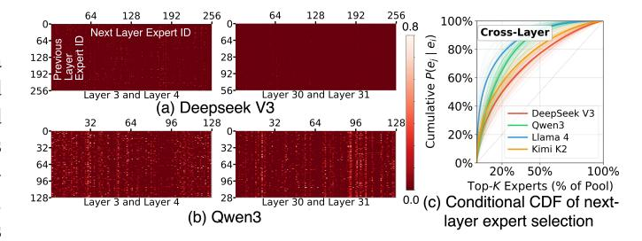

# A. Categorization Methodology

As in Figure 3, we categorize MoE expert selection profiling results into two categories: *temporal* and *spatial* relations.

Figure 4. Cross-layer expert correlation. (a, b) Joint co-activation heatmaps between layers N and N+1 in DeepSeek-V3 and Qwen3. (c) Conditional CDF  $P(e_i \mid e_i)$  for each layer's top-1 expert.

**Temporal relations** capture time-dependent expert selection patterns where current choices inform future selections. These patterns enable *single-unit strategies* that optimize data movement for individual units through prefetching, caching, and data migration. For example, in multi-chiplet GPU systems, caching experts in local DRAM after remote fetches significantly reduces inter-unit communication. To exploit temporal predictability, we analyze expert selection at multiple time scales shown in Figure 3(a): *layer-level*, *token-level*, and *prefill-decode-level* patterns.

**Spatial relations** capture how expert activations are distributed across compute units within a given time window. This distributional information enables *multi-unit strategies* that optimize expert placement and workload balancing across the system, reducing data movement and preventing bottlenecks. We classify spatial relations into *single-expert activation imbalance* and *expert-pair co-activation affinity* as shown in Figure 3(b), and investigate how task types influence these patterns to inform system-level optimization.

#### B. Temporal Relations

As shown in Figure 3(a), we classify the temporal relations of expert selection into three categories, arranged in order of increasing time scale. At the layer level, we examine the relationship between two adjacent model layers. At the token level, we focus on the same model layer across two adjacent tokens. At the stage level, we analyze the relationship between the prefill stage and the decode stage.

