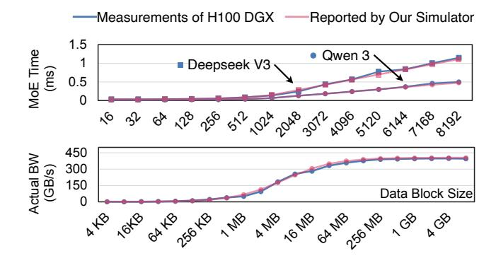
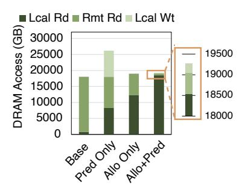
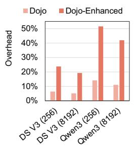

# A. Experiment Setup

**Methodology:** We conduct experiments using event-driven simulation on a validated simulator. Expert selection traces are collected by deploying SGLang [51] on an 8×H100 DGX server and an 8×H200 AWS instance.

We developed a custom multi-chiplet GPU simulator in Python, as existing tools are inadequate for our needs. Cycle-accurate simulators such as Gem5 [52], gpgpusim [53], and mgpusim [54] accurately model single GPUs but are prohibitively slow for large-scale systems with 20+ dies and batch sizes exceeding 15,000. Event-driven simulators such as ASTRA-sim [55] support multi-GPU systems but lack detailed microarchitecture modeling and do not support the single-GPU-like programming model we adopt. Our simulator models all key multi-chiplet GPU components, including LLC, HBM, compute units, and D2D links across all dies, with a central resource manager that captures contention and congestion. We validated the simulator against real measurements from an 8×H100 DGX server, as detailed in subsection V-B.

**Metric:** We measure the throughput of MoE layers during the decode stage as modern LLM serving systems show a trend toward fine-granularity disaggregation. Traditional LLMs benefit from separating prefill and decode stages across different machines, as demonstrated by DistServe [56] and subsequent works [57], [58]. For MoE models, this disaggregation extends further. MegaScale-Infer [15] separates attention and MoE operations onto different machines for optimal batch sizes. Following this trend, we focus on optimizing MoE operations during the decode stage.

Figure 12. Throughput of MoE layers (Top) and hop number reduction ratio (Bottom). All figures are scaled to baseline.

Table I HARDWARE CONFIGURATIONS

|               | X-die | Y-die                                                                                                                                                                                                                             | DRAM BW | D2D BW | DRAM  | Cmpt Power per Die (FP16) |  |  |  |  |  |
|---------------|-------|-----------------------------------------------------------------------------------------------------------------------------------------------------------------------------------------------------------------------------------|------------|-----------|-------|------------------------------|--|--|--|--|--|
| Dojo          | 5     | 5                                                                                                                                                                                                                                 | 3.35 TB/s  | 1.7 TB/s  | 80GB  | 989 TFLOPS                   |  |  |  |  |  |
| TSMC-SoW      | 3     | 8                                                                                                                                                                                                                                 | 3.35 TB/s  | 1.7 TB/s  | 80GB  | 989 TFLOPS                   |  |  |  |  |  |
| Dojo-Enhanced | 5     | 5                                                                                                                                                                                                                                 | 8 TB/s     | 2 TB/s    | 180GB | 4500 TFLOPS                  |  |  |  |  |  |
| Other Params  | C     | LLC hit latency: 100ns, LLC miss penalty: 110ns, LLC write latency: 30ns, LLC size: 64 MB D2D link latency: 200ns, Routing Alg: XY routing, Command and address size for each remote request: 16B Loca HBM access latency: 300 ns |            |           |       |                              |  |  |  |  |  |

**Hardware Configuration:** We evaluate two multi-chiplet topologies: Tesla Dojo [59], [60] and the TSMC SoW roadmap [61]. As summarized in Table I, Dojo uses a  $5\times5$  2D mesh, while TSMC SoW adopts an  $8\times3$  2D mesh. These choices reflect a deployed system (Dojo) and near-future industry support (TSMC SoW).

For both the Dojo and TSMC SoW configurations, each chiplet is H100-like, providing 1,000 TFLOPS FP16 compute, 80GB HBM, 3.35TB/s local HBM bandwidth, and 1.7 TB/s inter-die bandwidth to adjacent chiplets. We also include an extended experiment in subsection V-F with a Dojo-Enhanced configuration, where each die is B300-like to reflect an anticipated hardware performance trend in the future. We reserve 10% of DRAM for system and hardware management.

**Baseline Configurations:** We compare our approach against the simple strategy currently used by GPU.

The **Base** configuration adopts an EP-like data placement and assigns an equal number of experts to each die. However, the entire wafer operates as a single large GPU: each die handles the same amount of expert computation without considering expert placement.

**EP** assigns each expert's computation to the die where it resides, as also adopted by MoEntwine [45]. This eliminates all D2D communication but can cause severe workload imbalance. Note that even under EP, our Global CP and Local CP architecture remains necessary, as expert placement information is still required.

We implement three variants: **Allo Only** uses solely our task allocation strategy; **Pred Only** includes only the data-driven predictor; and **Allo+Pred** combines both techniques. These configurations evaluate the individual and combined effects of our proposed methods.

Models and Workloads: We conduct evaluations with real traces collected from Qwen3 and Deepseek V3. The traces are gathered from diverse datasets, including MMLU [35], MMLU Pro [36], ChineseSimpleQA [62], and LiveCodeBench [63], comprising over 24,000 requests per model. Each test batch is filled by sequentially adding requests in the order of MMLU, MMLU-Pro (CH), ChineseSimpleQA, and LiveCodeBench until the target batch size is reached.

#### B. Validation of Simulator

We validate our simulator using real measurements from an 8×H100 DGX server. We evaluate both single-GPU execution and two-GPU peer-to-peer (P2P) communication.

For single-GPU execution, we benchmark one expert in a MoE layer, which consists of three GEMM operations, across varying batch sizes for both DeepSeek and Qwen.

For P2P communication, we measure data migration between two GPUs over payload sizes ranging from 4 KB to 4 GB. To ensure simulation fidelity, we calibrate key parameters to fit the measured data. As shown in Figure 13, the simulator's error remains within 5% for all test cases.

Figure 13. Simulator validation with real data generated from 8xH100 DGX, including both MoE Layer (Top) and P2P data transfer (Bottom) test cases.

## C. Throughput

We evaluate MoE decode stage throughput in Figure 12, with results normalized to the baseline configuration.

**Comparison across models:** Our Allo+Pred strategy achieves  $7.0 \times$ ,  $8.2 \times$ ,  $7.3 \times$ , and  $4.1 \times$  throughput improvement on Deepseek, Kimi, Llama, and Qwen, respectively. Deepseek and Kimi benefit more due to their larger expert count (256 vs. 128) and more complex selection patterns.

Comparison across chiplet architectures: Our strategy shows  $6.0\times$  improvement on Dojo and  $7.5\times$  on TSMC, despite similar die counts (25 vs. 24). TSMC's rectangular layout places dies farther apart, introducing more inter-unit communication without strategic task allocation, hence the larger gain under our strategy.

**Comparison with EP:** At small batch sizes such as 4096, our strategy and EP perform similarly: few tokens per expert make execution memory-bound, so splitting one expert across multiple dies offers no benefit, and our strategy degenerates to EP. The advantage emerges at larger batches, achieving 1.44× speedup over EP at batch size 16,384.

#### D. Hop Reduction

We report hop counts in Figure 12 to show the reduction in inter-unit communication. Hop count is the sum of Manhattan distances for all cross-unit communications. Higher hop counts indicate frequent cross-die data movement. We normalize results to baseline and report hop reduction ratios, where a ratio of 10 means the hop count is reduced to 1/10.

**Pred Only** reduces hop counts by  $4.5\times$ , aligning with performance improvement of  $3.0\times$ . This indicates cross-unit communication is the primary bottleneck in baseline, and reducing hop counts proportionally improves performance.

Allo Only reduces hop counts by  $142\times$ , exceeding the performance improvement of  $6.3\times$ . This shows that with our allocation algorithm, inter-unit communication is no longer the sole bottleneck. While reducing hop counts still improves performance, the improvement is not proportional.

**Allo+Pred** reduces hop counts by over  $213 \times$  compared to baseline. However, performance improvement is only  $6.63 \times$  over baseline, with just  $1.1 \times$  average improvement over Allo

Figure 14. DRAM access breakdown for Qwen3 on TSMC-SoW Configuration with batch size 4096.

Figure 15. Host CPU implementation overhead under varying models and batch sizes.

Only. This demonstrates that hop count is no longer a performance bottleneck. With the help of our task allocation algorithm, most tasks are distributed to local dies holding related experts, with only extremely popular experts requiring remote allocation. This leads to minimal D2D traffic and shifts the bottleneck to workload distribution.

#### E. DRAM Access Breakdown

We provide a breakdown of DRAM access patterns in Figure 14 to show how our strategies reduce inter-unit communication. We categorize DRAM access into three types: reads from local dies, reads from remote dies, and writes to local dies, where writes to local dies only occur when we duplicate a remote expert locally. Most reads in the baseline are from remote dies, resulting in high inter-unit traffic and poor performance. With our strategies (Pred Only, Allo Only, and Allo+Pred), most remote DRAM reads are converted to local DRAM reads, significantly reducing traffic. Compared with Pred Only, Allo+Pred achieves fewer remote reads by allocating most tasks to local dies, with only extremely popular experts requiring computation across multiple dies. Compared with Allo Only, Allo+Pred further reduces remote reads by caching popular experts in local HBM.

#### F. Comparison with Host CPU-Based Implementation

Our task allocation algorithm runs on a new GPU command processor, but it could, in principle, be executed on the host CPU with a higher overhead. As shown in Figure 15, we evaluate both the Dojo and Dojo-Enhanced configurations. In Dojo, the overhead of host-CPU allocation is 5.2%–6.4% for DeepSeek V3 and 11.1%–14.2% for Qwen3. In Dojo-Enhanced, the overhead rises to 19.3%–23.8% for DeepSeek V3 and 42.0%–51.6% for Owen3.

**DeepSeek vs Qwen:** Qwen3 incurs higher overhead than DeepSeek V3 due to CPU–GPU data transfers over PCIe, which occur once per MoE layer. The CPU needs the Expert Distribution Table from the GPU to run the allocator, and the allocation results must be sent back to the GPU before kernel execution. Qwen3 has (i) more MoE layers (94 vs. 58), increasing transfer frequency, and (ii) smaller per-layer compute, which amplifies the relative cost of transfers.

Figure 16. Demonstration of expert placement strategies.

**Dojo vs Dojo-Enhanced:** Dojo-Enhanced shows over 3.7× higher overhead than Dojo because its GPU dies are significantly faster, making fixed PCIe transfer costs dominate more. As GPU performance outpaces interconnect bandwidth, implementing the allocator in the GPU command processor becomes increasingly necessary to sustain performance.

#### G. Area and Power Overhead

We estimate the area and power overhead of all added modules in Table II. Our design supports up to 100 layers with 512 experts per layer, well beyond SOTA MoE model (Kimi-K2: 61 layers, 384 experts). The full heatmap (50 MB) is stored in Global CP DRAM, with a 0.5 MB on-chip cache buffering one layer at a time. The Prediction Table is implemented in registers due to its small size; all other components use SRAM. Registers are synthesized with Yosys [64] and SRAM is modeled with CACTI [65], both scaled to 5 nm to match the H100 process node. Global and Local CP area estimates are derived from ARM core data. As shown in Table II, total area and power overhead is less than 0.04%.

Table II
AREA AND POWER OVERHEAD.

|                           | Capacity | Bit Width | Num Per Wafer | Tot Area (mm2) | Tot Power (mW) |
|---------------------------|----------|--------------|------------------|-------------------|----------------|
| Prediction Table          | 128 B    | 16 bit       | 25               | 0.0020            | 55.75          |
| Address Translation Unit  | 4.25 KB  | 68 bit       | 25               | 0.0048            | 334.25         |
| Local CP (A72) [66]       | N/A      | N/A          | 25               | $\sim 7.5000$     | $\sim 7000$    |
| Expert Distribution Table | 4.5 KB   | 72 bit       | 1                | 0.0002            | 13.94          |
| Heatmap Cache             | 0.5 MB   | 512 bit      | 1                | 0.0278            | 184.67         |
| Global CP (A76) [67]      | N/A      | N/A          | 1                | $\sim 1.1000$     | $\sim 1000$    |
| Total                     |          |              |                  | 6.13              | 8588.61        |
| Overhead (25-die wafer)   |          |              |                  | $\sim$ 0.04%      | $\sim 0.04\%$  |

