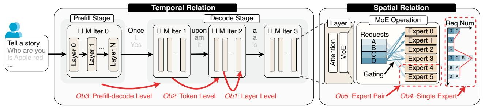

# *A. LLM and MoE Model Architecture*

Most state-of-the-art LLMs adopt a decoder-only transformer architecture that follows a token-by-token autoregressive workflow [\[29\]](#page-14-16). As shown in [Figure 3\(](#page-2-0)a), after users input queries, the serving process is divided into two stages: the prefill stage and the decode stage. During the prefill stage, all input tokens are processed simultaneously to generate the first output token. The decode stage follows immediately, where tokens are generated sequentially. The generated token from each iteration is appended to the input sequence to produce the next token in the following iteration.

The Mixture of Experts (MoE) mechanism is a state-of-theart approach to improve LLM performance and has become prevalent among current frontier LLMs [\[30\]](#page-14-17). As shown in [Fig](#page-2-0)[ure 3\(](#page-2-0)b), MoE-based LLMs replace the feed-forward network (FFN) layers in traditional LLMs with MoE layers. In each layer, multiple experts are deployed, and each request is routed to a small subset of the most suitable experts based on a gating mechanism. This innovation enables MoE models to scale model parameters without incurring extra inference overhead, since only a fraction of parameters are activated for each request. However, this mechanism also introduces dynamic randomness, since expert selection is unknown until gating is completed, posing new challenges for serving systems.

(a) MoE-LLM inference process and temporal relations

(b) MoE operation and spatial Relation

Figure 3. Inference process of MoE LLMs and the categorization method for our proposed data-centric profiling approach.

