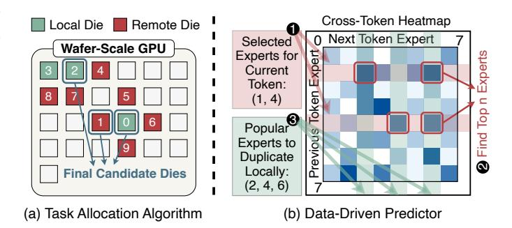

# E. Architecture Design

1) Architecture Overview: To support our proposed predictor and task allocation algorithm, we implement two architectural modifications with minimal overhead, as illustrated in Figure 10(a). These changes, highlighted in orange, consist of an enhanced Command Processor structure and an extended D2D controller design.

First, we redesign the Command Processor (CP) with a twolevel hierarchical structure: a Global CP at the wafer level and Local CPs within each die. The Global CP maintains systemwide expert selection and placement information for intelligent resource management. Second, we extend the D2D controller with an Address Translation Unit (ATU) and a Prediction Unit (PDU). The ATU translates remote HBM addresses to local addresses when remote data is duplicated, while the PDU identifies important remote data requiring duplication. These enable autonomous caching of remote data in local HBM and intelligent redirection of data requests, reducing inter-die communication overhead.

2) *Key Data Structures:* There are two key data structures: Global CP data and the PDU prediction table.

Global CP Data Structures: As shown in Figure 10(c), the Global CP maintains two structures. The expert distribution table stores each expert's initial die ID and distribution status as an n-bit binary code, where each bit indicates expert presence on the corresponding die. The cross-token heatmap records expert activation patterns over time, providing historical data for prediction generation.

<u>PDU Prediction Table:</u> Each PDU stores a prediction table with two key fields per expert: the cp\_en bit indicating whether the expert should be cached locally (calculated by Global CP and transferred to each die), and the is\_local bit tracking whether the expert is already cached in local HBM.

- 3) Workflow During Kernel Launch: When a new kernel launches (1), the Global CP runs our task allocation algorithm to split the MoE kernel into per-die sub-kernels and executes the predictor to generate duplication guidance (cp\_en field is PDU). The Global CP then sends sub-kernels and prediction information to local CPs (2). Each local CP allocates tasks to its SMs (3) and configures the prediction table in the D2D controller for local HBM management (4). After computation, local CPs collect expert duplication statistics and send them to Global CP to update expert distribution information.
- 4) Dataflow for Remote Data Access: We integrate ATU and PDU into the D2D controller to support hardware-managed HBM by modifying the remote data access flow. With these two units, our architecture automatically duplicates important remote data in local HBM, with green lines representing non-duplicated data reads and blue lines representing duplicated data reads, as shown in Figure 10(a).

Remote Data Read (Non-duplicated): When an SM reads remote data not in local HBM (1), the D2D controller routes the request conventionally (2). Upon return, the PDU checks the Prediction Table to make a duplication decision and sends data to the SM regardless of the decision (3). If duplication is required, the PDU writes to LLC and local HBM (4, 5),

#### Algorithm 1: Task Allocation Algorithm

```
Input: expert_reqs_dict, expert_die_map
   Output: allo_plan
1 Initialize the workload of each die: load_per_die;
2 Sort (expert_reqs_dict, by req_num ascending);
3 for (expert_id, req_num) in expert_reqs_dict do
4
       candi\_list \leftarrow \texttt{GenCandidateList} \ (expert\_id, \ dis = 1) \ ;
       candi\_list \leftarrow Sort(candi\_list, i \mapsto load\_per\_die[i])
         while req\_num > 0 do
            costs\_of\_dies \leftarrow \texttt{CostModel}(candi\_list);
            target\_die \leftarrow Argmin(costs\_of\_dies);
            allo\_plan.append([expert\_id, target\_die, req\_blk]);
            Update(load_per_die);
10
            req\_num \leftarrow req\_num - req\_blk;
11
       allo\_plan \leftarrow MergeTasks(allo\_plan);
12 return allo_plan;
13 Function GenCandidateList (expert_id, dis):
       local\_die\_list = expert\_die\_map[expert\_id];
       remote_die_list = FindNearDies (local_die_list, dis);
15
       return local\_die\_list + remote\_die\_list;
```

updates the address into ATU, and sets the is\_local bit in PDU's Prediction Table to 1.

Local Data Read (Duplicated): When an SM reads remote data already cached in local HBM (1), the ATU translates the remote address to a local address and redirects the request to LLC (2). The LLC and memory controller then retrieve data and send it back to the SM(3, 4).

5) Algorithm Design: This subsection presents our task allocation algorithm and data-driven predictor, both implemented by the global CP.

Task Allocation Algorithm: Since accurate task distribution is NP-hard, we propose two heuristic mechanisms: a candidate mechanism that reduces the number of dies to consider and a block-granularity distribution mechanism that searches for approximate solutions among candidates.

This algorithm splits MoE kernel computation into subtasks for individual dies based on expert selection and distribution information. As shown in algorithm 1, the input  $expert\_reqs\_dict$  contains the number of requests belonging to each expert, while  $expert\_die\_map$  provides dynamic expert distribution information from the Expert Distribution Table in Figure 10(c), indicating where each expert is stored.

The algorithm iterates through all experts to generate allocation plans. For each expert, it creates a candidate die list including dies storing expert weights and their adjacent dies (shown as green and red in Figure 11(a)). We sort candidates by workload and limit the list to  $max_split_num$  dies, determined by the expert's request count (line 3-5). Requests are distributed to candidate dies in blocks of size 50 to balance efficiency and accuracy (line 6-11). For each block, the algorithm selects the optimal die using our cost model, which considers DRAM access, computation, and dieto-die communication. Finally, we merge blocks allocated to the same die to generate the final allocation plan (line 12). Data-Driven Predictor: Our predictor algorithm, implemented by the global CP, uses current MoE kernel expert selection information to predict popular experts for the next token on



<span id="page-8-1"></span>Figure 11. Proposed task allocation algorithm and data-driven predictor.

each die. This prediction result is transferred to local CPs and configured in each die's PDU to guide hardware-managed local HBM. As shown by the red shadow in Figure 11(b), we first identify corresponding rows from the heatmap based on current expert selection ( $\bigcirc$ ), then select the top n experts from each row ( $\bigcirc$ ) and identify corresponding experts for the next token as prediction results, denoted by the green shadow ( $\bigcirc$ ). In this example, a die computes experts 1 and 4 during the current MoE kernel and we predict experts 2, 4, and 6 will be used next. Since this die only reads experts 1 and 4 currently, we duplicate only expert 4 in its local DRAM.

#### V. EVALUATION

