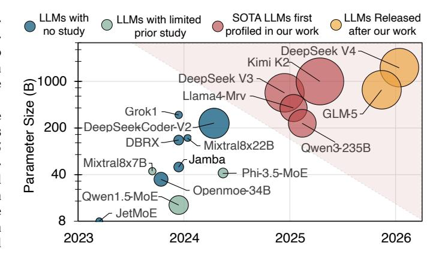

# Patterns behind Chaos: Forecasting Data Movement for Efficient Large-Scale MoE LLM Inference

Zhongkai Yu *UCSD* La Jolla, USA zhy055@ucsd.edu Yue Guan UCSD La Jolla, USA y9guan@ucsd.edu

Zihao Yu
Indiana University Bloomington
Bloomington, USA
yuzih@iu.edu

Chenyang Zhou Columbia University New York, USA cz2791@columbia.edu Zhengding Hu *UCSD* La Jolla, USA zhh068@ucsd.edu

Shuyi Pei

Samsung Semiconductor

San Jose, USA
shuyi.pei@samsung.com

Yangwook Kang Samsung Semiconductor San Jose, USA yangwook.k@samsung.com Yufei Ding

UCSD

La Jolla, USA

yufeiding@ucsd.edu

Po-An Tsai NVIDIA Santa Clara, USA poant@nvidia.com

Abstract—Large-scale Mixture of Experts (MoE) Large Language Models (LLMs) have recently become the frontier openweight models, achieving remarkable model capability similar to proprietary ones. But their random expert selection mechanism introduces significant data movement overhead that becomes the dominant bottleneck in multi-unit LLM serving systems.

To understand the patterns underlying this data movement, we conduct comprehensive data-movement-centric profiling across four state-of-the-art large-scale MoE models released in 2025 (200B-1000B) using over 24,000 requests spanning diverse workloads. We perform systematic analysis from both temporal and spatial perspectives and distill six key insights to guide the design of diverse serving systems. We verify these insights on both future wafer-scale GPU architectures and existing GPU systems. On wafer-scale GPUs, lightweight architectural modifications guided by our insights yield a 6.6x average speedup across four 200B-1000B models. On existing GPU systems, our insights drive the design of a prefill-aware expert placement algorithm that achieves up to 1.25x speedup on MoE computation. Our work presents the first comprehensive data-centric analysis of large-scale MoE models together with a concrete design study applying the learned lessons. Our profiling traces are publicly available at https: //huggingface.co/datasets/core12345/MoE\_expert\_selection\_trace.

Index Terms—Mixture of Experts, Large Language Model, Wafer-Scale GPU, Profiling, LLM Serving System

#### I. INTRODUCTION

Large Language Models (LLMs) have demonstrated remarkable capabilities across diverse domains, including programming assistance [1], [2], translation [3], [4], and chatbots [5], [6]. Since the beginning of 2025, large-scale Mixture of Experts (MoE) LLMs (200B+ model with 100+ experts) have become the leading models for frontier LLMs [7] and the most widely used open weight models.

Unlike dense LLMs that activate all model weights uniformly, MoE models dynamically route each token to only a subset of experts, introducing substantial data movement overhead. Such overhead already exceeds 50% of execution time for small models (e.g., Mixtral 8x7B) on modest systems (2–4 GPUs), and it exacerbates further with larger models such as

Figure 1. MoE LLM models sizes and release dates. Bubble size indicates the number of experts in each layer. Prior studies [13], [15]–[17] provide limited analysis of smaller models from narrow perspectives, while our work presents the first comprehensive analysis of multiple unstudied SOTA models.

DeepSeek V3 with 32× experts and 15× parameters deployed on multi-node systems (32+ GPUs) [8], [9]. Moreover, this scaling trend is accelerating: recent releases such as DeepSeek V4 [10] and GLM-5 [11] continue to push the frontier, making the associated data movement patterns ever more critical. Yet as shown in Figure 1, no prior work has systematically investigated these patterns at scale. Earlier studies [12]–[14] confined themselves to profiling one or two small MoEs on limited hardware, reporting surface-level observations without system-level insights. As parameter sizes and expert counts surge, new data movement patterns have emerged but remain unexplored, leaving significant optimization opportunities on the table. A comprehensive characterization of data movement in SOTA MoE models therefore presents a fruitful opportunity for better efficiency.

If data movement in MoE models were fully unpredictable, it would present significant challenges for deployments on multi-unit systems. **From a temporal perspective**, the explosive growth in expert combinations would make it impossible to prefetch, cache, or replicate experts in advance.

&lt;sup>0Accepted to ISCA 2026. This is the authors' preprint version.

For example, large-scale MoE models like DeepSeek V3 have C 8 256 = 4,426,165,368 combinations in expert selection. When served with host memory-offload systems, such unpredictability would result in data movement like expert migrations between GPU and host, incurring substantial overhead, as interunit communication becomes the primary bottleneck. From a spatial perspective, if expert selection were truly random, it would lead to severe workload imbalance across units. When queries from diverse tasks are served concurrently, the number of queries assigned to each expert would vary dramatically, creating significant workload disparities. Consequently, most units would remain idle and wait for heavily loaded units to finish, resulting in poor hardware resource utilization.

Fortunately, as we later show in the paper, MoE expert selections indeed have predictability that designers can exploit to reduce data movement. To uncover the inherent patterns in MoE models, we conduct a comprehensive data-movement-centric profiling of four state-of-the-art MoE models ranging from 235B to 1000B parameters released in 2025. As highlighted in [Figure 1,](#page-0-0) we profile DeepSeek V3 [\[18\]](#page-14-6), Llama4 Maverick [\[19\]](#page-14-7), Qwen3-235B [\[20\]](#page-14-8), and Kimi K2 [\[21\]](#page-14-9) across 24,000 requests involving varied tasks, topics, and languages, which consumes >2000 GPU hours in total. We then collect the expert selection trace of all layers and tokens in each request to create an expert selection database of over 150 GB JSON files. From these extensive traces, we conduct a comprehensive analysis to uncover data movement patterns from both temporal and spatial perspectives, making our findings *system-agnostic* and applicable to various serving architectures at any scale. We then distill six key insights that serve as a solid foundation to understand MoE data movement and directly inform future MoE LLM serving system design, addressing critical questions that have remained unanswered in the field, such as: *Is there a correlation between previously selected experts and those selected later? Are there discernible rules underlying the observed expert selection skewness? Do different tasks tend to activate different experts?* Our work represents the first systematic effort to characterize data movement patterns at the scale of up-to 1000B model across a wide range of tasks, providing actionable insights that can guide the design of next-generation MoE serving systems.

To demonstrate the broad applicability of our insights, we present case studies on both future and existing GPU systems. On the architecture side, we observe that modern GPUs have already adopted multi-chiplet designs due to single-die size limitations [\[22\]](#page-14-10)–[\[24\]](#page-14-11) and are evolving toward wafer-scale integration enabled by emerging on-wafer packaging technologies [\[25\]](#page-14-12), [\[26\]](#page-14-13). Targeting this trend, we develop a two-level data-placement-aware command processor and a hardwaremanaged HBM scheme that jointly balance workload across dies and reduce inter-die communication, achieving an average 6.6× speedup in MoE serving throughput on wafer-scale GPUs. On existing multi-GPU systems, we observe that prefillstage expert selections can effectively predict decode-stage behavior. Building on this observation, we propose prefillaware expert placement algorithms to reduce decode workload

Figure 2. Latency breakdown for different data movement in DeepSeekV3 (4K sequence), modeled after various serving configurations [\[18\]](#page-14-6), [\[27\]](#page-14-14), [\[28\]](#page-14-15).

imbalance, and achieve up to 1.25× speedup. Our main contributions can be summarized as follows:

- We propose a comprehensive and systematic datamovement-centric profiling across four latest, large-scale MoE models released in 2025 between 235B and 1000B to uncover the data movement patterns from both temporal and spatial perspectives.
- We distill six key insights for designing efficient MoE serving systems based on our profiling and analysis, providing actionable guidance that can inspire future research in MoE serving systems.
- Leveraging these insights, we conduct case studies on both future and existing GPU systems. On future waferscale GPUs, we improve MoE throughput by 6.6× with minor hardware modifications. On existing multi-GPU systems, we achieve up to 1.25× speedup on an 8×H100.
- We collect over 70,000 expert selection traces across multiple models and datasets, totaling over 150 GB in JSON format, and have open-sourced all traces with our multi-chiplet simulator to facilitate future research.

