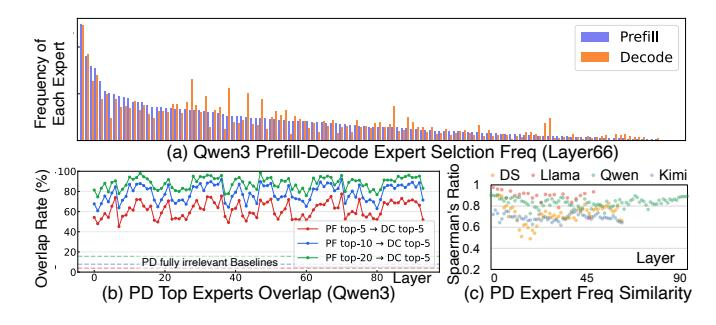

# *3) Prefill-Decode-Level Correlation: (Ob3)*

Building on the layer-level and token-level relations, we observe notable similarities in expert selection patterns between prefill and decode stages. Comparing heatmaps across stages in [Figure 6\(](#page-3-2)a)(b)(c)(d), we find similar distributions of bright dots, indicating that expert pair heatmap during prefill and decode shares similarities. This cross-stage consistency suggests us that the prefill-collected information can guide initial decode steps until sufficient decode data accumulates.

To quantify this similarity, we compute Spearman's ratio (ρ) across all model layers, comparing prefill and decode heatmaps. Spearman's Ratio ρ measures monotonic relationships between variables, ranging from −1 (perfect negative correlation) to 1 (perfect positive correlation). Generally, |ρ| >

1Llama 4 inserts dense FFN layers between MoE layers, so we pair adjacent MoE layers (N and N+2).

Figure 7. (a) Expert frequency distributions between prefill and decode stages exhibit similarity. (b) The most popular experts in the two stages overlap substantially. (c) All models show a high Spearman correlation between prefill and decode expert frequencies.

0.7 indicates strong correlation,  $0.4 < |\rho| \le 0.7$  indicates moderate correlation, and  $|\rho| \le 0.4$  suggests weak correlation [34]. The results in Figure 6(e)(f) show that most layers demonstrate strong correlation, while a few show moderate correlation. This makes it possible to predict decode-stage expert selection with prefill-stage data.

Beyond expert-pair heatmaps, we also identify prefill-to-decode correlation at the single-expert frequency level. As shown in Figure 7(a), the frequency distributions of prefill and decode stages are substantially similar, though some discrepancies exist among low-frequency experts. To examine the most popular experts, we report the overlap rate of top experts between stages in Figure 7(b): the top-5 prefill experts cover around 60% of the top-5 decode experts, rising to 75% and 90% for top-10 and top-20, respectively. This indicates that prefill information can help predict the hottest decode experts. The cross-model Spearman correlation in Figure 7(c) confirms this relationship holds across all four models.

4) System Insights from Temporal Relation: The observed temporal relations in expert selection motivate us to design fine-grained, dynamic strategies on every single unit to reduce data movement. For example, when expert weights are read from remote memory, such as remote DRAM in multi-chiplet systems, or CXL extension memory in memory-disaggregated systems, caching, migration, and prefetching strategies can be deployed to reduce data movement.

**★Insight 1: Prefill-data-driven prediction (Ob3).** Leverage the expert selection trace from the prefill stage to predict expert selection during the decoding stage.

Empirical analysis shows that expert selection patterns during prefill exhibit strong similarity to those during decode. Thus, expert selection information collected in the prefill phase can serve as a valuable reference for predicting decode-phase selections, particularly at the beginning of decoding when only a few tokens have been generated and historical context is scarce. Our section VI demonstrates how prefill information can guide expert placement during decode. This is especially relevant in modern PD-disaggregated serving systems, where

Figure 8. Single-expert spatial relation analysis of Llama4 layer 7 shows: (a) non-uniform expert activation distribution; (b) expert selection strongly correlates with task type; (c) expert activation patterns shift significantly when language changes while content remains identical.

the prefill and decode stages execute on separate machines.

\*Insight 2: Cross-hierarchy memory management (Ob1, Ob2). Token- and layer-level temporal relations enable dynamic expert prefetching and caching across memory hierarchies.

Layer-level and token-level temporal relations are similar in definition but differ in reuse distance, making them suitable for different levels of the memory hierarchy. Layer-level relations exhibit short reuse distances because consecutive MoE layers execute in immediate succession, while token-level relations incur longer reuse distances because a new token is generated only after traversing all layers.

This maps naturally onto the multi-level memory hierarchies in modern serving systems. For example, in multi-chiplet architectures, each die contains both an LLC and local DRAM, forming a two-tier hierarchy. The faster but smaller LLC is well-suited to managing experts with short reuse distances (layer-level), while the larger local DRAM accommodates experts with longer reuse distances (token-level). Accordingly, we can leverage layer-level relations for LLC management and token-level relations for DRAM management.

This principle generalizes to other system configurations: CXL-based systems with local DRAM and remote CXL memory, SSD offloading systems with DRAM and flash storage, and PIM systems with local and remote DRAM dies. In each case, layer-level relations guide the faster memory tier and token-level relations guide the slower one.

## C. Spatial Relation

As shown in Figure 3(b), we analyze spatial patterns in expert selection for both single-expert activation imbalance and expert pair co-activation affinity. For single experts, we examine statistical skewness and the factors affecting each expert's activation. For expert pairs, we analyze co-activation properties across all two-expert combinations.

