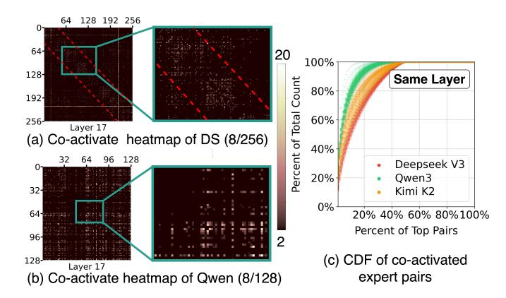

# *2) Expert Pair Co-activation Affinify: (Ob5)*

Beyond single expert patterns, we observe spatial relations for expert pairs where certain experts are more likely to be coactivated. We present co-activation heatmaps in [Figure 9\(](#page-5-0)a)(b), where both axes indicate expert IDs. Each pixel represents an expert pair with values showing co-activation frequency normalized by theoretical random selection probability: p = n(n−1) , where n is the number of experts.

Bright dots appear with probabilities 20-40 times higher than theoretical values, indicating strong co-activation tendencies. All heatmaps exhibit central symmetry since expert pair (i, j) equals (j, i). In Deepseek's heatmap [Figure 9\(](#page-5-0)a), frequently activated pairs lie between red lines forming bright squares, reflecting Deepseek's routing restriction where tokens are routed only to adjacent nodes to reduce communication overhead. This suggests the potential of separating co-activated expert pairs to balance workload.

We quantify this relation by in [Figure 9\(](#page-5-0)c). The top 10% of expert pairs account for 60-80% of total activations, indicating strong skewness. This suggests the potential for separating co-activated expert pairs to balance the workload. We only analyze Deepseek and Qwen since Llama selects one expert per MoE layer, eliminating co-activation relations.

*3) System Insights from Spatial Relation:* Spatial Relation enables coarse-grained, static strategies to address workload imbalance across the system. These strategies could be applied at system startup or during periodic redistribution (e.g., every 10 minutes) through appropriate task distribution.

★*Insight 3: Expert-placement-aware workload distribution [\(Ob4,](#page-4-0) [Ob5\)](#page-5-1). Employ expert placement information to design workload-balanced task distribution strategies.*

Expert placement in serving systems can change dynam-

Figure 9. Expert-pair co-activation affinity. (a)(b) Heatmaps for DeepSeek and Qwen. (c) CDF of co-activated expert pairs across all layers: a small fraction of expert pairs accounts for the majority of co-activations.

ically due to expert migration strategies. Therefore, when allocating workload to system units, expert placement should be considered for better workload balance. Besides, the design space for task allocation could be enlarged with emerging new systems. Traditional multi-GPU systems tend to allocate experts to local GPUs to avoid cross-unit communication. However, in multi-chiplet GPUs, we can consider allocating tasks to remote dies for better workload balance as inter-unit communication becomes faster.

★*Insight 4: Popular expert decentralization [\(Ob4\)](#page-4-0). Duplicate or decentralize frequently used experts to balance workloads.*

Expert skewness causes workload imbalance and suboptimal resource utilization. Duplicating popular experts across multiple compute units distributes load more evenly. Additionally, avoiding co-location of highly popular experts in the same unit further enhances workload balance.

★*Insight 5: Expert-pair separation [\(Ob5\)](#page-5-1). Separate frequently co-activated expert pairs to maximize parallelism.*

Certain experts are frequently activated simultaneously, exhibiting strong co-activation patterns. Assigning these coactivated expert pairs to different compute units maximizes hardware parallelism and prevents workload concentration on specific units. However, separation also introduces crossunit communication overhead. The effectiveness depends on system topology and batch size, requiring careful trade-off between parallelism benefits and communication costs.

★*Insight 6: Workload-aware serving system [\(Ob4\)](#page-4-0). Leverage the workload information, like task type and language, to make expert migration prior to serving.*

Hot experts vary by task and language. English queries, for instance, activate different expert subsets than Chinese queries. Providing task metadata during serving enables proactive expert placement: when workloads are predominantly English, systems can pre-duplicate or reassign English-relevant experts, reducing communication and balancing loads. This task-toexpert mapping requires only one-time offline profiling per model and can be reused throughout deployment, making the approach practical and efficient.

