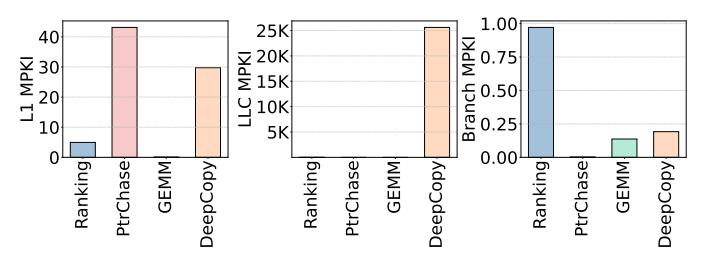
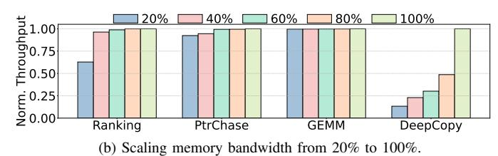

# D. Heterogeneity Across Operations Within Services

**Overview.** As individual microservices increase in complexity, they exhibit more frequent and pronounced internal execution phases. For example, a *FeedSim* request, among other operations, fetches the data from hash tables following the pointer chasing pattern (*PtrChase* operation), before performing the ranking on the collected data using the page rank algorithm [10] (*Ranking* operation). While *PtrChase* is a memory latency-bound phase, *Ranking* is compute-bound.

As another example, an *AdSim* request executes an ML inference using the GEMM routine [68] before performing a deep copy on the output tensors (*DeepCopy* operation). Similarly to *FeedSim*'s operations, while *DeepCopy* is memory bandwidth-bound, *GEMM* is compute-heavy.

**Architectural Metrics.** To quantify differences across execution phases, we profile the microarchitectural and system-level behavior of four representative intra-service operations (*Ranking, PtrChase, GEMM*, and *DeepCopy*) capturing the general heterogeneity within a single microservice.

Figure 5 presents a top-down microarchitectural analysis [31], [94] for the selected operations. The top-down approach classifies each pipeline slot into one of five categories: Frontend Bound, Core Bound, Memory Bound, Bad Speculation, and Retiring. This classification allows us to identify the main sources of pipeline inefficiency for each operation.

Fig. 5: Top-down microarchitecture analysis across different operations in *FeedSim* (*Ranking* and *PtrChase*) and *AdSim* (*GEMM* and *DeepCopy*) services.

The breakdowns reveal substantial differences across operations. *Ranking* and *GEMM* spend a significant fraction of cycles retiring instructions (*i.e.*, they are compute-bound), with *GEMM* being additionally bound by core resources due to heavier use of vector instructions (*i.e.*, it needs highpower cores). In contrast, memory-intensive operations such as *PtrChase* and *DeepCopy* spend most of their cycles in memory-bound regimes.

To further analyze the microarchitectural differences across operations, Figure 6 shows the miss-rates in architectural structures (i.e., L1 D-Cache, LLC, and Branch MPKI) across operations. Ranking exhibits a moderate L1 D-cache and Branch MPKI with lower LLC MPKI, reflecting a mix of compute and memory activity. On the other hand, PtrChase shows a significantly higher L1 D-cache MPKI despite its small working set, driven by frequent pointer dereferences and irregular memory accesses, while its LLC MPKI remains low due to cache reuse at higher levels. GEMM achieves low MPKIs across all structures, as expected from its dense, compute-bound nature with regular access patterns. In contrast, DeepCopy demonstrates extremely high LLC MPKI (orders of magnitude higher than other operations) due to its streaming memory behavior and lack of data reuse, which dominate its performance bottlenecks.

Fig. 6: L1 D-Cache, LLC, and Branch MPKIs across different operations in *FeedSim* and *AdSim* services.

Figure 7 characterizes the computational intensity of the analyzed operations in terms of floating-point (FP) activity. *Ranking* executes a substantial number of scalar FP instruc-

tions ( $\sim$ 12.4 per thousand retired instructions). *GEMM*, as expected from a dense linear-algebra kernel, exhibits the highest FP activity, issuing both scalar and vector FP instructions ( $\sim$ 2.6 and 10.0 per thousand instructions, respectively), showcasing heavy SIMD utilization and a compute-bound nature. In contrast, *PtrChase* and *DeepCopy* contain virtually no floating-point operations, consistent with their memory-dominated behavior and lack of arithmetic intensity. Thus, for such operations, cores do not need to include large-area and high-power vector units.

Fig. 7: Number of executed floating point scalar and vector instructions per kilo retired instructions across different operations in *FeedSim* and *AdSim* services.

#### E. Sensitivity Analyses

As a result of different computational properties, the operations within services have different sensitivities to architectural resources. We take the four representative intra-service operations (*Ranking*, *PtrChase*, *GEMM*, and *DeepCopy*) and test the sensitivity of these operations to CPU core frequency, memory bandwidth, L2 cache capacity, and processor generation.

Sensitivity to Frequency. Figure 8a shows the throughput of the four operations when varying the CPU core frequency from 1GHz to 3GHz. All throughputs are normalized to that at 3GHz. While compute-intensive operations, such as *Ranking* and *GEMM*, have significantly worse performance with lower core frequencies, the other two operations (*PtrChase* and *DeepCopy*) are much more lenient to lower core frequencies. Sensitivity to Memory Bandwidth. Figure 8b shows the throughput of the four operations when scaling the available memory bandwidth. We use Intel's pqos tool to scale memory bandwidth from 20% to 100%. All throughputs are normalized to that at 100% memory bandwidth. *DeepCopy* is highly sensitive to memory bandwidth. It reduces the throughput by more than 5× when using 20% of memory bandwidth, while other operations are not as sensitive to this resource.

Sensitivity to L2 Cache Capacity. Figure 8c shows the throughput of evaluated operations when adjusting the L2 cache capacity using pqos. We change the L2 cache size from 128KB to 2MB via way partitioning (i.e., 128KB is a 1-way cache while 2MB is a 16-way cache). All throughputs are normalized to that at 2MB L2 cache capacity. *PtrChase* is the most sensitive operation to L2 cache size, where it loses almost half of its performance with a 4-times smaller L2 cache. This is in line with the *memory-latency boundness* of *PtrChase*.

Sensitivity to Processor Generation. Figure 8d compares single-core throughput of the four operations across four Intel server generations: *Haswell* [39], *Skylake* [37], *Ice Lake* [38], and *Emerald Rapids* [36]. These are servers c220g2, c6420,

(c) Scaling L2 capacity from 128 KB (1 way) to 2 MB (16 ways).

(d) Scaling processor generation from Intel Haswell to Emerald Rapids.

Fig. 8: Normalized throughput of different operations in *Feed-Sim* and *AdSim* under (a) frequency, (b) memory bandwidth, (c) L2 cache capacity, and (d) processor generation scaling.

r650, and c6620 on CloudLab [15], and they were released in 2014, 2017, 2021, and 2023, respectively. Throughputs are normalized to the most recent generation, *Emerald Rapids*.

We observe clear generational gains for compute-intensive operations such as *Ranking* and *GEMM*, which achieve 25% and 21% higher throughput, respectively, from *Haswell* to *Emerald Rapids*. *Ranking* shows steady gains across generations. However, *GEMM* exhibits non-monotonic behavior, with notably lower performance on *Skylake* compared to *Haswell*, likely due to differences in vector unit configuration.

In contrast, memory-bound operations (e.g., PtrChase and DeepCopy) show marginal or even inverse sensitivity to processor generation. PtrChase exhibits a slight performance degradation on newer generations, as architectural advancements have not alleviated its dominant memory-latency bottleneck and, in some cases, may have even introduced higher access latency in deeper cache hierarchies. DeepCopy performs slightly worse on Skylake relative to Haswell, recovering only modestly in Ice Lake and Emerald Rapids.

