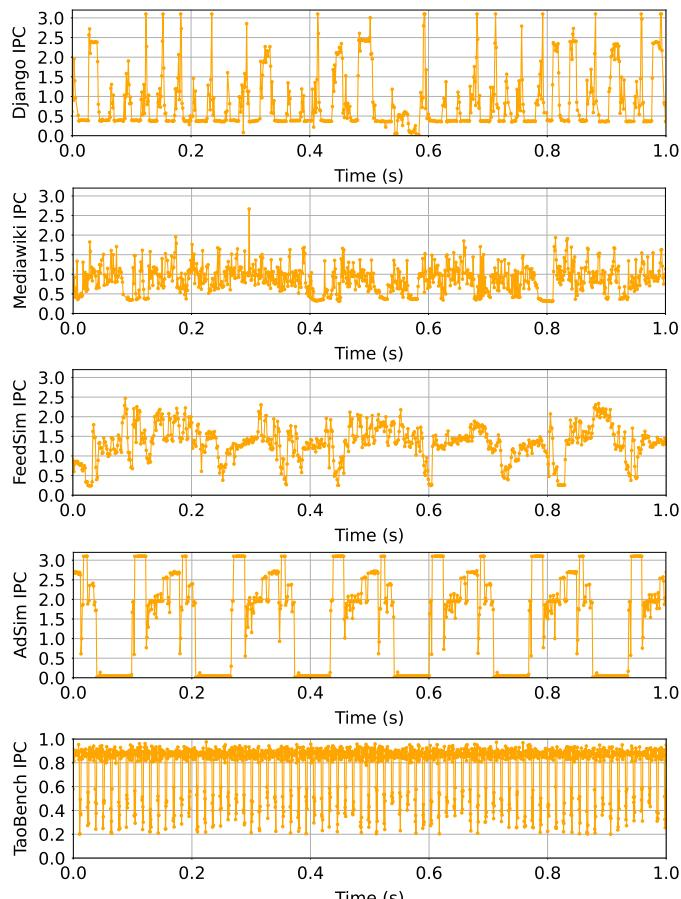
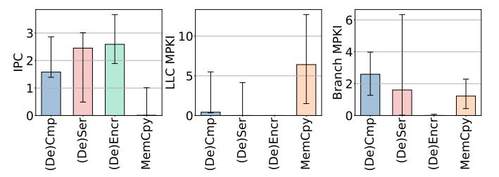

# II. CHARACTERIZING SOURCES OF PHASE HETEROGENEITY IN DATACENTER APPLICATIONS

To understand the behavior of datacenter applications, we characterize the fine-grained phase behavior of modern datacenter workloads running on typical datacenter hardware.

Hardware. We run our characterization on an Intel Emerald Rapids server [\[36\]](#page-13-8) equipped with 28 cores supporting 2-way SMT at 3GHz frequency. The server has 128GB of DRAM (8× 16GB 5600MT/s RDIMMs) and two NICs: a dual-port Intel E810-XXV 25Gb NIC and a dual-port Intel E810-C 100Gb NIC. For sensitivity studies, we use cpu-freq-utils to scale CPU frequency, and Intel's CAT [\[32\]](#page-13-9) technology to control memory bandwidth and cache capacity.

Metrics. We use the perf tool to collect architectural metrics across key resources. For compute, we measure instructions per cycle (IPC), types of executed instructions, and frequency of branch misses. For memory, we measure misses in data caches, *e.g.*, L1 and LLC Misses per Kilo Instructions (MP-KIs). For network, we measure I/O bandwidth and frequency of network system calls.

Applications. We use DCPerf [\[84\]](#page-14-6), an open-source suite of applications that mimics the behavior of Meta's production services. This includes web services (*Mediawiki*, *Django*), object ranking (*Feedsim*), data caching (*TaoBench*), and CPU-based ML inference (*Adsim*). [Table I](#page-1-0) summarizes these applications.

TABLE I: DCPerf applications [\[84\]](#page-14-6) analyzed in this study.

| Workload  | Category     | Description                          |
|-----------|--------------|--------------------------------------|
| Django    | Web service  | Dynamic web application              |
| Mediawiki | Web service  | PHP-based wiki engine                |
| FeedSim   | Object rank  | Social-media feed rank and aggregate |
| AdSim     | ML inference | Ad ranking in GEMM-based inference   |
| TaoBench  | Data cache   | Look-through Memcached               |

*Example Application.* [Figure 1](#page-2-0) shows the *Mediawiki* execution path, highlighting the layered sources of heterogeneity in datacenter workloads. First, it consists of multiple interactive microservices, *Nginx* (front-end web serving), *HHVM* (PHP execution), *Memcached* (in-memory caching), and *MySQL* (persistent storage). Each microservice exercises different architectural resources such as network, cores, memory, and storage. Second, between microservices, datacenter tax operations like (de)serialization and (de)compression introduce additional variability in compute and memory intensity. Finally, within each microservice, diverse internal operations (*e.g.*, HHVM's pointer chasing during hash-table lookups or bursts of JIT compilation) further contribute to rapid and fine-grained execution phase changes.

Fig. 1: MediaWiki workflow across Nginx, HHVM, Memcached, and MySQL microservices, connected via datacenter tax (e.g. (De)Ser, (De)Cmp); where individual microservices might execute distinct operations (e.g. PtrChase, JITComp).

#### A. Phase Behavior in Datacenter Workloads

To understand the high-level behavior of DCPerf workloads, Figure 2 shows their IPC over time, which is a good proxy for program behavior. Intuitively, high IPC typically captures compute-intensive periods and low IPC captures phases limited by memory or network activity. Across workloads, we see millisecond-scale alternations between high- and low-IPC regions even under stable input traffic.

The resulting wave IPC patterns across applications indicate rapid shifts between execution phases with distinct resource demands (*e.g.*, some compute-, others memory-bound). These patterns demonstrate that datacenter applications exhibit highly dynamic and fine-grained phase behavior.

This observation raises a question: what drives such rapid and diverse phase behavior in datacenter workloads? Understanding the sources of phase fluctuations is important, as they directly impact hardware efficiency and performance. To answer this question, we characterize the three main contributors to phase heterogeneity in datacenter applications: (1) the microservice software architecture itself, (2) the connecting logic between microservices (i.e., datacenter tax operations), and (3) the multi-stage internal structure of individual microservices.

#### B. Heterogeneity Across Services

**Overview.** In datacenter applications, each microservice is deployed as a separate program and communicates with others via remote procedure calls (RPCs). DCPerf workloads colocate microservices on the same server to improve performance and reduce communication latency. Hence, different microservices share the same set of cores, yet each is optimized for a specific function and stresses different system resources.

Architectural Metrics. Figure 3 presents the key compute (IPC), memory (LLC MPKI), and network (IO Bandwidth and frequency of network system calls) metrics for microservices in *Mediawiki*. We can see that HHVM demonstrates higher IPC, indicative of its compute-intensive behavior. In contrast, Memcached and MySQL exhibit high LLC MPKI and relatively low IPC, reflecting their memory-intensive and data-access-heavy nature. Finally, the frontend service, Nginx is characterized by high I/O activity and frequent network-related system calls, consistent with its role as a web server and proxy.

Fig. 2: IPC over time for different DCPerf workloads: *Django*, *Mediawiki*, *FeedSim*, *AdSim*, and *TaoBench*.

Fig. 3: Normalized IPC, LLC MPKI, I/O bandwidth, and frequency of network system calls for different microservices within the *Mediawiki* application. Numbers on top of the bars are their absolute values.

#### C. Heterogeneity Across DC Tax Operations Between Services

Overview. Datacenter applications rely on *datacenter tax* [44], [77] operations to connect microservices and ensure interoperability. A microservice request arrives as an encrypted network message that is processed by the TCP [43], SSL/TLS [61], and RPC frameworks [3], [25]. Then, protocols like Protobuf [22] deserialize the arguments, and protocols like Zstandard or Snappy [20], [23] decompress the arguments. After the service completes, the response follows the reverse steps. All these operations, *i.e.*, networking, (de)encryption, (de)serialization, (de)compression, RPC, form the datacenter tax.

**Architectural Metrics.** Figure 4 summarizes the architectural behavior (IPC, LLC MPKI, Branch MPKI) of representative datacenter tax operations across DCPerf applications. Each bar shows the median (P50), and the error bars capture variability across workloads (P10–P90).

Fig. 4: Architectural metrics (IPC, LLC MPKI, Branch MPKI) for different datacenter tax operations that connect services together in DCPerf workloads.

We can see that individual tax operations stress different resources. For example, (De)Encryption reaches high IPC with minimal cache activity, while MemCpy exhibits low IPC and high LLC MPKI due to heavy memory traffic. (De)Serialization and (De)Compression fall between these extremes, reflecting mixed compute and memory bottlenecks.

The error bars reveal variation even within the same operation type. For *(De)Compression* [20], decompression generally achieves higher IPC than compression because it is more compute-bound. In *(De)Serialization* [3], performance depends heavily on the input: fixed-size fields *(e.g.,* integers, floats) deserialize efficiently, whereas variable-length or nested structures incur lower IPC and greater cache pressure.

This variability shows that an operation's architectural behavior cannot be inferred from its semantic label. Even identical operations may stress the system differently depending on input and context. As a result, statically mapping operation types to hardware units is suboptimal. Instead, we must adapt dynamically to runtime characteristics and system state.

