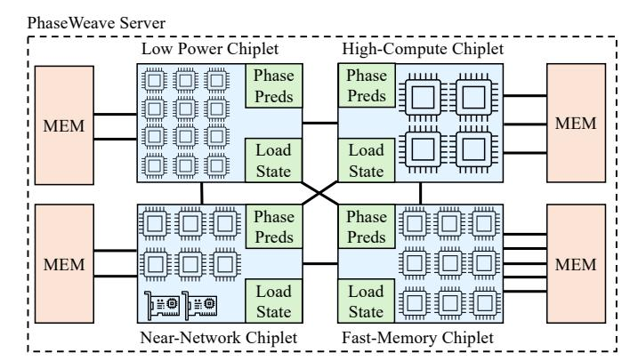

# III. PHASEWEAVE: A SERVER ARCHITECTURE FOR HETEROGENEOUS PHASES IN DATACENTER WORKLOADS

Our analysis highlights that different *phases* in datacenter workloads exhibit vastly different resource requirements and

Fig. 9: High-level architecture of a PhaseWeave server.

sensitivities. Compute-bound phases like *GEMM* and *Ranking* operations benefit most from high CPU frequencies and newer processor generations, whereas memory-bound phases such as *DeepCopy* are limited by memory bandwidth, and latencysensitive phases such as *PtrChase* rely heavily on sufficient cache capacity. Hence, distinct millisecond-scale phases within and across services demand different hardware capabilities.

This heterogeneity naturally motivates hardware designs that can satisfy varying resource needs. To efficiently serve phases with distinct computational characteristics, servers must incorporate hardware heterogeneity, *i.e.*, specialized compute, memory, and network resources that can each target specific classes of phases. A promising way to realize such heterogeneity is through chiplet-based processor architectures [\[9\]](#page-13-20), [\[18\]](#page-13-21), [\[59\]](#page-14-8), [\[73\]](#page-14-9), [\[91\]](#page-15-4), [\[93\]](#page-15-5), [\[95\]](#page-15-6). Such architectures have recently gained traction in both industry and academia, as they offer modular integration of components, improved yield, and flexible core grouping in clusters or core complexes [\[59\]](#page-14-8). Importantly, different chiplets within the same server can be specialized for different resource types, allowing the system to better match the diverse and dynamic requirements of datacenter workloads. Our proposal builds on such architectures.

#### *A. PhaseWeave Overview*

Building on our characterization, we propose *PhaseWeave*, a system that matches the fine-grained heterogeneity of execution phases in modern datacenter workloads with heterogeneity in hardware. [Figure 9](#page-5-0) shows the high-level architecture of a PhaseWeave server. Based on the observed recurring phases across datacenter applications, the server integrates four heterogeneous chiplet types: *high-compute*, *fast-memory*, *nearnetwork*, and *low-power* chiplets. Each chiplet is tailored to efficiently execute a distinct class of workload phases.

To exploit this heterogeneity, PhaseWeave dynamically and transparently migrates execution across chiplets at phase granularity. Each chiplet includes lightweight hardware modules, called *Phase Predictors*, that monitor hardware counters and system activity to anticipate upcoming phase transitions. When a phase change is detected, the system evaluates both the predictor's output and real-time chiplet utilization, captured by dedicated *Load State* modules, to decide if and where to migrate the thread. With this coordination, PhaseWeave ensures that each phase runs on the most suitable hardware given current system conditions, improving both performance and energy efficiency across diverse datacenter workloads.

#### *B. Server Architecture*

A PhaseWeave server integrates four types of chiplets: *highcompute*, *fast-memory*, *near-network*, and *low-power*. Cores within chiplets are organized into a 2D mesh topology, while chiplets communicate over a high-bandwidth all-to-all interconnect. Each chiplet type implements the same instruction set architecture (ISA), which enables thread migration across chiplets without requiring recompilation or binary translation. Despite sharing a unified ISA, the microarchitectural configuration of each chiplet is tuned for its designated phase class. Hence, the system achieves fine-grained specialization while maintaining programmability and compatibility. By provisioning each core to excel at a specific phase class rather than attempting to perform well across all classes, PhaseWeave achieves higher aggregate core counts within the same total power and area budgets as a conventional monolithic server.

High-Compute Chiplets. These chiplets target arithmeticand vector-intensive phases. Their cores operate at higher frequency and implement a wide issue width with large reorder buffers (ROB) and load/store queues (LSQ) to maximize instruction-level parallelism. Each core includes wide SIMD/vector units and TAGE branch predictor [\[72\]](#page-14-10). To conserve area and power, the chiplet features moderate LLC capacity and lower off-chip memory bandwidth relative to other chiplets, as these phases are typically compute-bound. Networking interfaces are not integrated into this chiplet.

Fast-Memory Chiplets. They accelerate memory-bound phases. Their cores are designed with narrower pipelines and lower core frequencies but are attached to a larger number of high-bandwidth memory channels or stacked DRAM interfaces. These chiplets prioritize memory-level parallelism and data throughput over peak computation. Like the compute chiplet, they exclude network interfaces to allocate more area for memory controllers and wider DRAM interfaces.

Near-Network Chiplets. They are optimized for networkintensive phases. Each chiplet integrates one or more NICs directly into the die to reduce communication latency and improve packet processing throughput. Cores in these chiplets have smaller caches, reduced-width vector units, and moderate DRAM bandwidth, trading computational capacity for lowlatency, high-throughput I/O. Integration of NICs within the chiplet fabric also minimizes PCIe overheads and reduces power-hungry data movement between chips.

Low-Power Chiplets. They serve latency-insensitive phases that do not require full-performance cores. Cores run at lower frequencies, use smaller private caches, and are connected to slower, lower-power DRAM channels. They omit NICs and vector units entirely. Despite their reduced performance, these cores maintain full ISA compatibility, allowing the runtime to migrate threads during idle or low-load periods to reduce overall server energy consumption.

#### *C. Memory Subsystem*

Unified Memory and Allocation Policies. All chiplets share a unified physical address space, which is managed by a single operating system instance. However, memory is physically disaggregated such that each chiplet connects to a dedicated fraction of the total DRAM capacity. DRAM is organized at the granularity of memory channels or DIMMs directly attached to that chiplet's memory controller. Latency and bandwidth properties of each memory fraction are selected to match the needs of different phases. Thus, while the software observes a flat memory address space, the underlying memory substrate is non-uniform and heterogeneous [\[11\]](#page-13-22). This contrasts with a conventional monolithic server, which provides uniform memory bandwidth and latency across its memory controllers.

When a thread allocates new memory, the allocation is satisfied by the DRAM region local to the chiplet executing the request, ensuring initial locality. Over time, as access patterns shift, pages predominantly accessed by other chiplets are migrated using NUMA-like page migration policies [\[90\]](#page-15-7) (*e.g.*, periodically evaluating access counters and promoting hot pages). In this way, the memory system can dynamically adapt to evolving execution phases without requiring explicit application-level data placement.

Cache Coherence. Cores in a PhaseWeave server, both within and across chiplets, are kept cache coherent. PhaseWeave employs a standard two-level MESI protocol, similar to those used in conventional multi-socket servers [\[16\]](#page-13-23), [\[50\]](#page-14-11), [\[80\]](#page-14-12). Each cache line has a designated global home core and LLC slice, and within each chiplet, it also has a local home [\[65\]](#page-14-13). Each chiplet maintains an *intra-chiplet directory* that tracks which cores within the chiplet cache a given line, and an *inter-chiplet directory* that tracks which remote chiplets cache the line.

When an invalidation is required for a line, the request is sent to the global home. The global home consults its intrachiplet directory and sends invalidations to all local cores that hold the line. At the same time, the global home also forwards the invalidation to the local homes of the line in other remote chiplets listed in the inter-chiplet directory. Finally, the local homes propagate the invalidations to the cores within their chiplets, ensuring that all copies are properly invalidated and coherence is maintained across the server.

