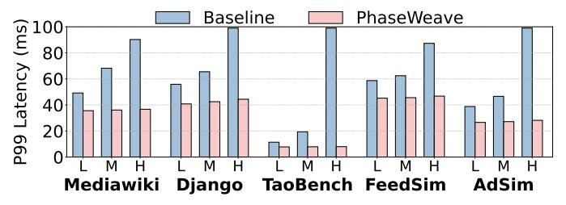
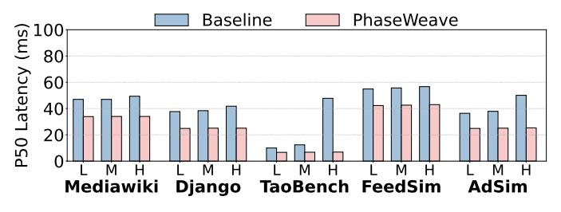
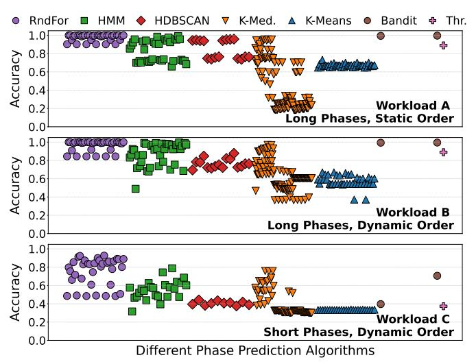
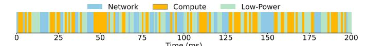

# IV. EVALUATION

#### A. Evaluation Methodology

**Modeled architectures.** We evaluate two architectures: *Baseline* and *PhaseWeave*. *Baseline* is modeled after a 28-core Emerald Rapids (EMR) server [36], where all cores are high-performance compute cores. We performed all characterization experiments in Section II on a server of this type. PhaseWeave is a heterogeneous architecture composed of four different chiplet types: compute, fast-memory, near-network, and low-power. All cores across chiplet types use the same x86 ISA.

Compute chiplets have high-performance cores modeled after EMR [36], but with 4× smaller L2 and 2× smaller perslice LLC cache sizes. Low-power chiplets have simple cores modeled after efficient cores, such as ARM A53 [5] and Ecores on Intel Skymont [35]. Fast-memory and near-network chiplets have cores whose microarchitecture is between the two extremes (*i.e.*, compute and low-power cores). Cores

TABLE III: Architectural parameters for modeled chiplets in *PhaseWeave*. Baseline has 28 cores of *Compute* type with  $4 \times 1$  larger L2 cache and  $2 \times 1$  larger LLC slice.

| Parameter   | Compute     | Fast-Mem.   | Near-Net.   | Low-Power   |
|-------------|-------------|-------------|-------------|-------------|
| # of Cores  | 10          | 9           | 9           | 10          |
| Frequency   | 3.0GHz      | 2.5GHz      | 2.5GHz      | 2.0GHz      |
| Issue Width | 6           | 4           | 4           | 2           |
| ROB         | 512 entries | 256 entries | 256 entries | 128 entries |
| Ld/StQ      | 192/114     | 192/114     | 130/60      | 64/48       |
| L1-I Cache  | 32KB        | 32KB        | 32KB        | 32KB        |
| L1 DCache   | 48KB        | 32KB        | 32KB        | 32KB        |
| L2 Cache    | 512KB       | 2MB         | 512KB       | 256KB       |
| LLC Slice   | 2.5MB       | 5MB         | 2.5MB       | 2.5MB       |
| L1 ITLB     | 256 entries | 192 entries | 192 entries | 32 entries  |
| L1 DTLB     | 96 entries  | 64 entries  | 64 entires  | 32 entries  |
| L2 TLB      | 2K entries  | 2K entries  | 2K entries  | 2K entries  |
| Mem. Lat.   | 15 cycles   | 22 cycles   | 15 cycles   | 15 cycles   |
| Mem. BW     | 17.06GB/s   | 25.60 GB/s  | 17.06GB/s   | 17.06GB/s   |

within chiplets are connected in a 2D-mesh topology with 3 cycles per hop, while the four chiplets are fully inter-connected with 60 cycles cross-chiplet latency [46] and 1Gbps bandwidth per link. Table III summarizes the number of cores for each chiplet type and their microarchitectural parameters.

**Simulation infrastructure.** We perform full-system simulations using QEMU [76] along with the SST simulator [67]. QEMU captures both user-space and kernel-space instructions, memory accesses, and system calls. These events are forwarded to the SST Ariel core [86], modified for high-accuracy, enabling precise modeling of architectures at the cycle level.

The simulation environment includes the complete software stack: operating system (Ubuntu 22.04, Linux 6.8.0-85), runtime libraries, and representative datacenter workloads. Main memory is modeled with DRAM-Sim3 [51].

For power and area measurements, we use McPAT [52] at 32nm technology (available in the tool) and scale to 7nm [78]. We size PhaseWeave to be iso-area relative to the baseline.

Real system. We emulate PhaseWeave software on an EMR server. We organize groups of cores into pools, each acting as a specialized chiplet in PhaseWeave, and we migrate threads across pools by changing their scheduling affinity in the OS. In addition, we set per-core pool frequency, memory bandwidth, and network bandwidth based on those chosen in PhaseWeave. **Applications.** We run 5 applications from the DCPerf benchmark suite [84] (Table I): Django, Mediawiki, FeedSim, AdSim, and TaoBench. We simulate application requests with Poissondistributed inter-arrival times under three load levels: low, medium, and high, corresponding to 25%, 50%, and 75% of the baseline server CPU utilization. The end-to-end latency is the time between when the client submits the request to when the response is sent back to the client. We also evaluate the maximum throughput under service-level objectives (SLOs). We increase the request load until each service reaches its target SLO of 100ms at the  $99^{th}$  percentile latency.

### B. Evaluation Results

**1. Tail Latency.** Figure 11 shows the P99 tail latency of each application with different load levels. Across all applications and loads, PhaseWeave consistently improves tail latency relative to Baseline. Averaged across all applications, PhaseWeave

reduces P99 latency by 28%, 42%, and 65% at low, medium, and high load levels, respectively.

Fig. 11: P99 tail latency across applications in low, medium, and high loads with Baseline and PhaseWeave.

These gains stem from two factors. First, reducing the percore size allows the system to provision a larger number of cores within the same area, mitigating queuing delays during bursts. Second, dedicating cores to specific phases enables more efficient execution within each phase, further tightening the latency distribution.

The gains are most pronounced at high load where queuing dominates latency. Differences across applications reflect this effect as well. PhaseWeave delivers the largest improvements for TaoBench, whose short per-request execution times makes it highly sensitive to queuing. Additionally, applications that spend substantial time in memory- or network-bound phases, such as AdSim, also see notable benefits, as PhaseWeave's specialized chiplets accelerate these bottleneck phases.

**2. Median Latency.** Figure 12 shows the median (P50) latency across applications in Baseline and PhaseWeave with different load levels. On average across all applications, PhaseWeave reduces the median latency over Baseline by 30%, 33%, and 46% in low, medium, and high load, respectively. Median latency benefits primarily from PhaseWeave's heterogeneous core design, which accelerates each phase's *common-case* behavior. Because median latency is less sensitive to queuing than the tail, the impact of higher core counts is smaller, leading to slightly lower gains in P50 compared to P99.

Fig. 12: P50 median latency across applications in low, medium, and high loads with Baseline and PhaseWeave.

**3. Throughput.** Figure 13 shows the throughput across applications in queries per second (QPS) for Baseline, PhaseWeave without the migration algorithm (Section III-E), and PhaseWeave. On average across all applications, PhaseWeave increases the throughput over Baseline by 1.56×. *Impact of Migration Algorithm.* Without the migration algorithm, PhaseWeave always migrates a task to its optimal chiplet whenever detecting a new phase, even if the

Fig. 13: Throughput under SLO across workloads with Baseline and PhaseWeave.

optimal chiplet is fully occupied and unloaded sub-optimal cores are available. Under this restrictive policy, PhaseWeave-NoMigrationAlg delivers a  $1.26\times$  throughput gain over Baseline, due to the benefits of specialization and higher core count.

With the migration algorithm, PhaseWeave improves overall resource utilization, yielding a further 1.24× gain over the no-algorithm configuration. On average, PhaseWeave migrates at least one thread in 53.2% of all epochs. For 18.5% of these, PhaseWeave moves a workload to a sub-optimal core because the optimal cores were fully loaded.

- **4. Area/Power.** By tuning each core to its role, PhaseWeave reduces per-core area and power relative to a Baseline core. High-Compute, Fast-Memory, Near-Network, and Low-Power cores reduce area by 27%, 11%, 34%, and 39%, and power by 34%, 33%, 35%, and 56%, respectively. These savings allow more cores to fit within the same overall area or power budget. As per-core area reductions are smaller than power reductions, area becomes the primary constraint on scaling core count. Thus, we scale per-server core counts to match Baseline's total area, resulting in PhaseWeave using 99% of Baseline's area and 82% of its power. Hence, the overall *Performance/Watt* gain with PhaseWeave is  $1.92 \times$ . These results show a high potential for *cost-efficiency* at datacenter-scale.
- **5. Sweep on Chiplet Configurations.** PhaseWeave's default configuration is balanced across chiplet types, *i.e.*, 10 cores per compute and low-power chiplets and 9 cores per fast-memory and near-network chiplets. Here, we explore configurations that are imbalanced and optimized for a specific phase class. For instance, the *Compute-Optimized* configuration has 16 compute, 8 fast-memory, 8 near-network, and 6 low-power cores, while *Memory+Network-Optimized* has 6 compute, 13 fast-memory, 13 near-network, and 6 low-power cores.

Table IV shows normalized area and power for some of the evaluated configurations. The table also shows the throughput (the load sweep in steps of 50 QPS) and Perf/Watt (QPS per Watt) when running Mediawiki application under these configurations. The other applications show similar trends. PhaseWeave's default configuration has the best balance between performance and power/area. Some configurations, *e.g.*, *Memory+Network-Opt*, have  $\sim$ 2% higher Perf/Watt but  $\sim$ 3% larger area. Other configurations, *e.g.*, *Compute+Memory-Opt*, have  $\sim$ 1% smaller area but  $\sim$ 4% lower Perf/Watt.

**6. Phase Prediction Accuracy.** For each of the candidate phase prediction algorithms (Section III-D), we explore a few different variants (*e.g.*, the number of trees and their depth in Random Forest, the distance functions in Clustering) and

TABLE IV: Chiplet configurations for Mediawiki.

| Config             | Throughput | Area | Power | Perf/Watt |
|--------------------|------------|------|-------|-----------|
| Baseline           | 550        | 1.00 | 1.00  | 1.00      |
| Compute-Opt        | 850        | 0.99 | 0.85  | 1.82      |
| Memory-Opt         | 800        | 0.99 | 0.80  | 1.81      |
| Network-Opt        | 900        | 1.00 | 0.87  | 1.89      |
| LowPower-Opt       | 800        | 1.01 | 0.81  | 1.80      |
| Memory+Network-Opt | 900        | 1.01 | 0.85  | 1.93      |
| Compute+Memory-Opt | 800        | 0.97 | 0.80  | 1.81      |
| PhaseWeave         | 850        | 0.98 | 0.82  | 1.89      |

the set of input features given to the algorithm. Recall that PhaseWeave uses a Random Forest predictor with 15 trees of depth 5 with 15 input features. We now evaluate the accuracy of these algorithms on different workloads.

We use the AdSim application, while the others follow the same trend. We generate three workloads: A, B, C. Workload C is the original Adsim application. We force Workload A to have longer per-phase durations ( $\sim$ 1s) and a fixed ordering of phases. Workload B uses the same second-scale phase lengths, but shuffles the order of phases to make it less predictable.

Fig. 14: Accuracy of PhaseWeave Phase Predictor with different algorithms for workloads A, B, and C.

Figure 14 shows the accuracy of different phase prediction algorithms across the 3 workloads of the AdSim application. Many algorithms (*i.e.*, HMM, Bandits, and Random Forest) have high accuracy, above 90%, with workloads A and B. However, workload C shows that only Random Forest has a high accuracy of 93%, while all other approaches fall below 80%. HMM clustering and Contextual Bandit are sensitive to noise (*e.g.*, when two phases overlap within an epoch) which is common with short-duration phases. Multi-armed Bandit is purely distribution-based: as phases are short, the distribution changes rapidly, reducing the effectiveness of this approach. Generalizing Across Workloads. We train the phase predictor using the WDL microbenchmarks included in the DCPerf suite [57]. While DCPerf already includes a wide range of workloads (web services, ML inference, page rank), to further

check for bias, we evaluate the predictor's accuracy on a

separate microservice benchmark suite, DeathStarBench [21],

which is not used during training. On these unseen work-loads, the predictor has 91% average accuracy across services, showing that phase patterns learned from microbenchmarks generalize well to diverse microservice applications.

#### C. Hardware vs. Software Phase Predictor

In Section III-D, we motivated the need for a hardwarebased phase predictor. To validate this claim, we replaced the hardware predictor in PhaseWeave with a software implementation of the same Random Forest model. The hardware predictor performs inference in under 100 cycles, whereas the software implementation requires from 50 to a few hundred  $\mu$ s per invocation. This overhead comes from the PMU collection (2-5  $\mu$ s), context switching between the execution thread and predictor (4-6  $\mu$ s), and Random Forest inference (40-250  $\mu$ s). Since the predictor is invoked at every 100 microsecond epoch and it is on the request's critical path, this overhead becomes substantial. For example, AdSim and Django have 250 and 390 epochs per request on average, translating to over 10ms of additional latency per request when using the software predictor. The added overhead significantly degrades performance: across workloads, maximum achievable throughput drops by more than 20% compared to the hardware implementation.

#### D. Real-System Experiments

**Migration Overheads.** We use the EMR server to measure the thread migration time across pools: from the moment we interrupt the thread until it starts running on its destination core. The average and median migration costs are  $23.8\mu s$  and  $9.5\mu s$ , respectively. Since the duration of a typical phase is in the order of 100s of  $\mu s$ , these overheads are negligible.

**Power Savings.** Since Baseline uses the maximum values for all knobs (frequency, memory and network bandwidth) it has high performance but also high power consumption. Instead, PhaseWeave software specializes core pools for a given phase class, such that the pool can maintain good performance but use less power. Across DCPerf benchmarks, PhaseWeave software achieves the same throughput as Baseline with 7.2% less power, even while using the *same core count* as Baseline.

These results confirm the effectiveness of PhaseWeave in a real server, but also demonstrate the need for full hardware support to reach the maximum benefits.

#### E. Comparison to big.LITTLE Architectures

We compare PhaseWeave against big.LITTLE-style monolithic heterogeneous baselines [8]. Conventional big.LITTLE architectures provide two classes of cores: high-performance ("big") and power-efficient ("little"). This heterogeneity captures a trade-off along the compute-energy axis. PhaseWeave provisions four chiplet types that target distinct resource bottlenecks: compute, memory, network, and low-power phases. Hence, heterogeneity in PhaseWeave is multi-dimensional.

Moreover, in conventional big.LITTLE systems, steering decisions are typically driven by OS heuristics or programmer annotations, and operate at coarse granularity (*e.g.*, per task). Such approaches often miss short-lived or fine-grained phase

changes within requests. PhaseWeave integrates a hardwaresupported phase predictor with chiplet-level migration, enabling transparent detection of fine-grained runtime phase behavior and dynamic steering across chiplets without programmer involvement. This allows PhaseWeave to exploit phase behavior even within individual microservice requests.

To quantitatively evaluate these differences, we construct multiple big.LITTLE-style baselines under iso-area constraints. All baselines are designed to match the total silicon area of PhaseWeave and consume slightly higher total power to avoid biasing results in our favor. To isolate the impact of load imbalance, we optimize the big.LITTLE baselines with our migration algorithm. We manually annotate each program phase to its optimal core type. Thus, our big.LITTLE baselines are highly optimized, presenting the upper bound of what is possible with conventional heterogeneous multicores.

We consider three classes of heterogeneous designs. First, we model ARM-style big.LITTLE configurations with out-of-order performance cores and in-order efficiency cores (bigL) [6], [7]. Second, we keep the sizes of microarchitectural structures in the efficiency cores but convert them to out-of-order designs (bigL-OoO). Third, we construct a big.LITTLE baseline using PhaseWeave's compute-optimized cores as performance cores and its low-power cores as efficiency cores (bigL-Opt). For each class, we evaluate performance-to-efficiency core count ratios of 1:1 [63], 1:2 [4], and 1:4 [30].

Fig. 15: P99 tail latency of the AdSim service under different loads with PhaseWeave and big.LITTLE architectures.

Figure 15 shows the P99 tail latency of the AdSim service across load levels for all evaluated systems. Other workloads show very similar performance trends. Across configurations, PhaseWeave consistently outperforms the monolithic heterogeneous baselines. When compared to the best big.LITTLE design (bigL-Opt-1:4), PhaseWeave achieves 1.3× higher throughput. The gains arise from the combination of finegrained phase detection and multi-dimensional resource specialization. By dynamically steering fine-grained execution to specialized chiplets, PhaseWeave addresses the dominant bottleneck of each phase, including those that cannot be mitigated by compute heterogeneity alone.

#### F. Granularity in Phase Prediction

While inter-service heterogeneity can be exploited via static pinning or OS-level scheduling, a substantial fraction of the performance gains arises from fine-grained, intra-microservice phase changes that cannot be efficiently captured without hardware-level phase prediction and low-latency migration.

Fig. 16: Alterations of phases in the Nginx microservice.

We first demonstrate that even services commonly perceived as homogeneous are internally phase-diverse. Figure 16 shows a timeline of the *Nginx* microservice, where different phases are color-coded. Although the service is largely networkfacing, its execution alternates between request parsing, TLS processing, kernel interaction, and user-level bookkeeping. These sub-phases exhibit different resource demands and are short-lived, making static core assignment suboptimal. In contrast, hardware phase detection enables PhaseWeave to react at the timescale at which these internal sub-phases emerge.

Next, we isolate the benefit of exploiting inter-service heterogeneity without intra-service phase adaptation. Figure 17 compares four configurations across three applications (others are similar). PinToCores statically maps different microservices to the optimal chiplet for its dominant phase to exploit inter-service heterogeneity. It captures the gains from intermicroservice diversity but ignores intra-service phase changes. On average across applications, PinToCores improves throughput by 1.12× over Baseline, but PhaseWeave-NoMigrationAlg further improves performance by 1.34× over PinToCores by adapting execution to fine-grained phases within services, even under the same restriction to optimal core types. Full PhaseWeave provides the largest benefit with average throughput improvement of 1.53× over PinToCores. The gap between PinToCores and PhaseWeave directly quantifies the benefit of phased execution beyond coarse inter-service placement.

Fig. 17: P99 tail latency of multiple services under different loads with PhaseWeave and static core pinning (*PinToCores*).

Finally, to isolate the contribution of intra-microservice phase behavior, we deploy each service on a dedicated server, i.e., only a single service instance executes per node. Thus, PhaseWeave cannot exploit heterogeneity arising from coscheduled microservices and can only adapt to phase changes within an individual microservice. Even in this constrained setting, we observe that maximum throughput improves by 54.8% on average across microservices. This demonstrates that a large fraction of PhaseWeave's gains stem from intra-microservice phase heterogeneity, independent from inter-service interference or co-scheduling effects. Overall, PhaseWeave remains beneficial even when services are independently scaled and deployed, as is common in some datacenter environments.

#### V. RELATED WORK

Phase Detection in Traditional Applications. Prior work has explored phase detection in traditional single- and multithreaded programs [14], [17], [40], [47], [49], [55], [60], [62], [69]–[71], [74], [75], [85], [96]. For example, Dhodapkar and Smith [75] compared hardware and software mechanisms for identifying coarse-grained program phases based on instruction working sets. Isci and Martonosi [55] analyzed control-flow and event-counter signatures for phase-aware power management, and Shen et al. [74] predicted locality phases to guide memory hierarchy optimizations. In contrast, PhaseWeave targets phase detection in datacenter workloads, which exhibit fine-grained, rapidly shifting behaviors. Beyond detection, PhaseWeave integrates architectural mechanisms to leverage these phases through hardware heterogeneity, achieving significant performance-per-watt improvements.

Heterogeneous-Core Servers. Architectures such as ARM big.LITTLE [8] and single-ISA heterogeneous CMPs [26], [48], [64] exploit performance–power trade-offs by pairing fast and slow cores within a chip. These systems typically rely on hardware heuristics or OS schedulers to statically schedule threads across cores. PhaseWeave differs by enabling fine-grained, *application-transparent*, phase-aware migration across chiplets, guided by online in-hardware predictions. This allows dynamic adaptation to the short-scale phase shifts.

Server Design for Datacenter Workloads. Recent research has proposed specialized CPU architectures tailored to datacenter workloads [58], [79], [82], [83] as well as accelerators targeting individual datacenter tax operations [1], [12], [27], [29], [33], [34], [41], [42], [45], [46], [92]. These designs focus on improving efficiency for specific bottlenecks or workload classes by rethinking microarchitectural structures or offloading recurring system functions to accelerators. PhaseWeave is orthogonal and complementary to these efforts: it provides a dynamic phase detection and migration scheme that can effectively leverage such specialized hardware.

