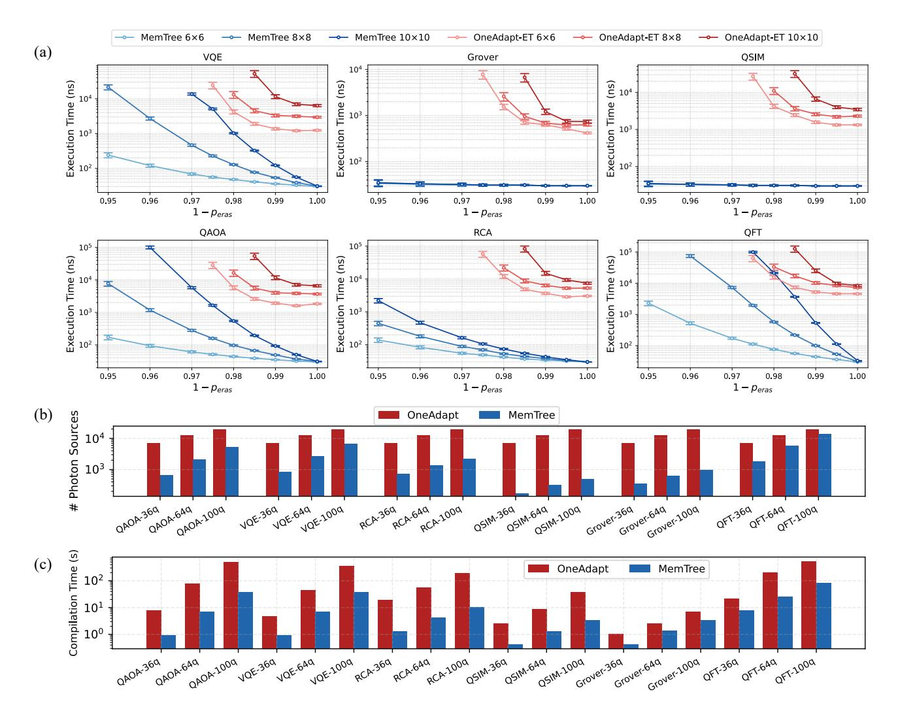
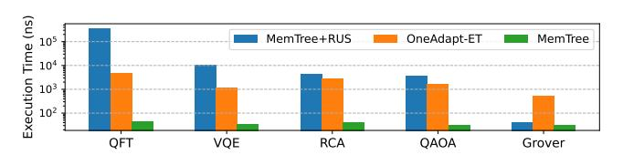

# C. Noise Model

- 1) Fusion Failure and Erasure Errors: Here are the details of our simulator for spin memory architecture PQC. Based on recent experimental works on spin memory architecture [30], [43] and linear-optical PQC [3], [6], [52], we simulate the following important errors in PQC: fusion failure and erasure errors, photon source decoherence, and fusion infidelity (indistinguishability). We set  $1-p_{fail}=0.75$  as the fusion success rate when assuming no erasure error, which corresponds to the error model introduced in Sec. 5.1 of the OneAdapt paper [74]. This success rate can be achieved by utilizing additional interferometric setups reported in previous works [18], [22], [49].
- 2) Decoherence Errors: We simulate the photon source (emitter) decoherence based on  $F_{de}=e^{\frac{-N_eT_{gen}}{T_2}}$ , in accordance with the error model used in RLGS [38]. We set the dephasing time of RLGS based at  $T_2=4.4\mu s$ , as reported by [31], [38]. As for OneAdapt and MemTree, we estimate the dephasing time based on the Bell state (GHZ state) fidelity reported in corresponding hardware demonstration [30], [52]. In [52] the fidelity of a 2-qubit Bell state is 99.22% for all-photonic architecture, while [30] reports a 95% optimal fidelity of a 4-qubit GHZ state for spin memory architecture. The dephasing time  $T_2$  can be calculated by

$$T_2 = \frac{-N_q t_{gen}}{\ln(F_{state})}, \ N_q = \mbox{\#qubit}, \ t_{gen} = \mbox{generation time}.$$

The dephasing time for each architecture is listed in Table. II.

3) Coherent Errors of Fusion Operation: We simulate the overall fusion fidelity  $F_{fus} = \sigma_{fus}{}^{N_{fus}}$ , corresponding with  $F_{CZ} = \overline{\sigma_{CZ}}{}^{N_{CZ}}$  reported in RLGS [38]. We set the fidelity of each emitter-CZ operation at  $\sigma_{CZ} = 99\%$  for RLGS, as reported by [57] in the form of pulse-level simulation result. Based on the Hong-Ou-Mandel (HOM) visibility  $V_{HOM} = 99.5\%$  reported in [52], we set the fidelity of type-II fusion operation at  $\sigma_{fus} = \frac{1+V_{HOM}}{2} = 99.75\%$  based on [27]. Meanwhile, we set the OSRP fidelity for spin memory at 99%, as reported in [30].

 $\begin{tabular}{l} TABLE~II\\ DETAILS~OF~NOISE~MODEL~WE~ADAPT~ON~THE~FIDELITY~COMPARISON. \end{tabular}$ 

| Compiler             | OneAdapt     | RLGS               | MemTree      |
|----------------------|--------------|--------------------|--------------|
| Based on Platform    | PsiQuantum   | [57] (Simulation)  | Quandela     |
| Dephasing $T_2$      | $2.04~\mu s$ | $4.4~\mu s$        | $2.34~\mu s$ |
| CZ (Fusion) Fidelity | 99.75%       | 99%                | 99%          |
| $t_{cycle}$          | 8 ns         | 10 ns (emitter-CZ) | 30 ns        |

Fig. 8. Execution time comparison between tree-encoded scheme and baselines.

Fig. 9. Number of required photon sources comparison between tree-encoded scheme and baselines.

## D. MemTree Simulator Configurations

We simulate the generation of caterpillar states according to hardware configurations reported in [30], [43]. Specifically, each qubit in a caterpillar state is emitted through an excitation pulse of InGaAs semiconductor quantum-dots, while assisted by an optical spin rotation pulse (OSRP) to define the caterpillar structure [30]. Generation of a caterpillar graph state includes a 12 ns initialization time, plus a 0.6 ns time cycle for the emission of each qubit. The near-term spin memory technique can produce a caterpillar state with at most 30-qubit [30], which is set as the maximal size of the caterpillar in our framework. For calculating the average execution time, we simulate  $2 \times 10^4$  cycles of caterpillar state emissions and divide the total time by the number of successful shots executed during these cycles. In addition, we choose b = 4 as the tree-encoding parameter, based on the parametric study in Sec VII.D.

## E. Metrics

We evaluate the performance of our compiler using the following metrics: average execution time of quantum programs, number of photon sources, compilation runtime, and fidelity of the quantum program. For fidelity, we include decoherence fidelity  $F_{de}$ , and CZ (fusion) fidelity  $F_{CZ}$  ( $F_{fus}$ ).

#### VII. EVALUATION

#### A. Comparison with Boosted-Fusion Schemes

Fig. 8 and Fig. 9 present the comparison of our treeencoded fusion scheme with the redundantly-encoded and RUS fusion schemes under the hardware configurations of the quantum spin memory architecture. In this comparison, all fusion schemes are integrated in MemTree with the same compilation algorithm. While fixing the fusion failure rate  $p_{fail} = 0.25$  (thus  $1 - p_{fail} = 0.75$ ), we compare the program execution time and the number of required photon sources. The program size (#qubit) varies from 2-qubit to 20qubit, and the erasure rate during fusion  $(p_{eras})$  varies from 0% to 10%. Due to the extremely large simulation overhead when the program size scales up, we truncate the execution time to at most  $6 \times 10^5$  ns. Fig. 8 shows that our scheme significantly reduces the average execution time of quantum programs, gaining an average reduction rate of  $1.9 \times 10^{-3}$ and  $1.7 \times 10^{-2}$ , compared to redundantly-encoded and RUS, respectively. Fig. 9 shows that our scheme consumes more photon sources than the baseline schemes, with an average of  $2.55\times$  and  $1.63\times$  compared to redundantly-encoded and RUS, respectively. Nevertheless, considering the exponential reduction in execution time, we believe that the tree-encoded scheme is an appropriate strategy for trading space for time. Besides, it can be observed that for tree-encoded fusion, its disadvantage on photon sources decreases as the #qubit grows (Fig. 9 dotted lines).

#### B. Comparison with SOTA Compilers of Other Architectures

**Execution Time.** Fig. 10(a)-(c) present the comparison of our framework MemTree with OneAdapt and OneAdapt-ET on average execution time, the number of photon sources, and compilation runtime. In Fig. 10(a), the execution time results on benchmarks with 36, 64, and 100-qubits are shown, with

Fig. 10. Comparison of MemTree with OneAdapt [\[74\]](#page-15-2) and OneAdapt-ET. (a) The average execution time of quantum programs, when peras = 0, the results are evaluated on OneAdapt without erasure-tolerance strategy. The error bars represent the value range with a statistical 95% CI (confidence interval), over 1000 times of experiment and each with 2 × 104 shots. (b) Number of required photon sources. (c) Total compilation runtime of compilers.

varying fusion erasure rates peras from 0% to 5%. Note that the realistic peras estimated from the hardware experiment is on the order of ∼ 1% [\[52\]](#page-14-2). We set a simulation limit for the execution time (2×105 ns), since a longer execution time requires > 80 hours of simulation on our machine. The results show that our compiler framework achieves an exponential improvement in execution time, and the reduction rates are 1.5×10−2 , 1.1×10−2 , 3.8×10−2 , 5.6×10−3 , 1.1×10−2 , and 8.8 × 10−3 for VQE, QAOA, Grover, RCA, QSIM, and QFT, respectively. Shown in Fig. [10\(](#page-10-0)b)-(c), the number of photon sources is reduced to 0.18× on average, and the compilation time is reduced 0.14× on average compared to OneAdapt. For the Grover and QSIM benchmarks, the intrinsic structure of their graph state leads to a relatively low number of fusions when divided into caterpillar states, and this number does not scale with program size, while larger programs only require more photon sources.

Circuit Fidelity. Fig. [11](#page-11-1) presents the comparison of MemTree with RLGS [\[38\]](#page-14-3) on Fde and FCZ/Ffus, using the benchmark results (QFT, QAOA, BV) reported in their paper. Note that the fusion operation in our architecture behaves similarly to emitter-CZ in the emitter-based architecture of RLGS, thus we compare our Ffus with their FCZ. The results show that we achieved a significant improvement on Fde, especially an exponential enhancement for QFT and QAOA. The results show that MemTree outperforms OneAdapt and RLGS both in Fde and FCZ, and the advantage grows with #qubit.

## *C. Ablation Study*

We conduct the following ablation study to verify that our performance gains over OneAdapt primarily stem from our novel tree-encoded fusion rather than merely from differences in PQC architecture or hardware configurations. Here, we compare three different compiler settings: MemTree with the RUS fusion scheme (the same we used in Sec. [VII.](#page-9-0)A), MemTree, and OneAdapt-ET, on 36-qubit benchmarks with peras = 0.5%. The results are shown in Fig. [12\(](#page-11-2)b). It can be observed that when the Tree-encoded fusion is replaced by

Fig. 11. Comparison on decoherence errors and CZ errors between OneAdapt [74], RLGS [38] and MemTree.

Fig. 12. Encoding parameter study and ablation study.

the RUS fusion scheme, it under-performs OneAdapt on all benchmarks except Grover. This ablation experiment supports for the novelty and effectiveness of our design of tree-encoded fusion scheme.

