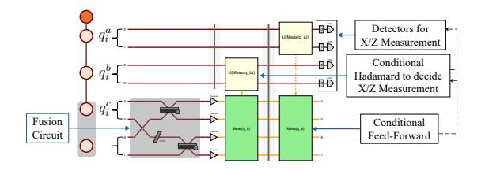
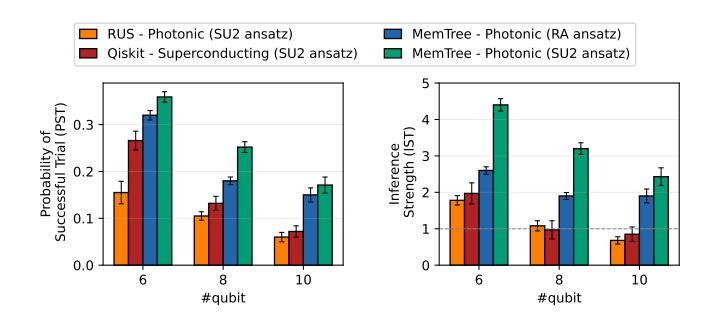

# D. Trade-Off Analysis of System Characterizations

In Table. III we analyze the system characterization of each compiler with the following metrics: emission frequency = #(physical photon) /ns, CZ frequency = #(CZ or fusion operation) /ns, and utilization rate = #(logical qubit) / #(total physical photon). From the data we can find MemTree establishing a proper trade-off between operation frequency and photon utilization rate. (i) Higher frequency (OneAdapt) leads to shorter QPU runtime, but requires larger number of noisy operations, hence the dominant errors derive from fusion operations. (ii) Higher utilization rate (RLGS) is based on fewer and more reliable CZ operations, but leads to lower frequency and longer QPU runtime, hence the dominant errors is decoherence. (iii) Based on the spin memory architecture and tree-encoded scheme, MemTree is designed to reach a trade-off between frequency and logical CZ (fusion) reliability. This prevents extremely high error rate deriving from CZ (fusion) or decoherence, thus MemTree outperforms both baselines in the evaluation of Fig.11.

TABLE III FREQUENCY-NOISE ANALYSIS (ON 30-QUBIT QAOA)

| Compiler                 | OneAdapt                | MemTree                 | RLGS         |
|--------------------------|-------------------------|-------------------------|--------------|
| Emission Frequency (/ns) | $\approx 2 \times 10^3$ | $\approx 7 \times 10^2$ | $\approx 10$ |
| CZ Frequency (/ns)       | $\approx 1 \times 10^3$ | $\approx 2 \times 10^2$ | ≈ 1          |
| Utilization rate         | $\approx 0.03\%$        | $\approx 10\%$          | 100%         |
| Dominant Error           | Fusion                  | F-D Tradeoff            | Decoherence  |

## E. Feed-Forward Control in PQC System

There are two cases in MemTree where feed-forward control is required. (i) In the tree-encoded fusion scheme, the measurement basis of ancillary qubits is updated according to the fusion outcome to handle fusion failure and erasure. This feed-forward is not on the critical optical path: once a fusion outcome is detected, the affected qubits can remain as dangling qubits, and the controller only needs to record which recovery pattern will later be applied. Therefore, the corrective measurements do not need to be triggered immediately after fusion; they only need to be synchronized before the dangling branch is consumed by later graph-state measurements, or before the final measurement stage of the quantum program, following the adaptive-measurement model of MBQC [68].

(ii) In the graph-generation pipeline (Sec. V-C), feedforward is also needed to decide whether a sub-graph should be delayed to the next timestep after an unsuccessful fusion. This control path consists of photon detection, a small classical decision circuit, and the timing/delay module. In our target hardware, the measurement signal is produced by superconducting nanowire single-photon detectors with latency below 50 ps [44]; the detector outputs are then passed to a small combinational logic block (e.g., a b-input AND/OR network for the b fusion branches), which decides whether the logical fusion succeeds or whether the sibling sub-graph must be stalled. The resulting control signal drives the time-delay module. We estimate the total classical feed-forward latency to be below 5 ns, and implement this logic using FFCircuitProvider in Perceval [24]. Since this latency is well below one emission timestep in spin-memory hardware, the updated measurement pattern and sub-graph schedule can be synchronized before the next emission layer begins.

#### F. Real Photonic Hardware Experiment

Here we perform a small-scale experiment on real photonic quantum hardware [2]. In this experiment, the optical hardware circuit is built with the Perceval PQC toolkit [24]. We illustrate the most important part of the hardware circuit in Fig. 13, which is the fusion operation and dealing with possible fusion failure or erasure. In the circuit, each qubit is represented

Fig. 13. The optical hardware circuit for tree-encoded fusion.

by a dual-rail encoding – two photon modes (e.g., H or V polarization) are used to encode one qubit. As in Fig. 13, the fusion circuit is a permutation of photon modes from the two qubits, followed by a phase shift and two beam splitters. Corresponding to the tree-encoded scheme in Fig. 4(b), the fusion outcome from  $q_i^c$  is detected and triggers a conditional feedforward operation on  $q_i^a$  and  $q_i^b$ . The feed-forward operation decides whether to apply an X or Z measurement on  $q_i^a$  and  $q_i^b$ , complying with the error-tolerant measurement patterns. The characterization of photonic hardware are as follows: HOM indistinguishability = 92.0%, transmittance = 5.16%,  $g_i^a = 2.0\%$ .

We compile QAOA programs (6–12 qubits) using MemTree, and execute them on photonic hardware. In Fig. 14, MemTree are compared with repeat-until-success (RUS) scheme [21] executed on photonic hardware, and Qiskit transpilation [32] executed on IBM Torino superconducting quantum computer. We use the EfficientSU2 (SU2) ansatz for QAOA as the default settings, and add a setting of RealAmplitudes (RA) ansatz to MemTree to extend the comparison. Note that in RA ansatz the parameterized rotation gates are restricted to  $R_Y(\theta)$  only, as a simplified ansatz. The results are evaluated in two metrics, which are Probability of Successful Trial (PST) [15], [42], [47], [62], [63] and Inference Strength (IST) [42], [50], [62]. From the evaluation results in Fig. 14, on average, MemTree (SU2 ansatz) achieves an improvement on Probability of Success Trial (PST) by the ratio of 2.68× compared to [RUS + photonic] and 2.20× compared to [Qiskit + superconducting]. Also, MemTree achieves an improvement on Inference Strength (IST) by the ratio of  $3.23\times$  compared to [RUS + photonic] and 2.91× compared to [Qiskit + superconducting].

From above results, we analyze the reason that PQC hardware outperforms superconducting QPU: PQC has significantly lower crosstalk than matter-based systems, while spin-memory single photon sources are isolated and have no interaction with each others. Consequently, PQC provides higher parallelism of CZ operations, and reduce circuit execution time. As we protect the fusion (CZ) with tree-encode scheme, the overall quantum noise is efficiently suppressed. Generally, SU2 ansatz performs better than RA ansatz for MemTree, however RA starts to outperform SU2 when the number of qubits scales up. This attributes to the fewer number of parameters in RA ansatz, which leads to lower complexity of optimization when #qubit scales up.

## VIII. RELATED WORKS AND DISCUSSIONS

Recent research on quantum computer systems has primarily addressed error correction for superconducting platforms [4], [14], [64], [69] via compilation advances [16], [60] and other architectural improvements [45], [61], [67], [70]. For photonic quantum computing, compilation frameworks target measurement-based systems [76], probabilistic fusion operations [73], and bosonic encodings [77]. FCM [46] uses wire cutting to partition circuits and reduce fusion counts through classical post-processing, while our work addresses fusion erasure errors through tree-encoded fusion schemes in spin

Fig. 14. Comparing the performance of QAOA programs on real hardware between superconducting qubits and photonic spin memory. The error bars stand for the standard error (SE).

memory architecture. FMCC [39] reduces photonic MBQC cluster-state depth by exploiting flexible mapping variants with dynamic programming and heuristics.

Prior work on biased-noise QEC, such as the XZZX surface code [8] and superconducting dual-rail cavity codes [65], studies circuit-model protection by tailoring syndrome-based correction to a hardware-specific error hierarchy. By contrast, our setting is fusion-based MBQC on optical photonic graph states, where the dominant challenge arises from imperfect graph-state generation itself. In particular, fusion *failure* and fusion *erasure* describe two distinct error modes of the fusion primitive, but they do not form a biased-noise model in the usual QEC sense, since neither is simply a dominant variant of the other. Our method corrects graph-generation uncertainty through graph-state measurement patterns and indirect measurements on ancillary qubits, rather than through circuit-level decoding of a biased code.

Beyond spin-memory hardware, the same loss-tolerant logical-fusion idea can also be applied to other PQC architectures whenever graph states are built through fusion. In particular, all-photonic schemes such as fusion-based quantum computation and OneAdapt already rely on small resource states and repeated fusion measurements [5], [74]. In that case, our method can be adapted by replacing the original fusion units with tree-encoded logical qubits, while changing only the resource-state preparation procedure: spin-memory hardware prepares them efficiently from caterpillar states, whereas all-photonic systems would synthesize them from Bell pairs or other small photonic resource states before entering the fusion pipeline. The loss-tolerant recovery mechanism itself remains unchanged, since it still follows graph-state measurement rules and indirect measurements [68].

