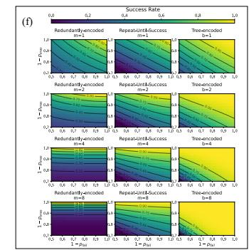
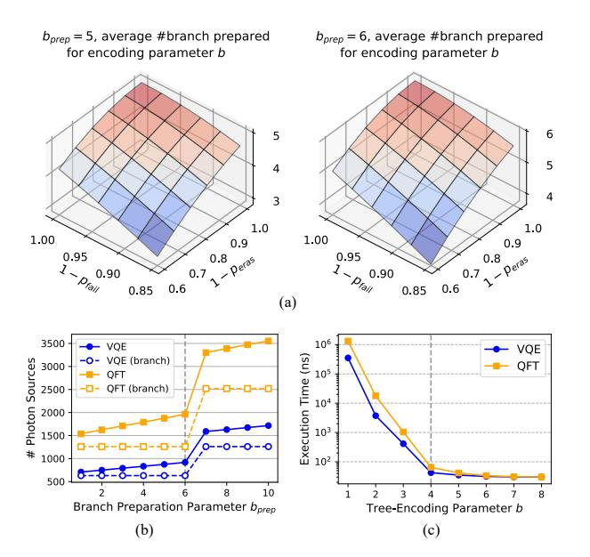

# IV. A ROBUST TREE-ENCODING FUSION SCHEME

#### A. Previous Boosted-Fusion schemes

First, we briefly describe prior error-tolerant fusion schemes on spin memory architecture and analyze their problems.

**Redundantly-encoded fusion.** Hilaire et al. [25] introduce a fusion failure-tolerant protocol to improve the success rate. Utilizing the feature of the caterpillar state, the redundantly-encoded scheme generates a logical linear graph state. Each node of this linear graph is a logical qubit encoded by m leaf qubits. For the fusion of two logical qubits from different graph states, a fusion operation is applied to each pair of leaf qubits from these two logical qubits. As a result, m attempts are performed between the two logical qubits, while any single successful attempt leads to fusion success. The redundant fusion operations reduce the overall rate of fusion failure, however, they lead to more exposure to fusion erasure. Assuming  $p_{fail}$  and  $p_{eras}$  as the probabilities of fusion failure and erasure, respectively, an m-qubit redundantly-encoded fusion has the following logical error rates:

$$P_{fail} = p_{fail}^{\ m}, \ P_{eras} = 1 - (1 - p_{eras})^{2m}.$$

 $P_{eras}$  has a 2m exponential because any one of the m physical qubits in each logical qubit is exposed to erasure error independently [12], [21]. Here we can observe that when the redundant encoding parameter m grows, the logical failure rate  $P_{fail}$  reduces, but the logical erasure rate  $P_{eras}$  increases.

**Repeat-until-success fusion.** Lim et al. [40] propose a repeat-until-success (RUS) method to improve the fusion operation [21], [66]. In this RUS scheme, ancillary photons are used to apply fusion operations between two photon sources, thus creating entanglement between the caterpillar states produced by the two photon sources. The RUS scheme has a similar idea to the redundantly-encoded scheme, but it terminates once the fusion operations succeed. Its logical error rates are:

$$P_{fail} = p_{fail}{}^m, \ P_{eras} = \sum_{i=0}^{m-1} p_{fail}{}^i \cdot 2p_{eras}$$

Although the RUS scheme achieves slightly better performance than the redundantly-encoded scheme [25], it consumes

more ancilla qubit resources and takes a longer time. Moreover, it has the same problem of intolerance to erasure errors.

#### B. Preliminary: Loss-Tolerant Graph State Patterns

Before introducing our tree-encoded fusion scheme, we explain the underlying principles. Our insight into tree-encoded fusion derives from the QEC tree graph-state code [1], [7], [68]. It reveals several properties of graph state measurement: Fig. 4(a) shows the direct Z measurement rule: A Z-basis measurement removes the target qubit from its graph state and breaks all the entanglement between the target qubit and all other qubits in the graph state. Fig. 4(b) shows the pair of X measurement rule: Two adjacent X-basis measurements on a linear cluster remove the qubits and form direct bonds between their neighbors. Most importantly, Fig. 4(c) shows the indirect Z measurement rule: we select a neighboring qubit i of the target qubit  $j_0$  and perform an X measurement; then we perform Z measurements on all other qubits  $j_1, j_2$ connected to this neighboring qubit i. These measurements deterministically reveal what the Z measurement outcome would have been on  $j_0$ , based on the underlying stabilizer operator  $X_i \prod_{j \in E(i)} Z_j$ . Hence, if the target qubit  $j_0$  that we want to measure undergoes photon loss, we can still measure it indirectly with this measurement pattern. We recommend [68] for complete details of the QEC tree code protocol.

#### C. Design of Tree-Encoded Fusion.

Inspired by both the redundantly-encoded fusion and the QEC tree code, we introduce our tree-encoded fusion scheme, illustrated in Fig. 4(d). Two logical qubits A and B involved in a fusion operation are encoded by a tree-structure: the root qubit  $q_{root}$  is connected to b branches, while each branch contains a linear graph of 3 qubits  $-\{q_i^a, q_i^b, q_i^c\}$ . The leaf qubit  $q_i^c$  is assigned for fusion measurement, while the other two qubits  $q_i^a, q_i^b$  are ancillarly qubits for indirect measurement in case of fusion erasure. The specific operations are listed below for different outcomes of fusion:

- 1) Fusion success: perform the pair of X measurements on  $q_i^a$  and  $q_i^b$ , so that the successful fusion entanglement is directly connected to  $q_{root}$ .
- 2) Fusion failure: upon fusion failure, the  $q_i^c$  is measured out, while  $q_i^a, q_i^b$  remains in the tree. Then we apply the Z measurement on  $q_i^b$  to remove it and leave  $q_i^a$  for backup usage, as explained in (4).
- 3) Fusion erasure: if  $q_i^c$  undergoes erasure, we apply an X measurement on  $q_i^b$  and a Z measurement on  $q_i^a$ , leading to an indirect Z measurement on  $q_i^c$ . Such operations

Fig. 4. (a)-(c) Graph state measurement patterns that establish loss-tolerance. (d) Tree-encoded fusion scheme. (e) Preparing tree-encoded logical qubit from caterpillar states. (f) Simulation of the fusion schemes. We compare these schemes with varying encoding parameters (m, b = 1, 2, 4, 8), by performing  $10^3$  fusion trials per data point to measure success rates.

effectively eliminate  $q_i^c$  without impacting the rest of the qubits, hence forming erasure-tolerance.

4) In the extreme case that all branches of the tree end up with fusion failure or erasure, the backup  $q_i^a$  in (2) can still be used for a fusion attempt.

Owing to the protection of fusion erasure, the logical qubits A and B retain an entanglement when one of the branches i succeeds in fusion. It should be noted that our design of the tree-encoded scheme is a trade-off between the fusion success rate and photon resource consumption.

## D. Analysis of Tree-Encoded Fusion.

Here, we analyze the fusion success rate of redundantly-encoded, RUS, and tree-encoded schemes under certain fusion failure and erasure probabilities (denoted by  $p_{fail}$  and  $p_{eras}$ ). With m or b as the encoding parameter, we calculate their theoretical success rates as:

$$S_{redun} = (1 - p_{fail}^{m}) \cdot (1 - p_{eras})^{2m}$$

$$S_{rus} = 1 - \sum_{i=0}^{m-1} p_{fail}^{i} \cdot 2p_{eras} - p_{fail}^{m}$$

$$S_{tree} = 1 - (1 - (1 - p_{eras})^{2} + p_{fail})^{b}$$

Here in  $S_{tree}$ , the probability of fusion erasure in each branch is calculated as  $P_{eras} = 1 - \left(1 - p_{eras}\right)^2$ , since the probability of no erasure on each side is  $1 - p_{eras}$ .

In Fig. 4(f), we simulate the process of these fusion schemes, following the error probabilities and counting the average success rate. We show the success rate of the logical fusion operation, with  $1-p_{fail}$  and  $1-p_{eras}$  as the X and Y axes. It can be observed that our tree-encoded scheme outperforms the redundant-encoded scheme and RUS when the erasure rate  $p_{eras}$  scales up.

#### E. Tailoring Tree-Encoded Fusion to Spin Memory

The tree-encoded scheme can be generated from caterpillar states on a quantum spin memory architecture. In Fig. 4(e), we demonstrate the process of ensembling the tree-encoded logical qubit from caterpillar states. First, we generate the caterpillar state that is used for the combination into the target

state. Each logical qubit involved in later fusion is composed of  $q_{root}$  on the main path and b leaf qubits (in gray color) connected to  $q_{root}$ . Meanwhile, we generate b 4-qubit linear graph states, which can be separated from a long linear graph by using Z measurement. Then, we apply fusion to concatenate these linear graph states to the leaf qubits appended to  $q_{root}$ , and form the tree-encoded structure we need for fusion.

Since the preparation procedure for tree-encoded logical qubit is not protected by the scheme itself, preparations of these tree branches are exposed to fusion errors. To ensure a steady and robust preparation of a logical qubit with branching, we introduce a preparation parameter  $b_{prep}$  complying with  $b_{prep} > b$ . During the preparation, we perform  $b_{prep}$  attempts of branch preparation: (i) If fusion failure happens to a branch, it will be measured out automatically. (ii) If fusion erasure happens to a branch, we solve it by indirect measurement with Z-measurement on  $\{q_i^b, q_i^e\}$ . All the branch preparation are performed simultaneously in one timestep, if less than b branches are prepared successfully among  $b_{prep}$  attempts, it will be retried in the next timestep. In the next subsection we discuss an appropriate selection of b and  $b_{prep}$  under near-term PQC hardware limitation.

#### F. Tree-encoding Parameter

The selection of b and  $b_{prep}$  should ensure less preparation timestep and photon sources. In Fig. 5(b), we count the #photon sources required for varying  $b_{prep}$ . Given a 30-qubit limitation of caterpillar graph, #photon sources keeps steady and grows sharply when  $b_{prep} > 6$ . In Fig. 5(c), we evaluate the average execution time of MemTree on 36-qubit VQE and QFT programs. The results show that with an increasing value of b, execution time decreases on an exponential scale until b=4, followed by convergence afterward.

Next, we study the relationship between  $b_{prep}$  and b in Fig. 5(a). Under the realistic fusion error rates of near-term PQC, when  $b_{prep}=6$  the preparation can ensure >4 branches prepared averagely. Hence we select b=4 and  $b_{prep}=6$  for a tradeoff between performance (fusion success rate) and number of photon sources. Furthermore, in real hardware experiment (Sec. VII-F), we obtain a 83.3% preparation success

Fig. 5. (a) Average number of tree branches that successfully prepared for logical qubit encoding parameter b, when the preparation parameter bprep = 5 and bprep = 6 (by simulation). (b) Photon resource breakdown analysis for parameter bprep, when given the maximum length of caterpillar is 30-qubit. Dashed lines represent the #photon sources used for branch preparation. (c) Execution time analysis for the tree-encoding parameter b, under a noise model that pfail = 2% and peras = 25%.

rate within one timestep and 97.1% success rate within in two timesteps. In the future, these parameters can be adjusted based on maximal capability of caterpillar generation.

## V. THE MEMTREE COMPILATION FRAMEWORK

## *A. Hierarchical Generation of Target State*

In this section, we introduce our compilation scheme, which generates the target graph state from a set of primitive caterpillar states. We adapt a hierarchical generation method in which the generation process is modeled in a balanced binary tree (BBT), as shown in Fig. [6\(](#page-7-1)a). The process starts from the leaves of BBT, which are linear graphs of logical qubits in our tree-encoding. Each pair of graph states is combined through fusions, forming a larger graph state as their parent. All fusions in the same layer are simultaneously operated on in one time step, and these time steps are performed sequentially from the layer of leaves (linear graphs) to the root (target graph state).

Here, we explain the reason for designing this hierarchical generation method. An alternative straightforward method is to apply all the fusions in one time step and directly generate the target graph from linear subgraphs. Considering the errors of fusion, this straightforward method is not practical: For example, even with an extremely high fusion success rate Sfusion (assuming Sfusion = 0.99), generating the target state of the 100-qubit VQE program requires k > 1000 times of fusion, leading to a success rate Sfusion k ∼ 1e −5 . On the contrary, in our hierarchical generation method, if any fusion operation – as one node in the BBT fails, we only need to recover a sub-tree with that node as the root, as shown in Fig. [6](#page-7-1) (a).

In our hierarchical generation method, the upper bound of generation overhead depends on a *critical path*. The *Critical path* is a path from a leaf to the root in BBT, which has the maximal total number of fusions along the path. The algorithm we introduce in the next subsection aims to reduce the critical path overhead. Overall, we use the balanced binary tree (BBT) to achieve a tradeoff between the overall success rate and execution time.

## *B. Building the Generation Tree of Target State*

Here, we describe the details of our algorithm for building the balanced binary tree (BBT) of target state generation (Fig. [6\(](#page-7-1)b)). Our algorithm is composed of two parts: (1) Dividing the target graph state into linear subgraphs, with a minimal number of total fusion operations (yellow box (I)). (2) Building the BBT while reducing the overhead on the critical path as much as possible (yellow box (II)-(III)).

*1) Dividing Target State:* We utilize the mix-integerprogramming (MIP) solver in Gurobi to solve this problem. First, we model the program graph state as an undirected graph gprog, with each qubit as a vertex v ∈ V , and each CZentanglement between qubits as an edge e(i, j) ∈ E. Then, we model the divided subgraphs as g l ⊆ gprog, and define specific constraints to ensure they are linear graphs. Next, we set the objective as the number of fusions to combine all the g l into gprog, to find its minimal value. We list the parameters, the constraints, and the objective function in the MIP model.

In the MIP model, we set each e(v1,v2) (CZ-entanglement) as a binary variable, with its value indicating whether it is cut or preserved:

$$x_{e,v_1,v_2} = \begin{cases} 1, & \text{if } e \text{ preserved in subgraphs} \\ 0, & \text{if } e \text{ cut for fusion.} \end{cases}, \forall e_{(v_1,v_2)} \in E$$

We add the constraint to ensure the subgraphs are linear – each vertex v should have its degree deg(v) ≤ 2:

$$\sum_{v \in \{v_1, v_2\}} \forall x_{e, v_1, v_2} \le 2, \quad \forall v \in V$$
 (2)

The model's objective function is the total number of edge cuttings:

$$K = |E| - \sum_{e_{(v_1, v_2)} \in E} x_{e, v_1, v_2}$$
(3)

Overall, the MIP model can be formulated as

minimize objective K (Eq. [3\)](#page-6-2)

s.t. constraint Eq. [2](#page-6-3)

Since the constraint Eq. [2](#page-6-3) may lead to a cyclic linear graph, we apply post-processing on the subgraphs g l , cutting one of its edges to make it acyclic. Furthermore, we cut these g l into smaller linear subgraphs to comply with the maximum length of the caterpillar graph allowed in the specific hardware configuration. Finally, we obtain a set of linear subgraphs Gl = {g l} that can be resembled into gprog.

Fig. 6. Details of our MemTree compiler. (a) The hierarchical generation of target state based on BBT. (b) Our compiler framework for building BBT. (c) The overall pipeline for target state generation, from a time direction prospective. Each slice corresponds to a time step in the cycles.

2) Constructing BBT of Target State Generation: We construct the BBT by growing its layers hierarchically from the root  $G^l$ . Each node of the BBT is a subgraph of  $g_{prog}$ , and this subgraph is composed of a set of linear graphs  $G^l_i$ , which are a subset of  $G^l$ . During the construction, the subset  $G^l_i$  in each node is divided into two smaller subsets  $G^l_j$  and  $G^l_k$ , which are grown as the children of  $G^l_i$ .

For maximally reducing the overhead of the critical path, we adopt a straightforward but effective strategy: Starting from the root  $G^l$ , we search for each division from  $G^l_i$  to  $G^l_j, G^l_k$  with the minimal number of edges to cut. This strategy ensures that the division in the lower layers (closer to the root) has fewer fusions, as it is more likely to be involved in the critical path. In the meantime, we retain the balance of BBT to minimize its tree-height: when we divide  $G^l_i$  into  $G^l_j, G^l_k$ , the difference in cardinality between the sets  $G^l_j$  and  $G^l_k$  should not exceed a certain value. Based on the above strategies, we define another MIP model for dividing each  $G^l_i$ .

For each linear subgraph  $g^l$  that  $g^l \in G_i^l$ , we define a <u>variable</u> to determine whether it is divided into  $G_j^l$  or  $G_k^l$ :

$$y_{g^l} = \begin{cases} 1, \text{ if } g^l \text{ divided to } G^l_j \\ 0, \text{ if } g^l \text{ divided to } G^l_k \end{cases}, \forall g^l \in G^l_i$$

The following constraints are used to restrict the difference in cardinality between  $G_i^l$  and  $G_k^l$ :

$$|G_j^l| \ge 2^{\lfloor log_2(|G_i^l|) \rfloor} \tag{4}$$

$$|G_k^l| \ge 2^{\lfloor log_2(|G_i^l|) \rfloor} \tag{5}$$

The objective function for this MIP model is the number of edge cuts needed to divide  $G_i^l$  into  $G_j^l$  and  $G_k^l$ :

$$L = \sum_{v_1 \in g_1^l \ \land \ v_2 \in g_2^l, \ \forall v_1, v_2} |y_{g_1^l} - y_{g_2^l}|, \quad \forall e_{(v_1, v_2)} \in E \quad (6)$$

Overall, the MIP model can be formulated as

minimize objective L (Eq. 6)

s.t. constraint Eqs. (4,5)

The node dividing process runs recursively until it reaches the leaf node where  $G_j^l = G_k^l = 1$ . Finally, we can build our BBT of the generation process: the edges cut from  $G_i^l$  to  $G_j^l$ ,  $G_k^l$  in each layer represents the number of fusion operations that need to be performed at each time step.

These two MIP models described above have O(|E|) and  $O(|G_i^l|)$  complexities in terms of the number of binary variables, which allows for a relatively low compilation runtime. In Sec. VII we evaluate the overall runtime of our algorithms.

#### C. Pipeline for Target State Generation

With the BBT of generation described above, in Fig. 6(c) we illustrate the generation process from a time-directional perspective. Similar to the time-like model in OneAdapt [74], the photon source iteratively generates caterpillar states, forming a pipeline for generating target states. First, the emitted caterpillar states are prepared into the linear graphs of treeencoded logical qubits. Then, at each time step, each layer of subgraphs performs fusion operations to merge into their parent subgraphs while being forwarded in the pipeline. When the fusion into a subgraph fails (Fig. 6(c) red arrows), its sibling subgraph is delayed to the next time step (green arrow) and waits for the next successful generation of this subgraph (blue arrows). The descendants of this sibling subgraph are also delayed. Overall, we aim to generate as many target states as possible, thereby maximizing the execution shots of the quantum program within the limited time cycles of the pipeline.

