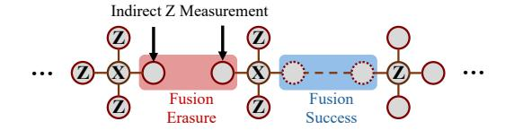

# A. Baselines

1) Boosted Fusion Schemes: In the first part, we select baselines within the same architecture – quantum spin memory. We evaluate our tree-encoded fusion scheme through comparison with two mainstream boosted-fusion schemes introduced in Sec. IV.A: the **redundantly-encoded fusion** [25] and **repeat-until-success (RUS) fusion** [21], [40]. We implement their up-to-date protocols according to the most recent research [12] and integrate them into our compiler framework. Based on the analysis and simulation from the

Fig. 7. Addressing erasure error in OneAdapt-ET.

papers [12], [25] of these schemes, we choose the code sizes  $m_{Redun}=5$  and  $m_{RUS}=6$  for optimal error-tolerance performance.

2) SOTA MBQC Compiler: In the second part, we select the baseline from other MBQC architectures, namely the allphotonic and emitter-based architectures.

We compare our framework with the SOTA compiler of the all-photonic architecture – **OneAdapt** [74]. Furthermore, we improve OneAdapt by designing an erasure-tolerance scheme and integrating the scheme into it, namely **OneAdapt-ET**. OneAdapt-ET addresses the qubit that undergoes fusion erasure by applying an indirect Z-measurement based on the graph state property introduced in Sec. IV.B. Specifically, we apply an X-measurement on a neighboring free qubit that is not involved in the normalization path, then apply a Z-measurement on all other adjacent qubits of this neighboring free qubit. The scheme of OneAdapt-ET is depicted in Fig. 7.

For a fair comparison, we set the configuration of the time-like edge length limit  $D_f$  in OneAdapt and OneAdapt-ET as  $D_f=30$  virtual layers, strictly following the evaluation settings in [74]. A recent experimental demonstration [52] from PsiQuantum claims a 125 MHz photon source pumping rate in their all-photonic architecture. While in OneAdapt, each virtual layer includes 4 physical photon resource layers (PL=4), and the maximal duration of the time-like edge is 960 ns. Correspondingly, we set our maximal delay to 32 emission layers, since the maximal emission time of each caterpillar state layer is 30 ns, according to the experiments in [25]. Additionally, we set the resource state layer (RSL) of OneAdapt/OneAdapt-ET as  $14n \times 14n$  2D size, according to the source code of OneAdapt.

We select the SOTA compilation framework **RLGS** [38] for the emitter-based architecture. Although the emitter-CZ operation is still out of reach in real experiments, we can still compare it as a long-term future architecture. Due to the distinctive hardware of emitter-based architecture, RLGS uses a set of different metrics [38]. Hence, we compare with RLGS specifically on fidelity metrics reported in their paper: (1) Fidelity affected by decoherence error  $(F_{de})$ , and (2) Fidelity affected by emitter-CZ  $(F_{CZ})$ , which corresponds to the fidelity affected by fusion  $(F_{fus})$  in our framework.

## B. Benchmark Programs

We select a set of benchmark programs, including the Bernstein–Vazirani algorithm (BV), the Quantum Approximate Optimization Algorithm (QAOA), Grover's Algorithm (Grover), the Quantum Fourier transform (QFT), quantum Hamiltonian simulation (QSIM), the Ripple Carry Adder (RCA), and the

Variational Quantum Eigensolver (VQE). In the comparison with redundantly-encoded and RUS fusion schemes, we set the size of the benchmark program from 2-qubits to 20-qubits. This is because these two baselines of fusion schemes have a prolonged execution time, which is out of reach in simulation. For the comparison between our compiler and OneAdapt [74], we use exactly the same benchmark programs and settings, with program sizes of 36, 64, and 100-qubits.

