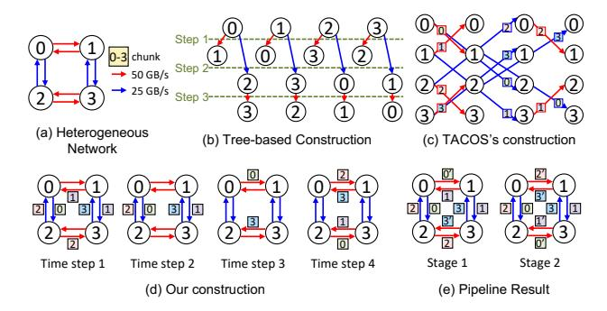

# *C. Motivation Example*

We illustrate our synthesis strategy based on pipeline optimization through an example. Consider a heterogeneous network with two bandwidth configurations, where the faster link operates at twice the speed of the slower one. As shown in

Fig. 2. Illustration of All-Gather using different algorithms in a heterogeneous network with two distinct bandwidth configurations. Each node starts with one chunk (represented by a square labeled 0–3) and broadcasts it to others.

Figure 2(a), a send operation over the slower link requires two time steps. We use the All-Gather collective as an illustration, which requires broadcasting the data from every node (0-3) to all other nodes. The spanning tree strategy, as used in MultiTree, can be extended to distinct bandwidth. Specifically, the All-Gather is decomposed into four concurrent broadcasts, where each tree rooted at x disseminates the data of node x. As shown in Figure 2(b), this tree-based approach constructs four spanning trees with two types of edges, each requiring three steps. TACOS [63] introduces the concept of a Time-Expanded Network and proposes a link-chunk matching algorithm based on a random and greedy strategy. As shown in Figure 2(c), TACOS greedily utilizes all available channels at each time step, where each edge denotes a data transfer. However, TACOS's heuristic decision-making often results in a suboptimal schedule where the critical path is inadvertently dominated by slower links, limiting overall communication efficiency.

Here, both MultiTree and TACOS achieve only 67% average link utilization due to bandwidth underutilization—primarily caused by long communication paths over slower links. The key idea behind PipeComm is to maximize utilization by overlapping multiple chunks. Although TACOS supports limited overlapping by partitioning chunks before synthesizing, its greedy heuristic often results in a suboptimal critical path.

To address these inefficiencies, PipeComm leverages pipeline techniques to improve link utilization while keeping synthesis time and program scale manageable. As shown in Figure 2(d), PipeComm constructs a conflict-free schedule with a logical depth of four steps. In each step, the notation x represents the transfer of node x's data, which must be broadcast to all other nodes. Although the time required for a single chunk increases, a new communication can be instantiated every two steps, effectively overlapping operations. Figure 2(e) illustrates the steady-state pipelined execution where all available links are fully utilized. In this diagram, the notation x represents the transfer of node x's data for the current i-th iteration, while x' denotes the data transfer for the previous iteration (i-1) that is still in flight. With an initiation interval (II) of 2, the operations for the i-th iteration span

Fig. 3. Overview of PipeComm

logical steps 2i+1 to 2i+4 in the unfolded timeline. Crucially, the pipeline stages are interleaved such that resources used in Step 1 (modulo II) are reused in Step 3 for the subsequent iteration, and similarly for Steps 2 and 4. Compared to the TACOS schedule which requires 3 steps per operation, our approach achieves a steady-state throughput of one operation every 2 steps, yielding a  $1.5\times$  speedup.

#### IV. OVERVIEW

Figure 3 presents an overview of PipeComm. The synthesis process takes a logical communication specification as input and generates a concrete communication algorithm tailored to the physical topology. We first define high-level primitives—including communication operations and scheduling directives—that allow users to specify optimization targets such as II and topology constraints. Based on these constraints, we formulate an optimization problem and solve it using a two-phase synthesis procedure.

In the first phase, PipeComm constructs communication patterns such as broadcast and reduce, represented as directional spanning trees either scattered from or aggregated to a root node. To automatically generate optimized patterns, we employ a Mixed-Integer Linear Programming (MILP) formulation that ensures optimality, assigns efficient depth levels, and mitigates network congestion. The MILP formulation incorporates both workload characteristics and system topology to synthesize communication schedules that minimize latency and maximize bandwidth utilization. In addition to the solver-based approach, we present an incremental strategy that iteratively refines the schedule by gradually increasing the II. This approach balances performance with computational overhead, avoiding the inefficiency of exhaustive search while still enabling effective pipeline optimization.

In the second phase, PipeComm performs pipeline schedule generation, assigning concrete, conflict-free scheduling steps to minimize per-iteration latency. To further reduce synthesis time, construction primitives can guide the scheduling process before pipeline generation. Key techniques, such as interleaved pipelining, pattern reversal, and expansion strategies, enhance efficiency by refining the initial design into a more optimized communication pattern.

Fig. 4. Illustration of the pattern construction procedure: (a) The 2D mesh topology; (b) A candidate construction using two separate broadcast patterns; (c) An optimized construction that overlaps broadcast and reduce operations; (d) A simplified visualization of the interleaved AllReduce execution. The solid colored edges correspond to the primary pattern, while the dotted edges represent the reversed pattern (exploiting the duality of broadcast and reduce) to complete the full AllReduce operation.

## V. PIPELINE SYNTHESIS

We design a pipeline synthesis procedure to carefully balance resource usage and minimize conflicts through precise coordination of data chunk transmissions. Our approach explicitly accounts for heterogeneous network constraints and communication dependencies. We decompose the synthesis process into two optimization phases: 1) Communication Pattern Construction: We first determine the optimal communication pattern for each data chunk without committing to specific transmission time steps. This phase ensures that data transmissions are distributed efficiently across available link resources; 2) Pipeline Schedule Generation: Given the communication pattern, we then assign specific transmission steps to each data chunk, ensuring conflict-free scheduling with a minimized time step.

### A. Communication Pattern Construction

Collective communication defines which data chunks are required at each node in the network, but it does not inherently specify the exact communication pattern used within the physical network topology. In real-world networks, the situation is further complicated by distinct link bandwidth, asymmetric connections, and potential congestion points. A naive mapping of collective communication to the network can lead to inefficient bandwidth utilization and bottlenecks.

To maximize communication efficiency, it is crucial to determine precise data-transfer paths for each chunk, selecting routing strategies that avoid conflicts among overlapping transmissions. This challenge becomes significantly harder under pipelined execution, where multiple iterations proceed concurrently, increasing the risk of network congestion. As shown in Figure 4, our approach constructs multiple communication patterns that collectively cover the original topology while maintaining a fixed throughput. Each pattern corresponds to either a broadcast (red) or reduce (blue) operation, illustrated in Figure 4(b)(c). We begin by constructing the patterns using

broadcast operations only, and then derive the corresponding reduce procedures by reversing the broadcast patterns.

1) MILP Encoding: We first propose a Mixed-Integer Linear Programming (MILP)-based approach to construct an optimal communication pattern to maximize bandwidth utilization. The primary decision variables in this formulation are: 1)  $x_{s,e}$ : A binary variable indicating whether edge e is used for the collective communication of pattern s; 2)  $l_{s,v}$ : A nonnegative real variable representing the depth of node v in the communication pattern s. The following constraints are used to model the communication pattern construction We propose a Mixed-Integer Linear Programming (MILP)-based approach to construct an optimal communication pattern.

$$\forall s \in R, e \in E, x_{s,e} \in \{0,1\}$$
  
$$\forall s \in R, v \in V, l_{s,v} > 0$$
 (1)

where R is the set of communication patterns, E and V are the set of edges and nodes in the network, respectively.

Each node, except for the root node  $root_s$ , must receive data exactly once. This ensures that the data propagates efficiently throughout the network:

$$\forall s \in R, v \in V, \sum_{\substack{e = (u, v, w) \\ \land e \in E}} x_{s, e} = [v \neq root_s]$$
 (2)

We establish the depth of each node in the communication pattern rooted at  $root_s$ , ensuring a valid hierarchical structure. Each root node s is assigned a depth of zero:

$$\forall s \in R, l_{s,root_s} = 0 \tag{3}$$

Let w denote the transmission delay for a single data chunk on link e, derived from its bandwidth BW (i.e., chunk size divided by BW). The depth of node v is determined relative to its predecessor node u through the selected edge e = (u, v, w). If edge e is used in the communication pattern, the depth constraint ensures that the node v's depth is set appropriately:

$$\forall s \in R, e = (u, v, w) \in E$$

$$l_{s,v} \le l_{s,u} + w + M * (1 - x_{s,e})$$

$$l_{s,v} \ge l_{s,u} + w - M * (1 - x_{s,e})$$
(4)

where M is a large margin used to relax the constraint when  $x_{s,e}=0$  (i.e., when edge e is not selected in pattern s).

To prevent congestion introduced by overlapping communications in a pipelined execution, we impose a constraint on the utilization of each network link. Let II denote the initiation interval, representing the time interval between injecting two consecutive chunks. To ensure that the network resources are not overutilized, the number of chunks scheduled on link e within one II must not exceed the link's temporal capacity:

$$\forall e = (u, v, w) \in E, \sum_{s \in R} x_{s,e} \le \frac{II}{w}$$
 (5)

Objective Function: The goal of the optimization is to minimize the overall depth, denoted by y, which directly influences the length of the longest communication path in the pipeline. By reducing the depth y, we aim to optimize the latency of data transfers and improve the efficiency of data propagation across the network. This is formalized by the following constraint, which ensures that the depth of each node v is bounded by the maximum depth y:

$$\forall s \in R, v \in V, y - l_{s,v} \ge 0 \tag{6}$$

When the root is not fixed, the constraints in Equation 2 can be reformulated such that the total number of selected edges equals the number of nodes minus one, ensuring a connected spanning structure. Additionally, each node can receive data at most once, preventing redundant communication. This formulation naturally generalizes to other collective operations by adjusting the correctness constraints accordingly. By solving this MILP formulation, we can derive an optimal communication pattern that minimizes congestion, and ensures efficient data transfer across the network.

*2) Incremental Strategy:* To improve the scalability of pattern construction, we propose an incremental strategy that efficiently explores the search space while balancing performance and computational overhead. Instead of exhaustively searching for an optimal communication pattern from the outset, our approach incrementally refines the pattern by iterating over increasing values of the II. This method reduces computational complexity while progressively enhancing communication efficiency. The algorithm begins with the smallest feasible II and increases it step by step. As II grows, the communication capacity allocated to each edge is dynamically adjusted (Equation 5). At each iteration, the algorithm finds new valid communication patterns based on the residual graph, which represents the available network bandwidth and connectivity constraints. If a feasible pattern is identified, it is incorporated into the existing set of patterns. The final output is the candidate that achieves the optimal link utilization, ensuring efficient data transmission.

By adopting this incremental approach, the algorithm significantly enhances scalability, making it well-suited for largescale distributed systems. Instead of conducting an exhaustive search over the entire design space, it incrementally refines solutions, enabling efficient exploration and utilization of underused communication links. This strategy is particularly effective for pipeline communication with large II values, enabling robust performance across topologies.

*3) Reduce & Broadcast Overlapping:* Many approaches [20], [27], [51], [60], [63] decompose the AllReduce procedure into two phases, such as ReduceScatter followed by AllGather. These phases are typically implemented by reversing the communication pattern of the other. However, it limits optimization opportunities due to the inherent symmetry of the AllGather phase. In contrast, we decompose AllReduce into reduce and broadcast phases, enabling overlapping between them.

Pipeline techniques naturally enable such optimizations by leveraging the inherent overlapping behavior. Rather than treating the two phases as independent steps, pipelining allows reduce and broadcast operations to proceed concurrently, maximizing resource utilization and minimizing overall communication latency. As shown in Figure 4(c), the 3 × 3 2dmesh can be decomposed into two broadcast patterns and one reduce pattern. Together, these three patterns fully cover the entire topology while maintaining the II as 1. In contrast, without overlapping, the topology can generate only two broadcast (or reduce) patterns, limiting the ability to optimize bandwidth utilization. This restriction significantly hinders performance, as fewer concurrent communication streams lead to underutilized network resources.

For the incremental approach, we simultaneously consider the broadcast and reduce operations, iteratively refining the communication on the residual graph. For the MILP-based approach, we modify the formulation about the correctness constraint (Equation 2). Instead of ensuring that each node receives the data exactly once, we revise the constraint to enforce that each node sends the data at most once:

$$\forall s \in R, u \in V, \sum_{\substack{e = (u, v, w) \\ \land e \in E}} x_{s, e} = [u \neq root_s] \tag{7}$$

By exploiting the duality of collective operations, we can derive the counterpart Reduce pattern simply by reversing the direction of the synthesized Broadcast pattern (and vice versa). Consequently, the full AllReduce operation is constructed by interleaving the primary patterns with their reversed counterparts. This creates two concurrent communication flows proceeding in opposite directions: the Reduce phase aggregates gradients towards the root, while the Broadcast phase disseminates the aggregated result back to all nodes. Crucially, these phases are overlapped together within the same pipeline structure. Figure 4(d) visualizes this interleaved strategy, where solid edges represent the primary flow and dotted edges represent the reversed flow. Although managing two flows increases resource contention, our solver optimally adjusts the initiation interval to accommodate the combined traffic without compromising overall link efficiency, thereby maximizing the aggregate throughput.

