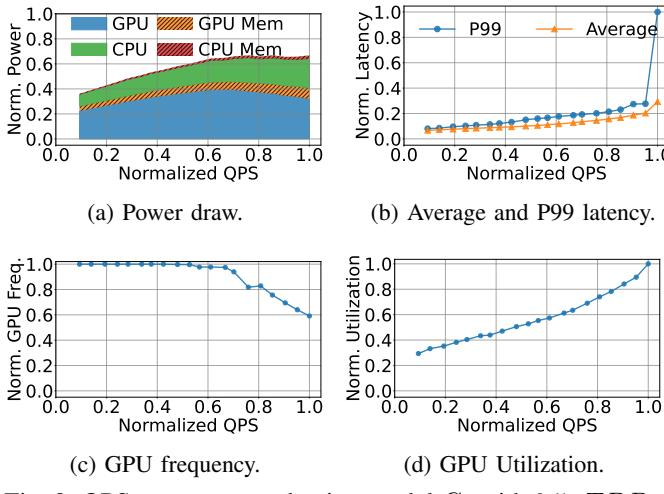

# A. Load Testing on Representative Models

We perform inference load testing for the selected models on AI Inference servers. For these experiments, we leverage the load-testing infrastructure. In each test, we gradually increase the query rate until the system fails to meet its SLO for P99 tail latency. During the test, we continuously monitor system metrics, including GPU utilization, GPU power draw, and end-to-end inference latency.

Fig. 8 presents data for the three selected models. We normalize all values to their maximum, hence the y-axes across plots are in the 0-1 range. We observe a congruence in the shape of the QPS, GPU utilization, and GPU power draw curves, which is consistently observed across all load-tests. QPS-utilization and QPS-power closely fit a linear regression model, indicating a strong linear correlation among these properties— $R^2$  values range between 0.71 and 0.94, and are quoted in Fig. 8's caption.

The correlation between QPS, utilization, and power usage is intuitive. As load increases, GPU utilization and power consumption grow. Our measurements empirically confirm that the correlation between the fields is effectively *linear*, allowing for simple power management schemes to be efficient at production datacenters.

Fig. 8d quantifies P99 latency as a function of load, which follows a typical shape: latency increases mostly linearly with

load, with inflection points at high load where latency spikes, which indicate that server is unable to keep up with the arrival rate and starts experiencing longer queuing delays.

Overall, this set of experiments shows that, within the operational range before saturation, GPU utilization, which is an *application-agnostic signal*, can serve as a practical proxy for managing power consumption and understanding its impact on performance (i.e., tail latency), in production environments.

#### B. A Closer Look at Single AI Inference Server

Next, we conduct a detailed study on an isolated AI Inference server, enabling fine-grained measurement and configuration. We select two high-impact models,  $C_1$  and  $C_2$ , which are different variants of *Model C*. The server is an Nvidia Grace Hopper system [31], equipped with an integrated H100 GPU and a Grace CPU.

For each model, we incrementally increase the input load (QPS) while keeping all driver configurations at their default settings. TDP limit control is one of mechanisms for power management in these GPUs. Hence, we repeat the experiment across a range of configurable TDP limits, from the maximum hardware allowed value  $(TDP_M)$  to lower settings.

Behavior at the maximum TDP is similar to those observed in Fig. 8. We note that latency inflection and SLO violations occur before the server reaches its power cap. Prior to the saturation point, total server power draw increases linearly with load. By instrumenting the server, we also measure the power consumption of individual components: GPU, GPU memory, CPU, and CPU memory. For model  $C_1$ , the power breakdown remains consistent across loads: GPU (65%), GPU memory (10%), CPU (22%), and CPU memory (3%). Model  $C_2$  exhibits a similar per-component power draw ratio, but the absolute power draw differs considerably.

Fig. 9 presents results for model  $C_1$  at a reduced TDP of  $0.5 \times TDP_M$ , revealing a more nuanced behavior. This setting is common in power-oversubscribed environments. Fig. 9a shows the component-wise power usage as load increases. As the server approaches its power limit, GPU power usage drops,

Fig. 9: QPS sweep on production model  $C_1$  with  $0.5*TDP_M$ .

while the other components continue to rise. This is due to a reduction in GPU frequency  $(f_G)$ , which can fall to 55% of its maximum  $(f_{GM})$ , as shown in Fig. 9c. This behavior is attributed to voltage and frequency scaling (DVFS) [26], [45], employed by the system to enforce the power cap.

As the power limit is reached and GPU frequency decreases, GPU utilization increases more steeply, diverging from the linear trend. This is because, at lower frequencies, the GPU takes longer to process the same load, increasing both utilization and request latency. As a result, requests queue and SLO violations occur at lower loads, as shown in Fig. 9b, with power now acting as the primary bottleneck. In these plots, we omit other models for brevity, as they exhibit qualitatively similar trends.

From these sweep tests and available documentation, we infer that the baseline server-level power control scheme relies on DVFS, but only modulates the GPU frequency when power usage approaches the TDP limit. The driver exclusively adjusts the GPU frequency, while the CPU frequency remains fixed at its maximum value  $(f_{CM})$ . As a result, both the GPU and CPU operate at their respective maximum frequencies  $(f_{GM})$  and  $f_{CM}$  at all other times, regardless of the actual workload, until the GPU frequency is capped.

Notably, when no models are loaded and the server is idle, the GPU frequency drops to a semi-idle state (20% of  $f_{GM}$ ). However, as soon as a model is loaded, even if there are no queries, the frequency immediately returns to  $f_{GM}$ , leading to unnecessary power consumption during idle periods.

These findings expose opportunities for improved power management. The current scheme only reacts to power limits and does not proactively optimize for power efficiency under varying loads, leaving power savings untapped. For the remainder of this paper, we experiment with frequency limits directly, rather than power limits, to isolate potential interferences and conflicting settings, given the presence of a built-in power management mechanism from the vendor.

Fig. 10: Heatmap of power usage in minimum power configuration relative to power usage of baseline for production models  $C_1$  and  $C_2$  with varying QPS and SLO.

#### IV. UNDERSTANDING POWER SAVING OPPORTUNITY

In this section, we explore the theoretical power savings achievable by fine-tuning server parameters for each application, given its input load and SLO. The goal is to reduce CPU and GPU power draw while meeting the service's SLO. We perform this characterization with the same inference models and hardware used in production.

To empirically determine the minimum power settings that meet the SLO, we sweep over GPU and CPU frequencies for each input QPS and SLO. We set GPU frequency from 53% to 100% of  $f_{GM}$  (in discrete steps defined by the driver), and CPU frequency from 71% to 100% of  $f_{CM}$ .

Although both GPU and CPU frequencies can be further reduced, we did not observe any additional power savings due to the limitations imposed by static leakage power and voltage scaling. Since the workloads examined are relatively insensitive to changes in CPU frequency we choose to make the CPU frequency sweep less granular.

Fig. 10 presents the ratio between the power usage under frequency control (i.e., the optimal setting) and the baseline, across different QPS and SLO configurations for models  $C_1$  and  $C_2$ . The findings suggest that more lenient SLOs allow more power savings: lowering frequency reduces power consumption at the cost of higher latency, and relaxed latency constraints provide more opportunities for power reduction.

For instance, in model  $C_2$  with a fixed load of maximum QPS (1.0), we find that an SLO of  $0.5 \times SLO_{max}$  cannot be met by any CPU/GPU frequency setting. However, when the SLO is set to  $SLO_{max}$ , the optimized frequency setting achieves a 30% reduction in power consumption compared to a system operating at maximum frequencies.

Similarly, lower QPS enable greater power savings, as the server can operate at lower frequencies when handling fewer requests. At higher loads, the server must operate at higher

Fig. 11: Theoretical power draw with per-epoch optimal CPU and GPU frequencies for  $C_1$ , compared against the baseline.

frequencies to keep up with demand, leaving less opportunity for power reduction. This effect is compounded by the fact that latency also increases with QPS, further limiting the potential for power savings at high loads.

While overarching patterns are consistent across the two models, the optimal frequency, power settings, and the measured latencies, exhibit substantial discrepancies. For instance, we note that model  $C_2$  is more compute intensive; hence, it cannot meet the tight SLO deadlines at higher QPS loads even with the highest CPU/GPU frequency. Consequently, it also shows lower power savings with optimal frequency settings compared to model  $C_2$ . This observation further highlights the need for model-specific tuning.

To further evaluate the theoretical power savings in a dynamic, production-like scenario, we generate a load pattern that fluctuates over time. Specifically, we conduct an hour-long experiment with model  $C_1$ , during which we induce varying QPS values at each epoch (lasting  $\approx$ 4 minutes,) to mimic the observed load patterns from production driving QPS from zero up to the maximum sustainable value.

We measure the baseline power consumption throughout this load trace. To determine the theoretical minimum power, based on the earlier frequency sweep results, we ensured that the server can operate at the minimum power to meet the SLO for the given load at each discrete sampled point. Specifically, we set the P99 latency limit to be the highest sustainable load achieved when the server operates at is maximum frequency.

Fig. 11 presents the computed theoretical minimum power consumption across the evaluated load profile, alongside the measured baseline power draw. On average, the theoretical minimum achieves a 30% reduction in power consumption compared to the baseline under this workload. Power savings are most pronounced at lower load levels, where increased latency slack relative to the SLO enables more aggressive frequency scaling and, consequently, greater power efficiency.

Due to space constraints, we omit results for  $C_2$ . We note that the  $C_2$  model achieves a similar power reduction of 31%, although with different frequency scaling configurations.

Alternative Potential Power Saving Opportunity: An interesting observation suggests a tangential direction to investigate for power saving. At lower QPS, the server can have its frequencies further reduced, resulting in sub-linear power scaling. In other words, serving half of the maximum load can consume less than half of the total server power. For

example, if the power required to handle the maximum QPS while meeting  $0.75 \times SLO_{max}$  is  $P_{MQ}$ , then handling half the QPS at the same SLO requires only  $0.37 \times P_{MQ}$ . This implies that, in theory, distributing the same total QPS across two GPUs, each operating at lower load, could achieve the same throughput and SLO using only 74% of the power.

This non-linear power saving is not observed when simply varying QPS at a fixed frequency. Instead, it is enabled by actively controlling the operating GPU and CPU frequencies. While it is not practical to double the number of servers for the same workload given current hardware costs, this insight shows the potential for further power savings through smarter workload distribution and frequency scaling. Further investigation into the underlying causes, such as serialization, batching, or architectural bottlenecks, could reveal additional opportunities to improve future server designs.

