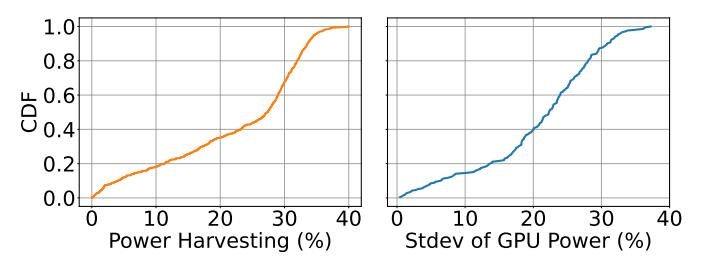

# D. Opportunity for Server-level Power Harvesting

To quantify the potential for more dynamic and efficient power allocation across components in a compound AI Infer-

Fig. 4: Power draw of 8 GPUs within an example server running production workload over a day.

Fig. 5: Normalized power draw across CPU and GPU components across AI Inference servers.

ence server, we perform two analyses across fleet.

First, we analyze the diversity in power draw between CPUs and GPUs across servers. Fig. 5 presents a scatter plot of CPU versus GPU power draw for each server at the peak total server power during a day. The plot reveals substantial diversity: while some servers are clearly GPU-bound, operating near their GPU power limits, others are CPU-bound, with the CPU power being close to its cap, while GPUs are underutilized. This diversity is a direct consequence of the heterogeneous mix of services and models described above.

Second, we examine the power usage across GPUs within the same server. For each server, we measure the maximum power draw of each of its 8 GPUs at the time of peak server power usage. We then assess whether GPUs operating below their TDP limit could effectively lend unused power to other GPUs, up to their physical maximum power cap.

Fig. 6 quantifies this aggregate power imbalance. On the left, we show the CDF of power harvesting defined as the amount of additional power that could be dynamically real-located among GPUs to better match workload demands. On the right, we show the CDF of normalized standard deviation in power draw across same-server GPUs. Both values (power harvesting and stdev) are normalized to the GPU TDP.

Fig. 6(right) shows that power draw across same-server GPUs has large variability and is highly imbalanced. Fig. 6(left) reveals that inter-GPU TDP allocations in most AI Inference servers leave significant power unused. For example, in over 60% of the fleet's servers, 20–40% of the TDP allocated to some GPUs is unused. This substantial power budget could be harvested and reallocated to other power-constrained GPUs within the same server. Hence, our analysis suggests there is substantial headroom for *server-level power harvesting*. A mechanism that dynamically and flexibly reallocates such harvested power budget between each AI Inference

Fig. 6: CDFs of power harvesting opportunities across sameserver GPUs (left) and standard deviation in power usage across same-server GPUs (right). Values are normalized to the per-GPU TDP.

Fig. 7: CPU vs GPU utilization for three different production models running real-world traffic.

server's CPUs and GPUs has the potential to substantially improve fleet-wide efficiency and service performance.

In § V, we present a mechanism that leverages this opportunity to maximize performance/Watt by dynamically harvesting and redistributing unused power budget within each server. Specifically, under a fixed module/server power cap, we divert power budget from underutilized CPUs/GPUs to power-limited components where additional power supply yields the highest marginal performance, improving the overall server efficiency.

