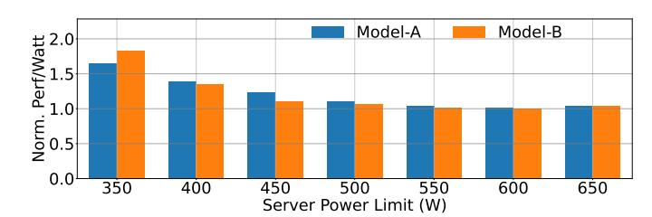
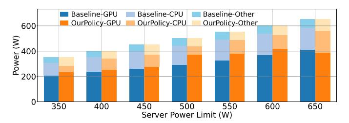
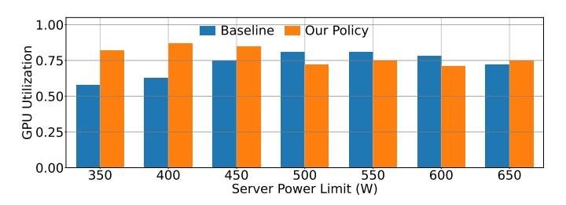
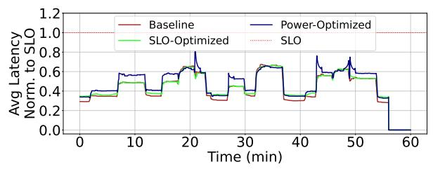
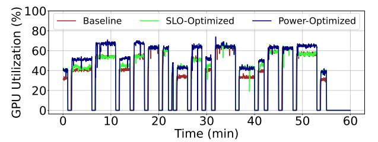

# VI. CASE STUDIES

In this section, we first evaluate the effectiveness of our module-level power sloshing algorithm (Alg. [1\)](#page-7-0) across a range of module power limits and workload characteristics, to quantify how well it reallocates power between CPU and GPU under different power-constrained scenarios. Then, we run the system at the maximum module power limit and evaluate power savings and SLO impact. Our goal is to demonstrate that even a simple, utilization-driven scheme can yield immediate power savings with minimal implementation effort, while also establishing a new baseline for future, more advanced power management strategies.

Experimental Setup. For a consistent comparison, we use the same server hardware (NVIDIA Grace Hopper system [\[31\]](#page-13-4) with an H100 GPU and a Grace CPU). In terms of workloads, in addition to AI models characterized in § [III-B](#page-4-1) (A, B, C1, C2), we test another high-impact inference model, D1, in order to showcase how the simple schemes perform in different loads, and to gauge workload-specific optimization opportunities. The input load trace is the one illustrated in Fig. [11.](#page-6-1) This trace is designed to exercise the system across a broad spectrum of operating conditions, including periods of low, moderate, and high load, as well as abrupt transitions between these states.

**Stress Testing.** To assess the robustness of our approach, we intentionally include stress scenarios that push the system beyond its typical operating envelope. We posit that evaluating under such conditions, where the baseline itself may experience SLO violations, provides deeper insight into the true performance boundaries and resilience of the power management scheme. The load trace includes multiple transitions, ranging from idle (zero load) to loads approaching or exceeding the maximum sustainable QPS. Inclusion of extreme load spikes ensures our design meets quality of service (QoS) targets in all expected live query traces.

**Metrics.** We evaluate each configuration by measuring two metrics: (1) average power consumption, and (2) the fraction of queries violating the SLO. The SLO is defined as the 99th percentile latency observed at the highest sustainable load with the server operating at maximum frequency, consistent with the Baseline configuration, allowing for a direct comparison of power savings and QoS across all schemes.

**Evaluated Schemes.** We implement and evaluate two variants of our utilization-based power management algorithm as described in per-model target utilization selection in § V: *SLO-Optimized* scheme and *Power-Optimized*. Both variants follow the same control mechanism described in § V, differing only in their target utilization thresholds. Contrasting results of the two variants serves as a sensitivity analysis that provides insights into the tradeoff of QoS and power savings.

We compare both variants against two schemes. *Baseline* is the default configuration with static, maximum frequency and no dynamic power management. *Theoretical Minimum* is the idealized lower bound on power draw (§ IV) where frequency is optimally tuned at each load without overheads.

#### A. Evaluation Results

Server Power Budgeting. We first evaluate the server-level power budgeting algorithm (Alg. 1) on production hardware and two production models. Server power limit refers to the maximum combined power of all components, i.e., CPU, GPU, and other (such as memory). We perform a sweep on the server power limit and compare an out-of-the-box baseline against our workload-aware policy that dynamically apportions power between CPU and GPU. Fig. 12 shows the Performance/Watt improvement of our proposed solution over the Baseline across different server power limits. We define performance as the highest load (QPS) the system can support without violating SLO. Then, Performance/Watt is scaled by the total server power. Across models and server power limits, our system outperforms the Baseline by up to 1.83×. The gains are higher under tighter power caps, where misallocation is less forgiving.

To explain these gains, Fig. 13 reports the component-level power distribution (CPU vs GPU). Due to space constraints, we present results only for Model-A, while Model-B follows similar trends. Compared to the Baseline, our policy consistently shifts budget away from the less power-sensitive component toward the bottlenecked component (from CPU

Fig. 12: Performance/Watt of our proposed policy for two production models normalized to that of Baseline.

Fig. 13: Power split across components with different server power limits for *Model-A*, with Baseline and with our policy.

to GPU in this case). Thus, the system avoids wasted power headroom and improves throughput per watt.

Finally, Fig. 14 shows GPU utilization for Model-A under the Baseline and our policy across server power limits. Under tight power budgets, the Baseline often assigns an insufficient share of the server budget to the GPU, leaving it power-throttled and underutilized, despite being needed for high throughput. In contrast, our workload-aware policy consistently allocates enough power for the GPU to run near its efficiency-optimal operating point, sustaining high utilization (around  $\sim$ 75%) and thereby translating the available budget into higher throughput. As the server power limit increases, the gap narrows: once the system is no longer power-constrained, both the baseline and our policy converge to similar GPU utilization levels and comparable behavior.

**Power Consumption.** Next, we evaluate power savings when the module is not power constrained. Fig. 15 shows the power consumption profiles of all evaluated schemes over the course of the dynamic load trace for  $C_1$ . The *Theoretical* scheme, which represents an idealized lower bound with perfect, instantaneous frequency tuning, consistently achieves the lowest power usage, illustrating the opportunity for power savings relative to the *Baseline* configuration.

Fig. 14: GPU utilization under baseline and under our policy with different server power limits.

Fig. 15: Server power draw for  $C_1$  over time in schemes: Baseline, SLO-Optimized, Power-Optimized, and Theoretical.

Fig. 16: P99 latency over time for the evaluated schemes in  $C_1$ . Latency is normalized to its SLO value.

Both the *Power-Optimized* and *SLO-Optimized* schemes, which implement our practical utilization-based control, maintain power consumption well below the baseline throughout the experiment. Notably, their power profiles closely track the theoretical minimum, particularly during moderate and low load. Averaged over the one-hour run, the *Power-Optimized* scheme reduces total power consumption by 24%, while the more conservative *SLO-Optimized* variant achieves an 11% reduction. These results demonstrate that efficiency gains are possible even with simple, deployable mechanisms.

At high load levels, as the system approaches the maximum sustainable QPS, both practical schemes converge to the Baseline, as they must operate at maximum frequency to avoid SLO violations. Under these conditions, the aggressive *Power-Optimized* scheme offers little to no additional benefit compared to the *SLO-Optimized* scheme, since any further frequency reduction would compromise latency guarantees.

In contrast, the theoretical minimum continues to realize modest power savings even near peak load, as it can exploit the non-linear relationship between frequency and power, where small reductions in frequency yield power savings due to the superlinear scaling of dynamic power with frequency. However, in practice, the aggressive scheme cannot reliably detect or respond to such fine-grained load variations in real time, and thus defaults to peak frequency as soon as the load nears the system's capacity limit.

**SLO Attainment.** We next evaluate the impact of power management schemes on QoS, as measured by SLO compliance. Our primary metric is the fraction of intervals in which the P99 latency exceeds the SLO threshold. This metric reflects the proportion of time intervals where at least 1% of requests failed to meet the latency target. By the experiment's design, query arrival rate is constant per load level. Since query count per interval is about the same, the fraction of *SLO-violating intervals* is a stricter a metric than the fraction of *SLO-violating queries*.

Fig. 16 shows the P99 latency over time for the evaluated schemes for  $C_1$ . Under the stress-test workload, *Baseline* 

exhibits SLO violations in 4% of sampled intervals, confirming the challenging nature of the load trace. The conservative (*SLO-Optimized*) scheme closely tracks the Baseline, with SLO violations in 5% of intervals which is only a marginal increase. These results demonstrate that power savings can be achieved with minimal impact on QoS.

In contrast, the aggressive (*Power-Optimized*) scheme shows an increase in SLO violations, with 14% of intervals exceeding the latency limit. Violations occur more frequently, and the magnitude of latency spikes is higher. These results indicate that while the aggressive configuration maximizes power savings, it does so at the expense of SLO robustness, making it less suitable for latency-sensitive or highly variable workloads.

As expected, the majority of SLO violations and latency spikes are concentrated around periods of abrupt load increases, when the system must scale up resources to maintain performance. While the overall trends are consistent, we observe occasional non-deterministic behavior. For example, around the 43-minute mark, the Baseline configuration exhibits a higher P99 latency than the conservative scheme, despite always operating at equal or higher frequency. Such anomalies likely arise from transient effects in workload scheduling or queuing. For instance, brief imbalances in request distribution can lead to temporary queue build-up on certain servers, amplifying tail latency. Additionally, contention for shared resources, such as memory bandwidth or I/O, can momentarily degrade performance, even when CPU or GPU frequencies are not the limiting factor.

**Average Latency.** Fig. 17 shows the average latency over time. Across all evaluated schemes, the average latency remains well below the SLO threshold throughout the experiment, even during periods of high load or frequent transitions.

**Resource Utilization.** Fig. 18 shows the GPU utilization profile for the evaluated schemes. Both the conservative and aggressive power management schemes maintain higher and more stable GPU utilization compared to the Baseline, except during periods of zero load. This reflects the effectiveness of the control loop in keeping the GPU operating closer to its

Fig. 17: Average latency over time for  $C_1$  in the evaluated schemes, normalized to its SLO value.

Fig. 18: GPU utilization for  $C_1$  int the evaluated schemes.

target utilization range, thereby improving power efficiency. CPU utilization also increases slightly under the power management schemes, but the effect is less pronounced.

**Results for Additional Models.** Fig. 19 shows the normalized average power usage across different models with each scheme. We observe similar trends to  $C_1$  in both  $C_2$  and  $D_1$ , with slightly reduced gains. Both models achieve 8% and 19% reduction in power consumption in *SLO-Optimized* and *Power-Optimized* respectively. We speculate that workload-specific characteristics, such as ratio of CPU power consumption, affect variance in power saving.

For  $C_2$ , SLO-Optimized maintains the QoS with SLO violations increasing from 9% in the Baseline to only 10%. With Power-Optimized, SLO violations rise to 12%.

In contrast to the C models,  $D_1$  shows no SLO violations across the Baseline, SLO-Optimized, and Power-Optimized schemes: service latency for  $D_1$  is lower than other workloads, which helps sustain shallower query queues in sudden load bursts.  $D_1$  maintains perfect QoS, and could potentially benefit further from a more aggressive power-saving scheme.

**Power Overhead of the Algorithm.** To evaluate the efficiency of our practical scheme, we assessed its impact on both system power and performance. We validate that our implementation is lightweight and introduces negligible overhead with an experiment measuring power consumption and latency under two conditions: zero load and maximum load, with and without the algorithm enabled. For the Baseline comparison, we manually matched operating frequencies to those observed when the algorithm was active. The results indicate no measurable difference in power consumption between the two scenarios. Additionally, at maximum load, we did not observe any difference in system latency.

**Multi-GPU Server Implications.** Modern GPU servers house 4–8 GPUs operating under a shared server-level power budget. Accordingly, our approach monitors utilization and power of each GPU (and CPU) and *redistributes* the available budget across them, from relaxed GPUs to power-limited GPUs,

Fig. 19: Server Power Usage for the evaluated benchmarks at each configuration, normalized to the baseline.

rather than treating each GPU in isolation. The control logic operates per GPU with  $\sim 100\,\mu s$  CPU overhead per 100ms interval. This cost is mostly parallelizable and remains negligible even for 8 GPUs. A firmware-level implementation can further reduce overhead and enable tighter control intervals.

A multi-GPU server can either be operating on several independent colocated models, or on a single model in a tensor-parallel setup. In the former case, independent GPU control naturally aligns with the deployment's nature. Fig. 6's results are derived from an 8-GPU server with colocated services, demonstrating intra-server power variability that per-GPU control handles seamlessly. In the latter case, because GPUs synchronize at layer boundaries (e.g., all-reduce operations), coordinated frequency scaling is desired to prevent creating GPU stragglers. Practically, uniform utilization within parallel groups ensures that all GPUs receive consistent frequency scaling, mitigating the concern. Nonetheless, an explicit coordinated policy that enforces a uniform frequency across all GPUs in a parallel group would be a reasonable minimal-overhead safeguard that is easy to add.

#### VII. FUTURE DIRECTIONS

Based on our experience, we outline guidelines and opportunities for the design of next-generation AI infrastructure.

Early and Richer Signals. The effectiveness of power management can be further improved by integrating earlier and richer signals into the control loop. The current design reacts to observed utilization, which lags behind actual changes in the load. By wiring upstream information, such as load forecasts from the load balancer or application-level intent, into the controller, the system can anticipate demand surges and adjust power states proactively. This reduces the risk of SLO violations during load bursts and enables operation at lower baseline frequencies, further improving power efficiency.

Co-Optimizing Load Balancing and Power Management. Traditional load balancers are agnostic to server power states, focusing on performance and fairness. By making load placement decisions to account for the current or projected power state of each server, the system can consolidate workloads onto fewer, more efficiently utilized machines, allowing others to enter deeper power-saving modes. Such rack- or cluster-level coordination can yield additional power savings beyond what is possible with localized server-level control alone.

**Predictive and Learning-Based Approaches.** Predictive techniques, including machine learning, offer further opportunities for proactive power management. By analyzing historical load traces, the system can learn to recognize patterns that precede demand spikes and preemptively adjust power states.

TABLE I: Comparison of different power management approaches.

| Aspect                 | Profile-based [5], [25], [36], [52] | Learned (RL/ML) [54], [57]   | Our approach                      |
|------------------------|-------------------------------------|------------------------------|-----------------------------------|
| Per-model setup        | Profiling per model                 | Training per model/class     | None                              |
| Input signals          | App-level (QPS, latency)            | Multiple, app-specific       | Generic HW counters (utilization) |
| New model adaptability | Re-profiling needed                 | Re-training needed           | Immediate                         |
| Scalability            | Centralized profile DB              | Model serving infra          | Per-GPU, independent              |
| Deployment overhead    | Moderate                            | High                         | Minimal                           |
| Potential savings      | Potentially higher per-workload     | Potentially higher with data | Good (11% in production)          |

While this introduces additional complexity and the risk of misprediction, it can complement reactive control, especially in environments with highly regular or forecastable workloads. Hardware-Based Power Management. By embedding power control mechanisms directly into CPUs, GPUs, and accelerators, future systems can respond to workload changes with minimal latency and overhead, independent of software stack complexity. Such hardware-level intelligence enables finegrained, real-time adaptation to dynamic workloads, reducing reliance on software orchestration and unlocking new levels of efficiency for AI inference at scale.

Software-Level Opportunities. Software-level optimizations can complement hardware-based power management. Application developers can expose workload characteristics, deadlines, or SLO requirements to the underlying system, enabling more informed and aggressive power control. Compiler and runtime techniques can further optimize code paths for energy efficiency, while new APIs can facilitate tighter integration between application logic and power management policies.

