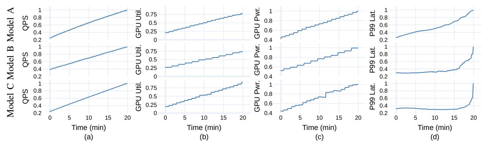

# III. UNDERSTANDING THE POWER-PERFORMANCE TRADEOFF ON PRODUCTION AI SYSTEMS

To quantify the potential benefits of a dynamic power assignment scheme across server components, we characterize the AI Inference servers running production-grade models. To illustrate the model heterogeneity present in our fleet, we select three representative models.

Model A is a single-task recommendation model optimized for click-through rate (CTR) prediction in mobile feeds. It uses a standard recommendation architecture (e.g., deep learning recommendation model) with sparse feature handling and CPU is used for preprocessing and feature extraction.

Model B is a multi-task ad ranking model that predicts several metrics (e.g., CTR, ad quality, conversion rate) for a webservice scenario. It features a more complex neural network with shared layers and multiple output heads, and is GPU-optimized to handle large-scale, multi-objective inference.

Model C is a multi-task content ranking model focused primarily on CTR prediction for the content of web services. While it shares the multi-task approach with Model B, it is less complex in terms of the number of tasks, and is more GPU-bound, tailored for content ranking.

Fig. 8: Request rate (QPS), GPU utilization, GPU power draw, and service latency for models A, B, and C on CPU-GPU hardware platforms for AI inference. Input load increases over time, and all values normalized from zero to one. QPS-util / QPS-power  $R^2$  correlation values across the three models are A: 0.73 / 0.84, B: 0.71 / 0.85, C: 0.79 / 0.94.

Fig. 7 shows the relationship between GPU and CPU utilization for these three models while running production traffic. While all models exhibit a linear correlation between CPU and GPU utilization, the slope of this relationship, i.e., the ratio of CPU to GPU usage, varies significantly. Model A is more CPU-intensive, Model C is more GPU-bound, and Model B falls in between.

This heterogeneity in resource scaling motivates the need for model-aware power management and resource allocation schemes. A one-size-fits-all approach is insufficient; instead, power management strategies must account for the diverse compute profiles present in an inference fleet.

