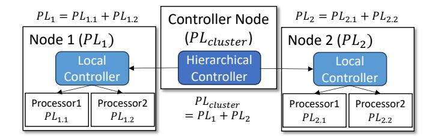
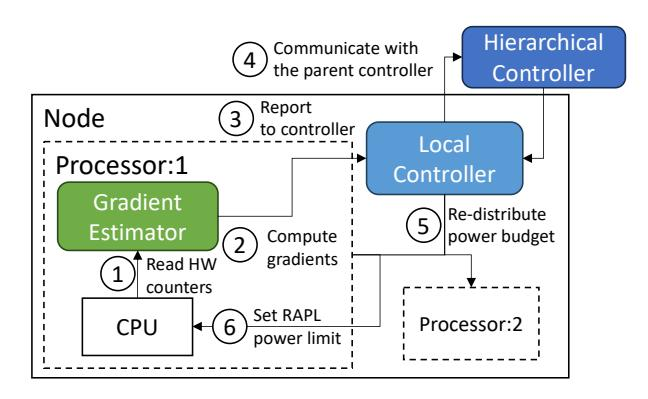

# A. Overview

To understand the operation of PowerGrad, consider Figure 3, which shows a computer cluster with Node 1 and 2, and two processors per node. The cluster is given a power limit or budget  $(PL_{cluster})$ , which a Hierarchical Controller divides into per-node power limits  $(PL_i)$ . Inside Nodes 1 and 2, a Local Controller divides the power limit into per-processor power limits  $(PL_{i,j})$ . The cluster power limit may change dynamically, as well as the power demands of the workloads. Consequently, the hierarchical and local controllers need to adjust the power budgets dynamically at runtime.

Fig. 3. Cluster controlled hierarchically by PowerGrad.

Given an environment like this, the goal of PowerGrad is to find a power allocation that maximizes the system performance. Typically, an equal power distribution is not optimal when the cluster is running heterogeneous workloads. In this case, to maximize the overall performance, PowerGrad uses the following strategy: to dynamically shift power budget from applications that lose little performance when their power allocation decreases, to applications that gain significant performance with increased power allocation.

PowerGrad attains this re-assignment by using a novel gradient-based approach. The idea is to dynamically estimate the *performance gradient* over power ( $\partial \text{perf}/\partial \text{power}$ ) of each running workload. This metric measures the performance sensitivity of a workload to its power consumption. As an example, compare a compute-bound workload to a memory-bound one. The former is likely to gain more performance per extra unit power, exhibiting a higher gradient. In contrast, the latter is likely to exhibit a lower gradient, as its performance is less sensitive to the power allocated. Therefore, shifting power from a lower-gradient workload to a higher-gradient one results in a net performance gain, as the former loses less performance and the latter gains more performance.

The performance gradient is not simply determined by whether the execution is compute- or memory-bound. If the core frequency is high, even a compute-bound execution can have a low performance gradient. This is because it may consume a lot of extra power when the frequency increases.

For PowerGrad to estimate performance gradients, it requires differentiable models of performance and power. Hence, it uses a linear performance model and a polynomial power model. PowerGrad dynamically generates the coefficients of these models from hardware performance counters, and voltage-frequency values measured at runtime. This data-driven approach requires no domain-specific knowledge of the running workload, and it is not limited to any specific type of compute engine architecture. The power management method that works without domain knowledge of the running workload is appropriate in ML inference clusters.

#### B. Components of the PowerGrad Framework

PowerGrad is a software framework that consists of three main components: Gradient Estimator, Local Controller, and Hierarchical Controller. Its architecture is shown in Figure 4.

**Gradient Estimator.** At regular time steps, the Gradient Estimator reads hardware performance counters (e.g., cache miss counts and instruction count), and measures frequency

Fig. 4. PowerGrad architecture in a node.

and voltage values (①). With this information, it generates the coefficients of the polynomial models of performance and power. These are online coefficients recomputed at every time step. They characterize the current workload and its current phase. Then, the Gradient Estimator differentiates the power and performance models to estimate the performance gradient  $\partial \text{perf}/\partial \text{power}$  (②) of the workload currently executing on the processor. Then, the power and performance estimation, and the gradient are passed to the Local Controller (③).

**Local Controller.** The Local Controller receives the power, performance, and the estimated gradients from all the local processors. Then, while interacting with the Hierarchical Controller (③), it uses the gradients to redistribute the node-level power budget among the local processors (⑤) to maximize the overall performance. The reallocated power budget is then enforced onto the processors using a power-capping method like RAPL [30] (⑥).

Hierarchical Controller. The Hierarchical Controller uses the power, performance, and gradient values reported from its child controllers to potentially redistribute the power budgets across the child nodes using the same gradient-based optimization algorithm. This power redistribution is done asynchronously to the child controllers at a coarser time granularity, enabling fast-paced controls in the lower levels of the hierarchy. The hierarchical structure can scale recursively: a set of Hierarchical Controllers can report their power, performance, and gradient values to a parent Hierarchical Controller, which also asynchronously redistributes the power budgets of its child controllers.

All the PowerGrad components are implemented as user-level software. Inside a node, the modules are Java threads communicating and synchronizing through shared memory. The Gradient Estimator and the Local Controller are woken up at short regular intervals (i.e., every 100ms), perform steps ① to ⑥, and then go to sleep. The Hierarchical Controller is a Python process that communicates with the other controllers through network sockets. Because of the network communication overheads, Hierarchical Controllers run with longer time steps of 1–4 seconds.

#### C. Building Power and Performance Models

PowerGrad mostly follows PPEP [39] to build the models for power and performance. PowerGrad's contribution is to differentiate the models and estimate the gradients (Section III-D). In this section, we describe how PowerGrad builds the models.

At every time step t, PowerGrad builds the power model of a core P(V) as a polynomial function of the core voltage V, and the performance model of a core in cycles per instruction CPI(f) as a linear function of the core frequency f. The coefficients of the power and CPI models are dynamically determined by reading the current frequency  $f^{(t)}$  and the current values of the performance counters  $\mathbf{E}^{(t)}$  of the core at that particular time step.

Specifically, PowerGrad uses counters to measure: billions of instructions executed per second  $(BIPS^{(t)})$ , core utilization  $(util^{(t)})$  as the number of cycles when the core is active over the sum of both core active and core idle cycles, and billions of memory stall cycles per second  $(Idm_stalls^{(t)})$ . In all these expressions, the superscript t means that the metric is measured at time step t. With these measures, PowerGrad uses the formulas below to compute the billions of active cycles per second  $(BCPS^{(t)})$ , the cycles per instruction  $(CPI^{(t)})$ , the memory CPI  $(MCPI^{(t)})$  as the component of the CPI due to memory access stall time, and the core (i.e, compute) CPI  $(CCPI^{(t)})$  as the component of the CPI due to compute operations:

$$BCPS^{(t)} = f^{(t)} * util^{(t)}$$
  $CPI^{(t)} = \frac{BCPS^{(t)}}{BIPS^{(t)}}$  (1)

$$MCPI^{(t)} = \frac{ldm\_stalls^{(t)}}{BIPS^{(t)}} \quad CCPI^{(t)} = CPI^{(t)} - MCPI^{(t)}$$
(2)

With these values, PowerGrad can build the performance model as:

$$CPI(f) = CCPI^{(t)} + MCPI^{(t)} * f/f^{(t)}$$
(3)

where, to estimate the CPI at another frequency f, the measured  $MCPI^{(t)}$  has to be scaled by the ratio of f to the frequency  $f^{(t)}$  used when the measurements were taken.  $CCPI^{(t)}$  does not need to be scaled.

To build the power model, PowerGrad uses:

$$P(V) = P_{idle}(V) + P_{active}(V, \mathbf{E}^{(t)})$$
 (4)

where  $P_{idle}$  and  $P_{active}$  are the core's idle and active power, respectively.  $P_{idle}$  does not depend on the core activity. It is approximated as a third-order polynomial of V [39], where the regression coefficients  $a_i$  are fitted offline using idle power traces.

$$P_{idle}(V) = a_3 V^3 + a_2 V^2 + a_1 V + a_0 \tag{5}$$

 $P_{active}$  depends on the core activity. It is a function of V and the values of the performance counters  $\mathbf{E}^{(t)}$  as follows [39]:

$$P_{active}(V, \mathbf{E}^{(t)}) = \sum_{i} (w_i E_i^{(t)}) * (V^{\gamma} + V)$$
 (6)

Fig. 5. Workflow of how the Gradient Estimator computes the performance gradients at each time step t.

Here,  $w_i$  are regression coefficients that are also fitted offline from active power traces collected at a fixed V. Further, the scaling factor  $\gamma$  is fitted by comparing the core's behavior at different voltages. Finally,  $E_i^{(t)}$  are performance event counts divided by time.

