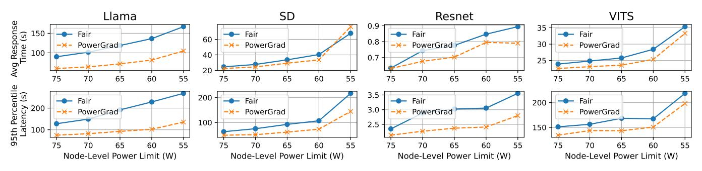

# B. Accuracy of the Gradient Estimation

We now consider the accuracy of PowerGrad's model of the performance gradient  $(\partial BIPS/\partial P)$  shown in (8). We first run our applications of Table II on one processor of the Legacy system while changing the performance-power operating point every 100ms. Specifically, we change the processor frequency using a random walk over the available range (i.e., 1.2 GHz–2.6 GHz) in increments of 100 MHz to span various operating points. We measure both the performance in BIPS and the power. These measured points are shown as circles in Figure 7.

At each of these operating points, we use PowerGrad's model in (8) to estimate  $\partial BIPS/\partial P$ . Then, in a plot not shown here, we fit a linear model between these performance gradients and the power, using the form  $\frac{\partial BIPS}{\partial P} = wP + b$ . After we obtain w and b by linear regression, we integrate equation wP+b over the power, to obtain BIPS as a function of power. The resulting curve is shown in Figure 7 for each application. Figure 7 also shows the  $R^2$  score of the model estimation over the collected data, which measures prediction accuracy.

Fig. 7. Measuring the accuracy of PowerGrad's estimation of performance gradients. The circles are the measured performance-power operating points on a Legacy processor, while the curve is the relationship obtained using PowerGrad's estimated performance gradients.

Fig. 8. Average response latency (top) and P95 response latency (bottom) of the applications running on a dual-processor Legacy node with Fair and with PowerGrad, for different node power limits.

We see that the curves obtained by the estimated gradients do track the measured performance across power values. The average  $R^2$  value is 0.501. Note that PowerGrad does not require perfect prediction. Because PowerGrad uses an iterative optimization, it only needs approximately-correct gradients to converge to the optimal point. These  $R^2$  values are sufficient for PowerGrad's iterative optimization. The variance of  $R^2$  across applications is affected by various factors, including the duration of the kernels. For example, short kernels are harder to predict and, therefore, cause lower  $R^2$ . Overall, we conclude that PowerGrad's gradient estimation is approximate enough.

#### C. Operation of Gradient-Based Power Management

Figure 7 also shows that ML applications vary in their response to power allocation, even across different configurations of the same application. Our gradient-based power management proposal exploits this difference to optimize power usage. In this section, we show that this is feasible.

We choose a dual-processor node in the Legacy platform, and run two copies of the same application with different workload levels: *High* in one processor and *Low* in the other. We enforce various power limits for the node (55–75 W), and measure the average and P95 response latency of the two applications with PowerGrad or with Fair. Figure 8 shows the average latency (top) and the P95 latency (bottom) for all the applications.

We see that, in practically all applications and power levels, PowerGrad reduces the response latencies over Fair—

sometimes by a large amount. The reason is that, at a given power level, PowerGrad transparently assigns more power to the application that can use it more efficiently to increase performance—i.e., the application that has a higher performance gradient.

To gain more insights, we examine one of the cases: a node running Llama-high in one processor and Llama-low in another. Figure 9 shows, as a function of time, the performance (a), the power (b), and the performance gradients (c) of each of the two applications with Fair power distribution. In the performance and gradient plots, the peaks correspond to the compute-bound prefill stages, while the valleys are the memory-bound decode stages. We see that Llama-high has long prefill periods due to large batch sizes and long inputs, while Llama-low has short prefill periods for the opposite reasons. However, under Fair power distribution, Figure 9b shows that both applications consume up to their power budget (35W per processor) in this power-limited environment.

Figure 9d shows the power of the two applications as a function of time with PowerGrad. We see that PowerGrad actively shifts power from a memory-bound processor to a compute-bound one based on the gradient estimates. The result is reduced response time. Without the estimated performance gradients, it is not obvious how to best distribute the power between applications in a power-limited environment.

