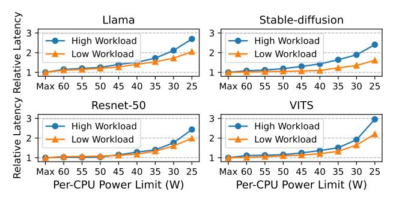

# II. CHARACTERIZING ML INFERENCE WORKLOADS

In this work, we manage the power in clusters running a variety of ML inference workloads. To gain insights, we start by characterizing the power and performance of four ML inference applications: the Llama-3.1-8b language model (Llama) [\[9\]](#page-13-16), an image generator (Stable-diffusion) [\[34\]](#page-13-17), an image classifier (Resnet-50) [\[13\]](#page-13-18), and a text-to-speech model (VITS) [\[20\]](#page-13-19). We run each application on a 10-core Haswell CPU. The applications and experimental setup are detailed in Section [IV.](#page-6-0) From our characterization, we extract the following conclusions.

ML workload behavior varies substantially across models and across time. Figure [1](#page-1-0) shows the power consumption and the instruction throughput in billions of instructions per second (BIPS) of the applications over time. The figure shows that power and performance vary widely across applications and time phases. For instance, *Llama* shows two clear phases: the compute-bound prefill phase and the memory-bound decoding phase. On the other hand, *Stable-diffusion* has short, repeated iterations to refine the image multiple times. Resnet-50 and VITS have other patterns. Commercial AI platforms observe much more variation as they serve many different models.

ML workload behavior depends on the user inputs. The compute and power behavior of ML workloads show significant variability based on input and output characteristics [\[38\]](#page-13-5). For instance, a longer prompt for a language model and a higher output resolution for an image generator increase the compute demand of the model execution. In addition, an ML model usually computes a batch of requests together for computational efficiency. The size of the batch constantly changes at runtime based on the user request patterns [\[23\]](#page-13-20). Figure [2](#page-2-0) characterizes the latency-power sensitivity of different requests. We compare two types of requests: *high* workloads, which have large batch sizes, long prompts, and high output resolutions, and *low* workloads, which have small batch sizes, short prompts, and low output resolutions. The figure shows the average request latencies for different CPU power limits relative to the latency at maximum Thermal Design Power

Fig. 2. Request latency changes of four ML inference applications with different CPU power limits and workload request levels.

(TDP) (Max). We see that the latency of high workload requests is more sensitive to power limits than that of low workload requests. This is because the low workloads are more memory-bound than the high ones: the memory cost of reading the model parameters is fixed, while the amount of compute is much less in low workloads. Therefore, shifting the available power from low to high workloads is likely to improve the overall performance.

Power measurements are not sufficient to identify the performance behavior. Consider Llama in Figure 1. Even in the low-BIPS phases, which are memory-bound, the CPU power consumption is still relatively high at over 60W. This means that, in power-limited environments, memory-bound workloads are still likely to consume high power. Power-only observations cannot reliably distinguish memory-bound from compute-bound behavior in power-limited settings. Hence, power management methods that depend on the power consumption pattern [8], [35] may be unable to identify memory-and compute-bound patterns to determine the assignment of power to nodes in power-limited environments. We need a more intelligent method to characterize workload behavior.

