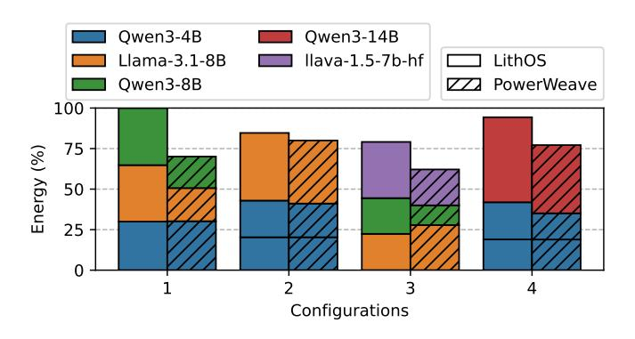

# *A. Disaggregated Prefill*

For this experiment, we disaggregate the prefill and decode LLM stages, each onto half the GPU's TPCs, in order to scale TTFT and TPOT independently. We run four models: Llama-3.2-1B, Llama-3.1-8B-Instruct, Qwen3-14B, and Qwen3-32B-FP8. We generate load according to the Azure trace to evaluate PowerWeave under realistic, fluctuating request rates. Next, we explore the relationship between load and energy savings by incrementally increasing the load over time.

Fig. 8: Energy savings for disaggregated inference service.

**Azure Trace.** The original Azure LLM inference trace targets a full node of 8 GPUs. Since we execute on a single GPU, we scale the inter-arrival times by a factor of 1/8. For the smallest and fastest model, Llama-3.2-1B, a factor of 1/4 suffices due to its lower per-request cost. SLOs are set according to DynamoLLM, except that we quadruple the TTFT for the largest model, Qwen3-32B-FP8, which has approximately  $4\times$  the parameters of Llama-3.1-8B.

Figure 8 shows the energy savings of PowerWeave compared with those of the LithOS baseline as a percentage of the energy of the default GPU DVFS policy. PowerWeave achieves more than twice the energy savings of LithOS on average: 28% compared to 13%. Moreover, PowerWeave's decoupled scaling mechanism provides consistent savings across all workloads, in contrast to LithOS, and achieves up to 38% in the best case. For Qwen3-32B FP8, PowerWeave delivers more than an 8× improvement over LithOS. This model exhibits very limited TTFT slack, forcing LithOS's coupled frequency-scaling policy to substantially overprovision during the decode phase, leading to significantly higher energy consumption.

Load Sensitivity. To evaluate the impact of load on energy savings, we sweep across a range of Requests per Second (RPS) values using inputs from two datasets: ShareGPT Vicuna and scientific\_papers. For the ShareGPT Vicuna dataset, we use the MLPerf interactive scenario SLOs as described in §VII. For the scientific\_papers with longer inputs we use the more relaxed MLPerf server scenario. Requests are made according to a Poisson process, with load levels determined by the model–dataset pair, and all experiments are executed using the vLLM benchmark CLI.

In Figure 9, we report energy as a percentage relative to the default GPU DVFS policy (lower is better). Both LithOS and PowerWeave outperform the default policy; however, PowerWeave is substantially more effective when only one of the TTFT or TPOT approaches its SLO. For example, if TTFT begins to increase, PowerWeave raises the clock frequency of the prefill instance while maintaining a low frequency for the decode instance. This selective scaling is often advantageous. However, there are scenarios, such as low-load conditions for the Qwen3-14B model, where both metrics comfortably satisfy their SLOs and low frequencies

TABLE II: Multitenancy experiment tenants.

| Tenant | TPC allocation      | MLPerf LLM scenario |
|--------|---------------------|---------------------|
| 1      | $18/74 \approx 1/4$ | interactive         |
| 2      | $19/74 \approx 1/4$ | server              |
| 3      | $37/74 \approx 1/2$ | server              |

suffice for both instances. Conversely, when both metrics begin to degrade, higher frequencies may be required for both instances, as observed under high-load conditions for Llama-3.1-8B on the scientific papers dataset.

Overall, PowerWeave achieves at least 20% energy savings in the best case for each model, with the maximum energy savings coming while serving Llama-3.2-1B at low RPS, at 41%. Moreover, LithOS's energy savings are at best comparable to those of PowerWeave, and lag it by up to 25% in the worst cases, Qwen3-32B-FP8 and Llama-3.1-8B. These results highlight how decoupled frequency scaling within a model unlocks energy savings that are unattainable when a single device-wide frequency must be used.

## B. Spatial GPU Multitenancy.

In this set of experiments, we evaluate PowerWeave under spatial GPU sharing scenarios, focusing on two representative use cases. First, we examine a spatial multitenant execution, where multiple independent models operate on fractions of a single GPU. We analyze how PowerWeave's decoupled frequency scaling affects energy consumption across a diverse set of model combinations. Second, we evaluate an agentic workflow comprising three sequential models of different sizes, where throughput balance across stages is crucial. Together, these experiments demonstrate the benefits of finegrained frequency control for both parallel (latency-critical) and pipeline-style (throughput-critical) deployments.

**Multitenancy.** We evaluate four configurations, each comprising a different set of three models. Each model represents a different tenant, with the TPC allocations and SLOs listed in Table II. For each configuration, we divide the Azure trace randomly into three splits and reduce the request rates by a factor of 1/3, since all three models are colocated on one GPU.

In Figure 10, we present the energy consumption of the two systems, normalized to the default DVFS policy. The energy consumptions of the three tenants are stacked from 1 to 3, and color denotes the model. The lowest tenant has the tightest SLOs. We observe that the single-frequency-domain approach (LithOS) struggles to deliver consistent energy savings. Across the configurations, Tenant 1 with the tighter SLO skews the overall device energy consumption upward, resulting in savings as low as 6% in the worst case and an average of only 10%. In contrast, PowerWeave's fine-grained spatial DVFS is able to sustain high energy efficiency for at least two of the three models at all times, even when it must assign a higher frequency to one of them. Specifically, PowerWeave achieves energy savings of up to 35%, with an average of 28%, an additional 18% over LithOS. These results demonstrate that in multitenant environments, a single device-wide frequency is insufficient to maintain high energy efficiency, particularly for diverse workloads with heterogeneous performance goals.

Fig. 9: Energy consumption of disaggregated LLM service by load.

Fig. 10: Energy consumption of multiple, independent tenants.

Finally, we run a fifth scenario to estimate an upper bound on the energy savings achievable with PowerWeave. We colocate two Qwen3-14B models. The first occupies a single TPC and must satisfy the MLPerf interactive scenario SLOs, while the second is allowed 73 TPCs and must satisfy the MLPerf server SLOs. The model running on a single TPC quickly violates its SLO and therefore requires the maximum clock frequency. Even so, PowerWeave is able to achieve 40% energy savings by scaling up only the latency-sensitive model. LithOS, on the other hand, leaves substantial energy savings unrealized, providing almost no benefit in this scenario.

Balancing the Throughput of an Agentic Workflow. We construct a coding agentic pipeline that programs small functions from user prompts. A custom 1024-token prompt describes the requested function and is fed into the first stage.

Fig. 11: Energy savings in the agentic pipeline.

TABLE III: Agentic pipeline.

| Agent | Model size | Instructions                                                 | TPC count |
|-------|------------|--------------------------------------------------------------|-----------|
| 1     | 4B         | "Draft a small function."                                    | 10        |
| 2     | 8B         | "Handle any parameter edge cases."                        | 27        |
| 3     | 14B        | "Debug and make sure the given function works correctly." | 37        |

Each agent's output is capped at 512 tokens before entering the next stage. We use the Qwen3 family of models, with unique size, instructions, and TPC allocations for each agent as described in Table III. Prompts are continuously streamed to the first agent in an open-loop fashion, to sustain pipeline load. We sweep batch size from 4 to 10 in increments of 2.

We compare PowerWeave against the default LithOS policy, under which all models must operate at a unified device-wide frequency. The goal is to preserve pipeline throughput after frequency scaling, while sustaining high energy efficiency. Figure 11 presents the energy savings for the whole pipeline. By relaxing the frequencies of faster pipeline stages while keeping the slowest stage high, PowerWeave achieves a 19% average energy reduction with a maximum of 22%, without compromising throughput. LithOS decays to the default GPU DVFS policy, as it must sustain high throughput and, therefore yields no energy savings. Additionally, since throughput is sustained, PowerWeave improves token/s per energy, gaining up to 20% TPJ (throughput per Joule) and 15% on average.

