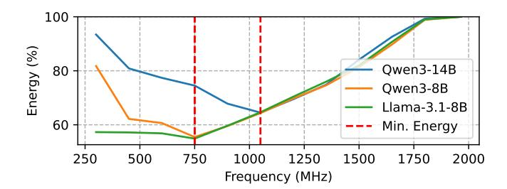

# *B. Related Work*

GPU Multi-Tenancy. Modern ML workloads and agentic pipelines exhibit heterogeneous phases, variable kernel characteristics, and bursty traffic patterns that often leave hardware underutilized. Industry mechanisms such as NVIDIA MPS [39] and MIG [41] support multi-tenant deployment but provide only coarse process-level or instance-level sharing. Prior systems have explored finer spatial and temporal multiplexing with performance isolation [12], [18], [38], [52], [56], [62]. The same workload characteristics that motivate fine-grained

Fig. 1: GPU Architecture.

sharing provide a natural opportunity for fine-grained DVFS, which would allow each tenant, model, or phase to operate at the frequency that best suits it.

LLM Inference and Agentic Workflows. LLMs map input tokens to output tokens by repeatedly applying the attention operation in each forward pass. Inference proceeds in two phases, prefill and decode. Prefill processes the input tokens in parallel to populate the KV cache and is therefore compute-bound, while decode subsequently generates each output token by reading the full KV cache, making it memory-bound. Performance is characterized by two corresponding metrics: Time To First Token (TTFT), the latency of prefill, and Time Per Output Token (TPOT), the average latency per decode step.

Disaggregated prefill is a technique that splits the phases either onto separate GPUs [35], [65] or onto different partitions of the same GPU [49], allowing the performance of each stage to be scaled in accordance with application requirements.

LLM serving complexity is further increased by the rise of agentic workflows that rely on multi-step reasoning and tool use, including reasoning-and-acting agents [61], plan-and-execute frameworks [14], and tool-calling chains [44], [47]. Agentic execution is highly input-dependent and unpredictable, complicating efficient system design.

Hardware and Software DVFS for GPUs. Prior work shows that GPUs can control clocks at finer granularity than the whole device. Techniques such as PCSTALL [6] use warp- or wavefront-level signals to drive voltage-frequency decisions at microsecond scale on per–compute-unit sub-device domains. These mechanisms demonstrate that fine-grained spatial energy management is possible, but rely on low-level microarchitectural behavior and lack visibility into application semantics, SLOs, or model phases, and therefore cannot exploit slack or schedule contending workloads with different characteristics.

A separate line of work has pursued power management through application-level objectives. GEEPAFS [63] and  $\mu$ -Serve [46] build online performance models accounting for throughput, SLO attainment, and queueing behavior. Cluster-scale frameworks such as POLCA [43] and DynamoLLM [51], and request regulators like throttLL'eM [24], incorporate LLM-specific knowledge of load bursts and latency constraints to model how request-level performance scales with frequency. LithOS [12] transparently enables DVFS by determining fre-

quency scaling behavior of kernels before choosing a frequency for the entire device. While these systems understand application-level goals, they control frequency only at device granularity, missing opportunities for localized adjustments. Thus, they are unable to provide differentiated service or performance isolation across tenants sharing a GPU.

PowerWeave's goal is to bridge the gap between finegrained frequency control and application-level performance, delivering better energy efficiency for ML on GPUs.

Technology Advances in DVFS. Modern GPUs inherit power-management mechanisms designed for coarse, device-wide control: off-chip voltage regulators with transition latencies of hundreds of microseconds, applied infrequently at a small number of chip-wide operating points. Recent integrated-voltage-regulator (IVR) architectures close this gap by placing switched-capacitor or digital low drop out (LDO) stages close to the load, enabling nanosecond-scale voltage changes and microsecond-scale frequency updates [16], [25]. Industrial processors now adopt hybrid power-delivery stacks where efficient off-chip or on-package buck converters provide coarse conversion, while small on-die regulators track fast load variations for per-core or per-block control [5], [7], [33], [50].

GPUs are especially amenable to fine-grained DVFS: their massive parallelism and heterogeneous workloads create non-uniform SM utilization. However, contemporary GPUs expose at most one or two DVFS domains, such as core and memory, forcing all SMs to share a common V/f state. This mismatch wastes energy whenever memory-bound or idle units run at the same high V/f setting as heavily utilized units. Increasing DVFS spatial granularity can reduce this waste, but introduces hardware overheads that grow with the number of domains, including regulator logic, inter-domain level shifters and isolation, and clock and power-domain management. As we will see later in this paper, these overheads are precisely what we quantify in PowerWeave's hardware analysis.

#### III. MOTIVATION

ML workloads consist of sequences of GPU kernels launched by the host CPU, each implementing computational-graph operations such as matrix multiplication, normalization, and attention. Their power consumption depends on both kernel characteristics and workload conditions. In particular, arithmetic intensity determines each kernel's compute and memory behavior, shaping its performance-frequency scaling and power use, while traffic rates, sequence lengths, and batch sizes further affect energy consumption. This section examines the challenges and opportunities of fine-grained spatial DVFS through spatial multi-tenancy, disaggregated prefill-decode, and cross-workload thermal-throttling interference.

#### A. Spatial Multi-tenancy

To showcase the opportunity for spatial DVFS, we focus on characteristics of LLM inference. Figure 2 shows how total energy consumption scales with frequency for three different LLMs. For this configuration, Qwen3-14B consumes minimum energy at approximately 1000 MHz, whereas Qwen3-8B

Fig. 2: Different models have distinct profiles.

Fig. 3: Prefill and decode kernels scale differently.

and Llama-3.1-8B reach their lowest energy usage at 750 MHz. This illustrates that models have different optimal operating frequencies. Without spatial DVFS, a single frequency for the entire device can drastically throttle one latency-critical model.

Beyond model characteristics, workload requirements vary with deployment setup, and even a single model can have different SLOs across scenarios. The MLPerf Datacenter Inference benchmark provides a representative example [36]: in an *interactive* setting, Llama-3.1-8B must sustain TTFT below 500 ms and TPOT below 30 ms, whereas in a *server* setting it has relaxed SLOs of 2 s TTFT and 100 ms TPOT. This variability requires different frequencies to meet SLO targets, creating an opportunity for independent per-model scaling.

