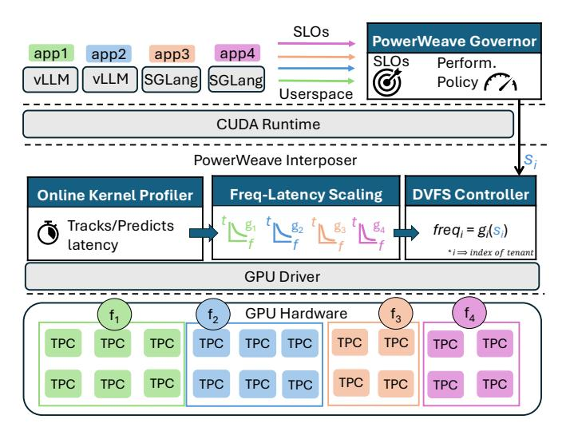

# *C. Thermal Throttling Interference*

Non-uniform temperature and power delivery across the die often necessitate conservative limits in global DVFS schemes. Figure 4 illustrates an example of thermal throttling where one application interferes with another, while spatially sharing the same device. The two applications are identical models; one runs at a higher load issuing requests at a much faster rate, while the second maintains a moderate load. The top plot shows that the high-load application continuously exercises its compute units, driving the total GPU power to the TDP limit. As a result, the firmware repeatedly throttles the global frequency to prevent overheating, as shown by the frequency oscillations in the bottom plot. This throttling also affects the low-load application, which suffers identical frequency reductions despite not contributing to the thermal pressure, as seen by its low power consumption on the top plot.

Eliminating this interference is crucial to allow different tenants to concurrently utilize the device efficiently. Spatial DVFS unlocks this opportunity, as the high-load application could throttle only its own frequency, allowing the lowload application to continue running at a higher frequency. Localized, per-domain control would enable lightly loaded regions to sustain higher frequencies while throttling only the hotspots, thereby enhancing thermal and power efficiency.

## D. The Need for Spatial DVFS

Spatial DVFS offers tangible benefits to performance, cost, and sustainability of GPU systems. However, balancing heterogeneity across models and variability between workload characteristics, such as request rates and SLO targets, is important for spatial DVFS, but can be challenging. Power-Weave is a software-driven design that leverages multiple GPU frequency domains, built around a scheduler that minimizes energy consumption while maintaining high SLO attainment.

#### IV. POWERWEAVE DESIGN

The guiding principle behind PowerWeave is to decouple frequency control across spatial domains of the GPU, in a way that each application dynamically operates at a frequency tailored to its own performance demands. The primary objective is to improve energy efficiency while meeting per-tenant SLOs. More broadly, PowerWeave seeks to eliminate interference among tenants, preventing one tenant's performance requirements from inflating another's power cost.

#### A. System Overview

PowerWeave is designed to operate under the availability of independent frequency domains, up to the level of individual SMs. Within this environment, PowerWeave introduces a software stack that coordinates per-tenant performance modeling and frequency control across these domains. Figure 5 shows a high-level overview of the PowerWeave design. Power-Weave sits below the application and serving frameworks like vLLM [26] and SGLang [64] and above the GPU device driver. It is composed of four main components. The Online Kernel Profiler, Frequency-Latency Scaling module, and DVFS Controller sit within the PowerWeave Interposer and perform the vast majority of the power management operations and control. The online profiler tracks individual kernels to construct perkernel frequency-latency profiles, which capture each kernel's scaling behavior. The frequency-latency scaling module uses these profiles to build application-level scaling functions that describe how end-to-end latency evolves with frequency. The DVFS controller then uses these functions to select frequencies for each independent domain based on performance slack provided by the *PowerWeave Governor*. The governor lives in userspace and enforces PowerWeave's power-management policy. It tracks application-level metrics, such as requests per second (RPS), and takes as input each application's SLOs. Based on this information, the governor communicates performance targets to the DVFS controller. This separation of concerns allows users and administrators to tailor policies for different ML use cases while reusing the interposer's control mechanisms across policy implementations. Together, these components enable efficient spatial DVFS for GPUs.

#### B. Interface with Userspace

**Resource Allocations.** System administrators specify their desired GPU resource limits whenever they want to execute their workload. They are assured that they will execute on their own independent frequency domain.

Fig. 5: PowerWeave design overview.

Service Level Objectives. The applications interact with PowerWeave through the Governor. They communicate their desired SLOs to allow PowerWeave's Governor and DVFS controller to make decisions on allocated frequencies for each frequency domain. Additionally, applications share their performance metrics and request rates with the governor to enable informed and dynamic frequency scaling.

