# II. COOLING DATA CENTERS

The effectiveness of data center cooling infrastructure is fundamentally linked to external environmental conditions,

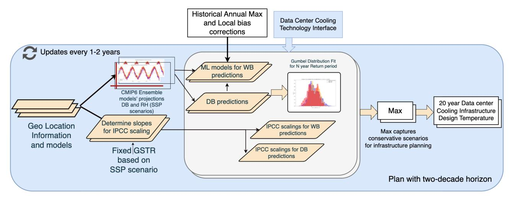

Fig. 1: Prometheus Overview – Decadal Forecasting and Plans.

making it vulnerable to climate risks. Servers generate heat that must be ejected into the environment. When data center architects provision cooling capacity, their decisions are guided by expectations about extreme weather, making accurate climate forecasting essential for resilient design and provisioning. We refer the reader to [3] (Chapter 5) for a full description of data center cooling; here we focus only on how heat is rejected into the environment.

Air-cooled data centers reject heat directly into the ambient air around the building. In temperate climates, some data centers simply flow outside air through the building via large fans, placing warm air exhausts far from the air intakes to avoid recirculation. Many data centers employ aircooled chillers, which reject the heat they produce via large, fan-assisted radiators, often placed on the building's roof. The effectiveness of both designs depends on the *Dry-Bulb Temperature (DBT)*, the ambient air temperature measured by a standard thermometer shielded from direct radiation and moisture. It represents the actual, sensible heat of the air, independent of humidity levels, and is the temperature commonly referenced in daily weather reports.

Water-cooled data centers reject heat by evaporating water in a cooling tower. Evaporation removes heat from the remaining water, cooling it the same way sweat cools human skin. The lowest temperature achievable this way is the *Wet-Bulb Temperature (WBT)*. High WBT indicates low evaporation potential and thus low cooling potential. For example, a DBT of 30◦C at 40% relative humidity translates to a WBT of 20.5 ◦C, but at 90% humidity the WBT rises to 28.6 ◦C.

Thus, forecasting extreme temperatures requires forecasting extremes in both DBT and WBT. Often, WBT extremes have a smaller absolute magnitude because warmer air has a higher capacity to absorb water. As a rule of thumb, increasing the DBT by one degree increases the WBT by only a quarter of a degree unless moisture also increases.

#### III. FORECASTING EXTREME TEMPERATURES

Designing resilient data centers requires robust forecasts of extreme temperatures. Prometheus combines multiple forecasting methods and conservatively uses the most extreme forecast to provision cooling. Its *baseline* method relies on ASHRAE's backward-looking analysis, neglecting future temperature rises. Its *scaling* method extrapolates from global climate scenarios but lacks geographical specificity. Both methods can under-predict risk and under-provision cooling.

Prometheus employs *machine learning*, in Figure 1, to improve spatial resolution and accuracy. It uses physics-based simulations to project local climate conditions. It then uses machine learning to predict wet-bulb temperature, a value not provided by simulation, from simulated dry-bulb temperature and relative humidity data. Furthermore, it quantifies risk by producing a probabilistic model of future temperature distributions rather than a single prediction.

#### *A. Forecasting with Baseline Method*

Today, data center architects follow ASHRAE, the American Society of Heating, Refrigerating and Air-Conditioning Engineers [4], [5], which derives design guidelines from 30 years of weather monitoring data. ASHRAE's design conditions for dry- and wet-bulb temperatures are specified by probability of exceeding design temperature (*e.g.*, the 0.4% wet-bulb condition) or by the N-year return period temperature (*e.g.*, 50-year). This method relies on past observations and neglects future warming.

## *B. Forecasting with Scaling Method*

Prometheus incorporates future warming based on global scenarios from the Intergovernmental Panel on Climate Change (IPCC). This method begins with today's baseline risk, which has already experienced a 1 ◦C global surface temperature rise (GSTR) since 1850. The IPCC's Shared Socioeconomic Pathways (SSPs) model how the frequency of extreme events will increase with GSTR. In a high-emissions

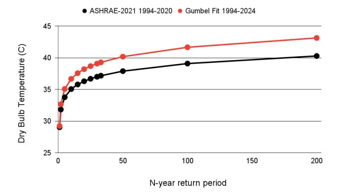

Fig. 2: ASHRAE standards versus GUMBEL fit for London, St. James Park (WMO:037720, 1994-2019 period).

scenario where GSTR reaches 3 ◦C, a 50-year return event is projected to occur 5.3 times more frequently and become a 9.4-year event while a 10-year event will occur 2.7 times more frequently and become a 3.7-year event [6].

$$T50_{3C} = \left[ \frac{\ln(50) - \ln(9.4)}{\ln(9.4) - \ln(3.7)} \right] (T50_{1C} - T10_{1C}) + T50_{1C}$$
 (1)

Prometheus uses these frequency shifts to forecast temperature extremes with Equation 1, which estimates 50-year temperature under future GSTR scenarios from today's 10 and 50-year temperatures. While scaling provides a forwardlooking adjustment, its use of a single global temperature lacks geographic specificity. Data centers in Phoenix and London experience different climate trajectories.

### *C. Forecasting with a Machine Learning Ensemble*

Prometheus improves spatial resolution by using physicsbased CMIP6 simulations to predict temperature increases, providing the 0.25 degree granularity needed to assess risk at specific data center sites. CMIP6 simulations, such as NEX-GDPP-CMIP6, provide dry-bulb temperature and relative humidity. But because the data is temporally misaligned and coarse-grained, we cannot directly calculate wet-bulb temperatures with standard formulas [7]. Prometheus solves this problem by using machine learning.

Ensemble Architecture. The ensemble, in Figure 4, is a multi-stage regression that combines strengths of complementary models. The first stage includes two base models, a Random Forest (RF) and a Support Vector Machine (SVM), which independently predict the daily maximum wet-bulb temperature from simulated data (daily minimum, mean, and maximum of dry-bulb temperature and relative humidity). First-stage predictions are fed, along with original input features, into a second stage Neural Network (NN) that produces a single, robust wet-bulb forecast.

Geo-Specific Bias Correction. Prometheus improves the forecast for specific data center sites with bias correction, making ensemble outputs consistent with historical records for a specific location. Drawing on similar practices for large spatial datasets [7], we compare model forecasts against five years of historical data at a given location to calculate the mean difference. By subtracting this bias from the ensemble's output, Prometheus reduces systematic error.

#### *D. Quantifying Uncertainty*

Prometheus uses forecasts to construct a probabilistic model with the Gumbel distribution, which is well suited for modeling extreme values. We fit the Gumbel location (µ) and scale (β) parameters, in Equation 2, to site-specific data. The robustness of this analysis depends on the data used to fit Gumbel parameters. Here, we depart from ASHRAE, which uses only historical data from nearby weather stations and thus neglects climate shifts. Prometheus combines decades of historical observations with multi-decade projections from an ensemble of CMIP6 models, embedding variance from these forecasts into the Gumbel distribution's parameters.

$$F(x; \mu, \beta) = \exp\left[-\exp\left(-(x - \mu)/\beta\right)\right] \tag{2}$$

A Gumbel distribution can estimate the N-year return temperature for a given data center site. This temperature is exceeded once every N years, on average, and corresponds to the 1−1/N percentile of the Gumbel distribution. Equation 3 calculates this value from the mean (Tmax-mean = µ + βγ) and standard deviation (Tmax-std = πβ/√ 6 where γ is Euler's constant) of the fitted Gumbel distribution.

$$T_{N} = T_{\text{max-mean}} - \frac{\sqrt{6}}{\pi} \left[ 0.5772 + \ln \left( \ln \frac{N}{N-1} \right) \right] \times T_{\text{max-std}}$$
 (3)

#### IV. DESIGNING DATA CENTER INFRASTRUCTURE

Prometheus's forecasts allow architects to design data centers that are resilient to extreme temperatures. Data centers must maintain a stable cold aisle temperature (CAT), which becomes more difficult as extreme weather becomes more common. This section translates the temperature forecasts from the previous section into a multi-layered framework for data center design and operation.

Consider the 2022 London heatwave, when multiple data centers suffered cooling failures [1]. Figure 2 shows that data centers designed to the 2021 ASHRAE standard of 37.7 ◦C were ill-equipped. ASHRAE's backward-looking model classified 40.2 ◦C in St. James's Park as a rare 1-in-200-year event whereas Prometheus's forward-looking model would have classified it as a more probable 1-in-50-year event. This discrepancy motivates forecasts that guide decision-making across three timescales.

- Planning with a two-decade horizon to guide strategic site selection and resource allocation, which ensures cooling can be provisioned based on climate risks.
- Upgrade with a two-year horizon to trigger tactical cooling upgrades, which ensures cooling is sufficient

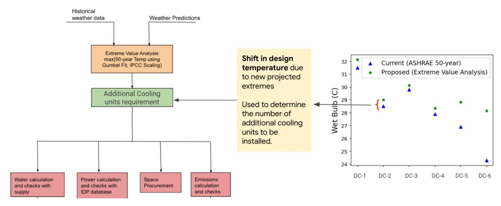

Fig. 3: Infrastructure planning at decadal timescales. Prometheus estimates extreme temperatures and checks resource constraints to provision power, water, and space.

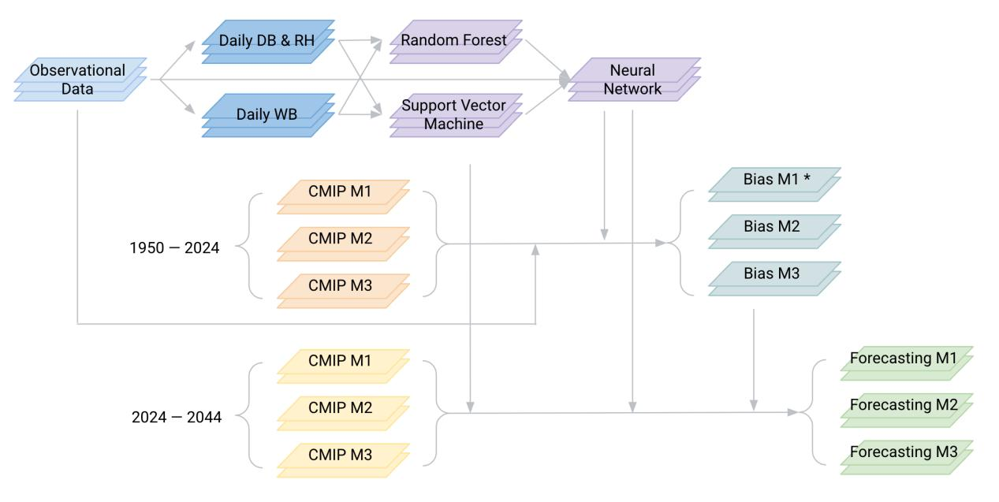

Fig. 4: Machine learning ensemble for wet-bulb temperature forecasting with bias correction [8].

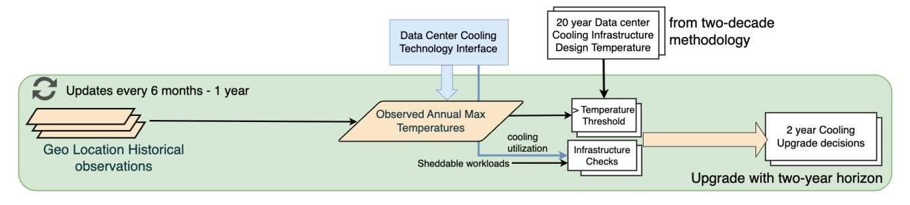

Fig. 5: Prometheus Overview – Annual Forecasting and Upgrades

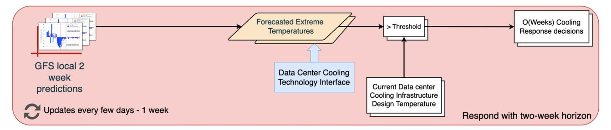

Fig. 6: Prometheus Overview – Weekly Forecasting and Responses

given unexpected computational loads and ambient temperatures.

• Respond with a two-week horizon through preemptive operational responses, which avoid cooling emergencies with the lowest impacts on performance.

## *A. Infrastructure Plans*

Prometheus guides data center design with a two-decade horizon, treating the facility as an adaptable platform rather than a static build. Architects must reserve space and resources for cooling upgrades, even if they are not required at initial construction, to ensure the facility can evolve over its twentyyear lifetime. Architects periodically revisit data center configurations and site plans as temperature risks increase.

The planning workflow, in Figure 3, begins with extreme temperature analysis. If forecasts indicate increased risk, architects will establish a more conservative design temperature, which increases the number of required modular cooling units and has broader implications for space, power and water usage for the mechanical equipment. The data center might require resources for more chillers, cooling towers, or water tanks.

In the long-term, the planning process influences site selection and seeks locations with favorable climates and sufficient resources. In the medium-term, the process guides utility contract negotiations. Prometheus's guidelines can prepare a data center to handle significantly more risk from increases of up to 4 ◦–5 ◦C in wet-bulb temperatures or 10◦C in dry-bulb temperatures.

#### *B. Infrastructure Upgrades*

Prometheus's tactical process determines when to implement strategic upgrades. Operating on annual timescales, this process collects operational telemetry and triggers cooling upgrades when data crosses predetermined thresholds for three key criteria, as illustrated in Figure 5.

Cooling Utilization. When a high percentage of provisioned cooling is used, the data center lacks the margins to handle unexpected load increases or extreme temperatures. Systems more sensitive to ambient temperature, like air-cooled chillers and air-side economizers, use lower thresholds to maintain larger safety margins while more resilient evaporative systems can operate with smaller margins safely. Prometheus recommends an upgrade when the seven-day rolling average exceeds a threshold in Equation 4.

Roll Avg 
$$\left(\frac{\text{IT Cooling Demand}}{\text{Cooling Capacity}}\right)_{\text{--}7-\text{days}} > \text{Thresh }_{\text{Util}}$$
 (4)

External Temperature. This criterion evaluates the data center's climate risk using the Gumbel distribution. Prometheus calculates the probability external temperatures will exceed the system's design temperature. In Equation 5, Prometheus triggers cooling upgrades to maintain the data center's baseline risk profile when the probability exceeds some tolerance (e.g., 2% for a 1-in-50-year event).

$$Pr [Annual max T > Cooling design T]_{\_Gumbel} > 2\% \quad (5)$$

Sheddable Load. The third criterion evaluates a data center's workload flexibility, a buffer against thermal emergencies. Sheddable load is non-production computation that can be deferred or migrated. Empirical data from production data centers indicates cold aisle temperature falls by approximately 1 ◦C for every 10% of computation shed. In Equation 6, Prometheus recommends an upgrade when the data center lacks the sheddable load needed to cover a potential cooling deficit. Less resilient systems, such as air-cooled chillers, require a larger buffer of sheddable load. More resilient evaporatively cooled data centers can operate safely with less of a buffer.

Non-sheddable IT Load 
$$-$$
 Sheddable Load  $+$  Other Thermal Loads  $\geq$  Cooling Capacity Available (6)

#### *C. Infrastructure Responses*

Finally, Prometheus operates on a weekly timescale, translating short-term weather forecasts into proactive responses to mitigate or avoid thermal emergencies as illustrated in Figure 6. An emergency occurs when external temperatures exceed the data center's design temperature or when the facility cannot maintain its cold aisle temperature.

Prometheus enables preemptive action with accurate weather forecasts (e.g., from NOAA's Global Forecast System). Although forecast errors are large fourteen days ahead, they shrink to approximately 1% as the day approaches. This decreasing uncertainty permits a staged response, starting with low-impact actions and escalating as the forecast becomes more reliable. A typical response timeline is as follows:

- 14 Days Ahead. Operators assess risks and evaluate cooling actions that impose minimal impact on performance.
- 8–10 Days Ahead. As confidence grows, operators plan for potential workload migration and shedding, actions that impose low to medium impact on performance.
- 4–7 Days Ahead. With greater certainty, operators execute workload migration and shedding plans, actions that impose medium to high impact on performance.
- 0–1 Day Ahead. Operators take any final actions needed to avoid the emergency, which typically have low impact on performance because more significant actions had already been taken.

The greatest challenge for these responses is the limited availability of sheddable, flexible workloads. The amount of sheddable load is currently a small and decreasing fraction of the total in most data centers. Future solutions could include distributing computational loads geographically or implementing fine-grained service contingency plans to enable earlier and more effective preemptive action.

#### V. METHODOLOGY AND DATA

Prometheus relies on published climate simulations and employs machine learning to forecast wet-bulb temperatures from the simulated dry-bulb and relative humidity data.

Climate Models. Prometheus uses data from the Coupled Model Intercomparison Project Phase 6 (CMIP6) climate models accessed via Google's Data Commons [9]. We capture a range of potential futures with an ensemble of six CMIP6 models with varied equilibrium climate sensitivity (ECS), which measures how much warming will occur once the climate reaches equilibrium. The six models represent a spectrum of high (ECS > 4K), medium (2.87K < ECS < 4K), and low (ECS < 2.87K) values [10], [11]. Each CMIP6 model provides daily minimum and maximum values for dry-bulb temperature and relative humidity up until the year 2100 on a 0.25-degree grid. These values are inputs into Prometheus's machine learning pipeline.

Machine Learning. Prometheus's ensemble consists of support vector machines, random forests, and a neural network. A support vector machine (SVM) is the first base regressor. It is effective at modeling non-linear relationships. It employs a radial basis function (RBF) kernel, which maps the input data—the minimum, maximum, and mean values of dry-bulb temperature and relative humidity—into a higher dimensional space to make complex relationships separable.

A random forest (RF) is the second base regressor. The RF consists of 100 decision trees trained on bootstrapped samples. To prevent overfitting, trees are kept shallow with a maximum depth of five and a minimum of two samples per split node. The final prediction is an average of the trees' outputs.

A neural network (NN) is the meta-regressor that consumes SVM and RF predictions alongside the original input features. The NN captures any latent interactions between features using two hidden dense layers of 16 and 8 neurons respectively, both

|                     | baseline1 | SVM  | RF   | Prometheus's Ensemble |
|---------------------|-----------|------|------|--------------------------|
| RMSE                | 1.71      | 0.70 | 0.71 | 0.67                     |
| 99.5%tile Pos Error | 9.7       | 5.0  | 7.0  | 3.5                      |
| 99.5%tile Net Error | -6.4      | -2.7 | -2.8 | -2.4                     |

TABLE I: Performance comparison between Baseline-1, SVM alone, RF alone, and Prometheus's ensemble.

using ReLU activation and an L2 regularization factor of 0.5. The output layer is a single dense neuron with no activation.

Computational Requirements. Prometheus uses public CMIP6 data and avoids the substantial computational costs of physics-based climate simulations. Training the ML ensemble for wet-bulb prediction requires a few hours per site. Once trained, inference costs are trivial and not on the critical path because they inform decisions at annual or decadal timescales.

#### VI. EVALUATION

We evaluate Prometheus's forecasts from three perspectives: the accuracy of its machine learning when predicting wet-bulb temperatures; a historical comparison against the ASHRAE baseline to demonstrate the value of forward-looking projections; and the use of forecasts to guide risk-aware design.

## *A. Benefits of Machine Learning*

The machine learning ensemble is critical for predicting wet-bulb temperatures. Diverse models (SVMs, RFs, and NN) ensure precision, which is especially important when forecasting extremes in the tails of a temperature distribution. Figure 7 indicates Prometheus's predictions exhibit less variance than baseline models that analytically calculate wet-bulb temperatures from dry-bulb and humidity statistics.

Moreover, the ensemble is accurate. As shown in Table I, even the most accurate baseline model has a root mean square error (RMSE) of 1.7 ◦C. In contrast, Prometheus reduces this error by 43% to 0.7 ◦C. This advantage is even more pronounced at the extremes of the distribution. At the 99.5-th percentile, the ensemble reduces error by over 60%, showcasing its accuracy in forecasting the rare events most critical for data center design.

#### *B. Historical Comparison to ASHRAE*

We benchmark the benefits from Prometheus's forwardlooking climate projections against ASHRAE's backwardlooking observations to quantify the difference in risk assessments. To do so, we "forecast" temperatures for historical years. For each year, we train Prometheus's model on a combination of past and future data. For instance, to forecast the 1-in-50 year temperature for 1990, Prometheus combines 25 years of historical observations (1965-1990) with 20 years of CMIP6 climate projections (1990-2010). This forecast is then compared against the official ASHRAE value for 1990, which is based only on the historical record. This analysis for various years and data center locations reveals a gap between the two methods' forecasts.

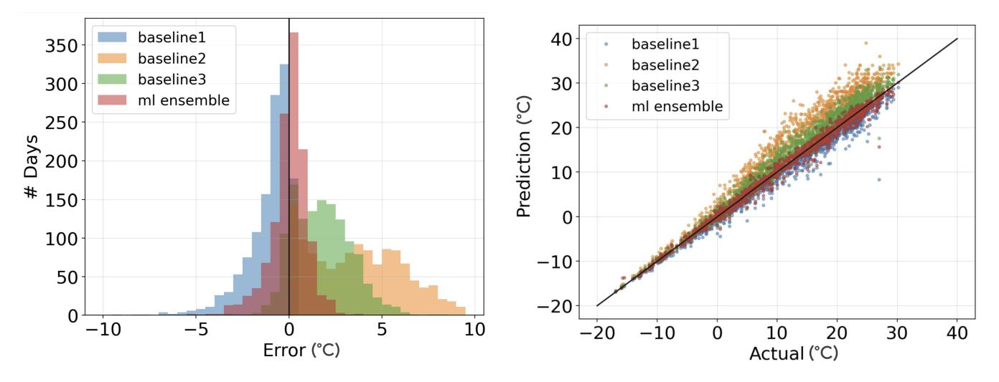

Fig. 7: Prediction of daily max wet-bulb temperature versus actual for baseline models and Prometheus's ensemble. Baselines 1, 2, and 3 predict wet-bulb for max dry-bulb temperature and daily min, mean, and max relative humidity, respectively.

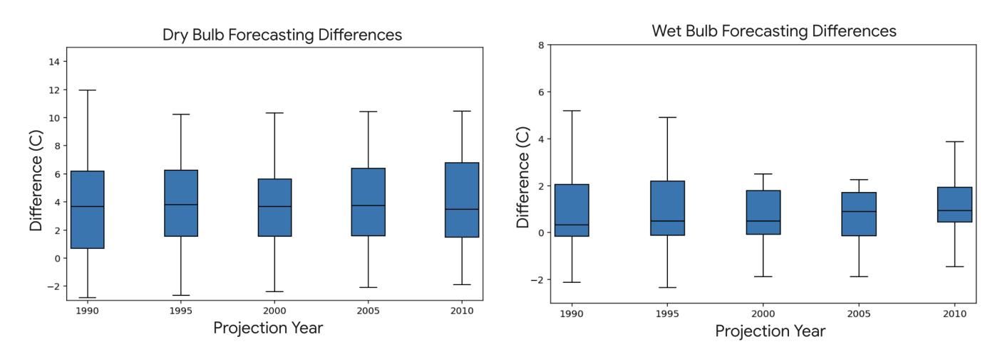

Fig. 8: Difference between Prometheus and ASHRAE predictions for 1-in-50-year temperature forecasts. Dry- and wet-bulb predictions assume 1.5 ◦C and 1.2 ◦C GSTR, respectively.

Figure 8 indicates Prometheus consistently predicts higher 50-year return temperatures. The dry-bulb difference ranges from −2.8 ◦C to 19.7 ◦C with an average of 4.4 ◦C. The wet-bulb difference ranges from −4.0 ◦C to 12.1 ◦C with an average of 1.4 ◦C. These differences arise because Prometheus incorporates two decades of simulated surface temperature increases whereas ASHRAE neglects these trends.

While adding fixed temperature margins to ASHRAE is simpler than Prometheus's machine learning, Figure 9 indicates margins are inadequate. For wet-bulb, even aggressive 3 ◦C margins underestimate risk at most sites. The median shortfall is 0.69◦C and 25% of sites are underestimated by more than 1.4 ◦C. For dry-bulb, although 6 ◦C margins are sufficient on average, the inter-quartile range spans underestimates of −2 ◦C to overestimates of 2 ◦C. These margins simultaneously underprovision cooling for half the fleet while over-provisioning for the other half. Margins ignore site-specific climate and are not calibrated to any specific risk tolerance.

#### *C. Future Emission Scenarios*

We use Prometheus to forecast 1-in-50-year return temperatures in 2044 and assess implications for data center cooling. Forecasts use 25 years of historical observations (1999-2024) and 20 years of CMIP6 climate projections (2024-2044). Forecasts consider two climate scenarios:

- SSP2-4.5: Medium emissions scenario with a Global Surface Temperature Rise (GSTR) of 1.7 ◦C for wet-bulb and 2.5 ◦C for dry-bulb temperatures.
- SSP5-8.5: High emissions scenario with a GSTR of 2.5 ◦C for wet-bulb and 3.0 ◦C for dry-bulb temperatures.

Prometheus's 2044 forecasts are significantly higher than ASHRAE's. In Figure 10, projected 50-year return temperatures are 2.7 ◦C to 6.8 ◦C higher for wet-bulb and 2.0 ◦C to 10.7 ◦C higher for dry-bulb across various data center locations.

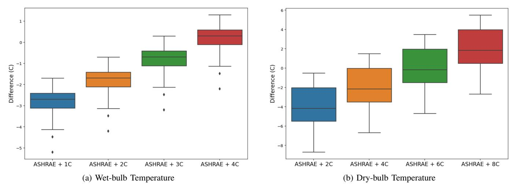

Fig. 9: Limitations of fixed margins. Boxplots show difference in (a) wet-bulb and (b) dry-bulb forecasts between ASHRAE with fixed margin and Prometheus for 2044 50-year return temperatures.

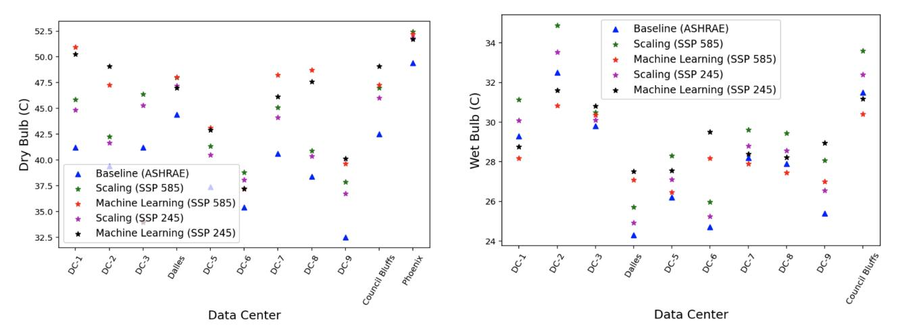

Fig. 10: Projected 50-year dry- and wet-bulb temperatures at various Google data center locations.

#### VII. PRODUCTION DEPLOYMENT

We apply Prometheus to a fleet of thirty production hyperscale data centers. This geographically diverse fleet spans North America, Europe, the Middle East, South America, and the Asia-Pacific region. It uses a mix of cooling technologies that are sensitive to either dry- or wet-bulb temperatures. For confidentiality, most data centers are identified by numeric labels but, for concrete examples, we also reveal five locations: Dublin, London, Phoenix, Council Bluffs, and Dalles.

## *A. Infrastructure Plans*

We apply Prometheus's long-term strategic planning framework to maintain the fleet's current risk profile over a twodecade horizon. We forecast 1-in-50-year temperatures for 2044 under the high emissions SSP5-8.5 scenario.1 These forecasts determine cooling needed to maintain target cold aisle temperatures at each site in Figure 11 and Table II.

1Site requirements, space reservations for cooling are similar whether we model high-emission (SSP5-8.5) or medium-emission (SSP2-4.5) future.

Prometheus forecasts significant temperature increases. For sites sensitive to dry-bulb, extreme temperatures increase by an average of 6 ◦C. Dublin and London are particularly critical as observed maxima have already surpassed their 2021 ASHRAE 50-year return temperatures. For sites sensitive to wet-bulb, extreme temperatures increase by an average of 3.8 ◦C. Even sites like Council Bluffs and Dalles, where ASHRAE standards have not yet been breached, face 1.1 ◦C to 2.6 ◦C increases over current standards. These temperature rises motivate cooling capacity upgrades of 11% on average. The most challenged sites for dry- and wet-bulb temperatures require upgrades of 39% and 48%, respectively.

Rising wet-bulb temperatures present a significant challenge as nine of the eleven data centers will require more physical space for upgrades. Some currently use evaporative cooling without chillers, which reduces power but becomes impractical with higher wet-bulb. By 2044, we expect these data centers will be unable to maintain cold aisle temperatures and current risk profiles during heat events and will require chillers.

| Site           | Ambient Condition | ASHRAE 50-yr (2021) | ASHRAE Violated in Last 25 Years | Prometheus SSP-585 50-yr Projection |
|----------------|----------------------|------------------------|----------------------------------|-------------------------------------------|
| Dublin         | Dry Bulb             | $30.1^{\circ}C$        | Yes (33.0°C)                     | $34.2^{\circ}C$                           |
| London         | Dry Bulb             | $37.7^{\circ}C$        | Yes $(40.2^{\circ}C)$            | $41.2^{\circ}C$                           |
| Phoenix        | Dry Bulb             | $49.4^{\circ}C$        | No (within $1^{\circ}C$ )        | $52.4^{\circ}C$                           |
| Council Bluffs | Wet Bulb             | $32.5^{\circ}C$        | No                               | $33.6^{\circ}C$                           |
| Dalles         | Wet Bulb             | $24.5^{\circ}C$        | No (within $1^{\circ}C$ )        | $27.1^{\circ}C$                           |

TABLE II: Locations of five production data centers and sensitivity to ambient temperature conditions. Comparisons between ASHRAE standards, actual observations, and Prometheus forecasts.

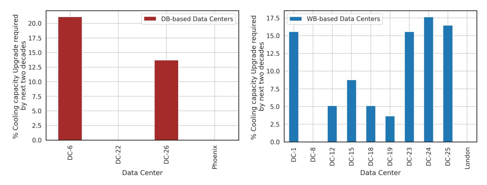

Fig. 11: Plant re-rates and upgrades required to maintain current risk profile twenty years into the future at 14 select Google data center locations.

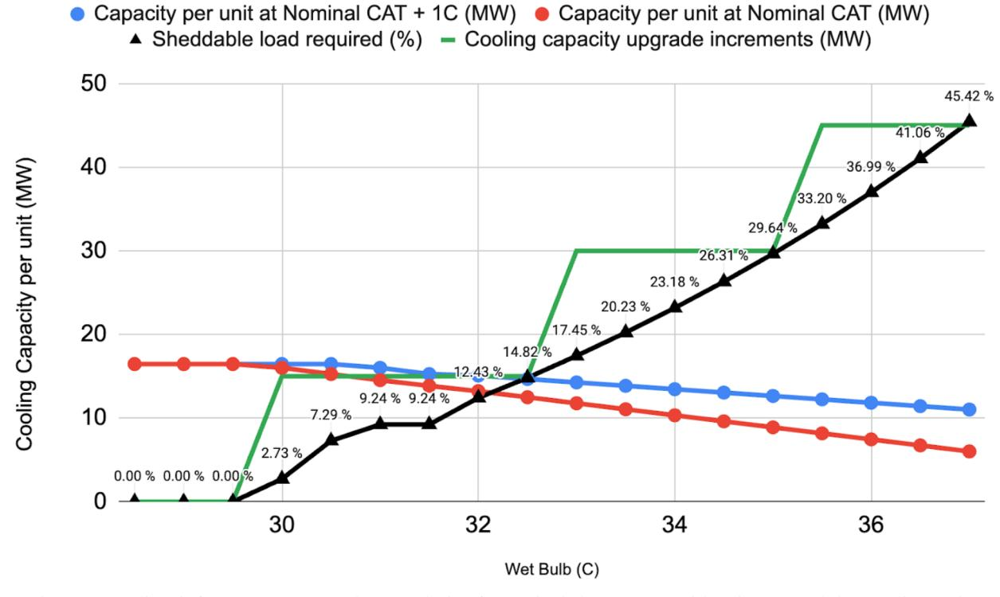

Fig. 12: Cooling infrastructure upgrade granularity for typical data center with 15MW modular cooling units.

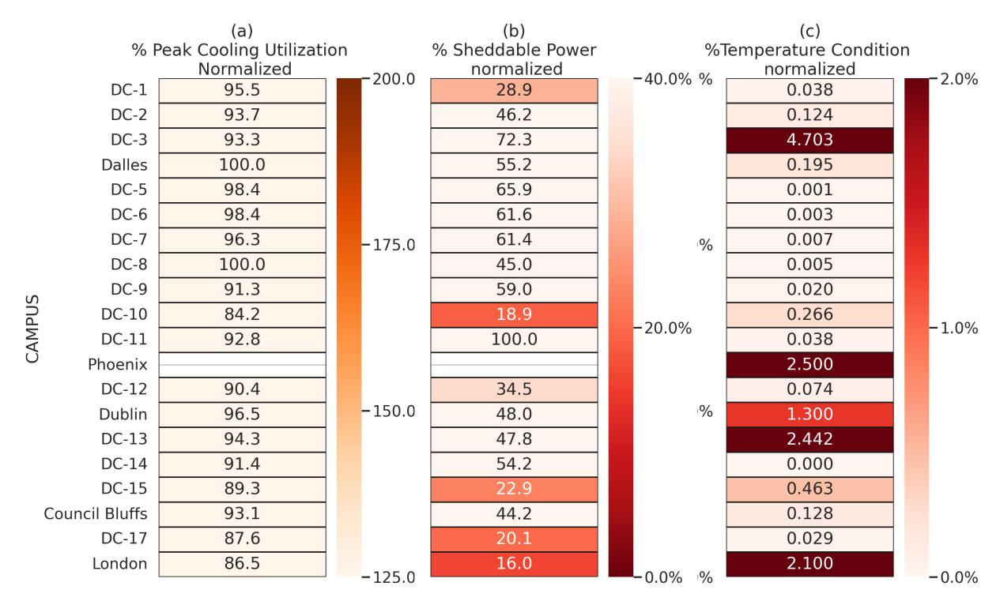

Fig. 13: Infrastructure upgrade criteria evaluated for Google's production data center locations. The three panels show (a) cooling utilization, (b) sheddable power, and (c) external temperature condition. Values are normalized by maximum observed in the data centers analyzed.

Infrastructure Granularity. Prometheus distinguishes between adjusting operational parameters for existing cooling infrastructure and adding modular cooling units. Adjustments retain existing infrastructure and simply modify control variables such as fan speed, economizer runtime, and chilled water setpoints. Upgrades add discrete cooling capacity increments such as chillers, pumps, heat exchangers. A typical hyperscale data center adds cooling in 15MW increments.

Figure 12 illustrates how, as wet-bulb temperature increases, cooling capacity degrades. The data center must either deploy additional cooling or prepare to shed more load during thermal emergencies. The red line shows capacity per unit at nominal cold aisle temperature (CAT). The blue line shows capacity at CAT+1 ◦C. The black line indicates the percentage of sheddable load required to maintain nominal CAT as wet-bulb temperature increases. The green steps show discrete 15MW capacity increments from adding modular cooling units.

For wet-bulb below 30◦C, operational adjustments for fan speeds, economizer runtime, chilled water setpoints suffice and load shedding is minimal (less than 3%). Beyond this threshold, cooling capacity degrades substantially as chillers saturate. Sites facing 32◦C wet-bulb will require 12% load shedding to handle thermal emergencies. Sites facing 35◦C wet-bulb will require 30% load shedding, which is infeasible and triggers addition of modular cooling units.

#### *B. Infrastructure Upgrades*

We apply Prometheus's medium-term tactical planning processes to determine when an upgrade is necessary. In Figure 13 and Table III, we evaluate each site against three criteria. Action is triggered only when crossing thresholds of > 125% for cooling utilization, ≤ 40% for sheddable load, and > 2% for the external temperature criteria. For confidentiality, percentages are normalized relative to maximum observed value across the data centers we analyze.

Most production workloads have limited flexibility. Sheddable power is often less than 40-60% of the maximum observed value. Although this may seem large, shedding can only reduce cold aisle temperature by approximately 1 ◦C per 10% of load shed. Given that most data centers have less than 20% sheddable load, the practical cooling benefit is limited to 1-2 ◦C. Six of the case study's twenty data centers fall below the sheddable load target, placing a greater burden on their cooling infrastructure. This issue is particularly notable for sites in Dublin, London, and Council Bluffs that serve primarily critical production workloads.

Moreover, Prometheus's forecasts identify significant risks. For instance, two data centers that house four distinct cooling loops at the same site will exceed design temperature with more than a 2% probability. This risk is compounded by inflexible workloads. For instance, one cooling loop at data center DC-13 has a normalized sheddable load of only 48%, close to the upgrade threshold. Prometheus recommends additional

| Site           | Cooling Utilization Criteria Eq(4) | External Temperature Criteria Eq(5) | Sheddable Load Criteria Eq(6) | Upgrade Required? |
|----------------|------------------------------------------|-------------------------------------------|----------------------------------|----------------------|
| Dublin         | 97%                                      | 1.3%                                      | 48%                              | No                   |
| London         | 86.5%                                    | 2.1%                                      | 16%                              | No                   |
| Phoenix        | −                                        | 2.5%                                      | −                                | No                   |
| Council Bluffs | 93.1%                                    | 0.13%                                     | 44.2%                            | No                   |
| Dalles         | 100%                                     | 0.002%                                    | 55.2%                            | No                   |

TABLE III: Measures of upgrade criteria for data center case studies. Values are normalized by maximum observed in the broader set of data centers analyzed. Phoenix is a new site under development and reports no values for cooling utilization and sheddable load.

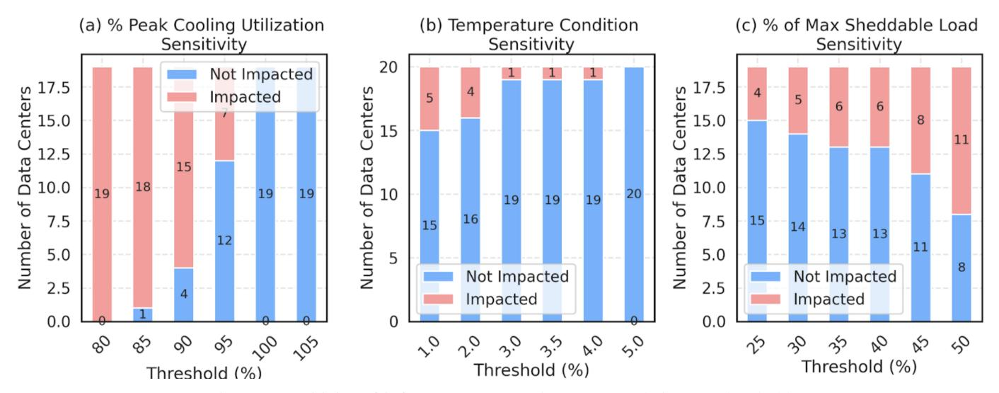

Fig. 14: Sensitivity of infrastructure upgrade recommendations to threshold.

cooling in that specific loop.

Yet no single data center crosses thresholds for all three criteria and requires immediate cooling upgrades. This highlights Prometheus's effectiveness as a phased, cost-efficient framework for resilience. For sites like Dublin and London, which have already observed record temperatures, Prometheus flags long-term risk and initiates infrastructure planning. But the upgrade itself is deferred until tactical criteria indicate critical conditions.

Figure 14 assesses how upgrade recommendations vary with thresholds. Panel (a) shows sensitivity to cooling utilization. Thresholds set at 85% flag nearly all data centers while those above 100% flag none. Panel (b) illustrates sensitivity to external temperature thresholds, measured in percentage probability that external temperatures exceed the data center's thermal design. Tightening this threshold from 2% to 1% adds one additional data center for upgrades whereas loosening it eliminates most upgrades. Panel (c) illustrates how increasing requirements for sheddable load from 25% to 50% requires more data centers to upgrade cooling.

#### *C. Comparative Economic Analysis*

Upgrading data center cooling capacity is expensive and justified only when upgrade costs are less than the expected cost of thermal emergencies and alternative mitigation strategies. We compare costs using order-of-magnitude estimates from public sources, confirmed against internal production parameters. Costs are normalized per Watt of compute capacity.

Infrastructure Costs. Hyperscale data center construction costs \$7–\$12 per Watt, with cooling infrastructure representing 15–25% of the total [16], [17]. Increasing cooling capacity by 20% incurs marginal costs of \$0.20–\$0.60 per Watt. This cost accounts for only the cooling upgrade as the data center shell, power distribution, and IT equipment remain unchanged.

Outage Costs. We establish a lower bound using cloud virtual machine pricing, which reflects the value of raw compute. Cloud providers price 4-vCPU, 16-GB instances at \$0.19/hour [18]–[20], corresponding to \$0.05 per vCPU-hour. Dual-socket servers provide 128 vCPUs at 500W, implying 4W per vCPU. Combining these two estimates would value computation at \$0.0125 per Watt-hour of data center capacity.

Consider these costs in the context of a specific thermal emergency. Google's report from the 2022 London heatwave indicates that cooling failures began on July 19 at 06:33 and 35 hours were required to fully restore service [21]. At \$0.0125 per Watt-hour, this outage cost \$0.44 per Watt whereas cooling upgrades would have cost \$0.20–\$0.60 per Watt. Thus, some might view the costs of upgrades and outages as comparable.

Yet cooling upgrades may have several additional cost advantages. First, Prometheus indicates most sites require only

|  | TABLE IV: Comparison of Thermal Management Research |  |
|--|-----------------------------------------------------|--|
|  |                                                     |  |

|                      | System Scale             | Timescale           | Analysis Method                 | Management Goal                            | Decision Type                          |
|----------------------|--------------------------|---------------------|---------------------------------|--------------------------------------------|----------------------------------------|
| Comp. Sprinting [12] | Cluster of servers    | Minutes             | Game-theoretic equilibrium   | Max performance given thermal budget    | Coordinate + trigger sprints        |
| Mercury/Freon [13]   | Cluster of servers    | Seconds             | Physics emulation            | Monitor server temperature              | Redistribute load across servers    |
| C-Oracle [14]        | Cluster of servers    | Minutes             | Physics + workload emulation | Respond to thermal emergency            | Select mitigation technique, action |
| CoolAir [15]         | Data center facility  | Hours to day     | ML regression                   | Reduce temperature variations, extremes | Select cooling technique, action    |
| Prometheus           | Fleet of data centers | Years to decades | ML ensemble on CMIP6         | Plan, upgrade infrastructure            | Provision cooling capacity          |

10% capacity increases rather than 20%, halving upgrade costs. Furthermore, the analysis accounts for raw compute and excludes the value of application software and the penalties for violating service level agreements; the latter is 30–100% of VM price [22]. Thus, outage costs might easily be twice as large as our initial estimate. Taken together, these effects increase the cost gap by 4× in favor of cooling upgrades.

Alternative – Load Migration Costs. Migrating 10MW of computation, 10% of a 100MW data center, requires either spare capacity or new construction. Construction costs \$7–\$12 per Watt, an order of magnitude greater than \$0.20–\$0.60 for cooling upgrades. Even if capacity exists, migrating 10MW of computation could affect 200,000 VMs and 3.2PB active memory [23]. Memory migration would require a week on a 50Gbps network and more if storage migration is required.

Alternative – Power Capping Costs. Reducing all processors' frequencies by 10% decreases power and thermal load but degrades performance. For first-party workloads, reduced throughput creates a backlog of jobs that is economically indistinguishable from outages. For third-party cloud workloads, SLAs might technically be satisfied but 10% performance loss may cause reputation damage and customer dissatisfaction.

