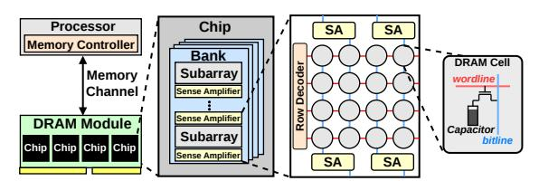
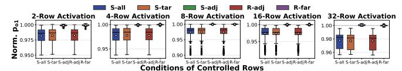
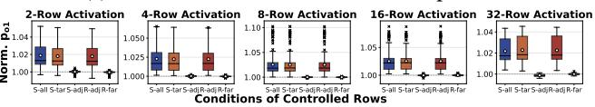

# PuDGhost: Experimental Analysis of Computation Result Corruption in Processing-using-DRAM Operations on Real DRAM Chips and Implications for Future Systems

Daichi Tokuda¹ İsmail Emir Yüksel² Tatsuya Kubo¹,⁴ Ataberk Olgun² Haocong Luo² Nisa Bostanci² Jikun Wang² A. Giray Yağlıkçı³ Shinya Takamaeda-Yamazaki¹,⁴ Onur Mutlu²

1The University of Tokyo 2ETH Zurich 3CISPA 4RIKEN

Processing-using-DRAM (PuD) is a promising computation paradigm to alleviate the frequent data movement between main memory and processing units. The PuD paradigm provides a substrate for highly parallel computation by using each DRAM column as a computation engine via simultaneous multiple-row activation (SiMRA). Unfortunately, DRAM density scaling might hinder PuD's benefits. This is because denser cell arrays bring rows and columns closer, making even regular DRAM operations susceptible to noise and interference from neighboring cells. PuD repurposes DRAM from a storage device into a parallel computing substrate, yet no prior work investigates whether interference from rows or columns that are not intended to participate in the computation can compromise PuD robustness.

In this work, we reveal an interference phenomenon affecting PuD computations, which we call PuDGhost, where a PuD operation in a given column produces erroneous results due to interference from 1) data stored in non-activated DRAM rows and 2) data stored in other columns that perform computations concurrently under the same SiMRA operation. PuDGhost violates the ideal picture of PuD computations, where each column's computation should depend solely on its own operand data. Thus, PuDGhost threatens the robustness of future PuD systems. We present the first extensive characterization of PuDGhost using 96 real DDR4 DRAM chips from 12 modules, systematically quantifying the impact of these two interference sources under various conditions (i.e., data patterns, temperature, and spatial properties). Among our 15 new empirical observations, we highlight two major results: 1) data in physically adjacent non-activated rows affects SiMRA outputs by up to 10% for random inputs, and 2) data in columns that perform computations concurrently affects SiMRA outputs by up to 48% for random inputs. Guided by these findings, we propose countermeasures against PuDGhost across multiple layers of the PuD computing stack (i.e., microarchitectural, architectural, and system levels). Specifically, we propose and evaluate on real DDR4 DRAM chips: 1) robust column screening that reduces the risk of mistakenly using unreliable columns in the presence of PuDGhost, and 2) a compute row layout that mitigates PuDGhost via dedicated rows between compute rows. Our solutions greatly improve PuD computation accuracy. We hope that our findings provide a foundation for developing solutions to enable future PuD systems that are robust.

#### 1. Introduction

Data movement between main memory (DRAM) and processors has become a major bottleneck, consuming a large share of execution time and energy in many real workloads [1–21]. Processing-using-DRAM (PuD) [21–71] is a promising paradigm that can alleviate this bottleneck by leveraging the

existing operational principles of DRAM to realize massively parallel computation within DRAM. Prior work demonstrates the potential of this approach to substantially improve throughput and energy efficiency compared to conventional systems for a wide range of applications, including databases, web search, data analytics, graph processing, genome analysis, cryptography, optimization solvers, hyperdimensional computing, and LLMs [26, 33, 35, 37, 38, 40–42, 48, 49, 51, 55–59, 61, 72–75].

The core computational capability of various PuD architectures relies on Simultaneous Multiple-Row Activation (SiMRA), a DRAM operation that simultaneously activates multiple DRAM rows within a subarray [23, 26, 33, 38, 40–43, 46–48, 50–52, 54–58, 61, 63, 64, 67, 68, 76]. Figure 1a shows how performing SiMRA across the cells of simultaneously activated DRAM rows (R1, R2, and R3) results in a majority operation (MAJX) to be computed on the values stored in the multiple simultaneously activated DRAM cells in two DRAM columns (C0 and C1) in three key steps. First, the MAJX input operands are initialized (①). Second, the SiMRA operation starts, enabling charge sharing among activated DRAM rows and columns (②). Third, the sense amplifier (SA in Figure 1a) kicks in and samples the MAJX result (③) based on its operational principles (see 2.2).

Figure 1: (a) Ideal MAJ3. (b) MAJ3 under PuDGhost.

Ideally, as illustrated in Figure 1a, the MAJX result in each DRAM column is determined *solely* by the activated cells used as operands. With each column performing its own MAJX, each one of the many (e.g., 65536) DRAM columns acts as a computing unit, enabling the massive parallelism of PuD.

We hypothesize that this ideal picture of PuD computations might be challenged by ongoing DRAM density scaling. With rapid DRAM scaling and denser cell arrays, even regular DRAM operations can become susceptible to noise and interference from neighboring cells, violating memory isolation (i.e., memory access to one location should not affect data stored in other memory locations) [77–167]. Prior work [78,81–84,86] demonstrates that accessing one DRAM location can corrupt data in other locations, even in systems where DRAM is used

solely as a storage device. As PuD repurposes DRAM from a storage device to a computation device, the notion of isolation should extend beyond between memory accesses to each computation (i.e., a computation's result should not be affected by data that is not intended to participate in the computation). Unfortunately, to our knowledge, no prior work investigates the impact of interference from rows or columns that are not intended to participate in the computation on the reliability of PuD computation results.

This work is the first to reveal an interference phenomenon corrupting PuD computation results, which we call PuDGhost, on real DRAM chips. PuDGhost causes a PuD operation in a given column to produce erroneous results due to interference from non-operand data (i.e., data not intended to participate in the computation) stored in (1) non-activated rows and (2) other columns that perform computations concurrently under the same SiMRA operation. Figure [1b](#page-0-0) illustrates how PuDGhost causes PuD computation errors. Rows R1, R2, and R3 are simultaneously activated to perform a MAJ3 operation. In column C1, the inputs are 1, 1, and 0, so the ideal MAJ3 output should be 1 (Figure [1a](#page-0-0)). Due to PuDGhost, column C1 suffers interference from non-activated rows (e.g., R0) ( 1 ) and other columns (e.g., C0) ( 2 ), resulting in an erroneous output.

We conduct the first extensive characterization of PuDGhost using 96 real DDR4 DRAM chips (12 modules). We systematically study interference from non-operand data under a wide range of operational conditions (e.g., data patterns, temperature, and spatial properties). Among our 15 key observations, we highlight two major findings. First, non-operand data in non-activated rows that are physically adjacent to simultaneously activated rows affects SiMRA outputs. Storing logic-0 (logic-1) in the adjacent rows biases the SiMRA output toward logic-0 (logic-1), affecting SiMRA outputs by up to 10% for random inputs. The bias increases monotonically as the fraction of logic-1 in adjacent rows increases (detailed in [§5\)](#page-4-0). Second, non-operand data in other columns that concurrently perform computations under the same SiMRA operation (i.e., the inputs of these concurrent computations) also affects SiMRA outputs by up to 48% for random inputs. Unlike adjacent-row interference, column-wise interference is both stronger and exhibits a non-monotonic relationship with the fraction of logic-1 in these columns' inputs (detailed in [§6\)](#page-6-0).

Our real DRAM chip characterization results suggest that PuDGhost is an important consideration for designing future PuD systems that are robust. Building on our empirical insights, we analyze PuDGhost's impact on PuD reliability and present robust PuD solution directions across multiple layers of the PuD computing stack. At the system level, we reveal that PuD systems that are unaware of adjacent-row data during column screening and PuD execution can mislabel unreliable columns as reliable. We propose robust column screening methods that control the data in rows adjacent to compute rows during both screening and PuD execution, reducing the risk of mistakenly using unreliable columns in the presence of PuDGhost. At the architecture level, we propose a compute row layout that uses dedicated isolation rows with fixed data patterns between compute rows, ensuring that the rows adjacent to compute rows store fixed data that does not change during PuD execution.

We evaluate our solutions on real DRAM chips for two use cases: general matrix-vector multiplication (GEMV) and true random number generation (TRNG). Our results demonstrate that our solutions significantly reduce the impact of PuDGhost, providing 1) 413× lower normalized mean squared error (NMSE) in GEMV and 2) preventing 93% of the entropy loss in TRNG, compared to PuDGhost-unaware systems.

Our main contributions are as follows.

- We perform the first experimental study of a new interference phenomenon in DRAM that corrupts Processing-using-DRAM (PuD) computation results, which we call PuDGhost, on real DRAM chips.
- Our experimental results on real DDR4 DRAM chips reveal that PuD computation results in a given column can be affected by data stored in 1) non-activated rows adjacent to the rows used for computation and 2) other columns that perform computations concurrently. PuDGhost violates the expectation that each computation depends solely on its own operand data.
- We propose and discuss solutions across multiple layers of the PuD computing stack to reduce PuDGhost-induced PuD computation errors.
- We evaluate our solutions on real DRAM chips for two use cases: general matrix-vector multiplication (GEMV) and true random number generation (TRNG). Our results demonstrate that our solutions significantly reduce the impact of PuDGhost on these real use cases.
- We believe and hope that our results and analyses will enable and inspire future research to reduce computation errors in PuD, and to design future PuD systems that are robust.

#### 2. Background

#### 2.1. DRAM Organization and Operation

Dynamic Random Access Memory (DRAM) is organized in a hierarchical structure consisting of channels, ranks, chips, banks, and subarrays of memory cells (Figure [2\)](#page-2-0). A module contains one or more ranks, and each rank consists of multiple DRAM chips. Each chip has multiple banks (e.g., 8–16), and each bank is further divided into multiple subarrays. Within each subarray, DRAM cells form a two-dimensional grid of rows (wordlines) and columns (bitlines). Each cell consists of a single transistor paired with a capacitor, and stores one bit of data, based on the charge level held in the capacitor. The DRAM cells in the same column are connected to the sense amplifier (SA) via a bitline. Modern DRAM employs an open bitline architecture [\[168](#page-15-1)[–171\]](#page-15-2), where half of the bitlines in a subarray share SAs with the upper adjacent subarray and the other half share SAs with the lower adjacent subarray. The memory controller integrated in the CPU die generates a sequence of DRAM commands to access data in DRAM. The ACT command opens a specific row and copies its data into the row buffer. The PRE command closes the active row. These commands operate on all columns in a row.

#### 2.2. Processing-using-DRAM

Computational Capability of PuD. Processing-using-DRAM (PuD) [\[21–](#page-13-1)[71\]](#page-14-0) is a paradigm that can alleviate the bottleneck caused by frequent data movement between processing elements (e.g., CPUs) and main memory. PuD enables massively

Figure 2: DRAM Organization.

parallel computation within DRAM by leveraging the intrinsic analog operational properties of DRAM circuitry. Many PuD architectures perform computation through two primitives: 1) in-DRAM data copy from one row to another (RowCopy) using consecutive multiple-row activation [\[22,](#page-13-21)[23,](#page-13-14)[26,](#page-13-2)[30](#page-13-22)[,43,](#page-13-15)[50,](#page-13-17)[64\]](#page-14-5), and 2) in-DRAM bitwise operations using simultaneous multiplerow activation (SiMRA) [\[23,](#page-13-14)[26,](#page-13-2)[33,](#page-13-3)[38,](#page-13-6)[40–](#page-13-7)[43,](#page-13-15)[46–](#page-13-16)[48,](#page-13-9)[50](#page-13-17)[–52,](#page-13-18)[54](#page-13-19)[–58,](#page-13-20) [61,](#page-14-1)[63,](#page-14-4)[64,](#page-14-5)[67,](#page-14-6)[68,](#page-14-7)[76\]](#page-14-8). In bitwise operations using SiMRA, simultaneously activating multiple DRAM rows within the same subarray induces charge sharing of activated cells in each bitline, resulting in a majority-of-X operation (MAJX) in each column. For example, when three rows are simultaneously activated, the charges of cells on the same bitline combine through charge sharing to produce the MAJ3 result (see Figure [1a](#page-0-0)). MAJX can implement basic Boolean operations such as AND and OR, and by chaining multiple MAJX operations, PuD can accelerate a wide range of computations, from basic arithmetic to complex kernels including general matrix-vector multiplication (GEMV) for LLM inference [\[26,](#page-13-2)[33,](#page-13-3)[35,](#page-13-4)[37,](#page-13-5)[38,](#page-13-6)[40](#page-13-7)[–42,](#page-13-8)[48,](#page-13-9)[49,](#page-13-10)[51,](#page-13-11)[55](#page-13-12)[–59,](#page-13-13)[61,](#page-14-1)[72](#page-14-2)[–75\]](#page-14-3).

In Ambit [\[23,](#page-13-14) [26,](#page-13-2) [30\]](#page-13-22) and its successor architectures [\[33,](#page-13-3) [38,](#page-13-6) [48\]](#page-13-9), six compute rows per subarray are reserved to execute MAJ3. The row decoder is modified to allow specific triplet combinations of these six rows to be simultaneously activated, enabling a MAJ3 operation. The remaining rows in the same subarray serve as storage rows, holding data that is loaded into compute rows via RowCopy when needed for computation.

PuD on COTS DRAM Chips. Prior work [\[41,](#page-13-23)[43–](#page-13-15)[47,](#page-13-24)[50,](#page-13-17)[51,](#page-13-11)[54,](#page-13-19) [61](#page-14-1)[–69,](#page-14-14) [76\]](#page-14-8) demonstrates that commercial off-the-shelf (COTS) DRAM chips possess PuD computation capability. Specifically, prior work [\[62–](#page-14-15)[65,](#page-14-16) [67\]](#page-14-6) experimentally shows that COTS DDR4 chips from SK Hynix [\[172\]](#page-15-3) can simultaneously activate 2, 4, 8, 16, or 32 rows within a subarray by violating nominal timing parameters. The memory controller can perform SiMRA on these chips by issuing an ACT-PRE-ACT command sequence (APA sequence) with very short intervals of 3ns or less between each command.

PuD Computation Errors. Prior work focuses primarily on process variation in DRAM circuit components as the mechanism for MAJX errors. Prior work [\[26,](#page-13-2) [33,](#page-13-3) [62,](#page-14-15) [64\]](#page-14-5) shows through circuit-level simulations that MAJ3 operations produce erroneous results when process variation of subarray components (e.g., cell capacitance) is large. Characterization studies using COTS DRAM chips [\[46,](#page-13-16) [47,](#page-13-24) [50,](#page-13-17) [62–](#page-14-15)[64\]](#page-14-5) experimentally show that the success rate of MAJX on real DRAM chips is below 100%, and that error susceptibility varies across columns. In these prior studies, the causes of SiMRA-based MAJX errors have been attributed to process variation of cell capacitance, access transistors, and SAs in each column.

#### 3. Methodology

We describe our COTS DRAM chip testing infrastructure ([§3.1\)](#page-2-1) and the COTS DDR4 chips tested for our characterization study ([§3.2\)](#page-2-2).

#### 3.1. COTS DRAM Testing Infrastructure

We conduct COTS DRAM chip experiments using DRAM Bender [\[173–](#page-15-4)[176\]](#page-16-0), an FPGA-based DDR4 testing infrastructure that provides precise control of DDR4 commands. Figure [3](#page-2-3) shows our experimental setup that consists of four main components: 1) a host machine that generates the test program and collects results, 2) an FPGA development board [\[177\]](#page-16-1), programmed with DRAM Bender, 3) thermocouple temperature sensors and heater pads pressed against the DRAM chips to maintain target temperature levels, and 4) a temperature controller that keeps the temperature at the desired level.

Figure 3: Our FPGA-based PuD testing infrastructure (DRAM Bender [\[173,](#page-15-4) [174\]](#page-16-2)) with DDR4 modules.

#### 3.2. COTS DDR4 DRAM Chips Tested

Table [1](#page-2-4) lists the 96 COTS DDR4 DRAM chips from 12 modules, showing chip manufacturer (Chip Mfr.), module manufacturer (Module Mfr.), module count (#Modules), chip count (#Chips), die revision (Die Rev.), density, and chip organization (Org.). All tested chips are from SK Hynix, as prior work reports that only SK Hynix modules can perform SiMRA [\[41,](#page-13-23) [43–](#page-13-15)[47,](#page-13-24) [50,](#page-13-17) [61–](#page-14-1)[65,](#page-14-16) [67\]](#page-14-6). We test modules from various module manufacturers, die revisions, and chip densities so that our findings apply across different DRAM designs and manufacturing processes.[1](#page-2-5)

Table 1: Summary of DDR4 DRAM chips tested.

| Chip Mfr. | Module Mfr. | #Modules (#Chips) | Die Rev. | Chip Density | Chip Org. |
|--------------|----------------|----------------------|-------------|-----------------|--------------|
| SK Hynix     | TimeTec        | 3 (24)               | A           | 4Gb             | x8           |
|              | TeamGroup      | 7 (56)               | M           | 4Gb             | x8           |
|              | SK Hynix       | 2 (16)               | A           | 8Gb             | x8           |

Logical-to-Physical Row Mapping. DRAM manufacturers use mapping schemes to translate logical to physical row addresses. To account for in-DRAM row address mapping, we reverse engineer the physical row address layout in all tested chips by analyzing RowHammer-induced bitflip patterns, following prior methodologies [\[63](#page-14-4)[–65,](#page-14-16) [82,](#page-14-17) [84\]](#page-14-12).

Subarray Boundaries. Following prior methodologies [\[50,](#page-13-17) [63](#page-14-4)[–65,](#page-14-16) [90\]](#page-14-18), we identify subarray boundaries using RowCopy, which only succeeds when source and destination rows are in

1Prior work [\[61–](#page-14-1)[64\]](#page-14-5) hypothesizes that the hierarchical row decoder design is the primary enabler of SiMRA on COTS DRAM chips: reducing the intervals between APA sequence allows the local wordline decoder to latch the subsequent row address without de-asserting the previous one. We believe that chips from other vendors are also fundamentally capable of SiMRA, as SiMRA leverages the hierarchical row decoder design that is common across high-performance DRAM chips and is likely to persist in future generations.

the same subarray. By attempting RowCopy across consecutive row pairs, we reconstruct each chip's subarray map.

**True/Anti Cells.** DRAM cells are classified as true-cell or anti-cell based on how a fully charged capacitor is interpreted: in a true-cell (anti-cell), a charged capacitor represents logic-1 (logic-0) and a discharged capacitor represents logic-0 (logic-1). Prior work [90, 178] on DRAM retention failure commonly assumes that retention-induced errors are from the charged to discharged state. We identify the cell type of our chips following these works. Throughout this paper, logic-1 denotes a charged capacitor and logic-0 denotes a discharged capacitor. **Even/Odd Columns.** In an open-bitline layout [168–171], adjacent subarrays share sense amplifiers (SAs). Bitlines alternate their connections: even columns connect to SAs on one side while odd columns connect to SAs on the other side. We identify this even/odd column assignment by analyzing RowCopy outcomes and charge-sharing across subarray boundaries, following prior work [63, 90].2

Verification of Simultaneously Activated Rows. Prior work [62-65, 67] demonstrates that an APA sequence can simultaneously activate 2, 4, 8, 16, and 32 DRAM rows, and a subsequent WRITE command overwrites these rows with the written data.3 We follow this methodology to verify which rows are activated during SiMRA. First, we initialize an entire subarray with a predefined pattern. Second, we issue an APA sequence to activate multiple target rows, immediately followed by a WRITE command with a distinct pattern. After issuing a PRE, we read back each row in the subarray. Rows that were activated during APA will contain the written pattern, allowing us to identify which rows participated in SiMRA. To ensure non-activated rows remain unchanged, we extend the delay between the WRITE command following APA and the subsequent PRE command beyond the nominal tWR timing. We test delays of tWR, tWR+50ns, tWR+100ns, and tWR+200ns to rigorously verify that non-activated rows are not overwritten.

#### 3.3. Overview of Experiments

**3.3.1. Study Scope.** We test whether a key expectation of PuD computations holds on real DRAM chips: that each column's output depends solely on its own operand data. We investigate two sources of interference from non-operand data by addressing the following research questions, RQ1 and RQ2.

RQ1: How does data stored in non-activated rows affect SiMRA outputs? (§4 and §5)

RQ2: How does data stored in other columns that concurrently perform computations under the same SiMRA operation affect SiMRA outputs? (§6)

We provide hypothetical explanations for the phenomena observed on real DRAM chips in §7.

**3.3.2. Terminology and Metric.** Figure 4 illustrates the six key terms we use in SiMRA experiments. *SiMRA rows* (1) refers to a set of rows that are simultaneously activated during

a SiMRA operation; these rows contain the input operands on which the operation is performed. *Adjacent rows* (2) are the rows that are *not* activated during SiMRA and physically adjacent to the SiMRA rows. *Target subarray* (3) refers to the subarray that contains the SiMRA rows. Adjacent subarrays (4) are physically adjacent subarrays of the target subarray, one above and one below the target subarray. We define the term *controlled rows* (or *controlled cells*) (**5**) to refer to rows (or cells) whose data pattern is intentionally configured to observe how the SiMRA output changes in response to different data patterns. These data patterns include fixed patterns (all zeros, all ones, and random patterns) and patterns that depend on the inputs to the SiMRA rows. For random patterns, we define  $p_c$  as the probability that each bit in controlled cells independently takes logic-1. *Target columns* (6) refer to a specified subset of columns over which we evaluate the SiMRA output. By default, all columns in the subarray serve as target columns. For column-wise interference experiments (shown in Figure 8 and §6), we randomly select 1/8th of all columns in the subarray as target columns. The SiMRA-row cells in the remaining 7/8th columns serve as controlled cells, whose data patterns we vary to analyze their impact on SiMRA outputs of the target columns.

Figure 4: Experimental setup for evaluating interference from non-activated rows.

We define  $p_{o1}$  as the fraction of output bits that equal logic-1 when SiMRA is executed with random inputs over the target columns. For example, if target columns cover all 64K columns in a bank and we collect 128 samples,  $p_{o1} = 0.60$  means that 60% of the 64K  $\times$  128 output bits are logic-1. We use  $p_{o1}$  to quantify the effect of PuDGhost on the SiMRA operation in three key steps. First, as a baseline, we set all data other than the operand data in the target columns to random patterns (i.e.,  $p_c = 0.5$ ). Second, we vary the data pattern of specific controlled rows or cells and measure the resulting change in  $p_{o1}$  relative to this baseline. A change in  $p_{o1}$  indicates that the controlled non-operand data affects the computation output, and the direction and magnitude of the shift quantify the interference. Third, we report the ratio of  $p_{o1}$  under each condition to the baseline  $p_{o1}$ , which we call **Norm.**  $p_{o1}$ . A Norm.  $p_{o1}$ closer to 1.0 indicates less interference from the controlled cells, while values below (above) 1.0 indicate that the controlled cells bias the SiMRA output toward logic-0 (logic-1).

#### 4. Interference from Non-Activated Rows

In this section, we examine how non-activated rows in the *target* and *adjacent* subarrays, which share bitlines with the SiMRA rows, affect SiMRA outputs.

#### 4.1. Experimental Methodology

**Metric.** We designate several rows in the target subarray and adjacent subarrays as controlled rows. For each experimental

&lt;sup>2For some modules, the even/odd column assignment could not be reliably determined (i.e., the expected parity-dependent pattern was not consistently observed) using the RowCopy-based method of [63, 90]. We exclude these modules from experiments involving even/odd column parity.

&lt;sup>3For some modules, SiMRA is unreliable at certain activation row counts (i.e., some intended rows are not activated). We exclude such modules from the results of the affected row counts.

condition, we collect 128 samples with random inputs to the SiMRA rows while keeping the data in the controlled rows fixed across samples. In this section, we use all the columns in a subarray (i.e., 65536 columns) as target columns to perform SiMRA operations. Thus, we generate a total of  $65536 \times 128$  SiMRA output bits per condition. We report Norm.  $p_{o1}$  as defined in §3.3.2 to quantify the interference from the controlled rows. **Conditions.** Figure 4 illustrates six different conditions that we define to progressively understand which non-activated rows affect the SiMRA output in the scope of three consecutive subarrays, the target subarray (3) and its adjacent subarrays

subarrays, the target subarray (3) and its adjacent subarrays (4). 1) Base is the baseline configuration. 2) S-all designates all rows except the SiMRA rows in both the target (3) and adjacent subarrays (4) as controlled rows. 3) S-tar designates all rows except the SiMRA rows in the target subarray as controlled rows, while 4) S-adj designates all rows in the adjacent subarrays. 5) R-adj designates all adjacent rows (2) as controlled rows, while 6) R-far designates all rows in the target subarray except the SiMRA rows (1) and the adjacent rows (2).

**Experimental Control.** Across all conditions, the 128 sets of random input data applied to the SiMRA rows are *identical*, and the fixed data in all *non-controlled* rows are also kept identical. This design enables us to attribute observed differences in  $p_{o1}$  to the data patterns in the controlled rows.

Experimental Protocol. For each of the 128 random-input samples per condition, we execute four key steps: (i) write the specified data patterns to all controlled rows in the target and adjacent subarrays; (ii) write random input data to the SiMRA rows; (iii) execute SiMRA; and (iv) read out the SiMRA rows to record the outputs. Controlled rows retain the same data pattern across all 128 random-input samples, while random inputs to the SiMRA rows are independently generated for each sample. We ensure that the time per sample is well within the DRAM refresh window to eliminate the influence of retention-time failures.

**Number of Instances Tested.** To keep the total testing time reasonable, for each DRAM module, we select three subarrays per bank (one from the upper, one from the middle, and one from the lower region of the bank). Within each selected subarray, we randomly choose a group of SiMRA rows for each activation count: 2-, 4-, 8-, 16-, and 32-row activation.

**Temperature.** Unless stated otherwise, all experiments are conducted at  $50^{\circ}$  C.

#### 4.2. COTS DRAM Chip Characterization

Figure 5 shows how non-activated rows affect SiMRA outputs under six conditions. The y-axis shows the distribution of Norm.  $p_{o1}$  across all tested modules, banks, and subarrays and the x-axis shows each tested condition. Figure 5a shows when all controlled rows store all-zeros ( $p_c=0.0$ ), and Figure 5b shows when all controlled rows store all-ones ( $p_c=1.0$ ). Each subplot represents a different number of SiMRA rows (i.e., 2-, 4-, 8-, 16-, and 32-row activation).

(a) All controlled rows store an all-zero pattern.

(b) All controlled rows store an all-one pattern.

Figure 5: Row-type characterization under controlled patterns.

**Obsv. 1.** Non-activated adjacent rows bias SiMRA outputs toward logic-0 (logic-1) when the adjacent rows store logic-0 (logic-1).

In Figure 5a, we observe that S-all, S-tar, and R-adj produce Norm.  $p_{o1}$  of approximately 0.97–0.98 on average across all five activation counts, reaching as low as 0.90. This indicates that adjacent-row data set to all-zeros biases SiMRA outputs for random inputs toward logic-0 by an average of 2–3% and up to 10%. Similarly, in Figure 5b, S-all, S-tar, and R-adj produce Norm.  $p_{o1}$  of 1.02–1.03 on average across all five activation counts, reaching as high as 1.10. This indicates that adjacent-row data set to all-ones biases SiMRA outputs for random inputs toward logic-1 by an average of 2–3% and up to 10%.

### **Obsv. 2.** Interference from non-activated rows is highly localized to physically adjacent rows.

The R-adj condition shows similar Norm.  $p_{o1}$  values to S-all and S-tar, with means of approximately 0.97–0.98 in Figure 5a and 1.02–1.03 in Figure 5b, demonstrating that adjacent rows account for essentially all observed interference. In contrast, conditions without adjacent-row control (S-adj and R-far) show at most 0.7% deviation from the baseline in both Figure 5a and Figure 5b, indicating that non-adjacent rows have a small impact on SiMRA outputs.

