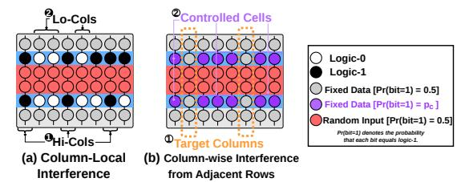
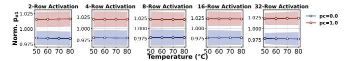

# 5. Characterization of Interference from Adjacent Rows

Building on the result of §4, this section provides a detailed characterization of adjacent-row interference from several perspectives (e.g., data patterns, spatial locality, and temperature sensitivity). We reuse the experimental control, the number of instances, and the default temperature setup from §4 and describe only the methodology specific to the experiment.

#### 5.1. Experimental Methodology

**Metric.** As in the R-adj setup in Figure 4, we designate all adjacent rows (2) as controlled rows (5) and use normalized

 $^4\text{Throughout}$  §4, §5, and §6, box-and-whisker plots show box boundaries representing the first and third quartiles (Q1 and Q3), and circle markers indicating the mean values. Each box shows the distribution across all tested instances (one SiMRA row group per subarray, across 12 modules  $\times$  16 banks  $\times$  3 subarrays).

(Norm.)  $p_{o1}$  to quantitatively evaluate their impact on the SiMRA output (the common baseline condition fills all adjacent rows with independent random data with  $p_c=0.5$ ). For each experimental condition, we collect 128 samples with random inputs to the SiMRA rows (1). Except for the experiment shown in Figure 12, the data in the controlled rows (5) are kept fixed across all samples. Unless otherwise noted, all columns are designated as target columns (6).

**Experimental Protocol.** For each of the 128 random-input samples, we execute the following four steps: (i) write the specified data pattern to all adjacent rows; (ii) write random input data to the SiMRA rows; (iii) execute SiMRA; and (iv) read out the SiMRA rows to record the outputs.

#### 5.2. COTS DRAM Chip Characterization Results

**Sensitivity to Fraction of Logic-1.** To examine how the fraction of logic-1 stored in adjacent rows affects the SiMRA output, we sweep  $p_c \in \{0.0, 0.25, 0.75, 1.0\}$ . Note that  $p_c = 0.5$  corresponds to the baseline condition. Figure 6 shows Norm.  $p_{o1}$  distribution (y-axis) for each  $p_c$  value of the adjacent rows (x-axis), across different numbers of SiMRA rows (each subplot).

Figure 6: Sensitivity to fraction of logic-1 in adjacent rows.

**Obsv. 4.** Data stored in non-activated adjacent rows more strongly biases SiMRA outputs toward logic-1 (logic-0) as the fraction of logic-1 (logic-0) in the adjacent rows increases.

As  $p_c$  increases, Norm.  $p_{o1}$  increases monotonically, demonstrating a clear positive correlation between the fraction of logic-1 in adjacent rows and the bias in SiMRA outputs. For example, with 32-row activation, the mean Norm.  $p_{o1}$  rises monotonically from 0.98 ( $p_c = 0.0$ ) to 1.02 ( $p_c = 1.0$ ).

**Structured Data Patterns.** To study the impact of structured (i.e., non-random) data patterns in adjacent rows, we vary the byte pattern among  $\{0\times00, 0\timesF0, 0\times55, 0\timesAA, 0\timesFF\}$ . Figure 7 shows Norm.  $p_{o1}$  distribution (y-axis) for various data patterns written to the adjacent rows (x-axis), across different numbers of SiMRA rows (each subplot).

Figure 7: Sensitivity to the data patterns in the adjacent rows.

**Obsv. 5.** Non-activated adjacent rows bias SiMRA outputs based on the fraction of logic-1 they store rather than on the specific structured data pattern.

Data patterns with the same fraction of logic-1 in adjacent rows produce similar Norm.  $p_{o1}$  regardless of the structured pattern used. 0xF0, 0x55, and 0xAA all have a fraction of logic-1 of 0.5 and produce Norm.  $p_{o1}$  of approximately 1.0.

**Column-Local Interference.** We test whether interference from adjacent rows is uniform across all columns or depends on each column's own adjacent-row cells. We set data in adjacent

rows to random ( $p_c=0.5$ ) and partition columns into two sets based on the fraction of logic-1 in each column's adjacent-row cells (see Figure 8a): **1** Hi-Cols (columns where more than half of the adjacent-row cells store logic-1) and **2** Lo-Cols (columns where fewer than half of the adjacent-row cells store logic-1). Columns where the adjacent-row cells store the same number of logic-0 and logic-1 are not classified into either **1** or **2**. We measure Norm.  $p_{o1}$  separately for Hi-Cols and Lo-Cols as target columns.

Figure 8: (a) Column-local interference. (b) Adjacent-row interference across columns.

Figure 9 shows the Norm.  $p_{o1}$  distribution (y-axis) separately for Hi-Cols and Lo-Cols (x-axis) across different numbers of SiMRA rows (each subplot).

Figure 9: Column-local interference.

**Obsv. 6.** Interference from non-activated adjacent rows is not uniform across all columns: each column's SiMRA output is affected by its own adjacent-row cells.

Hi-Cols and Lo-Cols show opposite trends: Hi-Cols produce a mean Norm.  $p_{o1}$  above 1.0 while Lo-Cols produce below 1.0. For example, with 2-row activation, the mean Norm.  $p_{o1}$ is 1.004 for Hi-Cols and 0.996 for Lo-Cols. This means that columns whose own adjacent-row cells contain more logic-0 (logic-1) are biased toward logic-0 (logic-1), confirming that adjacent-row interference is not uniform across all columns. Adjacent-Row Interference Across Columns. To evaluate whether a given column's SiMRA output is affected by data stored in other columns' adjacent-row cells, we randomly select 1/8th of all columns as target columns ((1)) (see Figure 8b). For the remaining 7/8th columns, we designate their adjacent-row cells as controlled cells ((2)) and set them to all-zeros ( $p_c = 0.0$ ) or all-ones ( $p_c = 1.0$ ). Figure 10 shows the Norm.  $p_{o1}$  distribution of the target columns (y-axis) for different  $p_c$  values of the controlled cells in non-target columns (x-axis), across different numbers of SiMRA rows (each subplot).

Figure 10: Adjacent-row interference across columns.

**Obsv. 7.** A given column's SiMRA output is affected by data stored in other columns' adjacent-row cells.

When the controlled cells in non-target columns store logic-0 (logic-1), the mean Norm.  $p_{o1}$  of target columns is biased

toward logic-0 (logic-1), confirming that data in other columns' adjacent-row cells affects a given column's SiMRA output. For example, with 2-row activation, the mean Norm.  $p_{o1}$  shifts to 0.99 at  $p_c=0.0$  and 1.01 at  $p_c=1.0$ .

Input-Dependent Adjacent-Row Patterns. To quantify how a SiMRA input bit and its corresponding adjacent-row bit jointly affect the output, we define  $bit_{\rm in}$  as the value of a SiMRA input bit in a given column and  $bit_{adj}$  as the value of the adjacent-row cell in the same column. For each random-input sample, we first initialize all adjacent rows with a random base pattern  $(p_c = 0.5)$ . We then modify the adjacent-row cells based on a specified  $(bit_{in}, bit_{adj})$  combination: for each column where the SiMRA input equals  $bit_{\rm in}$ , we set its corresponding adjacent-row cell to  $bit_{adj}$ ; all other adjacent-row cells retain the base pattern. Figure 11 illustrates the adjacent-row data patterns for the baseline and all four combinations in a given random-input sample. For example, for  $(bit_{in}, bit_{adj}) = (1, 1)$ , each column where the SiMRA input is logic-1 (1) has its corresponding adjacentrow cell set to logic-1 (2), while the remaining adjacent-row cells retain the random base pattern. Because the random inputs differ across samples, the spatial distribution of modified adjacent-row cells changes accordingly. This experiment uses configurations where each adjacent row borders only one SiMRA row, making  $bit_{adj}$  well-defined.

Figure 11: Input-dependent adjacent-row patterns.

Figure 12 shows Norm.  $p_{o1}$  distribution (y-axis) for all four combinations  $(bit_{\rm in}, bit_{\rm adj}) \in \{(0,0), (1,0), (0,1), (1,1)\}$  (x-axis), across different numbers of SiMRA rows (each subplot).

Figure 12: Input-dependent adjacent-row interference.

**Obsv. 8.** Cells in simultaneously activated rows storing logic-1 are substantially more susceptible to interference from non-activated adjacent rows than cells storing logic-0.

When  $bit_{\rm in}=0$ , the mean Norm.  $p_{o1}$  remains approximately 1.0 regardless of  $bit_{\rm adj}$  across all tested numbers of SiMRA rows, indicating negligible interference. In contrast, when  $bit_{\rm in}=1$ , the SiMRA output is sensitive to the adjacent-row cell:  $bit_{\rm adj}=0$  decreases the mean Norm.  $p_{o1}$  to approximately 0.97–0.98, while  $bit_{\rm adj}=1$  increases it to 1.02–1.03.

Temperature Sensitivity. To study the temperature dependence of interference from adjacent rows, we set the temperature to  $50^{\circ}$ C,  $60^{\circ}$ C,  $70^{\circ}$ C, and  $80^{\circ}$ C. At each temperature, we set all adjacent rows to all-zeros ( $p_c = 0.0$ ) or all-ones ( $p_c = 1.0$ ). Figure 13 shows the mean Norm.  $p_{o1}$  (y-axis) across temperatures ranging from  $50^{\circ}$ C to  $80^{\circ}$ C (x-axis) when all adjacent rows are set to all-zeros ( $p_c = 0.0$ ) or all-ones ( $p_c = 1.0$ ), across different numbers of SiMRA rows (each subplot).

Figure 13: Adjacent-row interference vs. temperature.

**Obsv. 9.** Temperature has a small effect on interference from non-activated adjacent rows.

We observe no significant temperature dependence in adjacent-row interference. For example, with 8-row activation under  $p_c=1.0$ , the mean Norm.  $p_{o1}$  remains at approximately 1.02 across all tested temperatures (50°C–80°C).

