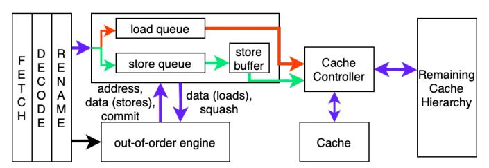
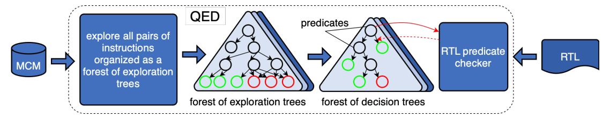

# II. BACKGROUND

We informally describe some common memory consistency models and a modern system comprising out-of-order issue cores and multi-level memory hierarchy.

#### *A. A few common consistency models*

In shared memory, the global memory order is the order in which memory accesses from each thread in an execution are seen by other threads in the system. An MCM specifies

Fig. 1. Program order (
m b is used to denote a occurs before b in the global order:

- 1) (One thread): Any pair of memory instructions, involving same or different addresses, within the same thread in program order required by the MCM are <p -ordered.
- 2) (One address): Any pair of memory instructions, one of which is a store, across two threads to the same address are <m -ordered (e.g., in Figure 1(a), *st B* <m *ld B* where a load from address B in a thread reads the value of a store to B in another thread, and *ld A* <m *st A* where the load reads the value of A before the store). Writes to one location in one or more threads are <m -ordered due to write serialization in all MCMs [2].

In addition, multiple <m orders (e.g., a <m b and b <m c) can be composed to achieve transitive <m ordering across multiple threads and multiple addresses (e.g., the total order in sequential consistency, as described below). Specifically, atomic writes to different addresses (e.g., *A* and *B*) across threads may be <m -ordered transitively (e.g., *st A* <m *st B* or *st B* <m *st A*) whereas non-atomic writes to different addresses in one or more threads are not ordered (i.e., no <m edge) except in MCMs with store-store order within a thread. Further, we extend <m to order external coherence events (e.g., incoming invalidations and external reads) with memory instructions in a given thread. These events are proxies at the given thread for memory instructions in other threads.

The most intuitive model is Sequential Consistency (SC) [35]. SC requires the global order <m to be a total order of all memory accesses to any location across all threads [53]. Further, SC requires all accesses from a thread in this global order to obey each thread's program order <p [53]. In this global order, any load from a location retrieves the value of the latest store to the location ("latest" is well-defined in the global order). No total <m order (i.e., a cycle as in Figure 1(b) due to out-of-order loads), means the system violates SC.

Total Store Order (TSO) is a commonly-used model which relaxes SC to allow a load from a location to occur before previous stores to different locations in program order. Such a schedule helps hide store latency and improves performance. A load to the same location as a previous store must obey program order to enforce the store-to-load dependence. Other program orders are not relaxed. TSO requires write atomicity

Fig. 2. Data path of loads (red,blue) & stores (green,blue)

except when a thread reads its own write early. Such a load is ordered after the store in the global memory order – i.e., after the store is made visible [67]. Hence, even though the load returns its value before the store that produced the value is complete, the load still returns the value of the "latest" store.

In more relaxed models, most program order constraints and, in some cases, write atomicity are relaxed [2]. Instructions can be executed out-of-order if the addresses do not match – data dependencies are still preserved. Ordering among instructions and atomicity of writes are programmed explicitly using some synchronization primitive – atomic instructions, acquire/releases, or memory barriers. The synchronization point denotes the time after which all threads are guaranteed to have seen all the instructions since the last synchronization point. Finally, some MCMs include address, data, or controlflow dependencies in ordering requirements (e.g., RVWMO). QED assumes that the pipeline front-end correctly marks such memory instructions in the load-store queue (LSQ) so that QED can verify that the LSQ meets the requirements.

#### *B. Modern systems*

Modern load-store queues (LSQs) in out-of-order-issue processors storing loads and stores in program order may reorder and overlap memory accesses (Figure 2). Loads in load queue can be issued out-of-order to the cache or its value forwarded from an older store to the same location in the store queue or store buffer. To ensure precise interrupts, a store is issued from the store queue to the cache only after the store reaches commit. Upon a miss without any exception, the store is moved from the store queue to the store buffer, where the store remains until completion (Figure 2). However, a store may prefetch coherence permission as soon as the address becomes available, before it reaches commit. In weaker MCMs, store misses can be overlapped in the cache hierarchy and can complete out-of-order. A load returns a value to the pipeline and is *globally ordered* after the store that produced the value [67]. A store is complete when (a) the writer receives the acknowledgments of invalidations of all the copies, and (b) is performed locally to the cache. The ordering between these two parts depends on the model (i.e., whether writes are atomic). A store is *globally ordered* after (a) the store that produced the previous value and (b) the loads that read the previous value (well-defined due to write serialization). The LSQ tracks the relevant information corresponding to each instruction's execution. QED verifies that the LSQ implementation (where all memory instruction reordering occurs in a modern core) preserves each instruction's ordering with respect to olderin-program-order instructions during commit, as required by

Fig. 3. Overview of QED

the MCM. For RVWMO-like MCMs that include address, data, or control-flow dependencies in ordering requirements, QED assumes that the pipeline front-end correctly marks such memory instructions in the LSQ so that QED can verify that the LSQ meets the requirements.

