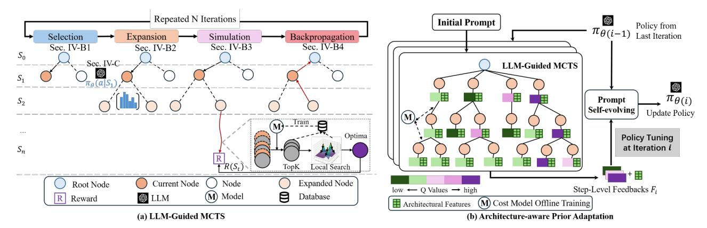
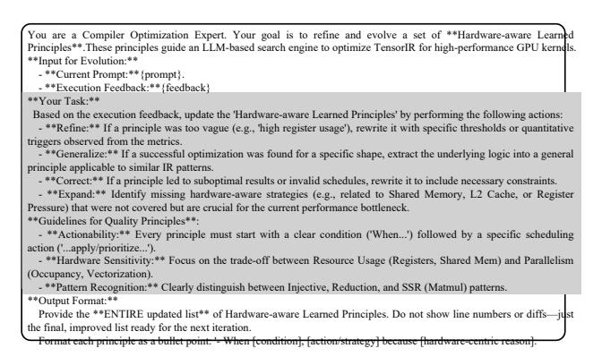

# II. BACKGROUND AND MOTIVATION

#### *A. Exploration-based Tensor Program Optimization*

Exploration-based tensor program optimization [14], [25], [52] is widely adopted in deep learning compilers. Systems


Fig. 1. Scheduling strategies comparison. (a) The original computation graph of the Gated MLP. (b) TVM divides the graph into two subgraphs with a space size of 1e10. (c) Mirage fuses all operations at the block level with a space size of 1024. (d) LLM-generated sequences often fail due to order sensitivity and no feedback. (e) *OiMeng-Tensify* leverages an MDP framework to discover high-performance schedules.

TABLE I EXAMPLE RULE APPLICATION POLICIES IN TVM

| Number | er Description                                         |  |
|--------|--------------------------------------------------------|--|
| P1     | Not strictly inlinable → Skip                          |  |
| P2     | Is strictly inlinable → AutoInline                     |  |
| P3     | Has data reuse and fusable → Tiling + Fusion           |  |
| P4     | More reduction than parallelization> ParallelReduction |  |

like TVM [14], Ansor [52], and TensorIR [25] rely on a set of scheduling rules to guide transformations and then search for an optimal low-level implementation.

These approaches, however, are typically designed for simple computation graphs, often containing a single compute-intensive operator (e.g., a single GEMM or Convolution). For these well-studied patterns, the fundamental limitation lies in the fixed, handcrafted policies that dictate how and in what sequence these rules are applied. As Table I illustrates, a *Tiling + Fusion strategy* is statically chosen for any subgraph identified as having "data reuse and fusable" characteristics.

While effective for these small and structurally regular subgraphs, this reliance on fixed policies becomes a primary bottleneck as the complexity of graphs increases, limiting adaptability and missing significant optimization opportunities.

#### B. Large-Scale Computation Graph Optimization

In contrast, large-scale computation graphs found in modern LLMs pose a greater challenge. They often consist of multiple computation-intensive operators (e.g., 3 matrix multiplications in LoRA) and complex data dependency patterns. Due to this complexity, the fixed policies of traditional auto-schedulers fail to identify valid and efficient graph-level scheduling decisions. As a result, recent works turn to more specialized graphlevel solutions, but these also have limitations. For instance, Chimera [53] narrows the scope to pairs of adjacent operators, while Mirage [45] employs fixed scheduling templates to fuse larger graphs, limiting its fusion space.

Therefore, existing approaches lack a general and automated solution to handle complex graph scheduling problems.

#### C. Motivation

While expanding the transformation space exposes more optimization opportunities, it also introduces practical challenges in exploration efficiency. To guide the design of architecture-aware LLM-guided MCTS, we present two key observations.

**Observation #1**: Prior-free search algorithms are inefficient for large-scale graph scheduling.

We evaluate exploration efficiency under the sequential decision setting using two prior-free algorithms: beam search [6] and MCTS [30]. The search space spans both transformation rule ordering and parameter configuration, detailed in Section III-C. As shown in Figure 2, both beam search and MCTS perform poorly in the automatic scheduling space of complex subgraphs like *GatedMLP*. The underlying issue is that these methods rely on limited exploration mechanisms and lack semantic awareness of the optimization task. Specifically, beam search greedily prioritizes schedules with high initial rewards (e.g., *AutoBind* or *MultiLevelTiling* in our experiments) from early-stage decisions. Meanwhile, standard MCTS, while more exploratory, depends heavily on hand-crafted simulation policies or random sampling, which fail to capture hardware-specific performance patterns or high-level program semantics.

**Observation #2:** Architecture awareness is essential for effective scheduling.

To understand how architectural differences influence the rule application policy, we compare the applied frequencies of different schedule rules on the A100 and the H100. Our results show that the distribution of scheduling rules selected during search exhibits noticeable, though not deterministic. Given the same programs, our system samples memory-centric rules slightly more often on the A100, such as AutoInline and ComputeAtLocation, to reduce register pressure and improve L2 locality. In contrast, on H100, our system samples computecentric rules more frequently, including MultiLevelTiling, ParallelizeVectorizeUnroll, and CrossThreadReduction. The higher sampling frequency of these rules helps the search better exploit the H100's larger register file and higher tensorcore throughput. Different GPU microarchitectures naturally induce different rule-usage distributions, and being aware of the target architecture allows the system to more efficiently


Fig. 2. Performance comparison of three search methods on GatedMLP using NVIDIA A100 (FP32), normalized to manual schedule.

generate rule choices that align with the hardware's strengths. These observations motivate us to propose an architectureaware LLM-guided search framework that injects semantic priors into the exploration process, enabling more informed and efficient navigation of complex scheduling spaces.

#### III. GRAPH SCHEDULING PROBLEM

To automatically determine the graph scheduling strategy, *QiMeng-Tensify* formulates the problem as a graph rewriting process. During the rewriting process, *QiMeng-Tensify* changes the graph states via iteratively applying rewrite rules to generate coarse-grained graph sketches. Then, *QiMeng-Tensify* performs fine-grained parameter specification on the generated sketches to generate concrete graph programs.

#### *A. Problem Formulation*

The graph rewriting problem can be formulated as a Markov Decision Process P = (S, A, T ,M, R), as illustrated in Figure 1 (e). A tensor computation graph can be rewritten as a finite number of graph states S via different combinations of graph rewrite actions A (i.e., schedule rules). For a given graph state and rewrite action, the graph is transformed into a new state using the transformation rule T after applying the action. When the graph reaches a terminal state where no further actions can be applied, *QiMeng-Tensify* queries a performance cost model M for an estimation of the reward signal. The cost model is randomly initialized and iteratively updated based on online collected performance data. During the performance measurement, the ground truth reward signal R is fed back for choosing the optimal graph rewrite.

$$\pi^* = \arg\max_{\pi} \mathcal{R}(\mathcal{S}_{\pi,x}) \tag{1}$$

The objective function of the scheduling problem can be formulated as Equation 1, where π represents the policy for generating a concrete action sequence and Sπ,x represents the terminal graph state under π for tensor program x. Thus, the optimal policy π ∗ is identified by maximizing the ground truth reward signal R (i.e., the measured program performance).

#### *B. Graph State*

The graph state (i.e., S(G, n)) consists of a computation graph G and a scheduling node n. The computation graph provides the structural foundation for static analysis and program transformation. Each scheduling node identifies a specific position in the graph where a rewriting action can be applied, enabling precise and localized transformations. To reduce the complexity, we canonicalize the representation of graph scheduling by processing the nodes in reverse topological order and applying the given sequence of rewrites sequentially.

#### *C. Graph Rewrite Action*

The graph rewrite action (i.e., A(r, p)) consists of a schedule rule r and a detailed parameter configuration p. The schedule rule is used for rewriting the coarse-grained program structure (e.g., loop tiling, loop fusion, and computation inlining). Based on the program structure, the parameter configuration specifies the rewrite details (e.g., the concrete tile sizes, the unroll lengths, and the fusion positions).

Table II illustrates a subset of the rewrite actions used in *QiMeng-Tensify*. Action A<sup>1</sup> applies the *MultiLevelTiling* rule together with its tunable tiling factors, enabling multi-level loop tiling that adapts the kernel to the memory hierarchy of the target architecture. Operator fusion is enabled by the *ComputeAtLocation* rule in action A5, which is restricted to blocks satisfying structural and dependency constraints (e.g., being a top-level, single-consumer, and untiled intermediate block), with the fusion position treated as a tunable scheduling parameter within this feasible space. Some actions contain no parameters; for example, the *AutoInline* (A2), *AutoBind* (A6) and *InlineConstantScalar* (A7) rules rewrite the program using fixed transformation patterns.

These schedule rules and their associated parameters define *QiMeng-Tensify* 's search space, which we decompose into two components: The Action Space (A) is the set of all available schedule rules (r) . Conversely, the Policy Space (π) determines which schedule rule should be applied under a given graph state. This distinction is critical: traditional compilers rely on a *single, hand-crafted policy* (a fixed rule sequence), whereas our MDP objective is to search this vast policy space π to discover the optimal sequence.

TABLE II GRAPH REWRITING ACTIONS AND RELATED PARAMETERS.

| NO. | Schedule Rule Names        | Parameters          |
|-----|----------------------------|---------------------|
| A1  | MultiLevelTiling           | Tiling factors      |
| A2  | AutoInline                 | None                |
| A3  | ParallelizeVectorizeUnroll | Loop, unroll length |
| A4  | CrossThreadReduction       | Split factors       |
| A5  | ComputeAtLocation          | Compute locations   |
| A6  | AutoBind                   | None                |
| A7  | InlineConstantScalar       | None                |

#### *D. Graph State Transition*

As shown in Table III, graph state transition is performed based on the state-action pattern and the action condition (e.g., whether the current node is inlinable for A2). The transition rules first check the patterns and the conditions, and then transform the current graph state to a new graph state. For example, if the condition of A<sup>2</sup> can be satisfied, the current graph G is transformed into a new G ′ . Since the current node no longer needs scheduling after inlining, it also changes the current node n to the next node n ′ following the reverse topological order of G ′ . Regarding the other actions, if conditions are satisfied, they perform transformations on the current graph without changing the node. Once the condition of a chosen action is not satisfied, *QiMeng-Tensify* updates the current scheduling node for further transformation, keeping the current graph unchanged.

TABLE III
GRAPH STATE TRANSITION RULES.

| Pattern                                             | Condition     | Transition                                                           |
|-----------------------------------------------------|---------------|----------------------------------------------------------------------|
| $\mathcal{T}(\mathcal{S}, \mathcal{A}_{2,7})$       | Satisfied     | $\mathcal{S}(\mathcal{G}, n) \leadsto \mathcal{S}(\mathcal{G}', n')$ |
| $\mathcal{T}(\mathcal{S}, \mathcal{A}_{1,3,4,5,6})$ | Satisfied     | $\mathcal{S}(\mathcal{G}, n) \leadsto \mathcal{S}(\mathcal{G}', n)$  |
| $\mathcal{T}(\mathcal{S}, \mathcal{A})$             | Not Satisfied | $\mathcal{S}(\mathcal{G}, n) \leadsto \mathcal{S}(\mathcal{G}, n')$  |

#### E. Limitations of Existing Works

With the problem formulated, we now examine the limitations of existing approaches by evaluating their exploration capabilities across action space (A) and policy space ( $\pi$ ), as summarized in Table IV. Auto-schedulers like Ansor [52] and Meta-Scheduler [25], [36] automate scheduling via rewrite rules, yet their efficacy is limited by hard-coded policies that partition large graphs into predefined subgraphs. This structural rigidity is also inherited by Reasoning Compiler [40] and AMOS [54]; although the former introduces LLM-guided MCTS to replace TVM's evolutionary search and the latter incorporates hardware abstractions for broader mapping, both remain confined by TVM's expert-designed graph partitioning and fusion policy. Astitch [57] aggressively fuses memoryintensive operations, which significantly constrains the policy space and forfeits opportunities to fuse compute-intensive operations. In contrast, Chimera [55] restricts its fusion policies to successive memory-bound and compute-intensive workloads. Welder [37] broadens the scope to support fusion for both memory-intensive and compute-intensive operators by caching intermediate results in shared memory, but its limited intra-operator optimization prevents exploration of thread-level fusion. The state-of-the-art Mirage [45] employs superoptimization to explore functionally equivalent tensor program rewrites at both block and thread levels. However, it depends on template libraries (e.g., CUTLASS) and hand-written code templates (e.g., CUDA or Triton), which ultimately constrain its action space and policy space. SpaceFusion [58] enables advanced fusion across operators with complex dependencies by holistically modeling them with the Space-Mapping Graph, but its focus on globally-ranged mappings restricts its scope to a specific class of operators. PluS [46] greatly simplifies pattern recognition for users and utilizes CUTLASS or cuBLAS for code generation, but this approach necessitates that the action and policy spaces be manually designed.

### IV. ARCHITECTURE-AWARE LLM-GUIDED MCTS

#### A. System Overview

As illustrated in Figure 3, *QiMeng-Tensify* integrates two components to generate high-performance tensor programs. First, *LLM-Guided MCTS* (Sec. IV-B) executes the specific optimization task by employing the adaptive prompt to guide the search over the policy space  $\pi$ , while a fine-grained

TABLE IV
LIMITATIONS OF ACTION AND POLICY SPACE.

| Framework               | Action Space A    | Policy Space $\pi$ |
|-------------------------|-------------------|--------------------|
| TVM [25], [52]          | Full              | Manually designed  |
| Astitch [57]            | Full              | Memory-intensive   |
| Chimera [55]            | Limited           | Compute-intensive  |
| Welder [37]             | Limited           | Full               |
| Mirage [45]             | Manually designed | Template-based     |
| SpaceFusion [58]        | Limited           | Template-based     |
| PluS [46]               | Manually designed | Manually designed  |
| Reasoning Compiler [40] | Full              | Limited            |
| AMOS [54]               | Full              | Manual             |
| QiMeng-Tensify          | Full              | Full               |

simulation module explores the parameter space A. Second, Architecture-Aware Prior Adaptation (Sec. IV-C) tailors the LLM to the target hardware by distilling natural-language heuristics from execution feedback and architectural feedback of representative subgraphs during a lightweight offline stage.

#### Algorithm 1: LLM-Guided Monte-Carlo Tree Search

```
Input: Computation Graph \mathcal{G}, Prompt Prompt
    Output: Best program p*
 1 R^* \leftarrow 0, t^* \leftarrow 0, p^* \leftarrow \emptyset
 2 for t=1 to N do
           // Early stopping
          if t - t^* > early\_stopping then
                break
 4
          end
 5
          \mathcal{S} \leftarrow \mathcal{G}, \, \pi \leftarrow \emptyset;
           // Selection and Expansion
          while S visited and not terminal do
                 \mathcal{A} \leftarrow \text{SelectBest}(\mathcal{S})
                 \pi \leftarrow \pi \cup \{(\mathcal{S}, \mathcal{A})\}
                 \mathcal{S} \leftarrow \mathcal{T}(\mathcal{S}, \mathcal{A})
11
12
          if {\mathcal S} not terminal then
13
                 logits \leftarrow LLM(S, Prompt)
                 \mathcal{A} \leftarrow Sample(\mathcal{S}, logits)
14
                 \pi \leftarrow \pi \cup \{(\mathcal{S}, \mathcal{A})\}\
15
16
                 \mathcal{S} \leftarrow \mathcal{T}(\mathcal{S}, \mathcal{A})
17
                Simulation and Evaluation
          Sketches \leftarrow GenerateProgramSketches(\mathcal{G}, \pi)
18
           (p,R) \leftarrow \text{Fine-GrainedParamaterSpecification } (Sketches)
           // Backpropagation
20
          foreach (s,a) \in \pi do
                Q(s,a) \leftarrow Q(s,a) * \alpha + R * (1 - \alpha)
21
22
            // Update search parameters
23
          if R > R^* then
               R^* \leftarrow R, \, t^* \leftarrow t, \, p^* \leftarrow p
24
25
          end
26 end
27 return n'
```

#### B. LLM-Guided MCTS

To efficiently solve the formulated MDP problem, we first introduce an LLM-guided MCTS algorithm (Algorithm 1). *QiMeng-Tensify* iteratively constructs a search tree where each node represents a graph state  $\mathcal{S}$  (i.e., a program sketch) and each edge corresponds to a schedule rule r (an action  $a \in \mathcal{A}$ ).



Fig. 3. Overview of *QiMeng-Tensify*. The framework integrates two components: (a) **LLM-Guided MCTS**, which explores the policy space  $\pi$  through a four-stage iterative process (Selection, Expansion, Simulation, Backpropagation) guided by adaptive priors; and (b) **Architecture-aware Prior Adaptation**, which refines the LLM's guidance by distilling natural-language heuristics from hardware execution.

QiMeng-Tensify jointly explores the scheduling decisions and the related parameters for a fixed number of iterations. At each iteration, starting from the root (initial graph S), the algorithm traverses the tree by selecting actions that balance exploration and exploitation. When a non-terminal leaf node is reached, OiMeng-Tensify leverages the LLM with the learned adaptive prompt to generate a prior probability distribution over applicable schedule rules and then generate a set of new program sketches by sampling over the distribution. Each new sketch is then evaluated via a Simulation phase, which employs a fine-grained parameter specification module to determine optimal parameters (e.g., tiling size) and uses a cost model to estimate a reward R. Finally, this reward is backpropagated up the tree to update the action values Q(s, a), informing future decisions. The best-performing program  $p^*$  is returned after a fixed budget (e.g., 500 iterations). To optimize efficiency, an early stopping mechanism terminates the search if the peak reward stagnates for K iterations (e.g., K = 200), avoiding redundant exploration upon reaching a performance plateau.

The following subsections detail each stage of this process.

1) **Selection**: The *selection* phase guides the MCTS traversal from the root node (original, unscheduled computation) down to a leaf node, following a path that balances *exploitation* of known high-performing schedules and *exploration* of less-visited but potentially promising transformations.

When visiting a node v, instead of the traditional UCB rule [43], our approach selects the next child action  $a^*$  by maximizing a Gumbel-augmented score:

$$a^* = \arg\max_{a} \left[ g(s, a) + \pi(s, a) + \sigma \cdot Q(s, a) \right]$$
 (2)

where g(s,a) is Gumbel-distributed noise (enabling exploration via the Gumbel-max trick [18]),  $\pi(s,a)$  is the LLM-provided prior logit, Q(s,a) estimates the action value based on the highest performance achieved within the schedule rooted at a, and  $\sigma$  balances the LLM prior and empirical value. This formulation explicitly incorporates an LLM-guided prior  $\pi(s,a)$  into the selection policy, allowing semantic knowledge

about the operator's structure and optimization opportunities (e.g., recommending *compute\_at* when a GEMM is immediately followed by an element-wise operation) can be leveraged early in the search, improving sample efficiency.

The traversal proceeds recursively until it reaches a leaf node, which is either not fully expanded or corresponds to an incomplete sketch. To guard against LLM inaccuracies and maintain exploration diversity, we incorporate an auxiliary term g(s,a) (i.e., a perturbation) into the action selection. This design enables QiMeng-Tensify to efficiently exploit semantic priors while preserving principled exploration.

2) Expansion: Once the selection phase reaches a leaf node v that is not fully expanded (representing an incomplete schedule rules sequence), the expansion step generates child nodes by applying valid schedule rules to the current program state. In QiMeng-Tensify, each node represents a partially scheduled program (a sketch), and expansion corresponds to applying a concrete rewrite action that guarantees correctness. The choice of which rewrite to apply during expansion is guided by LLM- $generated\ priors$ . Before the search begins, the LLM analyzes the operator's semantics and suggests a ranked list of likely beneficial rewrites. These suggestions are used to prioritize the expansion order: high-priority rewrites are explored earlier, improving search efficiency.

At each expansion, the tree is extended with a new child node v' represents the state after the selected rewrite. Initialized with the LLM-generated prior score, this node enables  $\mathit{QiMeng-Tensify}$  to explore complex schedule spaces in a structured and semantically guided manner.

3) Simulation: While MCTS explores high-level schedule sequences, the simulation step in QiMeng-Tensify performs fine-grained parameter tuning via guided local search. We focuses on neighborhoods of top-ranked candidates, enabling faster convergence through targeted exploration. Moreover, the top-K candidates are refined in parallel, enabling efficient exploration of diverse high-quality starting points.

As shown in Algorithm 2, the algorithm first randomly samples different parameter settings to form concrete programs

 $\mathcal{P}$  from MCTS-generated sketches. Next, the cost model (XGBoost model [13] in our experiments) predicts and ranks the programs in  $\mathcal{P}$ , after which the top K candidates  $\mathcal{P}_k$ are selected. Then, their execution times  $\mathcal{T}_k$  are measured on hardware, and the resulting code-performance pairs are subsequently used to update the cost model. Following this, for each program-performance pair  $(p_i, t_i)$  in  $\mathcal{P}_k$ , the algorithm explores its neighborhood  $\mathcal{P}_{neigh}$ , defined by programs within a small Manhattan distance. From  $\mathcal{P}_{neigh}$ , it further selects programs  $\mathcal{P}_{thres}$  whose predicted performance lies close to  $t_i$ . After measuring the performances, the algorithm decides to finish the search if it finds a better program candidate. Finally, when the local search reaches the preset tuning time, the bestperforming program found during the process is returned as the representative implementation for the current sketch, and a performance-proportional reward R is fed back to the MCTS node to guide future exploration.

Algorithm 2: Fine-Grained Parameter Specification

```
\textbf{Input :} Sketches, cost\_model
    Output: Optimal program p^*, Reward \mathcal{R}^*
 1 \ \mathcal{P} \leftarrow SamplePrograms(Sketches)
2 \mathcal{P}_k \leftarrow \text{TopK-Selection}(\mathcal{P}, cost\_model)
3 \mathcal{D} \leftarrow \phi
4 \mathcal{T}_k \leftarrow \text{MeasurePerformance}(\mathcal{P}_k, \mathcal{D})
5 M \leftarrow \text{UpdateModel}(cost\_model, \mathcal{D})
    foreach p_i, t_i \in \mathcal{P}_k, \mathcal{T}_k do
            t_{best} \leftarrow t_i
            while GetCurrentTime() \leq Tuning\_time do
                   \mathcal{P}_{neigh} \leftarrow \text{GenerateNeighbors}(p_i)
                   \mathcal{P}_{thres} \leftarrow \text{PickByThreshold}(\mathcal{P}_{neigh}, cost\_model)
10
                   \mathcal{T}_{thres} \leftarrow \text{MeasurePerformance}(\mathcal{P}_{thres}, \mathcal{D})
11
                   t \leftarrow \text{PickBestPerformance}(\mathcal{P}_{thres}, \mathcal{T}_{thres})
12
13
                   if t > t_{best} then
                          break
14
                   end
15
                   t_{best} = t
17
            end
18 end
19 p^* \leftarrow \text{BestProgram}(\mathcal{D})
20 R^* \leftarrow \text{EstimateReward}(p^*)
21 return p^*, R^*
```

4) Backpropagation: After simulation phase identifies the optimal parameter configuration for the candidate program sketch, the backpropagation step updates internal statistics of the search tree upward from the leaf node (where the schedule rules sequence was expanded) back to the root. Let v be a node on this path with associated values Q (i.e., Q(s,a) in Algorithm 1), the reward R of programs derived from its optimal program. Upon obtaining a new performance  $t_{best}$  (execution time) from the simulation, the reward  $R^* = flops(p^*)/t_{best}$  is computed and propagated. For each ancestor node v, the value is updated via moving average:

$$Q \leftarrow Q * \alpha + R^* * (1 - \alpha) \tag{3}$$

This update reinforces paths that lead to high-performing kernels, increasing their selection probability in future iterations of the LLM-guided policy. Notably, because the reward is derived from *real hardware execution*, the backpropagation

TABLE V
KEY ARCHITECTURAL FEATURES FOR NVIDIA GPUS

| Metric                          | Description                                |
|---------------------------------|--------------------------------------------|
| SM Efficiency                   | Fraction of active SM cycles.              |
| Shared Utilization              | Fraction of shared memory used.            |
| Achieved Occupancy              | Actual warps per SM (normalized).          |
| Instructions per Warp           | Avg. instructions executed per warp.       |
| Tensor Precision FU Utilization | Tensor Core usage by precision.            |
| Warp Execution Efficiency       | Avg. active threads / max threads per warr |

process incorporates accurate performance feedback into the search dynamics, enabling the LLM-guided MCTS to adapt to complex hardware behaviors such as memory hierarchy effects and thread divergence. Additionally, in *QiMeng-Tensify*, the backpropagation phase may also trigger an update to the LLM-guided prior when a significantly better program is found, allowing the system to learn from successful patterns and refine its high-level search strategy over time.

#### C. Architecture-aware Prior Adaptation

To enable the LLM to provide precise hardware-specific guidance, we introduce an offline adaptation mechanism. This process, detailed in Algorithm 3, serves a dual purpose: it self-evolves the prompt into natural-language heuristics and trains an offline cost model using collected performance data.

```
Algorithm 3: Hardware-aware Prompt Self-evolving
```

```
Input: Base prompt \mathcal{P}_b, Subgraphs pool \mathcal{T}
    Output: Optimized Prompt \mathcal{P}^*
    \mathcal{P}^* \leftarrow \mathcal{P}_b
2 for e=1 to E do
            \mathcal{P}_0 \leftarrow \mathcal{P}
3
            \mathcal{G}_0 \leftarrow \text{RandomTasks}(\mathcal{T}, M)
 4
 5
            for i = 1 to N do
                    for g \in \mathcal{G}_0 do
                    \mid p_j^*, R_j^* \leftarrow \text{LLM-guided MCTS with } \mathcal{P}_{i-1} \text{ on } g end
 7
 8
                     \mathcal{F} \leftarrow \text{AggregateFeedback}(\{p_j^*\}, \{R_j^*\})
                    \mathcal{P}_i \leftarrow \text{UpdatePrompt}(\mathcal{P}_{i-1}, \mathcal{F})
10
11
            end
            \mathcal{P}^*
12
13 end
14 return P*
```

**Prompts Self-Evolution and Cost Model Offline- Training.** In each epoch, QiMeng-Tensify samples a batch of representative subgraphs  $\mathcal{G}_0$  and performs parallel MCTS simulations using the current prompt (lines 5–7). We then aggregate the complete search trajectories, including input IRs, adopted policies, and comprehensive hardware performance metrics (e.g., SM Efficiency, Shared Memory Utilization) shown in Table V. This collective feedback  $\mathcal{F}$  is utilized in two ways: (1) It is fed back to the LLM to distill high-level optimization rules and iteratively refine the prompt using a meta prompt as shown in Figure 5 (e.g., sumarizing the root causes of performance gains by correlating the input TensorIR with execution outcomes, including prompt of previous iteration, scheduling policies, input TensorIR, rewards, and hardware metrics) (line 10). (2) The collected dataset of


Fig. 4. Optimization trajectory of GatedMLP in *QiMeng-Tensify*. Throughout the transformation process, the background color of each component remains unchanged to facilitate visual tracking. (S0) The initial GatedMLP workload. (S1) The AutoInline rule (A1) is applied several times, which fuses the elementwise operators of the SiLU function into a single, unified SiLU operator. (S2)-(S3) The MultiLevelTiling (A1) and ComputeAtLocation (A5) rules are applied sequentially, leading to the tiling and fusion of GEMM1 and GEMM2. (S4) The ComputeAtLocation rule (A5) is applied to fuse the SiLU operator into the previously fused GEMM block. (S5) Finally, another application of the ComputeAtLocation rule (A5) integrates the element-wise multiplication into the existing fused operator group. Note that the figure shows simplified pseudo-code for readability.



Fig. 5. The meta prompt for prompt learning.

program sketches and execution latencies is used to train an offline XGBoost cost model. This pre-trained model serves as the initial performance predictor for the online search phase (Sec. IV-B3), significantly accelerating convergence.

Example of Learned Heuristics. We conducted this adaptation offline using 7 representative subgraphs (i.e., *DoubleMatmul*, *Conv2d+Bias+Relu*, *Matmul*, *LSTM*, *Matmul+Relu*, *MLP*, and *Softmax*), collecting 12,500 performance measurements. As shown in Figure 6, the resulting prompt evolves from generic instructions into sophisticated strategies aligning schedule rules with hardware constraints. For instance, the LLM learns to identify *injective blocks* (one-toone mappings) and prioritizes AutoInline to eliminate calloverhead. Conversely, for compute-bound *SSR-shaped* pat-

```
You are an expert GPU schedule policy generator. Your task is to assign a probability distribution over the following seven
schedule rules: {Pass Description}
Hardware-aware Learned Principles:
- When the IR contains an injective block where each output element depends on exactly one input element), the scheduler
prioritizes AutoInline to eliminate intermediate buffers and enable downstream fusion.
- For SSR-shaped computations (e.g., matmul), the scheduler applies tensor-core-aware multi-level tiling, with tile shapes
and scheduling primitives specialized to the target GPU architecture.
- For long element-wise or affine operator chains with no data reuse, apply ComputeAtLocation to relocate computation
across producer/consumer boundaries, enabling kernel fusion and eliminating intermediate buffers.
- When a reduction axis is long or requires collaboration across multiple warps, use CrossThreadReduction to implement
efficient warp- or block-level cooperative reductions.
- When constant scalar appear in the IR, apply InlineConstantScalars to embed values directly into instructions and avoid
global memory loads.
- When register usage approaches architectural limits, suppress vectorization and loop unrolling to preserve occupancy and
avoid register spilling, balancing instruction-level parallelism with resource constraints.
- When primary spatial loop axes exhibit sufficient parallelism, apply AutoBind to map them onto CUDA thread and
block dimensions, optimizing occupancy and memory coalescing.
- When local memory usage is non-zero, reduce or disable ParallelizeVectorizeUnroll to alleviate register pressure and
avoid performance degradation from spilling.
Given the following TensorIR: {prim_func}
First, describe the structural characteristics of this IR. Then assign a probability of usage for each pass according to the
hardware-aware learned principles, expressed as a value between 0 and 1, such that their total equals 1.
Return ONLY a 1x7 probability list in the format: [p1, p2, p3, p4, p5, p6, p7]. Do not include any other text or explanation.
```

Fig. 6. The learned prompt of *QiMeng-Tensify*.

terns, it favors MultiLevelTiling to optimize data locality across the register file and shared memory. These learned heuristics, plus the offline-trained cost model, effectively prune the search space and improve evaluation accuracy.

#### *D. A Working Example*

To illustrate how *QiMeng-Tensify* discovers highperformance tensor programs, we walk through the optimization of a representative GatedMLP subgraph, which is a fused multi-layer perceptron with dynamic gating. As shown in Figure 4, the computation is defined as: O = SiLU(X · W1) ⊗ (X · W2), where · denotes matrix multiplication and ⊗ element-wise multiplication. A starting implementation (Figure 4, left) decomposes the computation into isolated kernels: GEMM1, followed by a SiLU (involving exp, add, div, mul), then GEMM2, and finally mul. This modular design introduces multiple intermediate buffers (O1, O2, O3 in our example), incurring high memory traffic.

In the expansion phase, the LLM is prompted with operator structure, task description, and schedule definitions. It assigns high prior probabilities to fuse SiLU to eliminate intermediate buffers after recognizing that SiLU can be computed as a fused expression: SiLU(x) = x/(1 + e −x ). This guides the search toward S1, where the sub-computations (e.g., exp, add, div, mul) are fused into a single block, reducing both memory footprint and kernel launch overhead.

Further exploration reveals greater optimization potential. The LLM identifies that GEMM1 and GEMM2 share input X, and their outputs feed into a subsequent element-wise operation. It thus assigns high priors to align GEMM loops and tile across GEMMs. Guided by these priors and early feedback, *QiMeng-Tensify* fuses both GEMMs under a shared tiling loop (e.g., i0, j0, k0), enabling coarse-grained parallelism and improving data locality shown as S2. Multi-level tiling here enables asynchronous memory copy, overlapping globalto-shared data loading with previous tile computation. Then the search progresses toward deeper fusion. The LLM observes that the output of GEMM1 is used by SiLU, and that SiLU's result is fed into the element-wise MUL before being consumed by GEMM2. Recognizing this producer-consumer chain, the LLM recommends compute\_at(SiLU, GEMM1) to improve locality and enable fusion (as in S4).

Furthermore, it suggests fusing the SiLU and MUL operations directly into the reduction loop of GEMM2. This transformation lifts the element-wise operations into the GEMM2 block, avoiding redundant memory writes and significantly reducing memory traffic. Ultimately, *QiMeng-Tensify* achieves full fusion: operations (i.e., GEMM1, SiLU, GEMM2, and MUL) are integrated into a single, highly optimized loop nest (S5), enabling end-to-end computation without intermediate storage.

Execution feedback reinforces high-performing paths, guiding *QiMeng-Tensify* to a kernel that eliminates all intermediates, reduces memory traffic, and achieves high utilization. This demonstrates how LLM-driven semantics enable globally coherent optimizations (e.g., cross-operator fusion and memory-aware tiling) beyond the reach of rule-based systems.

#### V. EVALUATION

