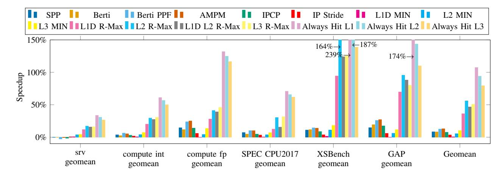

# *A. Methodology*

We use Champsim [8], a trace-driven simulator, with parameters from Table V to simulate an Intel Golden Cove processor with a 5-level paging system and non-inclusive LLC

Fig. 4. Speedups for SPP(L2), Berti(L1D), Berti(L1)+PPF(L2), AMPM(L2), IPCP(L1), IP Stride(L1), L1D/L2/L3 MIN, L1D/L2/L3/(L1D+L2) R-Max, Always Hit L1D/L2/L3 normalized to baseline with no prefetch and with LRU for replacement. Each setup has a geomean of 8.3%, 8.1%, 12.5%, 12.9%, 7.5%, 3.4%, 0.4%, 5.4%, 10.1%, 36.1%, 55.9%, 46.7%, 50.9%, 107.3%, 95.0% and 79.38%.

Fig. 5. Speedups for no prefetch L2 with MIN for replacement, SPP(L2), Berti(only issue to L2), always hit L2, and R-Max(L2), ordered by speedups of R-Max and normalized to a no-prefetching, LRU baseline. The geomean speedup of each is 5.5%, 11.3%, 11.8%, 121.1% and 72.6% respectively.

for our experiments. All caches have a limited number of MSHRs and do not allow unlimited in-flight memory requests as defined in the table. Other microarchitectural components such as the branch target or the branch predictor, are modeled with normal behavior and do not possess future knowledge or infinite amount of state.

Here we simulate workloads from SPEC CPU2017 [38], GAP [1], the public traces of CVP-1 [30] [27] and XSBench [39]. We use the ChampSim traces for GAP and XSBench traces captured by Jamet et al. [15]. We show results for no prefetch, Bélády's Optimal L1D/L2/L3 (no prefetch), SPP, Berti, Berti+SPP+PPF, AMPM, IPCP, IP Stride, always hit L1D/L2/L3, and R-Max in L1D, L2, L3 or in L1D and L2 at the same time. We use the SimPoint [31] methodology. For SPEC CPU2017, GAP and XSBench, we run 50 million

instructions for warmup and 250 million instructions for simulation. For the public traces of CVP-1 (shorter than 250 million instructions), we use the first 20% of the instructions for warmup and the remaining for simulation.

Note that we do not present results for R-Max in a shared last level cache in a multi-core configuration. This is because, while the reorderings of a single core are relatively limited in scope and thus the results converge after a limited set of iterations, multi-core references do not converge so easily. We leave multi-core to future work.

#### VI. EXPERIMENTAL RESULTS

In this section we provide a performance overview of R-Max across different levels of the cache and against traditional prefetching and MIN replacement. Then we do a deeper dive into R-Max's performance in the L2.

TABLE V CHAMPSIM SIMULATOR SETTINGS.

| Parameter             | Value                                |
|-----------------------|--------------------------------------|
| CPU core              | 4.0 GHz, 6-issue wide, out-of-order  |
| Number of ROBs        | 512                                  |
| Load/store queue size | 192 / 114 entries                    |
| Branch predictor      | Hashed perceptron [16], [6]          |
| Branch target buffer  | 1024 sets, 8 ways                    |
| L1 instruction cache  | 32KB, 8 ways, 8 MSHRs, LRU           |
| L1 data cache         | 48KB, 12 ways, 16 MSHRs, LRU         |
| L2 cache              | 1.28MB, 10 ways, 32 MSHRs, LRU       |
| Last level cache      | 3.072MB, 24 ways, 64 MSHRs, LRU      |
| Instruction TLB       | 256 entries, 8 ways, 8 MSHRs, LRU    |
| Data TLB              | 96 entries, 6 ways, 8 MSHRs, LRU     |
| Second Level TLB      | 2048 entries, 16 ways, 16 MSHRs, LRU |
|                       | 1 channel, 1 rank/channel, 8 banks   |
| Physical memory       | per rank, 65536 rows , 128 columns,  |
|                       | 3200 MHz, 8 -byte-wide channel       |
| Block size            | 64 bytes                             |
| Page size             | 4096 bytes                           |

