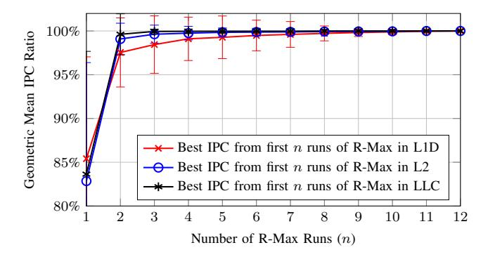

# *B. L2 Cache Detailed Evaluation*

Figure 5 shows the IPC speedup for an L2 cache with several different prefetchers and replacement policies. In particular, no prefetch and MIN for replacement, SPP, Berti (only issue to L2), always hit L2, and R-Max, ordered by speedups of R-Max, and normalized to a baseline that has no prefetch and uses LRU for replacement. In the figure we see that despite significant gains for Berti and SPP over the noprefetcher baseline, R-Max shows there remains significant space for improvement. For benchmarks like 644.nab, Berti and SPP perform similarly to R-Max, thus for those kinds of workloads, a better prefetcher may be hard to design. For other benchmarks like cc.kron, better prefetchers may be possible since the performance gap is very large. We note that Berti and SPP both seem to improve the same subset of benchmarks, while there are many that R-Max sees improvement on that neither SPP nor Berti improve.

TABLE VI GEOMEAN OF PREFETCH COVERAGE OF SPP AND R-MAX RUNNING IN L2.

| Benchmark    | SPP   | R-Max in L2 |
|--------------|-------|-------------|
| compute fp   | 41.9% | 93.2%       |
| compute int  | 13.7% | 95.6%       |
| srv          | 17.0% | 97.7%       |
| SPEC CPU2017 | 27.1% | 94.1%       |

Table VI shows that R-Max has a very high coverage compared with other prefetchers like SPP. Such high coverage eliminates the vast majority of cache misses. The remaining cache misses can be attributed to the following. A prefetch issued by R-Max opens an MSHR. While the prefetch is still inflight, the demand for that block comes into the cache and causes an MSHR merge. The prefetch does not run too far ahead of demand access. The timeliness is not ideal because of bandwidth, delay, and cache capacity constraint. Hence the performance improvement can be limited. Alternately, the demand comes before the prefetch is even issued, due to memory access re-ordering causing the prefetch to be dropped.

Overall, R-Max shows huge gains indicating a large space remains for better prefetcher designs. Comparing R-Max against an always hit L2, however, broadly shows that always hit is far too loose a constraint. For benchmarks like sssp.web and cc.kron, speedups of an always hit L2 and R-Max are almost identical. But for benchmarks like 619.lbm and pr.kron, an always hit L2 shows very large gains of 660.5% and 701.6%, while R-Max shows speedups of just 10.3% and 24.8% can be achieved under realistic BW and latency constraints. Interestingly, we see that Belady's MIN alone

Fig. 6. Effect of limiting R-Max runs. The plotted value shows the geometric mean across all traces of the ratio between the best IPC found among the first n R-Max runs and the best IPC found among all 12 runs. Error bars represent the standard deviation across traces.

shows little improvement in the L2, indicating replacement without prefetching in the L2 has little scope for improvement. Note that most prior work in replacement policy focuses on the LLC, where larger associativity and greater filtering for the lower level caches give a bigger scope for improvement with Belady's MIN alone.

#### C. Convergence Analysis and Simulator Runtime

For the iterative approach used in R-Max, we iterate until convergence and use the highest IPC observed across all iterations. Typically, we observe a monotonic convergence, but in some cases, we see minor performance regression as iterations progress. The standard deviation and the percentage difference at each number of iterations with R-Max enabled at different cache levels for CVP-1 traces is plotted in Fig. 6. In no case did convergence take more than 12 iterations.

Compared to a no-prefetch, LRU baseline, each R-Max iteration takes between 37% and 118% of the baseline runtime.

