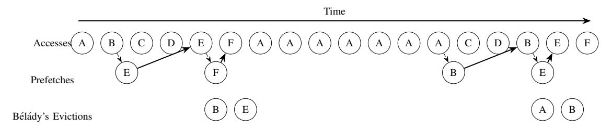

# *C. R-Max*

While the above would yield a simple, Bel´ ady's "MIN" ´ style prefetching policy, it is a bit na¨ıve. In particular, it does not account for the realistic constraints on bandwidth, MSHRs and latency of a real, multi-level cache hierarchy and thus may fall behind relative to the demand stream, leading to late prefetches, or starving MSHRs for demand fetch. Further, we find that any perturbation of the hits and misses in a given level of the cache in a multi-level cache system driven by an Out-of-Order core can yield both reorderings of references, as well as small changes to the reference stream from run to run. This is due to the changes in the filtering effects of the higher level caches, as well as simple reordering of memory requests from the core. Here, we design R-Max to be resilient to these constraints and reference stream changes.

This paper introduces R-Max, a realistic upper bound on prefetching for use in cache management studies. We presume R-Max to have perfect knowledge and no limitation on the amount of prefetcher metadata, though it is constrained to produce prefetches that have to flow through the memory hierarchy and pay the time and bandwidth cost. We have included speedups for an always hit L1 data/L2/last level

1Of course, sometimes the time window is too short given the latency of the cache fill and a miss nevertheless must occur.

TABLE I
EXAMINING LRU REPLACEMENT, LRU+OMNISCIENT PREFETCHING, BÉLÁDY'S "MIN" REPLACEMENT, AND MIN+OMNISCIENT PREFETCHING
UNDER A GIVEN REFERENCE STREAM FOR A SINGLE, FOUR WAY CACHE SET.

| Step # | Access | Set w/ LRU | Hit? | Set w/ LRU + Prefetch | Hit? | Action     | Set w/ MIN | Hit? | Set w/ MIN + Prefetch | Hit? | Action     |
|--------|--------|------------|------|--------------------------|------|------------|------------|------|--------------------------|------|------------|
| 1      |        |            |      |                          |      | Prefetch A |            |      |                          |      | Prefetch A |
| 2      | A      | X,X,X,A    | N    | X,X,X,A                  | Y    | Prefetch B | X,X,X,A    | N    | X,X,X,A                  | Y    | Prefetch B |
| 3      | В      | X,X,A,B    | N    | X,X,A,B                  | Y    | Prefetch C | X,X,A,B    | N    | X,X,A,B                  | Y    | Prefetch C |
| 4      | С      | X,A,B,C    | N    | X,A,B,C                  | Y    | Prefetch D | X,A,B,C    | N    | X,A,B,C                  | Y    | Prefetch D |
| 5      | D      | A,B,C,D    | N    | A,B,C,D                  | Y    | Prefetch E | A,B,C,D    | N    | A,B,C,D                  | Y    | Prefetch E |
| 6      | Е      | B,C,D,E    | N    | B,C,D,E                  | Y    | Prefetch F | A,E,C,D    | N    | A,E,C,D                  | Y    | Prefetch F |
| 7      | F      | C,D,E,F    | N    | C,D,E,F                  | Y    | Prefetch A | A,F,C,D    | N    | A,F,C,D                  | Y    |            |
| 8      | A      | D,E,F,A    | N    | D,E,F,A                  | Y    | Prefetch C | A,F,C,D    | Y    | A,F,C,D                  | Y    |            |
| 9      | A      | D,E,F,A    | Y    | E,F,C,A                  | Y    | Prefetch D | A,F,C,D    | Y    | A,F,C,D                  | Y    |            |
| 10     | A      | D,E,F,A    | Y    | F,C,D,A                  | Y    | Prefetch B | A,F,C,D    | Y    | A,F,C,D                  | Y    |            |
| 11     | A      | D,E,F,A    | Y    | C,D,B,A                  | Y    | Prefetch E | A,F,C,D    | Y    | A,F,C,D                  | Y    |            |
| 12     | A      | D,E,F,A    | Y    | D,B,E,A                  | Y    | Prefetch F | A,F,C,D    | Y    | A,F,C,D                  | Y    |            |
| 13     | A      | D,E,F,A    | Y    | B,E,F,A                  | Y    |            | A,F,C,D    | Y    | A,F,C,D                  | Y    |            |
| 14     | A      | E,D,F,A    | Y    | B,E,F,A                  | Y    |            | A,F,C,D    | Y    | A,F,C,D                  | Y    |            |
| 15     | С      | D,F,A,C    | N    | E,F,A,C                  | N    |            | A,F,C,D    | Y    | A,F,C,D                  | Y    |            |
| 16     | D      | F,A,C,D    | Y    | F,A,C,D                  | N    |            | A,F,C,D    | Y    | A,F,C,D                  | Y    | Prefetch B |
| 17     | В      | A,C,D,B    | N    | A,C,D,B                  | N    |            | B,F,C,D    | N    | B,F,C,D                  | Y    | Prefetch E |
| 18     | Е      | C,D,B,E    | N    | C,D,B,E                  | N    |            | E,F,C,D    | N    | E,F,C,D                  | Y    |            |
| 19     | F      | D,B,E,F    | N    | D,B,E,F                  | N    |            | E,F,C,D    | Y    | E,F,C,D                  | Y    |            |

Fig. 1. Perfect prefetching, inspired by Bélády's Algorithm. Prefetches can be moved early to after the last use of the block that will be evicted.

cache, a no prefetch L1 data/L2/last level cache but with Bélády's Algorithm [2] for replacement in Section VI to show how much difference R-Max can make. This paper makes the following contributions:

- 1) We introduce a system for evaluating a realistically tight upper bound on the potential benefit of prefetching, cognizant of realistic bandwidth and latency constraints within a multi-level caching hierarchy;
- We show a large gap between R-Max and existing prefetchers, indicating a large potential for improvement;
- 3) We show that existing prefetchers all tend to perform similarly well on the same subset of workloads, indicating that they largely go after the same types of locality;
- 4) We show that a large subset of workloads exists in which R-Max shows a large benefit and existing prefetchers show no gain, indicating the need for new approaches to prefetching; and
- 5) Finally we show that much of the largest potential gains lie in new and emerging workloads, such as those from the GAP [1] and XSBench [39] respectively as opposed to the more traditional SPEC CPU [38] and CVP [30], [27], highlighting the need to retarget research towards prefetching for these workloads.

This paper is organized as follows: Section I addresses the issue this paper tries to conquer, Section II talks about the related work and inspiration for this paper, Section III shows how memory accesses are processed in existing memory hierarchy, Section IV shows a detailed R-Max implementation and how it fits into the existing memory design, Section V is the evaluation methodology, Section VI shows and discusses the results of running R-max under different settings with other existing hardware prefetchers. Section VII concludes the paper.

#### II. BACKGROUND

In this section we discuss the prior work in cache prefetching and replacement policy.

#### A. Cache Prefetching

As mentioned previously, hardware cache prefetching is a well known technique that is widely used in computer systems to increase performance. Recent work has explored a wide range of techniques, such as DSPatch [3] which utilizes spatial patterns or Voyager [36] that uses neural models for prefetching and LSTM-based designs [10]. Other related work such as TEA [9] that profiles the application and identifies instructions on the critical path to help with optimization. Despite many prior works in prefetching existing, we are aware

of no prior work defining a realistic upper bound of possible performance gain for prefetching. Here, we compare R-Max with several hardware prefetchers, including the Signature Path Prefetcher(SPP) [21] with Perceptron-based Prefetch Filtering(PPF) [4], Berti [28], Instruction Pointer Classifier-based Prefetcher(IPCP) [29], Access Map Pattern Matching(AMPM) [11], and IP-Stride [7].

