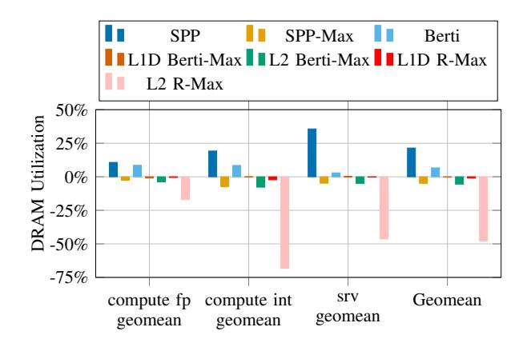

# D. Attributing the R-Max Performance Gap vs. Realistic Prefetchers

We analyze the cause of the performance gap between R-Max and existing, implementable prefetchers. We use SPP and Berti for comparison and test on CVP-1 traces. To isolate the effect of accuracy, bandwidth, cache capacity, latency and coverage, the following experiments are performed.

1) Prefetcher's Ability to Predict: To attribute the impact of R-Max's perfect address prediction versus its ability to perfectly time prefetch insertions we record all addresses SPP and Berti predict over the course of each trace. These addresses are respectively then used to drive R-Max's prefetching. We refer to these variations as SPP-Max and Berti-Max respectively. Since Berti can issue prefetches to both the L1D and L2, we test Berti-Max separately in the L1D and L2. SPP-Max and Berti-Max illustrate the achievable performance if prefetches were accurate and timely and replacement decisions were ideal. Fig. 8 illustrates the impact of prediction accuracy and coverage for SPP and Berti relative to R-Max. Interestingly, we

Fig. 7. DRAM utilization comparison for CVP-1 traces for SPP, SPP-Max, Berti, L1D Berti-Max, L2 Berti-Max, and R-Max (in L1D or L2), normalized to a no-prefetching, LRU baseline. The geomean for each configuration is 21.43%, -4.90%, 6.61%, -0.30%, -5.47%, -0.99% and -47.93% respectively.

see that for some benchmarks, Berti can outperform Berti-Max in L1D, but not Berti-Max in L2. This observation matches with the previous result: placing R-Max in L2 yields the largest gain. This can also show that part of the performance gain of Berti comes from prefetching into L2 as well. SPP-Max and Berti-Max isolate the impact of prediction accuracy and coverage, but still preserving the ideal timing and replacement decisions provided by R-Max.

- 2) DRAM Bandwidth: DRAM utilization is reduced significantly when using R-Max, as seen in Fig. 7. We attribute this to the benchmarks' working set sizes and to R-Max's ability to issue timely prefetches and manage cache with a replacement policy that has future knowledge. If the working set fits entirely in the cache, R-Max can prefetch and manage the cache replacement policy to reduce traffic to the DRAM. Because R-Max has knowledge of future memory accesses, R-Max prefetches blocks as early as possible while respecting bandwidth, latency, and capacity constraints. The limited reduction in DRAM usage from SPP-Max is due to SPP's limited coverage. The increase in DRAM utilization for SPP is caused by incorrect prefetches that pollute the cache and a replacement policy that does not always make the correct decision when evicting blocks from the cache. If DRAM accesses are reduced significantly, there is less contention for DRAM resources, leading to shorter access times and possibly increasing performance.
- 3) Cache Capacity: Fig.8 shows the performance effects of giving each level of the cache a capacity that is 100 times the original size, without increasing the number of tag checks allowed, the number of tag checks per cycle, access latency, or available MSHRs. The result for srv workloads shows that R-Max approaches the performance of a cache 100 times its size with existing prefetchers. The remaining gap between large caches and an always hit cache can be caused by latency bandwidth issues and prefetchers' limited ability to reduce compulsory misses.

Fig. 8. Speedup for CVP-1 traces for SPP, SPP-Max, SPP with ×100 number of MSHRs, SPP with large cache, Berti, L1D Berti-Max, L2 Berti-Max, Berti with ×100 number of MSHRs, Berti with large cache, L1D R-Max, L2 R-Max, always hit L1D, normalized to a no-prefetching, LRU baseline. The geomean for each configuration is 5.96%, 6.32%, 6.68%, 46.96%, 8.08%, 5.91%, 11.24%, 10.12%, 48.40%, 19.85%, 29.07% and 64.64% respectively.

- *4) Cache Bandwidth and Latency:* Fig. 8 shows the effect of increasing the number of MSHRs by 100 times at all cache levels to show the effect of cache bandwidth. For the constraints on latency, we show the results of always hit cache. We do not see significant performance gain by solely increasing the number MSHRs.
- *5) Prefetching Accuracy and Coverage:* In Fig. 9, we show the accuracy comparison for different prefetchers. R-Max has a very high prefetch accuracy because it is omniscient. Such high prefetch accuracy can contribute to its high performance compared with existing prefetchers. During simulation, memory access re-ordering can take place and contribute to useless prefetches. Based on the data we see, the fraction of useless prefetches is relatively small. For SPP-Max and Berti-Max, though they have a lower performance than R-Max, they still preserve the high prefetch accuracy from R-Max. For coverage, we have shown some results in Table VI. The remaining gap in coverage arises from late prefetches that are caused by insufficient bandwidth, latency or memory access reordering that leads to incorrect prefetch sequence.
- *6) Timeliness:* Fig. 10 shows timeliness of prefetches generated by R-Max vs. other prefetchers. Broadly we see that all prefetchers have a wide range of timeliness, with upper bounds ≈ 108 . Interestingly, we see that generally while R-Max's timeliness is on average higher than most real prefetchers, it's range is similar. The benefit of prefeching as early as possible is not infinite, prefetching too soon can cause an eviction of useful data and can be worse than prefetching too late.

