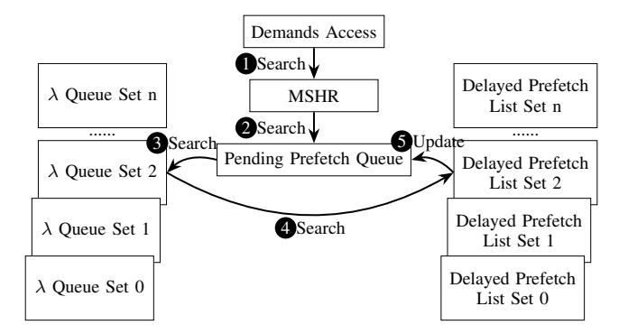

# *D. R-Max Structures*

When simulation begins, R-Max processes the recorded memory accesses sequentially and prefills blocks to each set until each set has no free ways. At this stage, all blocks in the same set are waiting for demand accesses. Any demand access to a block decrements that block's counter. If the counter reaches 0, R-Max prioritizes that block for eviction and issues a targeted prefetch to evict it. If a set is full, R-Max continues to prefetch blocks in other sets until all sets are filled with prefetched blocks waiting for demand accesses. R-Max uses a Cache Status Map, a Delayed Prefetch List and a λ Queue for each set to make prefetch and replacement decisions. R-Max uses a Pending Prefetch Queue and a Do Not Fill Queue shared

TABLE II AN EXAMPLE OF RUNNING ALGORITHM 1 ON A CACHE SET OF 4 WAYS.

| Time    | Demand Address | "Prefetch" Or "Hold"? | Next-to -prefetch Address | Miss Time | Action     | Way 0 | Next Access Time | Way 1 | Next Access Time | Way 2 | Next Access Time | Way 3 | Next Access Time |
|---------|-------------------|-----------------------------|---------------------------------|--------------|------------|-------|------------------------|-------|------------------------|-------|------------------------|-------|------------------------|
| Prefill |                   |                             |                                 |              |            | A     | 1                      | B     | 10                     | C     | 15                     | D     | 20                     |
| 1       | A                 | Prefetch                    | E                               | 27           | Prefetch E | A     | 35                     | B     | 10                     | C     | 15                     | D     | 20                     |
|         |                   |                             |                                 |              | Evict A    | E     | 27                     | B     | 10                     | C     | 15                     | D     | 20                     |
| 10      | B                 | Prefetch                    | F                               | 31           |            | E     | 27                     | B     | 25                     | C     | 15                     | D     | 20                     |
| 15      | C                 | Prefetch                    | F                               | 31           |            | E     | 27                     | B     | 25                     | C     | 30                     | D     | 20                     |
| 20      | D                 | Prefetch                    | F                               | 31           | Prefetch F | E     | 27                     | B     | 25                     | C     | 30                     | D     | ∞                      |
|         |                   |                             |                                 |              | Evict D    | E     | 27                     | B     | 25                     | C     | 30                     | F     | 31                     |
| 25      | B                 | Hold                        | A                               | 35           | Prefetch A | E     | 27                     | B     | 50                     | C     | 30                     | F     | 31                     |
|         |                   |                             |                                 |              | Evict B    | E     | 27                     | A     | 35                     | C     | 30                     | F     | 31                     |
| 27      | E                 | Prefetch                    | G                               | 47           | Prefetch G | E     | ∞                      | A     | 35                     | C     | 30                     | F     | 31                     |
|         |                   |                             |                                 |              | Evict E    | G     | 47                     | A     | 35                     | C     | 30                     | F     | 31                     |
| 30      | C                 | Hold                        | B                               | 50           | Prefetch B | G     | 47                     | A     | 35                     | C     | ∞                      | F     | 31                     |
|         |                   |                             |                                 |              | Evict C    | G     | 47                     | A     | 35                     | B     | 50                     | F     | 31                     |
| 31      | F                 | Prefetch                    |                                 |              |            | G     | 47                     | A     | 35                     | B     | 50                     | F     | ∞                      |
| 35      | A                 | Prefetch                    |                                 |              |            | G     | 47                     | A     | ∞                      | B     | 50                     | F     | ∞                      |
| 47      | G                 | Prefetch                    |                                 |              |            | G     | ∞                      | A     | ∞                      | B     | 50                     | F     | ∞                      |
| 50      | B                 | Prefetch                    |                                 |              |            | G     | ∞                      | A     | ∞                      | B     | ∞                      | F     | ∞                      |

TABLE III AN EXAMPLE OF ACCESSES WITH PREFETCH/HOLD INFORMATION UPDATED.

| Address | Prefetch/Hold |
|---------|---------------|
| A       | Prefetch      |
| B       | Prefetch      |
| C       | Prefetch      |
| D       | Prefetch      |
| B       | Hold          |
| E       | Prefetch      |
| C       | Hold          |
| F       | Prefetch      |
| A       | Prefetch      |
| G       | Prefetch      |
| B       | Prefetch      |

TABLE IV AN EXAMPLE OF PROCESSED MEMORY ACCESSES WITH COUNTERS GENERATED.

| Address | Counter |
|---------|---------|
| A       | 1       |
| B       | 2       |
| C       | 2       |
| D       | 1       |
| E       | 1       |
| F       | 1       |
| A       | 1       |
| G       | 1       |
| B       | 1       |

among all sets to issue prefetches and optionally skip filling of blocks. We note these are simply software data structures we use to implement this algorithm. Since this algorithm cannot be implemented in a real hardware prefetcher we make no attempt to optimize the size of these structures.

Cache Status Map Block addresses, counters and timestamps. R-Max maintains such map per set to keep track of what the actual cache set should have at the moment. Pending Prefetch Queue Shared3 queue of prefetches ready to issue when MSHRs becomes available. R-Max directly opens MSHRs when issuing prefetches from this queue. Delayed Prefetch List Prefetches waiting to be issued when capacity becomes available. R-Max uses the Cache Status Map to track of the actual cache set. R-Max holds prefetches from being issued if issuing such prefetches will evict blocks in the set whose dead block counters have not reached 0. If none the blocks in the set have zero counters, no blocks can be evicted. No capacity is left. Prefetches stay in the Delayed Prefetch List until any of the blocks has zero counters, the block's information is removed from the Cache Status Map. The information of the first block in the Delayed Prefetch List is moved the Cache Status Map. The address of the block is append to the end of the Pending Prefetch Queue.

λ Queue Prefetches issued but replaced due to memory access reordering. R-Max compares the address of the demand from upstream against those from the Cache Status Map. If no match is found, a memory re-ordering happens and R-Max needs to handle the re-ordering. Prefetched blocks may be evicted to make space to fill the re-ordered blocks. In that case, if the evicted blocks have non-zero counters, meaning that they have accesses not yet observed, the addresses and the counters of the evicted blocks are moved to the λ Queue to keep track of that information. λ Queue is not part of the cache and does not contribute to increasing cache capacity.

Do Not fill Queue Shared queue of addresses that will not be filled at the current level of cache. The queue is needed for scenario like the following. A block with a counter of just 1 is prefetched. While the prefetch is still inflight, the demand for that block from upstream arrives. The block's counter is decreased by the demand access and reaches 0. The prefetch becomes a demand. Because the counter value is 0, the block has no accesses in the close future

3"Shared" Indicates that all sets can access the structure or only one instance of the structure exists.

Fig. 3. How R-Max works at a high level for cache accesses. The example shows how an access to set 2 of the cache is handled.

and should not be filled to the current level cache that issues the prefetch. Instead, when the block returns from lower levels of the memory hierarchy, it is sent to the upstream requester directly and skips the fill. A per set queue is not necessary as it complicates the design.

