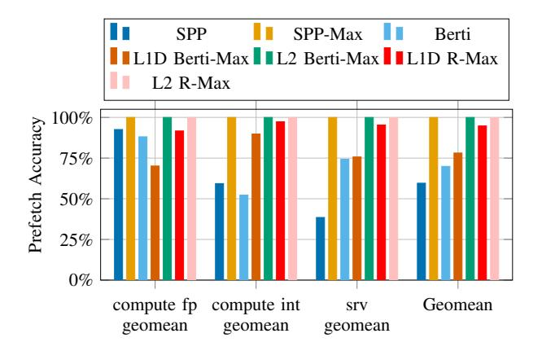
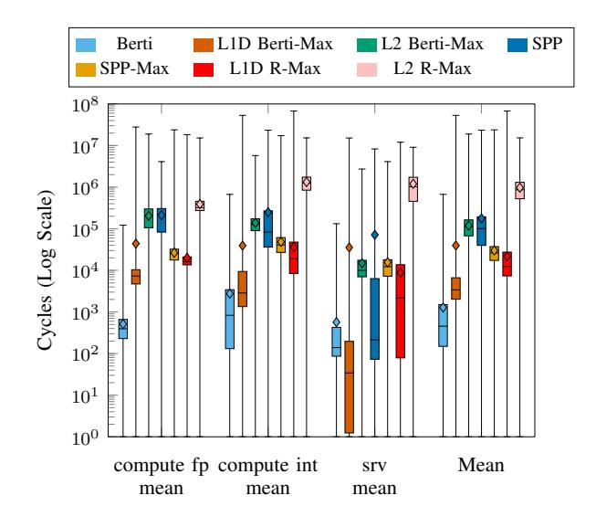

# VII. CONCLUSION

In this work, we propose a R-Max, a scheme to determine a tighter-bound on the potential gains from prefetching, as a tool to direct future research in prefetching and replacement. R-Max uses oracular knowledge of future requests, but is

Fig. 9. Prefetch accuracy comparison for CVP-1 traces for SPP, L2 SPP-Max, Berti, L1D Berti-Max, L2 Berti-Max, R-Max (in L1D or L2). The geomean for each configuration is 59.58%, 99.99%, 69.92%, 78.12%, 99.99%, 95.75% and 99.99% respectively.

Fig. 10. Timeliness comparison of Berti, L1D Berti-Max, L2 Berti-Max, SPP, SPP-Max, L1D R-Max and L2 R-Max. The box plots show the minimum, the 1st quartile, median, mean(the diamond sign), the 3rd quartile and the maximum of the time difference, measured in cycles, between issuing the prefetch and the demand time for the prefetch.

constrained by memory bandwidth, latency, cache capacity, set-associative structure of the cache. We observe significant gains remain for prefetching and replacement in the L2, particularly for graph workloads. Future work may include coordinating similar prefetchers at multiple cache levels and cores to explore such upper bounds. R-Max reveals the potential space for performance improvement that future prefetcher design might claim.

